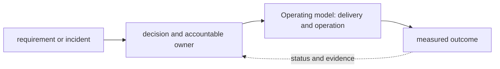

# Operating model

<!-- chapter-guide:start -->
> **Step 005 of 373 — 00.04**
>
> **Builds on:** [Taking ownership of an existing platform](../03-taking-ownership-of-an-existing-platform/README.md)
>
> **Now:** Learn **Operating model** from its mental model through production ownership.
>
> **Then:** Rehearse the linked questions and continue to [Contractor and remote-work readiness](../05-contractor-and-remote-work-readiness/README.md).
<!-- chapter-guide:end -->

> [Interview questions and answers](questions-and-answers.md) · [Master curriculum](../../curriculum/master-curriculum.txt) · Official starting point: <https://sre.google/workbook/on-call/>

## Explanation

### What it is and why it exists

**Operating model** is easiest to understand as one part of a larger path. The subject is an ownership system: people turn ambiguous needs into decisions, changes, operated services and evidence that the outcome remains healthy.

The chapter focuses on Production support, On-call ownership, Incident escalation, Runbooks. These are connected mechanisms, not vocabulary to memorize. Operating model is the part of Interview and role-ownership framework that connects the listed mechanisms to effective runtime state, observable behavior and production outcomes The explanations below first build the simple model, then add the exact system behavior and production consequences.

### History and evolution

Operations work began as a specialist system-administration function, then broadened through Agile, DevOps, SRE and platform engineering. The important change was not a job-title change: teams moved from owning isolated tickets to owning measurable service outcomes, safe delivery and the developer experience over the full lifecycle.

In this chapter, **Operating model** is the next layer of that evolution. Its modern purpose is to operating model is the part of Interview and role-ownership framework that connects the listed mechanisms to effective runtime state, observable behavior and production outcomes. The exact product surface may change by version, but the underlying state, request path and failure boundaries remain the durable ideas to learn.

### How it works: the end-to-end path



The path begins with a concrete input: a user request, configuration revision, packet, job, model request or operational symptom. The relevant subsystem validates that input, reads current state, performs or schedules work and exposes a result. Some transitions complete before the caller receives a response; others acknowledge the request and converge later. That difference determines whether a timeout means "nothing happened," "the operation failed," or "the final result is still unknown."

For **Operating model**, the important stages are Production support, On-call ownership, Incident escalation, Runbooks, Change management, Release approval, Cross-team collaboration, Communication with the Head of Engineering. Their boundaries explain where identity is checked, where state becomes durable, where capacity is consumed, how failures propagate and which signal can distinguish one layer from another. A production explanation should follow the actual path rather than treating each term as an isolated definition.


### Core concepts explained in detail

#### Production support

**What it is.** The term Production support refers to a responsibility and decision mechanism that connects an accountable person, an explicit outcome, evidence, escalation and follow-through within Operating model.

**Junior mental model.** A useful analogy is a parcel journey: the name identifies the destination, routing selects each next hop, policy decides whether the parcel may pass, transport tracks delivery, and the application decides what the contents mean.

**How it works.** A real request crosses several independent states: name resolution returns an address, the source selects a route and source address, link or overlay forwarding reaches the next hop, stateful or stateless policy evaluates the flow, transport establishes communication, and TLS/application protocols negotiate their own contract. The return path must also work.

**What it looks like in production.** Healthy evidence progresses layer by layer: correct name/address, expected route, permitted flow, listening endpoint, successful handshake and valid application response. Timeouts, refusals, resets and protocol errors mean different layers; packet loss, MTU, asymmetric paths, connection-state exhaustion and proxy timeout mismatch are common production failures.

#### On-call ownership

**What it is.** The term On-call ownership turns organizational requirements into named owners, enforceable controls, evidence, exceptions with expiry and lifecycle decisions that can be audited and repeated within Operating model.

**Junior mental model.** Governance is how a team makes repeated decisions visible and enforceable; economics shows which resources those decisions consume. Neither is a one-time approval or a monthly bill review.

**How it works.** An asset or service receives an owner, lifecycle state, data/risk class, policy, budget and evidence requirements. Usage is attributed to stable organizational dimensions, compared with outcome and SLO, and reviewed through changes, exceptions and retirement; automated guardrails enforce the decisions at the relevant control point.

**What it looks like in production.** Healthy evidence connects an accountable owner and approved intent to runtime inventory, audit and unit cost. Orphaned resources, permanent exceptions, unallocated shared cost, vanity utilization and savings that damage reliability or quality are common failure modes.

#### Incident escalation

**What it is.** Requires a layer-by-layer, evidence-first path from user impact and recent change through identity, configuration, runtime, dependency and resource saturation, followed by reversible mitigation and verified repair.

**Junior mental model.** Failure controls are traffic rules for unhealthy conditions: they bound how long work waits, how often it retries, how much enters the system and what reduced service remains possible.

**How it works.** A caller assigns a deadline and attempt budget, classifies an error, applies bounded backoff with jitter only when retry is safe, and propagates capacity limits upstream. Circuit breakers, bulkheads and load shedding prevent one dependency from consuming every worker; recovery probes and gradual traffic return avoid a second overload.

**What it looks like in production.** Healthy evidence shows bounded queues, stable retry ratios and recovery within an objective. Unbounded retries, identical timeouts at every layer, non-idempotent replays, shared resource pools and failover to an unqualified target commonly turn a small fault into an outage.

#### Runbooks

**What it is.** The term Runbooks refers to a responsibility and decision mechanism that connects an accountable person, an explicit outcome, evidence, escalation and follow-through within Operating model.

**Junior mental model.** Governance is how a team makes repeated decisions visible and enforceable; economics shows which resources those decisions consume. Neither is a one-time approval or a monthly bill review.

**How it works.** An asset or service receives an owner, lifecycle state, data/risk class, policy, budget and evidence requirements. Usage is attributed to stable organizational dimensions, compared with outcome and SLO, and reviewed through changes, exceptions and retirement; automated guardrails enforce the decisions at the relevant control point.

**What it looks like in production.** Healthy evidence connects an accountable owner and approved intent to runtime inventory, audit and unit cost. Orphaned resources, permanent exceptions, unallocated shared cost, vanity utilization and savings that damage reliability or quality are common failure modes.

#### Change management

**What it is.** The term Change management refers to a responsibility and decision mechanism that connects an accountable person, an explicit outcome, evidence, escalation and follow-through within Operating model.

**Junior mental model.** Governance is how a team makes repeated decisions visible and enforceable; economics shows which resources those decisions consume. Neither is a one-time approval or a monthly bill review.

**How it works.** An asset or service receives an owner, lifecycle state, data/risk class, policy, budget and evidence requirements. Usage is attributed to stable organizational dimensions, compared with outcome and SLO, and reviewed through changes, exceptions and retirement; automated guardrails enforce the decisions at the relevant control point.

**What it looks like in production.** Healthy evidence connects an accountable owner and approved intent to runtime inventory, audit and unit cost. Orphaned resources, permanent exceptions, unallocated shared cost, vanity utilization and savings that damage reliability or quality are common failure modes.

#### Release approval

**What it is.** The term Release approval is a delivery mechanism that binds reviewed source to an immutable revision and moves that revision through validation and bounded rollout toward verified runtime state within Operating model.

**Junior mental model.** Treat delivery like a controlled assembly line: reviewed source becomes an immutable artifact, the artifact is promoted without being rebuilt, and each environment records exactly which revision is effective.

**How it works.** The lifecycle begins with versioned intent, validates syntax and policy, resolves dependencies, builds or selects immutable inputs, produces a diff or release plan, changes the target in bounded waves, and records status. Reconciliation keeps desired and observed state aligned; rollback is another tested state transition, not merely a command name.

**What it looks like in production.** Healthy evidence links source revision, review, test, artifact digest, signer/provenance, deployment target and user-facing verification. Mutable tags, environment-specific rebuilds, unpinned dependencies, non-idempotent migrations and controllers fighting emergency changes are recurring failure modes.

#### Cross-team collaboration

**What it is.** The term Cross-team collaboration refers to a responsibility and decision mechanism that connects an accountable person, an explicit outcome, evidence, escalation and follow-through within Operating model.

**Junior mental model.** Governance is how a team makes repeated decisions visible and enforceable; economics shows which resources those decisions consume. Neither is a one-time approval or a monthly bill review.

**How it works.** An asset or service receives an owner, lifecycle state, data/risk class, policy, budget and evidence requirements. Usage is attributed to stable organizational dimensions, compared with outcome and SLO, and reviewed through changes, exceptions and retirement; automated guardrails enforce the decisions at the relevant control point.

**What it looks like in production.** Healthy evidence connects an accountable owner and approved intent to runtime inventory, audit and unit cost. Orphaned resources, permanent exceptions, unallocated shared cost, vanity utilization and savings that damage reliability or quality are common failure modes.

#### Communication with the Head of Engineering

**What it is.** The term Communication with the Head of Engineering refers to a responsibility and decision mechanism that connects an accountable person, an explicit outcome, evidence, escalation and follow-through within Operating model.

**Junior mental model.** Governance is how a team makes repeated decisions visible and enforceable; economics shows which resources those decisions consume. Neither is a one-time approval or a monthly bill review.

**How it works.** An asset or service receives an owner, lifecycle state, data/risk class, policy, budget and evidence requirements. Usage is attributed to stable organizational dimensions, compared with outcome and SLO, and reviewed through changes, exceptions and retirement; automated guardrails enforce the decisions at the relevant control point.

**What it looks like in production.** Healthy evidence connects an accountable owner and approved intent to runtime inventory, audit and unit cost. Orphaned resources, permanent exceptions, unallocated shared cost, vanity utilization and savings that damage reliability or quality are common failure modes.

### Worked command and configuration example

The following is a diagnostic example, not an unexplained command dump. Define every uppercase placeholder first—for example `NAME`, `RESOURCE`, `PROJECT`, `REGION`, `NAMESPACE`, `URL`, `IMAGE` or `CONTAINER`—and use a sandbox or read-only production role.

```bash
git log --since='30 days ago' --stat
kubectl get events -A --sort-by=.lastTimestamp
terraform plan
git shortlog -sn
```

What the example demonstrates:

- `git log --since='30 days ago' --stat` inspects the repository's object graph, refs or diff so a delivery decision is tied to exact content rather than an assumed branch name.
- `kubectl get events -A --sort-by=.lastTimestamp` reads Kubernetes API desired/status state or recent reconciliation evidence without treating a single `Ready` value as proof of the user journey.
- `terraform plan` checks configuration or previews the dependency-aware state transition before any apply; the preview must be reviewed for replacement, deletion, identity and cost.
- `git shortlog -sn` inspects the repository's object graph, refs or diff so a delivery decision is tied to exact content rather than an assumed branch name.

A healthy run returns the intended identity/context, exits successfully and shows the expected object or response without a new warning, retry loop or saturation signal. A failure is useful evidence: preserve the exact exit code, status/reason, timestamp and target, then inspect the immediately adjacent layer before changing anything. This makes the example part of the explanation of **Operating model**, not merely a list to copy.

### Security, reliability and production ownership

Security controls who can initiate a transition and what data or resource that transition may affect. Authentication, authorization, network reachability, encryption and audit solve different problems and must align at each boundary. Short-lived attributable identities, least privilege, explicit tenant separation and tested key/certificate rotation reduce blast radius. Logs and traces need their own data controls because copying a secret or customer payload into telemetry defeats the primary protection.

Reliability depends on every synchronous dependency and on the eventual convergence of asynchronous work. Timeouts bound waiting; idempotency makes an ambiguous retry safe; backpressure and load shedding keep demand within useful capacity; replication and failover help only across independent failure domains. Recovery must be tested from protected state and verified through the original user outcome, not inferred from a green administrative status.

Ownership makes these mechanisms operable. Every production resource or service needs an accountable team, source-of-truth revision, environment and data classification, SLO, runbook, cost center and retirement policy. Reversible mitigation can stabilize an incident, but the durable repair belongs in Git, IaC, policy or the owning application so reconciliation does not reintroduce the fault.

### Observability, performance and cost

Metrics, logs, traces, profiles and audit events are complementary. A useful diagnostic path starts with time, identity, exact target and user symptom, then compares desired and observed state before moving through reconciliation, network/protocol, runtime, dependency and saturation layers. High-cardinality request or object IDs belong in sampled logs or traces rather than metric labels; alerts should represent actionable user-impact risk or leading exhaustion.

Performance is governed by work distribution, queueing and bottlenecks. Rate, latency percentiles, errors, saturation, queue depth or age and service-specific limits reveal more than average utilization. Application replicas and underlying machines, storage or provider quota scale through separate loops with different cold delays. Cost includes idle headroom, requests or work units, storage/retention, network transfer, telemetry, support and recovery capacity; optimize cost per successful outcome rather than the cheapest isolated resource.

### What you should be able to explain

The table remains as a revision checklist. Read the explanations above first; afterward, use each row to check whether you can explain the concept without relying on memorized wording.

| # | Topic | What you must understand and demonstrate |
|---:|---|---|
| 1 | **Production support** | is part of Operating model; learn its precise definition, mechanism and lifecycle, nearest alternatives, configuration interface, failure/limit, security boundary, observable evidence and production trade-off |
| 2 | **On-call ownership** | is part of Operating model; learn its precise definition, mechanism and lifecycle, nearest alternatives, configuration interface, failure/limit, security boundary, observable evidence and production trade-off |
| 3 | **Incident escalation** | requires a layer-by-layer, evidence-first path from user impact and recent change through identity, configuration, runtime, dependency and resource saturation, followed by reversible mitigation and verified repair |
| 4 | **Runbooks** | is part of Operating model; learn its precise definition, mechanism and lifecycle, nearest alternatives, configuration interface, failure/limit, security boundary, observable evidence and production trade-off |
| 5 | **Change management** | is part of Operating model; learn its precise definition, mechanism and lifecycle, nearest alternatives, configuration interface, failure/limit, security boundary, observable evidence and production trade-off |
| 6 | **Release approval** | is part of Operating model; learn its precise definition, mechanism and lifecycle, nearest alternatives, configuration interface, failure/limit, security boundary, observable evidence and production trade-off |
| 7 | **Cross-team collaboration** | is part of Operating model; learn its precise definition, mechanism and lifecycle, nearest alternatives, configuration interface, failure/limit, security boundary, observable evidence and production trade-off |
| 8 | **Communication with the Head of Engineering** | is part of Operating model; learn its precise definition, mechanism and lifecycle, nearest alternatives, configuration interface, failure/limit, security boundary, observable evidence and production trade-off |

## Practice

### Practice objective

Build a small, safe proof of **Operating model** and explain the result in your own words. The goal is not command completion; it is to connect input, internal mechanism, observable state and user outcome.

### Prerequisites and setup

Use a disposable local or cloud sandbox. Confirm identity/context and cost boundary, capture a healthy baseline with the commands above, introduce one bounded configuration or invalid-input failure, compare evidence, revert from source control, verify the original outcome, and delete only the named lab resources.

Record tool and platform versions because flags, APIs and defaults can change. Define every uppercase placeholder before use and keep secrets out of shell history and committed files.

### Activity 1: establish a healthy baseline

Run the read-oriented example first:

```bash
git log --since='30 days ago' --stat
kubectl get events -A --sort-by=.lastTimestamp
terraform plan
git shortlog -sn
```

For each line, write down the layer it inspects, the expected healthy field or response, and one thing it cannot prove. The expected result is an attributable request against the intended target plus enough state to draw the path from input to outcome.

### Activity 2: create or review the smallest working example

Put the smallest relevant command, configuration, manifest or code sample in source control. Validate or lint it, produce a preview/diff where the tool supports one, and apply only inside the disposable boundary. Record the exact revision and resulting resource or process ID. If the topic is observational rather than configurable, save a sanitized baseline and an automated assertion instead of mutating the system.

### Activity 3: controlled failure and troubleshooting

Introduce one bounded failure: use a definitely nonexistent resource name, an invalid sandbox-only value, a denied test identity, a closed test port or a stopped disposable dependency. Capture the exact error and classify it as identity/policy, input/configuration, control-plane reconciliation, network/protocol, dependency or capacity. Test one discriminating hypothesis at a time; do not widen access or restart unrelated components.

Expected failure evidence is a specific non-zero exit, status/reason, event or protocol response that disappears when the controlled fault is removed. If healthy and failing runs look identical, the chosen signal does not explain the phenomenon and the exercise is not complete.

### Verification

Repeat the original client or user-facing check, not only an administrative status command. Confirm the desired revision, data correctness where applicable, error and latency recovery, and absence of a continuing retry/backlog/saturation condition. Explain why this evidence proves recovery and what uncertainty remains.

### Cleanup and rollback

Revert the configuration in its source of truth and review the rollback diff before applying it. Delete only the named sandbox resources, stop disposable processes, remove temporary credentials and verify that no billable resource, volume, artifact, queue item or background job remains. Read-only activities require no infrastructure rollback, but sanitized captures must still follow retention policy.

### Harder extension

Automate the healthy and failing paths in CI, use short-lived identity, add one SLI/alert or policy assertion, and write a five-step runbook another engineer can execute without hidden context. Then explain how the design changes for two tenants, a zonal or dependency failure, 10× load and a strict cost or recovery target.

<!-- reading-navigation:start -->
---

**Reading path:** [← Back: Taking ownership of an existing platform](../03-taking-ownership-of-an-existing-platform/README.md) · [Questions](questions-and-answers.md) · [Next: Contractor and remote-work readiness →](../05-contractor-and-remote-work-readiness/README.md)

<!-- reading-navigation:end -->
