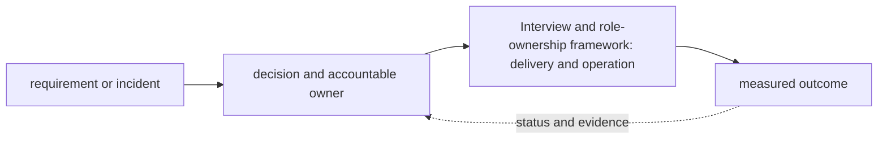

# Interview and role-ownership framework

<!-- chapter-guide:start -->
> **Step 001 of 373 — 00**
>
> **Builds on:** [the handbook contents](../README.md)
>
> **Now:** Learn **Interview and role-ownership framework** from its mental model through production ownership.
>
> **Then:** Rehearse the linked questions and continue to [Understanding the role](01-understanding-the-role/README.md).
<!-- chapter-guide:end -->

<!-- explanation-practice-normalizer:v1 -->


## Explanation

### What this chapter is and why it exists

**Interview and role-ownership framework** is easiest to understand as one part of a larger path. The subject is an ownership system: people turn ambiguous needs into decisions, changes, operated services and evidence that the outcome remains healthy.

The chapter focuses on Interview and role-ownership framework. These are connected mechanisms, not vocabulary to memorize. Role ownership connects technical decisions, delivery, support and communication to one accountable outcome over the service lifecycle The explanations below first build the simple model, then add the exact system behavior and production consequences.

### History and evolution

Operations work began as a specialist system-administration function, then broadened through Agile, DevOps, SRE and platform engineering. The important change was not a job-title change: teams moved from owning isolated tickets to owning measurable service outcomes, safe delivery and the developer experience over the full lifecycle.

In this chapter, **Interview and role-ownership framework** is the next layer of that evolution. Its modern purpose is to role ownership connects technical decisions, delivery, support and communication to one accountable outcome over the service lifecycle. The exact product surface may change by version, but the underlying state, request path and failure boundaries remain the durable ideas to learn.

### How the complete branch works



A branch overview connects child mechanisms into one lifecycle. The input crosses identity and policy, a control or decision plane, the runtime data path and its dependencies before producing a user-visible result. Status and telemetry travel back through the loop so operators and controllers can correct drift or failure. Reading the child chapters adds precision, but this overview explains why those chapters depend on one another.

A useful test of understanding is to trace one concrete request or change from origin to outcome and name the authoritative state at each boundary. That trace reveals where work is synchronous or asynchronous, which failure domains are independent, what a timeout can prove, and which evidence distinguishes accepted intent from healthy behavior.

### Role mental model

An AI Platform Engineer owns the paved road from approved model/data/artifact to secure, observable, reliable and cost-controlled production use. Conventional DevOps builds delivery/operations capability; MLOps emphasizes model/data lifecycle; AI platform work integrates both with accelerator capacity, serving, gateways, RAG/evaluation and customer deployment. Titles overlap, so define outcomes and boundaries rather than arguing labels.

The platform is a product. Its users are application developers, ML/data engineers, security/finance/operations and customer deployment teams. The control plane accepts desired state and policy, reconciles resources and reports status. The data plane handles prompts, retrieval, model inference and tools. Separating them clarifies availability, scale, trust and upgrade boundaries; they still share dependencies that must be inventoried.

### Senior ownership expectations

Convert an ambiguous request into functional and non-functional requirements: users/tenants, deployment modes, workloads/models, scale and latency/quality SLOs, data classification/residency, RPO/RTO, security/compliance, budget, team/support constraints and deadline. List assumptions, owners and validation evidence. Record consequential decisions in ADRs with context, options, decision, consequences, rollback and revisit triggers.

Build versus buy compares time-to-value, differentiation, portability, data/control needs, integration, reliability/support, skill/on-call load, exit cost and total economics. A senior recommendation includes a staged path and reversibility, not a false universal answer.

Prioritize by user/business impact, risk reduction, dependencies, effort and learning. Safety foundations—identity, backups/restore, audit, ownership, incident path—often precede feature breadth. Manage technical debt as explicit risk with interest, triggers and owners. Guardrails should make the safe path easiest and exceptions observable/time-bound.

### Taking over an existing platform: 30/60/90 days

#### Days 0–30: establish safety and truth

- Align with Head of Engineering on outcomes, decision rights, escalation, customers, deadlines and unacceptable risks.
- Inventory accounts/projects/clusters/regions, services, models/providers, data/indexes, GPU capacity, IaC/state, CI identities, DNS/certificates, secrets/keys, vendors/licenses, telemetry and customer environments.
- Map dependency and request paths, owners/on-call, SLO/SLA, RPO/RTO, costs/commitments/quotas and data classifications.
- Review recent incidents/changes, access and public exposure, backup/restore evidence, certificate/key expiry, unsupported versions, drift and single points of failure.
- Make small reversible safety improvements; do not begin a rewrite before understanding operational truth.

#### Days 31–60: stabilize and standardize

- Define service catalog/ownership, severity and incident process, change/release controls, runbook template, SLI/SLO and alert hygiene.
- Reconcile drift to source, protect state/log/backup accounts, rotate risky credentials, test a representative restore and failure drill.
- Rank backlog by risk and leverage; publish architecture/dependency diagrams and ADRs.
- Prototype one golden path end-to-end with identity, policy, observability, cost and rollback built in.

#### Days 61–90: deliver and scale the operating model

- Release the paved road to real users; measure adoption, time-to-deploy, success rate, toil, SLO and unit cost.
- Execute highest-risk migrations in waves with compatibility, canary, rollback and support plans.
- Establish capacity/cost forecasts, customer deployment/upgrade contracts and quarterly recovery/game-day cadence.
- Present roadmap, explicit trade-offs, staffing/vendor risks and what leadership must decide.

### Operating model

Every service needs an accountable owner, user-facing purpose, dependencies, SLO, alerts/runbook, escalation, data/security classification, cost owner, deployment/rollback and lifecycle status. On-call owns mitigation and communication, not blame. Incident roles separate command, operations and communications. Postmortems describe timeline, impact, detection/response, causal/contributing conditions and measurable actions.

Change management is proportional to blast radius: automated validation and peer review for routine changes; explicit approval/windows for high-risk or customer environment changes; emergency path with retrospective review. Release approval should be based on evidence and risk, not titles.

Communicate upward in outcomes: impact, risk, evidence, options, recommendation, cost/time and decision needed. For disagreement, make the constraint and consequence visible, propose a reversible experiment, commit after the decision unless it crosses safety/legal/ethical boundaries, and escalate clearly when it does.

### Contractor, remote and BYOD readiness

Clarify full-time dedication, timezone overlap, travel, invoicing/tax/currency, rate basis, payment terms, notice/termination, IP/confidentiality, liability/insurance, equipment/support, on-call/overtime and data-access restrictions. Do not give legal/tax conclusions; obtain professional advice for the jurisdiction.

BYOD should use supported encrypted devices, automatic patching, EDR, screen lock, phishing-resistant MFA, separate work profile/account, least-privilege VPN/ZTNA, no local production secrets/data, managed browser/password manager, backup policy, remote revocation and incident reporting. Agree who can manage/wipe which data and how offboarding proves access removal.

### Interview answer patterns

- **Ownership:** context → risk/outcome → evidence gathered → decision/trade-off → execution → measured result → learning.
- **Architecture:** requirements → scale/SLO/security/cost → options → choice → failure/recovery → rollout/operations.
- **Incident:** impact/command → containment → layered evidence → reversible mitigation → validation → prevention.
- **Conflict:** shared goal → disagreement/evidence → options/consequence → decision mechanism → outcome/relationship.
- **Failure:** own it without dramatizing, show detection/communication/correction and a system change that reduced recurrence.

### Revision summary

- Own outcomes and operating systems, not a pile of tools.
- Establish truth and safety before broad rebuilds.
- Make assumptions, decision rights and trade-offs explicit.
- Measure platform adoption, reliability, security, unit cost and toil.
- Prepare concrete stories with evidence, conflict and learning.

### Read further

- [Google SRE Workbook: On-Call](https://sre.google/workbook/on-call/) — practical ownership, escalation, readiness, playbooks and sustainable operational load.

## Practice

### Practice objective

Build a small, safe proof of **Interview and role-ownership framework** and explain the result in your own words. The goal is not command completion; it is to connect input, internal mechanism, observable state and user outcome.

### Prerequisites and setup

Use a disposable local environment, sandbox account/project or isolated namespace. Confirm the effective identity and target, record the start time, and set a cost limit before creating anything.

Record tool and platform versions because flags, APIs and defaults can change. Define every uppercase placeholder before use and keep secrets out of shell history and committed files.

### Activity 1: establish a healthy baseline

Run the read-oriented example first:

```bash
git log --since='30 days ago' --stat
git shortlog -sn
```

For each line, write down the layer it inspects, the expected healthy field or response, and one thing it cannot prove. The expected result is an attributable request against the intended target plus enough state to draw the path from input to outcome.

### Activity 2: create or review the smallest working example

Put the smallest relevant command, configuration, manifest or code sample in source control. Validate or lint it, produce a preview/diff where the tool supports one, and apply only inside the disposable boundary. Record the exact revision and resulting resource or process ID. If the topic is observational rather than configurable, save a sanitized baseline and an automated assertion instead of mutating the system.

### Activity 3: controlled failure and troubleshooting

Introduce one bounded failure: use a definitely nonexistent resource name, an invalid sandbox-only value, a denied test identity, a closed test port or a stopped disposable dependency. Capture the exact error and classify it as identity/policy, input/configuration, control-plane reconciliation, network/protocol, dependency or capacity. Test one discriminating hypothesis at a time; do not widen access or restart unrelated components.

Expected failure evidence is a specific non-zero exit, status/reason, event or protocol response that disappears when the controlled fault is removed. If healthy and failing runs look identical, the chosen signal does not explain the phenomenon and the exercise is not complete.

### Verification

Repeat the original client or user-facing check, not only an administrative status command. Confirm the desired revision, data correctness where applicable, error and latency recovery, and absence of a continuing retry/backlog/saturation condition. Explain why this evidence proves recovery and what uncertainty remains.

### Cleanup and rollback

Revert the configuration in its source of truth and review the rollback diff before applying it. Delete only the named sandbox resources, stop disposable processes, remove temporary credentials and verify that no billable resource, volume, artifact, queue item or background job remains. Read-only activities require no infrastructure rollback, but sanitized captures must still follow retention policy.

### Harder extension

Automate the healthy and failing paths in CI, use short-lived identity, add one SLI/alert or policy assertion, and write a five-step runbook another engineer can execute without hidden context. Then explain how the design changes for two tenants, a zonal or dependency failure, 10× load and a strict cost or recovery target.

<!-- reading-navigation:start -->
---

**Reading path:** [← Back: Contents](../README.md) · [Questions](questions-and-answers.md) · [Next: Understanding the role →](01-understanding-the-role/README.md)

<!-- reading-navigation:end -->
