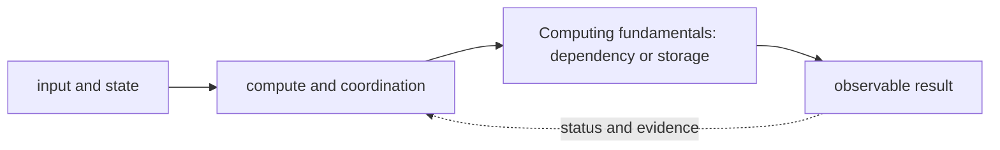

# Computing fundamentals

<!-- chapter-guide:start -->
> **Step 008 of 373 — 01.01**
>
> **Builds on:** [Computer science and distributed-systems foundations](../README.md)
>
> **Now:** Learn **Computing fundamentals** from its mental model through production ownership.
>
> **Then:** Rehearse the linked questions and continue to [Concurrency](../02-concurrency/README.md).
<!-- chapter-guide:end -->

> [Interview questions and answers](questions-and-answers.md) · [Master curriculum](../../curriculum/master-curriculum.txt) · Official starting point: <https://sre.google/sre-book/handling-overload/>

## Explanation

### What it is and why it exists

**Computing fundamentals** is easiest to understand as one part of a larger path. The subject is a system of state and work: inputs arrive, compute and storage transform state, concurrent actors coordinate, and callers observe an outcome even when components fail independently.

The chapter focuses on CPU, Memory, Disk, Network. These are connected mechanisms, not vocabulary to memorize. Computing fundamentals is the part of Computer science and distributed-systems foundations that connects the listed mechanisms to effective runtime state, observable behavior and production outcomes The explanations below first build the simple model, then add the exact system behavior and production consequences.

### History and evolution

Modern computing grew from single machines and batch programs into time-sharing, networked services and globally distributed systems. Each step improved sharing and scale but introduced concurrency, partial failure and consistency problems, which is why the foundational mechanisms in this chapter still appear inside cloud and AI platforms.

In this chapter, **Computing fundamentals** is the next layer of that evolution. Its modern purpose is to computing fundamentals is the part of Computer science and distributed-systems foundations that connects the listed mechanisms to effective runtime state, observable behavior and production outcomes. The exact product surface may change by version, but the underlying state, request path and failure boundaries remain the durable ideas to learn.

### How it works: the end-to-end path



The path begins with a concrete input: a user request, configuration revision, packet, job, model request or operational symptom. The relevant subsystem validates that input, reads current state, performs or schedules work and exposes a result. Some transitions complete before the caller receives a response; others acknowledge the request and converge later. That difference determines whether a timeout means "nothing happened," "the operation failed," or "the final result is still unknown."

For **Computing fundamentals**, the important stages are CPU, Memory, Disk, Network, Processes, Threads, File descriptors, Interrupts, System calls. Their boundaries explain where identity is checked, where state becomes durable, where capacity is consumed, how failures propagate and which signal can distinguish one layer from another. A production explanation should follow the actual path rather than treating each term as an isolated definition.


### Core concepts explained in detail

#### CPU

**What it is.** Executes instructions on logical processors; run-queue pressure, per-core saturation, steal time, affinity, quotas and throttling determine effective compute.

**Junior mental model.** Think of a scheduler as allocating seats and time slots: a request states what it needs, available workers advertise capacity, and policy chooses a placement. Requested capacity, usable capacity and completed useful work are different quantities.

**How it works.** Work enters a runnable or pending state, eligibility filters remove incompatible placements, scoring or queue policy selects a worker, and a runtime creates the process and accounts for CPU, memory, devices and time. Autoscaling observes demand, requests more replicas or machines, and waits through provisioning and warm-up before capacity becomes useful.

**What it looks like in production.** Healthy evidence connects queue delay, placement, utilization, throttling, memory/device pressure, runtime readiness and successful work. Fragmentation, inaccurate requests, quota, topology, cold starts and a saturated downstream service can leave capacity apparently free while latency and pending work grow.

#### Memory

**What it is.** Maps virtual pages to RAM or swap; RSS, cache, faults, reclaim, PSI, NUMA locality and cgroup limits explain pressure better than one free-memory number.

**Junior mental model.** The simplest mental model is a state machine: an input is checked, current state is read, a rule computes the next state, and an observable result tells callers whether the transition succeeded.

**How it works.** The mechanism receives configuration or runtime input, validates preconditions, changes or derives state, and exposes status to the next component. Synchronous parts return a direct outcome; asynchronous parts need durable status, reconciliation and idempotency because the original caller may disappear.

**What it looks like in production.** Healthy evidence shows the expected state transition and its owner, timestamp and reason. Invalid input, stale state, conflicting writers, hidden limits and dependencies that partially complete are the most useful failure categories to distinguish.

#### Disk

**What it is.** Persists blocks through filesystem, page cache, block queue and device; IOPS, throughput, latency, queue depth, durability and failure are distinct.

**Junior mental model.** Think of this as a library catalog plus shelves: metadata says what should exist and where, while physical or remote storage holds the bytes. A successful write is not necessarily durable, replicated, backed up or restorable under the same contract.

**How it works.** A write normally passes validation and authorization, enters a buffer or transaction, reaches a durable medium, and may then replicate or become visible to readers. Caches and indexes accelerate access but introduce freshness and eviction behavior; snapshots preserve a point-in-time representation but application consistency depends on write ordering.

**What it looks like in production.** Healthy evidence combines capacity, latency, error, replication and integrity signals with a tested read or restore. Typical failures include exhausted bytes or inodes, throttling, stale replicas, corrupt metadata, topology mismatch, lost encryption keys and backups that exist but cannot reconstruct the application within RPO/RTO.

#### Network

**What it is.** Moves packets through name resolution, routing, policy/NAT, transport, TLS and application layers; each hop has independent state and failure.

**Junior mental model.** A useful analogy is a parcel journey: the name identifies the destination, routing selects each next hop, policy decides whether the parcel may pass, transport tracks delivery, and the application decides what the contents mean.

**How it works.** A real request crosses several independent states: name resolution returns an address, the source selects a route and source address, link or overlay forwarding reaches the next hop, stateful or stateless policy evaluates the flow, transport establishes communication, and TLS/application protocols negotiate their own contract. The return path must also work.

**What it looks like in production.** Healthy evidence progresses layer by layer: correct name/address, expected route, permitted flow, listening endpoint, successful handshake and valid application response. Timeouts, refusals, resets and protocol errors mean different layers; packet loss, MTU, asymmetric paths, connection-state exhaustion and proxy timeout mismatch are common production failures.

#### Processes

**What it is.** Are kernel-scheduled execution/resource containers with address space, credentials, descriptors, namespaces, cgroups, signals and lifecycle state.

**Junior mental model.** Think of a scheduler as allocating seats and time slots: a request states what it needs, available workers advertise capacity, and policy chooses a placement. Requested capacity, usable capacity and completed useful work are different quantities.

**How it works.** Work enters a runnable or pending state, eligibility filters remove incompatible placements, scoring or queue policy selects a worker, and a runtime creates the process and accounts for CPU, memory, devices and time. Autoscaling observes demand, requests more replicas or machines, and waits through provisioning and warm-up before capacity becomes useful.

**What it looks like in production.** Healthy evidence connects queue delay, placement, utilization, throttling, memory/device pressure, runtime readiness and successful work. Fragmentation, inaccurate requests, quota, topology, cold starts and a saturated downstream service can leave capacity apparently free while latency and pending work grow.

#### Threads

**What it is.** Share a process address space and resources while retaining independent stacks and scheduling state, trading lower communication cost for synchronization risk.

**Junior mental model.** Think of a scheduler as allocating seats and time slots: a request states what it needs, available workers advertise capacity, and policy chooses a placement. Requested capacity, usable capacity and completed useful work are different quantities.

**How it works.** Work enters a runnable or pending state, eligibility filters remove incompatible placements, scoring or queue policy selects a worker, and a runtime creates the process and accounts for CPU, memory, devices and time. Autoscaling observes demand, requests more replicas or machines, and waits through provisioning and warm-up before capacity becomes useful.

**What it looks like in production.** Healthy evidence connects queue delay, placement, utilization, throttling, memory/device pressure, runtime readiness and successful work. Fragmentation, inaccurate requests, quota, topology, cold starts and a saturated downstream service can leave capacity apparently free while latency and pending work grow.

#### File descriptors

**What it is.** Are per-process integer handles to open files, sockets, pipes and kernel objects; process and system limits can exhaust independently.

**Junior mental model.** The simplest mental model is a state machine: an input is checked, current state is read, a rule computes the next state, and an observable result tells callers whether the transition succeeded.

**How it works.** The mechanism receives configuration or runtime input, validates preconditions, changes or derives state, and exposes status to the next component. Synchronous parts return a direct outcome; asynchronous parts need durable status, reconciliation and idempotency because the original caller may disappear.

**What it looks like in production.** Healthy evidence shows the expected state transition and its owner, timestamp and reason. Invalid input, stale state, conflicting writers, hidden limits and dependencies that partially complete are the most useful failure categories to distinguish.

#### Interrupts

**What it is.** The term Interrupts refers to a computing mechanism that changes how work, state or communication is represented and coordinated within Computing fundamentals.

**Junior mental model.** The simplest mental model is a state machine: an input is checked, current state is read, a rule computes the next state, and an observable result tells callers whether the transition succeeded.

**How it works.** The mechanism receives configuration or runtime input, validates preconditions, changes or derives state, and exposes status to the next component. Synchronous parts return a direct outcome; asynchronous parts need durable status, reconciliation and idempotency because the original caller may disappear.

**What it looks like in production.** Healthy evidence shows the expected state transition and its owner, timestamp and reason. Invalid input, stale state, conflicting writers, hidden limits and dependencies that partially complete are the most useful failure categories to distinguish.

#### System calls

**What it is.** Cross the user/kernel boundary to request controlled operations such as open, read, write, mmap, clone and network I/O.

**Junior mental model.** The simplest mental model is a state machine: an input is checked, current state is read, a rule computes the next state, and an observable result tells callers whether the transition succeeded.

**How it works.** The mechanism receives configuration or runtime input, validates preconditions, changes or derives state, and exposes status to the next component. Synchronous parts return a direct outcome; asynchronous parts need durable status, reconciliation and idempotency because the original caller may disappear.

**What it looks like in production.** Healthy evidence shows the expected state transition and its owner, timestamp and reason. Invalid input, stale state, conflicting writers, hidden limits and dependencies that partially complete are the most useful failure categories to distinguish.

### Worked command and configuration example

The following is a diagnostic example, not an unexplained command dump. Define every uppercase placeholder first—for example `NAME`, `RESOURCE`, `PROJECT`, `REGION`, `NAMESPACE`, `URL`, `IMAGE` or `CONTAINER`—and use a sandbox or read-only production role.

```bash
lscpu; free -h; lsblk; ip -br addr
ss -s
curl -v URL
dig NAME
```

What the example demonstrates:

- `lscpu; free -h; lsblk; ip -br addr` captures a read-oriented state snapshot that must be interpreted against a healthy baseline, the exact target and the next adjacent dependency.
- `ss -s` captures a read-oriented state snapshot that must be interpreted against a healthy baseline, the exact target and the next adjacent dependency.
- `curl -v URL` tests one part of the end-to-end request path and preserves protocol-level evidence such as resolution, connection, handshake, status or packet direction.
- `dig NAME` tests one part of the end-to-end request path and preserves protocol-level evidence such as resolution, connection, handshake, status or packet direction.

A healthy run returns the intended identity/context, exits successfully and shows the expected object or response without a new warning, retry loop or saturation signal. A failure is useful evidence: preserve the exact exit code, status/reason, timestamp and target, then inspect the immediately adjacent layer before changing anything. This makes the example part of the explanation of **Computing fundamentals**, not merely a list to copy.

### Security, reliability and production ownership

Security controls who can initiate a transition and what data or resource that transition may affect. Authentication, authorization, network reachability, encryption and audit solve different problems and must align at each boundary. Short-lived attributable identities, least privilege, explicit tenant separation and tested key/certificate rotation reduce blast radius. Logs and traces need their own data controls because copying a secret or customer payload into telemetry defeats the primary protection.

Reliability depends on every synchronous dependency and on the eventual convergence of asynchronous work. Timeouts bound waiting; idempotency makes an ambiguous retry safe; backpressure and load shedding keep demand within useful capacity; replication and failover help only across independent failure domains. Recovery must be tested from protected state and verified through the original user outcome, not inferred from a green administrative status.

Ownership makes these mechanisms operable. Every production resource or service needs an accountable team, source-of-truth revision, environment and data classification, SLO, runbook, cost center and retirement policy. Reversible mitigation can stabilize an incident, but the durable repair belongs in Git, IaC, policy or the owning application so reconciliation does not reintroduce the fault.

### Observability, performance and cost

Metrics, logs, traces, profiles and audit events are complementary. A useful diagnostic path starts with time, identity, exact target and user symptom, then compares desired and observed state before moving through reconciliation, network/protocol, runtime, dependency and saturation layers. High-cardinality request or object IDs belong in sampled logs or traces rather than metric labels; alerts should represent actionable user-impact risk or leading exhaustion.

Performance is governed by work distribution, queueing and bottlenecks. Rate, latency percentiles, errors, saturation, queue depth or age and service-specific limits reveal more than average utilization. Application replicas and underlying machines, storage or provider quota scale through separate loops with different cold delays. Cost includes idle headroom, requests or work units, storage/retention, network transfer, telemetry, support and recovery capacity; optimize cost per successful outcome rather than the cheapest isolated resource.

### What you should be able to explain

The table remains as a revision checklist. Read the explanations above first; afterward, use each row to check whether you can explain the concept without relying on memorized wording.

| # | Topic | What you must understand and demonstrate |
|---:|---|---|
| 1 | **CPU** | executes instructions on logical processors; run-queue pressure, per-core saturation, steal time, affinity, quotas and throttling determine effective compute |
| 2 | **Memory** | maps virtual pages to RAM or swap; RSS, cache, faults, reclaim, PSI, NUMA locality and cgroup limits explain pressure better than one free-memory number |
| 3 | **Disk** | persists blocks through filesystem, page cache, block queue and device; IOPS, throughput, latency, queue depth, durability and failure are distinct |
| 4 | **Network** | moves packets through name resolution, routing, policy/NAT, transport, TLS and application layers; each hop has independent state and failure |
| 5 | **Processes** | are kernel-scheduled execution/resource containers with address space, credentials, descriptors, namespaces, cgroups, signals and lifecycle state |
| 6 | **Threads** | share a process address space and resources while retaining independent stacks and scheduling state, trading lower communication cost for synchronization risk |
| 7 | **File descriptors** | are per-process integer handles to open files, sockets, pipes and kernel objects; process and system limits can exhaust independently |
| 8 | **Interrupts** | is part of Computing fundamentals; learn its precise definition, mechanism and lifecycle, nearest alternatives, configuration interface, failure/limit, security boundary, observable evidence and production trade-off |
| 9 | **System calls** | cross the user/kernel boundary to request controlled operations such as open, read, write, mmap, clone and network I/O |

## Practice

### Practice objective

Build a small, safe proof of **Computing fundamentals** and explain the result in your own words. The goal is not command completion; it is to connect input, internal mechanism, observable state and user outcome.

### Prerequisites and setup

Use a disposable local or cloud sandbox. Confirm identity/context and cost boundary, capture a healthy baseline with the commands above, introduce one bounded configuration or invalid-input failure, compare evidence, revert from source control, verify the original outcome, and delete only the named lab resources.

Record tool and platform versions because flags, APIs and defaults can change. Define every uppercase placeholder before use and keep secrets out of shell history and committed files.

### Activity 1: establish a healthy baseline

Run the read-oriented example first:

```bash
lscpu; free -h; lsblk; ip -br addr
ss -s
curl -v URL
dig NAME
```

For each line, write down the layer it inspects, the expected healthy field or response, and one thing it cannot prove. The expected result is an attributable request against the intended target plus enough state to draw the path from input to outcome.

### Activity 2: create or review the smallest working example

Put the smallest relevant command, configuration, manifest or code sample in source control. Validate or lint it, produce a preview/diff where the tool supports one, and apply only inside the disposable boundary. Record the exact revision and resulting resource or process ID. If the topic is observational rather than configurable, save a sanitized baseline and an automated assertion instead of mutating the system.

### Activity 3: controlled failure and troubleshooting

Introduce one bounded failure: use a definitely nonexistent resource name, an invalid sandbox-only value, a denied test identity, a closed test port or a stopped disposable dependency. Capture the exact error and classify it as identity/policy, input/configuration, control-plane reconciliation, network/protocol, dependency or capacity. Test one discriminating hypothesis at a time; do not widen access or restart unrelated components.

Expected failure evidence is a specific non-zero exit, status/reason, event or protocol response that disappears when the controlled fault is removed. If healthy and failing runs look identical, the chosen signal does not explain the phenomenon and the exercise is not complete.

### Verification

Repeat the original client or user-facing check, not only an administrative status command. Confirm the desired revision, data correctness where applicable, error and latency recovery, and absence of a continuing retry/backlog/saturation condition. Explain why this evidence proves recovery and what uncertainty remains.

### Cleanup and rollback

Revert the configuration in its source of truth and review the rollback diff before applying it. Delete only the named sandbox resources, stop disposable processes, remove temporary credentials and verify that no billable resource, volume, artifact, queue item or background job remains. Read-only activities require no infrastructure rollback, but sanitized captures must still follow retention policy.

### Harder extension

Automate the healthy and failing paths in CI, use short-lived identity, add one SLI/alert or policy assertion, and write a five-step runbook another engineer can execute without hidden context. Then explain how the design changes for two tenants, a zonal or dependency failure, 10× load and a strict cost or recovery target.

<!-- reading-navigation:start -->
---

**Reading path:** [← Back: Computer science and distributed-systems foundations](../README.md) · [Questions](questions-and-answers.md) · [Next: Concurrency →](../02-concurrency/README.md)

<!-- reading-navigation:end -->
