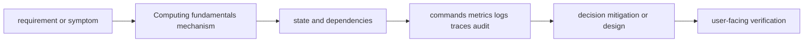

# Computing fundamentals

<!-- chapter-guide:start -->
> **Step 008 of 373 — 01.01**
>
> **Builds on:** [Computer science and distributed-systems foundations](../README.md)
>
> **Now:** Learn **Computing fundamentals** from its mental model through production ownership.
>
> **Then:** Rehearse the linked questions and continue to [Concurrency](../02-concurrency/README.md).
<!-- chapter-guide:end -->

> [Interview questions and answers](questions-and-answers.md) · [Master curriculum](../../curriculum/master-curriculum.txt) · Official starting point: <https://sre.google/sre-book/handling-overload/>

## Easy mode: mental model

Master Computing fundamentals from first principles through safe production operation and senior architecture decisions.

Learn this topic in layers: name the object or mechanism, trace its lifecycle/data path, configure it safely, observe a healthy and failed state, recover it, and then design it across failure domains and team boundaries.



## Complete curriculum checklist

| # | Topic | What you must understand and demonstrate |
|---:|---|---|
| 1 | **CPU** | executes instructions on logical processors; run-queue pressure, per-core saturation, steal time, affinity, quotas and throttling determine effective compute. |
| 2 | **Memory** | maps virtual pages to RAM or swap; RSS, cache, faults, reclaim, PSI, NUMA locality and cgroup limits explain pressure better than one free-memory number. |
| 3 | **Disk** | persists blocks through filesystem, page cache, block queue and device; IOPS, throughput, latency, queue depth, durability and failure are distinct. |
| 4 | **Network** | moves packets through name resolution, routing, policy/NAT, transport, TLS and application layers; each hop has independent state and failure. |
| 5 | **Processes** | are kernel-scheduled execution/resource containers with address space, credentials, descriptors, namespaces, cgroups, signals and lifecycle state. |
| 6 | **Threads** | share a process address space and resources while retaining independent stacks and scheduling state, trading lower communication cost for synchronization risk. |
| 7 | **File descriptors** | are per-process integer handles to open files, sockets, pipes and kernel objects; process and system limits can exhaust independently. |
| 8 | **Interrupts** | is part of Computing fundamentals; learn its precise definition, mechanism and lifecycle, nearest alternatives, configuration interface, failure/limit, security boundary, observable evidence and production trade-off. |
| 9 | **System calls** | cross the user/kernel boundary to request controlled operations such as open, read, write, mmap, clone and network I/O. |
| 10 | **CPU** | executes instructions on logical processors; run-queue pressure, per-core saturation, steal time, affinity, quotas and throttling determine effective compute. |
| 11 | **Memory** | maps virtual pages to RAM or swap; RSS, cache, faults, reclaim, PSI, NUMA locality and cgroup limits explain pressure better than one free-memory number. |
| 12 | **Disk** | persists blocks through filesystem, page cache, block queue and device; IOPS, throughput, latency, queue depth, durability and failure are distinct. |
| 13 | **Network** | moves packets through name resolution, routing, policy/NAT, transport, TLS and application layers; each hop has independent state and failure. |
| 14 | **Processes** | are kernel-scheduled execution/resource containers with address space, credentials, descriptors, namespaces, cgroups, signals and lifecycle state. |
| 15 | **Threads** | share a process address space and resources while retaining independent stacks and scheduling state, trading lower communication cost for synchronization risk. |
| 16 | **File descriptors** | are per-process integer handles to open files, sockets, pipes and kernel objects; process and system limits can exhaust independently. |
| 17 | **Interrupts** | is part of Computing fundamentals; learn its precise definition, mechanism and lifecycle, nearest alternatives, configuration interface, failure/limit, security boundary, observable evidence and production trade-off. |
| 18 | **System calls** | cross the user/kernel boundary to request controlled operations such as open, read, write, mmap, clone and network I/O. |

## Beginner → mid-level → senior learning path

1. **Beginner:** define every term; identify the relevant file, object, protocol, API, or command; explain one normal use.
2. **Mid-level:** configure it from source control, inspect effective runtime state, diagnose two failure modes, automate a safe change, and explain one trade-off.
3. **Senior:** clarify ambiguous requirements, map trust and failure domains, quantify capacity/SLO/RPO/RTO/cost, compare alternatives, plan migration/rollback, and assign ownership.

## Command and configuration lab

Run read-only checks first in a sandbox. For each command, predict healthy output, one failing result, the next discriminating check, and the safe rollback for any later mutation.

```bash
lscpu; free -h; lsblk; ip -br addr
ss -s
curl -v URL
dig NAME
```

## Hands-on practice: setup → failure → verification → cleanup

Use a disposable local or cloud sandbox. Confirm identity/context and cost boundary, capture a healthy baseline with the commands above, introduce one bounded configuration or invalid-input failure, compare evidence, revert from source control, verify the original outcome, and delete only the named lab resources.

Expected result: you can show the healthy evidence, reproduce a safe failure, explain why each command distinguishes one layer from another, restore the baseline, and prove cleanup. Hard extension: automate the lab from source control, add a test or alert for the injected failure, and write a five-step runbook another engineer can execute.

For code/configuration, be ready to review an intentionally unsafe diff and improve idempotency, secret handling, timeouts, validation, logging, tests, and rollback.

## Senior design checklist

State assumptions for tenants, traffic/work units, latency and availability targets, data classification/residency, recovery, team skills and budget. Draw control/data planes and synchronous/asynchronous dependencies. Cover identity, policy, encryption/key lifecycle, delivery provenance, observability, capacity, unit cost, operational ownership, migration and exit criteria. Name the evidence that would cause you to revise the design.

## Revision and practice

Complete the separate [checkbox interview bank](questions-and-answers.md). Do not memorize wording: speak in the order **definition → mechanism → evidence/configuration → failure/trade-off → production example**. For procedures use **stabilize → scope → inspect → hypothesize → test → mitigate → verify → prevent**.

<!-- reading-navigation:start -->
---

**Reading path:** [← Back: Computer science and distributed-systems foundations](../README.md) · [Questions](questions-and-answers.md) · [Next: Concurrency →](../02-concurrency/README.md)

<!-- reading-navigation:end -->
