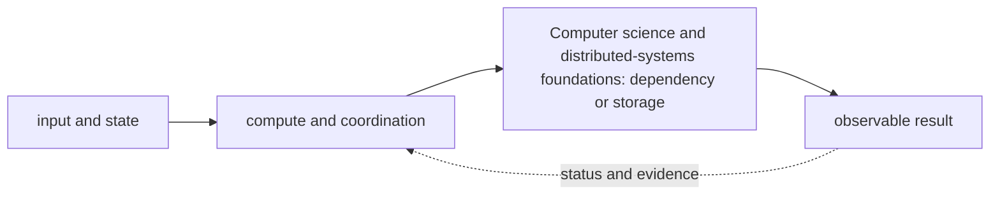

# Computer science and distributed-systems foundations

<!-- chapter-guide:start -->
> **Step 007 of 373 — 01**
>
> **Builds on:** [Contractor and remote-work readiness](../00-role-ownership/05-contractor-and-remote-work-readiness/README.md)
>
> **Now:** Learn **Computer science and distributed-systems foundations** from its mental model through production ownership.
>
> **Then:** Rehearse the linked questions and continue to [Computing fundamentals](01-computing-fundamentals/README.md).
<!-- chapter-guide:end -->

<!-- explanation-practice-normalizer:v1 -->


## Explanation

### What this chapter is and why it exists

**Computer science and distributed-systems foundations** is easiest to understand as one part of a larger path. The subject is a system of state and work: inputs arrive, compute and storage transform state, concurrent actors coordinate, and callers observe an outcome even when components fail independently.

The chapter focuses on Computer science and distributed-systems foundations. These are connected mechanisms, not vocabulary to memorize. The foundations branch explains the computing, concurrency, distributed-state, resilience and API mechanisms on which the later platform chapters depend The explanations below first build the simple model, then add the exact system behavior and production consequences.

### History and evolution

Modern computing grew from single machines and batch programs into time-sharing, networked services and globally distributed systems. Each step improved sharing and scale but introduced concurrency, partial failure and consistency problems, which is why the foundational mechanisms in this chapter still appear inside cloud and AI platforms.

In this chapter, **Computer science and distributed-systems foundations** is the next layer of that evolution. Its modern purpose is to the foundations branch explains the computing, concurrency, distributed-state, resilience and API mechanisms on which the later platform chapters depend. The exact product surface may change by version, but the underlying state, request path and failure boundaries remain the durable ideas to learn.

### How the complete branch works



A branch overview connects child mechanisms into one lifecycle. The input crosses identity and policy, a control or decision plane, the runtime data path and its dependencies before producing a user-visible result. Status and telemetry travel back through the loop so operators and controllers can correct drift or failure. Reading the child chapters adds precision, but this overview explains why those chapters depend on one another.

A useful test of understanding is to trace one concrete request or change from origin to outcome and name the authoritative state at each boundary. That trace reveals where work is synchronous or asynchronous, which failure domains are independent, what a timeout can prove, and which evidence distinguishes accepted intent from healthy behavior.

### Computing model

CPU executes instructions; memory holds addressable working state; storage persists blocks/files/objects; networks move bounded packets with latency/loss/reordering; processes own isolated virtual address spaces/resources; threads share a process. System calls cross user/kernel boundary. Interrupts signal hardware; file descriptors name open files, sockets, pipes and devices. Limits on descriptors, processes, memory, disk, ports and queues often appear as application failures.

Concurrency is overlapping work; parallelism is simultaneous execution. Locks/mutexes protect invariants, semaphores bound concurrency, condition variables coordinate state, queues decouple producers/consumers and async I/O waits without dedicating a thread. Races arise when outcomes depend on unsynchronized timing; deadlocks require circular waiting conditions. Control concurrency with ownership, immutability, bounded queues, timeouts/cancellation and load tests.

### Distributed systems

Remote calls can be slow, duplicated, reordered or partially succeed while the client times out. You cannot infer “operation did not happen” from “response was not received.” Use deadlines, bounded retries with exponential backoff/jitter, idempotency keys/conditional writes, deduplication, durable state machines and reconciliation.

At-most-once may lose; at-least-once may duplicate; “exactly once” usually means a scoped effect achieved by idempotency/transactions/deduplication under stated failure assumptions. Backpressure slows producers; load shedding rejects lower-value work before collapse; circuit breakers stop futile calls; bulkheads isolate resource pools; graceful degradation preserves critical paths.

Replication improves availability/read scale but creates lag/conflict/failover concerns. Strong consistency makes a defined ordering/visibility promise; eventual consistency converges absent new writes; read-after-write may be session/key scoped. Quorums trade read/write participation and failure tolerance. Leader election needs leases/terms/fencing to prevent stale leaders. CAP applies under partitions: choose which operations remain available versus consistent; it is not a database ranking slogan.

### API and architecture

REST models resources over HTTP; gRPC provides typed RPC/streaming over HTTP/2; WebSockets are bidirectional long-lived connections; server-sent events are server-to-client streams; queues/events decouple time and availability. Define contracts, authentication/authorization, validation, versioning/compatibility, pagination/cursors, idempotency, error taxonomy, deadlines/cancellation, correlation/trace context and rate limits.

Synchronous calls simplify immediate flows but couple latency/availability. Async messaging buffers and isolates but adds delivery/order/replay/observability complexity. A modular monolith can be safer than premature microservices; microservices trade independent ownership/scale for distributed-systems and platform cost. Event-driven systems need schema evolution, ownership, idempotent consumers and replay. Serverless changes execution/cost/limits, not correctness.

Control planes accept desired state/policy and reconcile; data planes serve traffic/work. Multi-tenancy must isolate identity, data, compute, network, keys, telemetry and cost. Choose shared versus dedicated resources from threat model, regulatory/customer requirements, noisy-neighbor risk and economics.

### Resilience and operations

Set a total deadline and retry budget across hops; otherwise layered retries amplify load. Use randomized backoff, honor server hints, do not blindly retry non-idempotent or permanent errors. Bound queues and concurrency to protect memory/dependencies. Cache with freshness, invalidation, stampede and tenant/security design. Test failure at boundaries and observe latency distributions, error/saturation/queue, dependency outcomes and correctness.

### Revision summary

- Partial failure and ambiguity are normal.
- Bound time, concurrency, queues and retries.
- Make side effects idempotent or durably coordinated.
- State consistency and availability claims with scope and failure assumptions.
- Architecture is a trade of coupling, ownership, failure and operational cost.

### Read further

- [Google SRE: Handling Overload](https://sre.google/sre-book/handling-overload/) — primary production guidance connecting capacity, request cost, throttling, criticality and graceful degradation.

## Practice

### Practice checkpoint

Use a disposable local process or container to observe one bounded queue, timeout, retry and cancellation path. Inject one delayed or duplicated request, explain the resulting failure mode and reliability effect, then stop the process and remove the temporary files, network and test data. Cleanup is part of the proof: no background worker, listener or generated state should remain.

### Practice objective

Build a small, safe proof of **Computer science and distributed-systems foundations** and explain the result in your own words. The goal is not command completion; it is to connect input, internal mechanism, observable state and user outcome.

### Prerequisites and setup

Use a disposable local environment, sandbox account/project or isolated namespace. Confirm the effective identity and target, record the start time, and set a cost limit before creating anything.

Record tool and platform versions because flags, APIs and defaults can change. Define every uppercase placeholder before use and keep secrets out of shell history and committed files.

### Activity 1: establish a healthy baseline

Run the read-oriented example first:

```bash
lscpu
free -h
ss -s
```

For each line, write down the layer it inspects, the expected healthy field or response, and one thing it cannot prove. The expected result is an attributable request against the intended target plus enough state to draw the path from input to outcome.

### Activity 2: create or review the smallest working example

Put the smallest relevant command, configuration, manifest or code sample in source control. Validate or lint it, produce a preview/diff where the tool supports one, and apply only inside the disposable boundary. Record the exact revision and resulting resource or process ID. If the topic is observational rather than configurable, save a sanitized baseline and an automated assertion instead of mutating the system.

### Activity 3: controlled failure and troubleshooting

Introduce one bounded failure: use a definitely nonexistent resource name, an invalid sandbox-only value, a denied test identity, a closed test port or a stopped disposable dependency. Capture the exact error and classify it as identity/policy, input/configuration, control-plane reconciliation, network/protocol, dependency or capacity. Test one discriminating hypothesis at a time; do not widen access or restart unrelated components.

Expected failure evidence is a specific non-zero exit, status/reason, event or protocol response that disappears when the controlled fault is removed. If healthy and failing runs look identical, the chosen signal does not explain the phenomenon and the exercise is not complete.

### Verification

Repeat the original client or user-facing check, not only an administrative status command. Confirm the desired revision, data correctness where applicable, error and latency recovery, and absence of a continuing retry/backlog/saturation condition. Explain why this evidence proves recovery and what uncertainty remains.

### Cleanup and rollback

Revert the configuration in its source of truth and review the rollback diff before applying it. Delete only the named sandbox resources, stop disposable processes, remove temporary credentials and verify that no billable resource, volume, artifact, queue item or background job remains. Read-only activities require no infrastructure rollback, but sanitized captures must still follow retention policy.

### Harder extension

Automate the healthy and failing paths in CI, use short-lived identity, add one SLI/alert or policy assertion, and write a five-step runbook another engineer can execute without hidden context. Then explain how the design changes for two tenants, a zonal or dependency failure, 10× load and a strict cost or recovery target.

<!-- reading-navigation:start -->
---

**Reading path:** [← Back: Contractor and remote-work readiness](../00-role-ownership/05-contractor-and-remote-work-readiness/README.md) · [Questions](questions-and-answers.md) · [Next: Computing fundamentals →](01-computing-fundamentals/README.md)

<!-- reading-navigation:end -->
