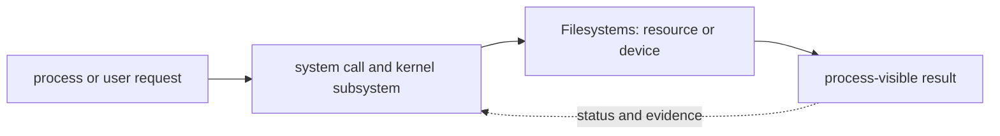

# Filesystems

<!-- chapter-guide:start -->
> **Step 017 of 373 — 02.02**
>
> **Builds on:** [Linux architecture](../01-linux-architecture/README.md)
>
> **Now:** Learn **Filesystems** from its mental model through production ownership.
>
> **Then:** Rehearse the linked questions and continue to [Users and permissions](../03-users-and-permissions/README.md).
<!-- chapter-guide:end -->

> [Interview questions and answers](questions-and-answers.md) · [Master curriculum](../../curriculum/master-curriculum.txt) · Official starting point: <https://docs.kernel.org/>

## Explanation

### What it is and why it exists

**Filesystems** is easiest to understand as one part of a larger path. The subject lives across user space and the Linux kernel. A process asks the kernel for CPU, memory, files, devices or network access through system calls; the kernel enforces identity, isolation, accounting and lifecycle rules.

The chapter focuses on Linux directory structure, /etc, /var, /proc, /sys, /dev, /tmp, ext4, XFS. These are connected mechanisms, not vocabulary to memorize. Filesystems is the part of Linux and operating systems that connects the listed mechanisms to effective runtime state, observable behavior and production outcomes The explanations below first build the simple model, then add the exact system behavior and production consequences.

### History and evolution

Linux inherits the Unix process, file and permission model developed from the late 1960s. Linus Torvalds released the Linux kernel in 1991; networking, loadable modules, namespaces, cgroups, modern filesystems and service managers later turned it into the common substrate for servers, containers and Kubernetes nodes.

In this chapter, **Filesystems** is the next layer of that evolution. Its modern purpose is to filesystems is the part of Linux and operating systems that connects the listed mechanisms to effective runtime state, observable behavior and production outcomes. The exact product surface may change by version, but the underlying state, request path and failure boundaries remain the durable ideas to learn.

### How it works: the end-to-end path



The path begins with a concrete input: a user request, configuration revision, packet, job, model request or operational symptom. The relevant subsystem validates that input, reads current state, performs or schedules work and exposes a result. Some transitions complete before the caller receives a response; others acknowledge the request and converge later. That difference determines whether a timeout means "nothing happened," "the operation failed," or "the final result is still unknown."

For **Filesystems**, the important stages are Linux directory structure, /etc, /var, /proc, /sys, /dev, /tmp, ext4, XFS, NFS, OverlayFS, Mounts, Bind mounts, Inodes, Hard links, Symbolic links, Filesystem permissions, Filesystem corruption, Filesystem expansion. Their boundaries explain where identity is checked, where state becomes durable, where capacity is consumed, how failures propagate and which signal can distinguish one layer from another. A production explanation should follow the actual path rather than treating each term as an isolated definition.


### Core concepts explained in detail

#### Linux directory structure

**What it is.** The term Linux directory structure refers to a kernel or user-space mechanism that changes how a process obtains, shares, limits or observes an operating-system resource within Filesystems.

**Junior mental model.** Think of a scheduler as allocating seats and time slots: a request states what it needs, available workers advertise capacity, and policy chooses a placement. Requested capacity, usable capacity and completed useful work are different quantities.

**How it works.** Work enters a runnable or pending state, eligibility filters remove incompatible placements, scoring or queue policy selects a worker, and a runtime creates the process and accounts for CPU, memory, devices and time. Autoscaling observes demand, requests more replicas or machines, and waits through provisioning and warm-up before capacity becomes useful.

**What it looks like in production.** Healthy evidence connects queue delay, placement, utilization, throttling, memory/device pressure, runtime readiness and successful work. Fragmentation, inaccurate requests, quota, topology, cold starts and a saturated downstream service can leave capacity apparently free while latency and pending work grow.

#### /etc, /var, /proc, /sys, /dev, /tmp

**What it is.** The term /etc, /var, /proc, /sys, /dev, /tmp refers to a kernel or user-space mechanism that changes how a process obtains, shares, limits or observes an operating-system resource within Filesystems.

**Junior mental model.** Think of a scheduler as allocating seats and time slots: a request states what it needs, available workers advertise capacity, and policy chooses a placement. Requested capacity, usable capacity and completed useful work are different quantities.

**How it works.** Work enters a runnable or pending state, eligibility filters remove incompatible placements, scoring or queue policy selects a worker, and a runtime creates the process and accounts for CPU, memory, devices and time. Autoscaling observes demand, requests more replicas or machines, and waits through provisioning and warm-up before capacity becomes useful.

**What it looks like in production.** Healthy evidence connects queue delay, placement, utilization, throttling, memory/device pressure, runtime readiness and successful work. Fragmentation, inaccurate requests, quota, topology, cold starts and a saturated downstream service can leave capacity apparently free while latency and pending work grow.

#### ext4

**What it is.** The term ext4 refers to a kernel or user-space mechanism that changes how a process obtains, shares, limits or observes an operating-system resource within Filesystems.

**Junior mental model.** Think of a scheduler as allocating seats and time slots: a request states what it needs, available workers advertise capacity, and policy chooses a placement. Requested capacity, usable capacity and completed useful work are different quantities.

**How it works.** Work enters a runnable or pending state, eligibility filters remove incompatible placements, scoring or queue policy selects a worker, and a runtime creates the process and accounts for CPU, memory, devices and time. Autoscaling observes demand, requests more replicas or machines, and waits through provisioning and warm-up before capacity becomes useful.

**What it looks like in production.** Healthy evidence connects queue delay, placement, utilization, throttling, memory/device pressure, runtime readiness and successful work. Fragmentation, inaccurate requests, quota, topology, cold starts and a saturated downstream service can leave capacity apparently free while latency and pending work grow.

#### XFS

**What it is.** The term XFS refers to a kernel or user-space mechanism that changes how a process obtains, shares, limits or observes an operating-system resource within Filesystems.

**Junior mental model.** Think of a scheduler as allocating seats and time slots: a request states what it needs, available workers advertise capacity, and policy chooses a placement. Requested capacity, usable capacity and completed useful work are different quantities.

**How it works.** Work enters a runnable or pending state, eligibility filters remove incompatible placements, scoring or queue policy selects a worker, and a runtime creates the process and accounts for CPU, memory, devices and time. Autoscaling observes demand, requests more replicas or machines, and waits through provisioning and warm-up before capacity becomes useful.

**What it looks like in production.** Healthy evidence connects queue delay, placement, utilization, throttling, memory/device pressure, runtime readiness and successful work. Fragmentation, inaccurate requests, quota, topology, cold starts and a saturated downstream service can leave capacity apparently free while latency and pending work grow.

#### NFS

**What it is.** The term NFS refers to a kernel or user-space mechanism that changes how a process obtains, shares, limits or observes an operating-system resource within Filesystems.

**Junior mental model.** Think of a scheduler as allocating seats and time slots: a request states what it needs, available workers advertise capacity, and policy chooses a placement. Requested capacity, usable capacity and completed useful work are different quantities.

**How it works.** Work enters a runnable or pending state, eligibility filters remove incompatible placements, scoring or queue policy selects a worker, and a runtime creates the process and accounts for CPU, memory, devices and time. Autoscaling observes demand, requests more replicas or machines, and waits through provisioning and warm-up before capacity becomes useful.

**What it looks like in production.** Healthy evidence connects queue delay, placement, utilization, throttling, memory/device pressure, runtime readiness and successful work. Fragmentation, inaccurate requests, quota, topology, cold starts and a saturated downstream service can leave capacity apparently free while latency and pending work grow.

#### OverlayFS

**What it is.** Presents lower image layers plus an upper writable layer; copy-up and inode/storage behavior affect container performance.

**Junior mental model.** Think of a scheduler as allocating seats and time slots: a request states what it needs, available workers advertise capacity, and policy chooses a placement. Requested capacity, usable capacity and completed useful work are different quantities.

**How it works.** Work enters a runnable or pending state, eligibility filters remove incompatible placements, scoring or queue policy selects a worker, and a runtime creates the process and accounts for CPU, memory, devices and time. Autoscaling observes demand, requests more replicas or machines, and waits through provisioning and warm-up before capacity becomes useful.

**What it looks like in production.** Healthy evidence connects queue delay, placement, utilization, throttling, memory/device pressure, runtime readiness and successful work. Fragmentation, inaccurate requests, quota, topology, cold starts and a saturated downstream service can leave capacity apparently free while latency and pending work grow.

#### Mounts

**What it is.** The term Mounts refers to a kernel or user-space mechanism that changes how a process obtains, shares, limits or observes an operating-system resource within Filesystems.

**Junior mental model.** Think of a scheduler as allocating seats and time slots: a request states what it needs, available workers advertise capacity, and policy chooses a placement. Requested capacity, usable capacity and completed useful work are different quantities.

**How it works.** Work enters a runnable or pending state, eligibility filters remove incompatible placements, scoring or queue policy selects a worker, and a runtime creates the process and accounts for CPU, memory, devices and time. Autoscaling observes demand, requests more replicas or machines, and waits through provisioning and warm-up before capacity becomes useful.

**What it looks like in production.** Healthy evidence connects queue delay, placement, utilization, throttling, memory/device pressure, runtime readiness and successful work. Fragmentation, inaccurate requests, quota, topology, cold starts and a saturated downstream service can leave capacity apparently free while latency and pending work grow.

#### Bind mounts

**What it is.** The term Bind mounts refers to a kernel or user-space mechanism that changes how a process obtains, shares, limits or observes an operating-system resource within Filesystems.

**Junior mental model.** Think of a scheduler as allocating seats and time slots: a request states what it needs, available workers advertise capacity, and policy chooses a placement. Requested capacity, usable capacity and completed useful work are different quantities.

**How it works.** Work enters a runnable or pending state, eligibility filters remove incompatible placements, scoring or queue policy selects a worker, and a runtime creates the process and accounts for CPU, memory, devices and time. Autoscaling observes demand, requests more replicas or machines, and waits through provisioning and warm-up before capacity becomes useful.

**What it looks like in production.** Healthy evidence connects queue delay, placement, utilization, throttling, memory/device pressure, runtime readiness and successful work. Fragmentation, inaccurate requests, quota, topology, cold starts and a saturated downstream service can leave capacity apparently free while latency and pending work grow.

#### Inodes

**What it is.** Store filesystem object metadata and block references while directories map names to inode numbers; inode exhaustion is separate from byte exhaustion.

**Junior mental model.** Think of a scheduler as allocating seats and time slots: a request states what it needs, available workers advertise capacity, and policy chooses a placement. Requested capacity, usable capacity and completed useful work are different quantities.

**How it works.** Work enters a runnable or pending state, eligibility filters remove incompatible placements, scoring or queue policy selects a worker, and a runtime creates the process and accounts for CPU, memory, devices and time. Autoscaling observes demand, requests more replicas or machines, and waits through provisioning and warm-up before capacity becomes useful.

**What it looks like in production.** Healthy evidence connects queue delay, placement, utilization, throttling, memory/device pressure, runtime readiness and successful work. Fragmentation, inaccurate requests, quota, topology, cold starts and a saturated downstream service can leave capacity apparently free while latency and pending work grow.

#### Hard links

**What it is.** Add another directory name for the same inode and normally cannot cross filesystems; data remains until the final link/open reference disappears.

**Junior mental model.** Think of a scheduler as allocating seats and time slots: a request states what it needs, available workers advertise capacity, and policy chooses a placement. Requested capacity, usable capacity and completed useful work are different quantities.

**How it works.** Work enters a runnable or pending state, eligibility filters remove incompatible placements, scoring or queue policy selects a worker, and a runtime creates the process and accounts for CPU, memory, devices and time. Autoscaling observes demand, requests more replicas or machines, and waits through provisioning and warm-up before capacity becomes useful.

**What it looks like in production.** Healthy evidence connects queue delay, placement, utilization, throttling, memory/device pressure, runtime readiness and successful work. Fragmentation, inaccurate requests, quota, topology, cold starts and a saturated downstream service can leave capacity apparently free while latency and pending work grow.

#### Symbolic links

**What it is.** Store a path resolved at access time, can cross filesystems, and can dangle or create security-sensitive traversal.

**Junior mental model.** Think of a scheduler as allocating seats and time slots: a request states what it needs, available workers advertise capacity, and policy chooses a placement. Requested capacity, usable capacity and completed useful work are different quantities.

**How it works.** Work enters a runnable or pending state, eligibility filters remove incompatible placements, scoring or queue policy selects a worker, and a runtime creates the process and accounts for CPU, memory, devices and time. Autoscaling observes demand, requests more replicas or machines, and waits through provisioning and warm-up before capacity becomes useful.

**What it looks like in production.** Healthy evidence connects queue delay, placement, utilization, throttling, memory/device pressure, runtime readiness and successful work. Fragmentation, inaccurate requests, quota, topology, cold starts and a saturated downstream service can leave capacity apparently free while latency and pending work grow.

#### Filesystem permissions

**What it is.** The term Filesystem permissions holds state beyond one operation or process lifetime and therefore must define durability, consistency, concurrency, replication, backup, restore and deletion semantics within Filesystems.

**Junior mental model.** Think of this as a badge plus a checkpoint: identity says who or what is acting, while policy decides whether that actor may perform this exact action on this exact target under the current conditions.

**How it works.** At runtime a caller presents or derives an identity, the enforcement point gathers identity, resource and request context, and applicable rules produce allow or deny. The effective decision is the intersection of all guardrails; encryption protects bytes but does not replace authorization, and audit records explain which decision was made.

**What it looks like in production.** Healthy evidence includes a short-lived attributable identity, narrowly scoped access and an audit event for the intended resource. Failures commonly come from expired credentials, mismatched trust, an overriding deny, wrong resource scope or key/certificate lifecycle problems; widening access may hide the cause while creating a breach path.

#### Filesystem corruption

**What it is.** The term Filesystem corruption holds state beyond one operation or process lifetime and therefore must define durability, consistency, concurrency, replication, backup, restore and deletion semantics within Filesystems.

**Junior mental model.** Think of this as a library catalog plus shelves: metadata says what should exist and where, while physical or remote storage holds the bytes. A successful write is not necessarily durable, replicated, backed up or restorable under the same contract.

**How it works.** A write normally passes validation and authorization, enters a buffer or transaction, reaches a durable medium, and may then replicate or become visible to readers. Caches and indexes accelerate access but introduce freshness and eviction behavior; snapshots preserve a point-in-time representation but application consistency depends on write ordering.

**What it looks like in production.** Healthy evidence combines capacity, latency, error, replication and integrity signals with a tested read or restore. Typical failures include exhausted bytes or inodes, throttling, stale replicas, corrupt metadata, topology mismatch, lost encryption keys and backups that exist but cannot reconstruct the application within RPO/RTO.

#### Filesystem expansion

**What it is.** The term Filesystem expansion holds state beyond one operation or process lifetime and therefore must define durability, consistency, concurrency, replication, backup, restore and deletion semantics within Filesystems.

**Junior mental model.** Think of this as a library catalog plus shelves: metadata says what should exist and where, while physical or remote storage holds the bytes. A successful write is not necessarily durable, replicated, backed up or restorable under the same contract.

**How it works.** A write normally passes validation and authorization, enters a buffer or transaction, reaches a durable medium, and may then replicate or become visible to readers. Caches and indexes accelerate access but introduce freshness and eviction behavior; snapshots preserve a point-in-time representation but application consistency depends on write ordering.

**What it looks like in production.** Healthy evidence combines capacity, latency, error, replication and integrity signals with a tested read or restore. Typical failures include exhausted bytes or inodes, throttling, stale replicas, corrupt metadata, topology mismatch, lost encryption keys and backups that exist but cannot reconstruct the application within RPO/RTO.

### Worked command and configuration example

The following is a diagnostic example, not an unexplained command dump. Define every uppercase placeholder first—for example `NAME`, `RESOURCE`, `PROJECT`, `REGION`, `NAMESPACE`, `URL`, `IMAGE` or `CONTAINER`—and use a sandbox or read-only production role.

```bash
findmnt -o TARGET,SOURCE,FSTYPE,OPTIONS
df -hT; df -i; du -xhd1 /var | sort -h
stat PATH; namei -l PATH
lsof +L1
```

What the example demonstrates:

- `findmnt -o TARGET,SOURCE,FSTYPE,OPTIONS` captures a read-oriented state snapshot that must be interpreted against a healthy baseline, the exact target and the next adjacent dependency.
- `df -hT; df -i; du -xhd1 /var | sort -h` captures a read-oriented state snapshot that must be interpreted against a healthy baseline, the exact target and the next adjacent dependency.
- `stat PATH; namei -l PATH` captures a read-oriented state snapshot that must be interpreted against a healthy baseline, the exact target and the next adjacent dependency.
- `lsof +L1` captures a read-oriented state snapshot that must be interpreted against a healthy baseline, the exact target and the next adjacent dependency.

A healthy run returns the intended identity/context, exits successfully and shows the expected object or response without a new warning, retry loop or saturation signal. A failure is useful evidence: preserve the exact exit code, status/reason, timestamp and target, then inspect the immediately adjacent layer before changing anything. This makes the example part of the explanation of **Filesystems**, not merely a list to copy.

### Security, reliability and production ownership

Security controls who can initiate a transition and what data or resource that transition may affect. Authentication, authorization, network reachability, encryption and audit solve different problems and must align at each boundary. Short-lived attributable identities, least privilege, explicit tenant separation and tested key/certificate rotation reduce blast radius. Logs and traces need their own data controls because copying a secret or customer payload into telemetry defeats the primary protection.

Reliability depends on every synchronous dependency and on the eventual convergence of asynchronous work. Timeouts bound waiting; idempotency makes an ambiguous retry safe; backpressure and load shedding keep demand within useful capacity; replication and failover help only across independent failure domains. Recovery must be tested from protected state and verified through the original user outcome, not inferred from a green administrative status.

Ownership makes these mechanisms operable. Every production resource or service needs an accountable team, source-of-truth revision, environment and data classification, SLO, runbook, cost center and retirement policy. Reversible mitigation can stabilize an incident, but the durable repair belongs in Git, IaC, policy or the owning application so reconciliation does not reintroduce the fault.

### Observability, performance and cost

Metrics, logs, traces, profiles and audit events are complementary. A useful diagnostic path starts with time, identity, exact target and user symptom, then compares desired and observed state before moving through reconciliation, network/protocol, runtime, dependency and saturation layers. High-cardinality request or object IDs belong in sampled logs or traces rather than metric labels; alerts should represent actionable user-impact risk or leading exhaustion.

Performance is governed by work distribution, queueing and bottlenecks. Rate, latency percentiles, errors, saturation, queue depth or age and service-specific limits reveal more than average utilization. Application replicas and underlying machines, storage or provider quota scale through separate loops with different cold delays. Cost includes idle headroom, requests or work units, storage/retention, network transfer, telemetry, support and recovery capacity; optimize cost per successful outcome rather than the cheapest isolated resource.

### What you should be able to explain

The table remains as a revision checklist. Read the explanations above first; afterward, use each row to check whether you can explain the concept without relying on memorized wording.

| # | Topic | What you must understand and demonstrate |
|---:|---|---|
| 1 | **Linux directory structure** | is part of Filesystems; learn its precise definition, mechanism and lifecycle, nearest alternatives, configuration interface, failure/limit, security boundary, observable evidence and production trade-off |
| 2 | **/etc, /var, /proc, /sys, /dev, /tmp** | is part of Filesystems; learn its precise definition, mechanism and lifecycle, nearest alternatives, configuration interface, failure/limit, security boundary, observable evidence and production trade-off |
| 3 | **ext4** | is part of Filesystems; learn its precise definition, mechanism and lifecycle, nearest alternatives, configuration interface, failure/limit, security boundary, observable evidence and production trade-off |
| 4 | **XFS** | is part of Filesystems; learn its precise definition, mechanism and lifecycle, nearest alternatives, configuration interface, failure/limit, security boundary, observable evidence and production trade-off |
| 5 | **NFS** | is part of Filesystems; learn its precise definition, mechanism and lifecycle, nearest alternatives, configuration interface, failure/limit, security boundary, observable evidence and production trade-off |
| 6 | **OverlayFS** | presents lower image layers plus an upper writable layer; copy-up and inode/storage behavior affect container performance |
| 7 | **Mounts** | is part of Filesystems; learn its precise definition, mechanism and lifecycle, nearest alternatives, configuration interface, failure/limit, security boundary, observable evidence and production trade-off |
| 8 | **Bind mounts** | is part of Filesystems; learn its precise definition, mechanism and lifecycle, nearest alternatives, configuration interface, failure/limit, security boundary, observable evidence and production trade-off |
| 9 | **Inodes** | store filesystem object metadata and block references while directories map names to inode numbers; inode exhaustion is separate from byte exhaustion |
| 10 | **Hard links** | add another directory name for the same inode and normally cannot cross filesystems; data remains until the final link/open reference disappears |
| 11 | **Symbolic links** | store a path resolved at access time, can cross filesystems, and can dangle or create security-sensitive traversal |
| 12 | **Filesystem permissions** | is part of Filesystems; learn its precise definition, mechanism and lifecycle, nearest alternatives, configuration interface, failure/limit, security boundary, observable evidence and production trade-off |
| 13 | **Filesystem corruption** | is part of Filesystems; learn its precise definition, mechanism and lifecycle, nearest alternatives, configuration interface, failure/limit, security boundary, observable evidence and production trade-off |
| 14 | **Filesystem expansion** | is part of Filesystems; learn its precise definition, mechanism and lifecycle, nearest alternatives, configuration interface, failure/limit, security boundary, observable evidence and production trade-off |

## Practice

### Practice objective

Build a small, safe proof of **Filesystems** and explain the result in your own words. The goal is not command completion; it is to connect input, internal mechanism, observable state and user outcome.

### Prerequisites and setup

Use a disposable Linux VM or container. Record `date -u`, `uname -a`, distribution, effective user and cgroup before the topic commands. Capture a healthy baseline, run one command with an intentionally nonexistent PID/path/unit to learn its error and exit code, then return to the real object and explain the discriminating fields. Do not change mounts, firewall, users, kernel settings or services on a shared host. Cleanup: exit and delete the disposable environment.

Record tool and platform versions because flags, APIs and defaults can change. Define every uppercase placeholder before use and keep secrets out of shell history and committed files.

### Activity 1: establish a healthy baseline

Run the read-oriented example first:

```bash
findmnt -o TARGET,SOURCE,FSTYPE,OPTIONS
df -hT; df -i; du -xhd1 /var | sort -h
stat PATH; namei -l PATH
lsof +L1
```

For each line, write down the layer it inspects, the expected healthy field or response, and one thing it cannot prove. The expected result is an attributable request against the intended target plus enough state to draw the path from input to outcome.

### Activity 2: create or review the smallest working example

Put the smallest relevant command, configuration, manifest or code sample in source control. Validate or lint it, produce a preview/diff where the tool supports one, and apply only inside the disposable boundary. Record the exact revision and resulting resource or process ID. If the topic is observational rather than configurable, save a sanitized baseline and an automated assertion instead of mutating the system.

### Activity 3: controlled failure and troubleshooting

Introduce one bounded failure: use a definitely nonexistent resource name, an invalid sandbox-only value, a denied test identity, a closed test port or a stopped disposable dependency. Capture the exact error and classify it as identity/policy, input/configuration, control-plane reconciliation, network/protocol, dependency or capacity. Test one discriminating hypothesis at a time; do not widen access or restart unrelated components.

Expected failure evidence is a specific non-zero exit, status/reason, event or protocol response that disappears when the controlled fault is removed. If healthy and failing runs look identical, the chosen signal does not explain the phenomenon and the exercise is not complete.

### Verification

Repeat the original client or user-facing check, not only an administrative status command. Confirm the desired revision, data correctness where applicable, error and latency recovery, and absence of a continuing retry/backlog/saturation condition. Explain why this evidence proves recovery and what uncertainty remains.

### Cleanup and rollback

Revert the configuration in its source of truth and review the rollback diff before applying it. Delete only the named sandbox resources, stop disposable processes, remove temporary credentials and verify that no billable resource, volume, artifact, queue item or background job remains. Read-only activities require no infrastructure rollback, but sanitized captures must still follow retention policy.

### Harder extension

Automate the healthy and failing paths in CI, use short-lived identity, add one SLI/alert or policy assertion, and write a five-step runbook another engineer can execute without hidden context. Then explain how the design changes for two tenants, a zonal or dependency failure, 10× load and a strict cost or recovery target.

<!-- reading-navigation:start -->
---

**Reading path:** [← Back: Linux architecture](../01-linux-architecture/README.md) · [Questions](questions-and-answers.md) · [Next: Users and permissions →](../03-users-and-permissions/README.md)

<!-- reading-navigation:end -->
