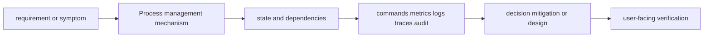

# Process management

<!-- chapter-guide:start -->
> **Step 019 of 373 — 02.04**
>
> **Builds on:** [Users and permissions](../03-users-and-permissions/README.md)
>
> **Now:** Learn **Process management** from its mental model through production ownership.
>
> **Then:** Rehearse the linked questions and continue to [systemd](../05-systemd/README.md).
<!-- chapter-guide:end -->

> [Interview questions and answers](questions-and-answers.md) · [Master curriculum](../../curriculum/master-curriculum.txt) · Official starting point: <https://docs.kernel.org/>

## Easy mode: mental model

Master Process management from first principles through safe production operation and senior architecture decisions.

Learn this topic in layers: name the object or mechanism, trace its lifecycle/data path, configure it safely, observe a healthy and failed state, recover it, and then design it across failure domains and team boundaries.



## Complete curriculum checklist

| # | Topic | What you must understand and demonstrate |
|---:|---|---|
| 1 | **Process lifecycle** | is part of Process management; learn its precise definition, mechanism and lifecycle, nearest alternatives, configuration interface, failure/limit, security boundary, observable evidence and production trade-off. |
| 2 | **Parent and child processes** | is part of Process management; learn its precise definition, mechanism and lifecycle, nearest alternatives, configuration interface, failure/limit, security boundary, observable evidence and production trade-off. |
| 3 | **PID and PPID** | is part of Process management; learn its precise definition, mechanism and lifecycle, nearest alternatives, configuration interface, failure/limit, security boundary, observable evidence and production trade-off. |
| 4 | **Foreground and background jobs** | is part of Process management; learn its precise definition, mechanism and lifecycle, nearest alternatives, configuration interface, failure/limit, security boundary, observable evidence and production trade-off. |
| 5 | **Signals** | deliver asynchronous process notifications; SIGTERM enables cleanup while SIGKILL cannot be caught and risks unfinished work. |
| 6 | **Zombie processes** | have exited but retain a process-table entry until the parent waits; fix the parent/reaping lifecycle rather than killing the zombie. |
| 7 | **Orphan processes** | is part of Process management; learn its precise definition, mechanism and lifecycle, nearest alternatives, configuration interface, failure/limit, security boundary, observable evidence and production trade-off. |
| 8 | **Process priorities** | is part of Process management; learn its precise definition, mechanism and lifecycle, nearest alternatives, configuration interface, failure/limit, security boundary, observable evidence and production trade-off. |
| 9 | **nice and renice** | is part of Process management; learn its precise definition, mechanism and lifecycle, nearest alternatives, configuration interface, failure/limit, security boundary, observable evidence and production trade-off. |
| 10 | **CPU affinity** | is part of Process management; learn its precise definition, mechanism and lifecycle, nearest alternatives, configuration interface, failure/limit, security boundary, observable evidence and production trade-off. |
| 11 | **ulimit** | exposes shell/process resource limits such as open files and processes; systemd, PAM and cgroup limits may set other effective ceilings. |
| 12 | **File descriptor limits** | is part of Process management; learn its precise definition, mechanism and lifecycle, nearest alternatives, configuration interface, failure/limit, security boundary, observable evidence and production trade-off. |

## Beginner → mid-level → senior learning path

1. **Beginner:** define every term; identify the relevant file, object, protocol, API, or command; explain one normal use.
2. **Mid-level:** configure it from source control, inspect effective runtime state, diagnose two failure modes, automate a safe change, and explain one trade-off.
3. **Senior:** clarify ambiguous requirements, map trust and failure domains, quantify capacity/SLO/RPO/RTO/cost, compare alternatives, plan migration/rollback, and assign ownership.

## Command and configuration lab

Run read-only checks first in a sandbox. For each command, predict healthy output, one failing result, the next discriminating check, and the safe rollback for any later mutation.

```bash
ps -eo pid,ppid,user,state,ni,psr,pcpu,pmem,rss,etime,cmd --sort=-pcpu
pstree -ap; pgrep -af NAME
cat /proc/PID/status; cat /proc/PID/limits
pidstat -wru -p PID 1
```

## Hands-on practice: setup → failure → verification → cleanup

Use a disposable Linux VM or container. Record `date -u`, `uname -a`, distribution, effective user and cgroup before the topic commands. Capture a healthy baseline, run one command with an intentionally nonexistent PID/path/unit to learn its error and exit code, then return to the real object and explain the discriminating fields. Do not change mounts, firewall, users, kernel settings or services on a shared host. Cleanup: exit and delete the disposable environment.

Expected result: you can show the healthy evidence, reproduce a safe failure, explain why each command distinguishes one layer from another, restore the baseline, and prove cleanup. Hard extension: automate the lab from source control, add a test or alert for the injected failure, and write a five-step runbook another engineer can execute.

For code/configuration, be ready to review an intentionally unsafe diff and improve idempotency, secret handling, timeouts, validation, logging, tests, and rollback.

## Senior design checklist

State assumptions for tenants, traffic/work units, latency and availability targets, data classification/residency, recovery, team skills and budget. Draw control/data planes and synchronous/asynchronous dependencies. Cover identity, policy, encryption/key lifecycle, delivery provenance, observability, capacity, unit cost, operational ownership, migration and exit criteria. Name the evidence that would cause you to revise the design.

## Revision and practice

Complete the separate [checkbox interview bank](questions-and-answers.md). Do not memorize wording: speak in the order **definition → mechanism → evidence/configuration → failure/trade-off → production example**. For procedures use **stabilize → scope → inspect → hypothesize → test → mitigate → verify → prevent**.

<!-- reading-navigation:start -->
---

**Reading path:** [← Back: Users and permissions](../03-users-and-permissions/README.md) · [Questions](questions-and-answers.md) · [Next: systemd →](../05-systemd/README.md)

<!-- reading-navigation:end -->
