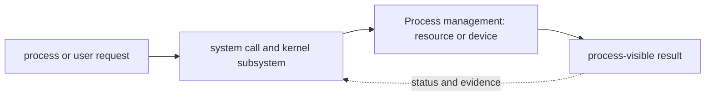

# Process management

<!-- chapter-guide:start -->
> **Step 019 of 373 — 02.04**
>
> **Builds on:** [Users and permissions](../03-users-and-permissions/README.md)
>
> **Now:** Learn **Process management** from its mental model through production ownership.
>
> **Then:** Rehearse the linked questions and continue to [systemd](../05-systemd/README.md).
<!-- chapter-guide:end -->

> [Interview questions and answers](questions-and-answers.md) · [Master curriculum](../../curriculum/master-curriculum.txt) · Official starting point: <https://docs.kernel.org/>

## Explanation

### What it is and why it exists

**Process management** is easiest to understand as one part of a larger path. The subject lives across user space and the Linux kernel. A process asks the kernel for CPU, memory, files, devices or network access through system calls; the kernel enforces identity, isolation, accounting and lifecycle rules.

The chapter focuses on Process lifecycle, Parent and child processes, PID and PPID, Foreground and background jobs. These are connected mechanisms, not vocabulary to memorize. Process management is the part of Linux and operating systems that connects the listed mechanisms to effective runtime state, observable behavior and production outcomes The explanations below first build the simple model, then add the exact system behavior and production consequences.

### History and evolution

Linux inherits the Unix process, file and permission model developed from the late 1960s. Linus Torvalds released the Linux kernel in 1991; networking, loadable modules, namespaces, cgroups, modern filesystems and service managers later turned it into the common substrate for servers, containers and Kubernetes nodes.

In this chapter, **Process management** is the next layer of that evolution. Its modern purpose is to process management is the part of Linux and operating systems that connects the listed mechanisms to effective runtime state, observable behavior and production outcomes. The exact product surface may change by version, but the underlying state, request path and failure boundaries remain the durable ideas to learn.

### How it works: the end-to-end path



The path begins with a concrete input: a user request, configuration revision, packet, job, model request or operational symptom. The relevant subsystem validates that input, reads current state, performs or schedules work and exposes a result. Some transitions complete before the caller receives a response; others acknowledge the request and converge later. That difference determines whether a timeout means "nothing happened," "the operation failed," or "the final result is still unknown."

For **Process management**, the important stages are Process lifecycle, Parent and child processes, PID and PPID, Foreground and background jobs, Signals, Zombie processes, Orphan processes, Process priorities, nice and renice, CPU affinity, ulimit, File descriptor limits. Their boundaries explain where identity is checked, where state becomes durable, where capacity is consumed, how failures propagate and which signal can distinguish one layer from another. A production explanation should follow the actual path rather than treating each term as an isolated definition.


### Core concepts explained in detail

#### Process lifecycle

**What it is.** The term Process lifecycle describes the ordered states from creation or submission through active use, change, failure, recovery and retirement, including who owns each transition within Process management.

**Junior mental model.** Think of a scheduler as allocating seats and time slots: a request states what it needs, available workers advertise capacity, and policy chooses a placement. Requested capacity, usable capacity and completed useful work are different quantities.

**How it works.** Work enters a runnable or pending state, eligibility filters remove incompatible placements, scoring or queue policy selects a worker, and a runtime creates the process and accounts for CPU, memory, devices and time. Autoscaling observes demand, requests more replicas or machines, and waits through provisioning and warm-up before capacity becomes useful.

**What it looks like in production.** Healthy evidence connects queue delay, placement, utilization, throttling, memory/device pressure, runtime readiness and successful work. Fragmentation, inaccurate requests, quota, topology, cold starts and a saturated downstream service can leave capacity apparently free while latency and pending work grow.

#### Parent and child processes

**What it is.** The term Parent and child processes refers to a kernel or user-space mechanism that changes how a process obtains, shares, limits or observes an operating-system resource within Process management.

**Junior mental model.** Think of a scheduler as allocating seats and time slots: a request states what it needs, available workers advertise capacity, and policy chooses a placement. Requested capacity, usable capacity and completed useful work are different quantities.

**How it works.** Work enters a runnable or pending state, eligibility filters remove incompatible placements, scoring or queue policy selects a worker, and a runtime creates the process and accounts for CPU, memory, devices and time. Autoscaling observes demand, requests more replicas or machines, and waits through provisioning and warm-up before capacity becomes useful.

**What it looks like in production.** Healthy evidence connects queue delay, placement, utilization, throttling, memory/device pressure, runtime readiness and successful work. Fragmentation, inaccurate requests, quota, topology, cold starts and a saturated downstream service can leave capacity apparently free while latency and pending work grow.

#### PID and PPID

**What it is.** The term PID and PPID refers to a kernel or user-space mechanism that changes how a process obtains, shares, limits or observes an operating-system resource within Process management.

**Junior mental model.** Think of a scheduler as allocating seats and time slots: a request states what it needs, available workers advertise capacity, and policy chooses a placement. Requested capacity, usable capacity and completed useful work are different quantities.

**How it works.** Work enters a runnable or pending state, eligibility filters remove incompatible placements, scoring or queue policy selects a worker, and a runtime creates the process and accounts for CPU, memory, devices and time. Autoscaling observes demand, requests more replicas or machines, and waits through provisioning and warm-up before capacity becomes useful.

**What it looks like in production.** Healthy evidence connects queue delay, placement, utilization, throttling, memory/device pressure, runtime readiness and successful work. Fragmentation, inaccurate requests, quota, topology, cold starts and a saturated downstream service can leave capacity apparently free while latency and pending work grow.

#### Foreground and background jobs

**What it is.** The term Foreground and background jobs refers to a kernel or user-space mechanism that changes how a process obtains, shares, limits or observes an operating-system resource within Process management.

**Junior mental model.** A queue is like a numbered waiting line: producers can hand off work without waiting for completion, but someone must define ordering, capacity, acknowledgement and what happens when a worker disappears.

**How it works.** A producer serializes and publishes a message, the service stores or routes it, a consumer receives it under a delivery contract, and acknowledgement advances or removes the item. At-least-once systems can redeliver after an unknown outcome, so stable operation identifiers and idempotent state changes are part of correctness.

**What it looks like in production.** Healthy evidence includes publish and consume rates, queue depth and age, processing latency, retry/dead-letter counts and end-to-end business completion. Poison messages, hot partitions, backlog growth, duplicate effects and retry storms are common; adding consumers helps only when the downstream dependency and partition model can absorb them.

#### Signals

**What it is.** Deliver asynchronous process notifications; SIGTERM enables cleanup while SIGKILL cannot be caught and risks unfinished work.

**Junior mental model.** Treat delivery like a controlled assembly line: reviewed source becomes an immutable artifact, the artifact is promoted without being rebuilt, and each environment records exactly which revision is effective.

**How it works.** The lifecycle begins with versioned intent, validates syntax and policy, resolves dependencies, builds or selects immutable inputs, produces a diff or release plan, changes the target in bounded waves, and records status. Reconciliation keeps desired and observed state aligned; rollback is another tested state transition, not merely a command name.

**What it looks like in production.** Healthy evidence links source revision, review, test, artifact digest, signer/provenance, deployment target and user-facing verification. Mutable tags, environment-specific rebuilds, unpinned dependencies, non-idempotent migrations and controllers fighting emergency changes are recurring failure modes.

#### Zombie processes

**What it is.** Have exited but retain a process-table entry until the parent waits; fix the parent/reaping lifecycle rather than killing the zombie.

**Junior mental model.** Think of a scheduler as allocating seats and time slots: a request states what it needs, available workers advertise capacity, and policy chooses a placement. Requested capacity, usable capacity and completed useful work are different quantities.

**How it works.** Work enters a runnable or pending state, eligibility filters remove incompatible placements, scoring or queue policy selects a worker, and a runtime creates the process and accounts for CPU, memory, devices and time. Autoscaling observes demand, requests more replicas or machines, and waits through provisioning and warm-up before capacity becomes useful.

**What it looks like in production.** Healthy evidence connects queue delay, placement, utilization, throttling, memory/device pressure, runtime readiness and successful work. Fragmentation, inaccurate requests, quota, topology, cold starts and a saturated downstream service can leave capacity apparently free while latency and pending work grow.

#### Orphan processes

**What it is.** The term Orphan processes refers to a kernel or user-space mechanism that changes how a process obtains, shares, limits or observes an operating-system resource within Process management.

**Junior mental model.** Think of a scheduler as allocating seats and time slots: a request states what it needs, available workers advertise capacity, and policy chooses a placement. Requested capacity, usable capacity and completed useful work are different quantities.

**How it works.** Work enters a runnable or pending state, eligibility filters remove incompatible placements, scoring or queue policy selects a worker, and a runtime creates the process and accounts for CPU, memory, devices and time. Autoscaling observes demand, requests more replicas or machines, and waits through provisioning and warm-up before capacity becomes useful.

**What it looks like in production.** Healthy evidence connects queue delay, placement, utilization, throttling, memory/device pressure, runtime readiness and successful work. Fragmentation, inaccurate requests, quota, topology, cold starts and a saturated downstream service can leave capacity apparently free while latency and pending work grow.

#### Process priorities

**What it is.** The term Process priorities refers to a kernel or user-space mechanism that changes how a process obtains, shares, limits or observes an operating-system resource within Process management.

**Junior mental model.** Think of a scheduler as allocating seats and time slots: a request states what it needs, available workers advertise capacity, and policy chooses a placement. Requested capacity, usable capacity and completed useful work are different quantities.

**How it works.** Work enters a runnable or pending state, eligibility filters remove incompatible placements, scoring or queue policy selects a worker, and a runtime creates the process and accounts for CPU, memory, devices and time. Autoscaling observes demand, requests more replicas or machines, and waits through provisioning and warm-up before capacity becomes useful.

**What it looks like in production.** Healthy evidence connects queue delay, placement, utilization, throttling, memory/device pressure, runtime readiness and successful work. Fragmentation, inaccurate requests, quota, topology, cold starts and a saturated downstream service can leave capacity apparently free while latency and pending work grow.

#### nice and renice

**What it is.** The term nice and renice refers to a kernel or user-space mechanism that changes how a process obtains, shares, limits or observes an operating-system resource within Process management.

**Junior mental model.** Think of a scheduler as allocating seats and time slots: a request states what it needs, available workers advertise capacity, and policy chooses a placement. Requested capacity, usable capacity and completed useful work are different quantities.

**How it works.** Work enters a runnable or pending state, eligibility filters remove incompatible placements, scoring or queue policy selects a worker, and a runtime creates the process and accounts for CPU, memory, devices and time. Autoscaling observes demand, requests more replicas or machines, and waits through provisioning and warm-up before capacity becomes useful.

**What it looks like in production.** Healthy evidence connects queue delay, placement, utilization, throttling, memory/device pressure, runtime readiness and successful work. Fragmentation, inaccurate requests, quota, topology, cold starts and a saturated downstream service can leave capacity apparently free while latency and pending work grow.

#### CPU affinity

**What it is.** The term CPU affinity refers to a kernel or user-space mechanism that changes how a process obtains, shares, limits or observes an operating-system resource within Process management.

**Junior mental model.** Think of a scheduler as allocating seats and time slots: a request states what it needs, available workers advertise capacity, and policy chooses a placement. Requested capacity, usable capacity and completed useful work are different quantities.

**How it works.** Work enters a runnable or pending state, eligibility filters remove incompatible placements, scoring or queue policy selects a worker, and a runtime creates the process and accounts for CPU, memory, devices and time. Autoscaling observes demand, requests more replicas or machines, and waits through provisioning and warm-up before capacity becomes useful.

**What it looks like in production.** Healthy evidence connects queue delay, placement, utilization, throttling, memory/device pressure, runtime readiness and successful work. Fragmentation, inaccurate requests, quota, topology, cold starts and a saturated downstream service can leave capacity apparently free while latency and pending work grow.

#### ulimit

**What it is.** Exposes shell/process resource limits such as open files and processes; systemd, PAM and cgroup limits may set other effective ceilings.

**Junior mental model.** Think of a scheduler as allocating seats and time slots: a request states what it needs, available workers advertise capacity, and policy chooses a placement. Requested capacity, usable capacity and completed useful work are different quantities.

**How it works.** Work enters a runnable or pending state, eligibility filters remove incompatible placements, scoring or queue policy selects a worker, and a runtime creates the process and accounts for CPU, memory, devices and time. Autoscaling observes demand, requests more replicas or machines, and waits through provisioning and warm-up before capacity becomes useful.

**What it looks like in production.** Healthy evidence connects queue delay, placement, utilization, throttling, memory/device pressure, runtime readiness and successful work. Fragmentation, inaccurate requests, quota, topology, cold starts and a saturated downstream service can leave capacity apparently free while latency and pending work grow.

#### File descriptor limits

**What it is.** The term File descriptor limits refers to a kernel or user-space mechanism that changes how a process obtains, shares, limits or observes an operating-system resource within Process management.

**Junior mental model.** Think of a scheduler as allocating seats and time slots: a request states what it needs, available workers advertise capacity, and policy chooses a placement. Requested capacity, usable capacity and completed useful work are different quantities.

**How it works.** Work enters a runnable or pending state, eligibility filters remove incompatible placements, scoring or queue policy selects a worker, and a runtime creates the process and accounts for CPU, memory, devices and time. Autoscaling observes demand, requests more replicas or machines, and waits through provisioning and warm-up before capacity becomes useful.

**What it looks like in production.** Healthy evidence connects queue delay, placement, utilization, throttling, memory/device pressure, runtime readiness and successful work. Fragmentation, inaccurate requests, quota, topology, cold starts and a saturated downstream service can leave capacity apparently free while latency and pending work grow.

### Worked command and configuration example

The following is a diagnostic example, not an unexplained command dump. Define every uppercase placeholder first—for example `NAME`, `RESOURCE`, `PROJECT`, `REGION`, `NAMESPACE`, `URL`, `IMAGE` or `CONTAINER`—and use a sandbox or read-only production role.

```bash
ps -eo pid,ppid,user,state,ni,psr,pcpu,pmem,rss,etime,cmd --sort=-pcpu
pstree -ap; pgrep -af NAME
cat /proc/PID/status; cat /proc/PID/limits
pidstat -wru -p PID 1
```

What the example demonstrates:

- `ps -eo pid,ppid,user,state,ni,psr,pcpu,pmem,rss,etime,cmd --sort=-pcpu` captures a read-oriented state snapshot that must be interpreted against a healthy baseline, the exact target and the next adjacent dependency.
- `pstree -ap; pgrep -af NAME` captures a read-oriented state snapshot that must be interpreted against a healthy baseline, the exact target and the next adjacent dependency.
- `cat /proc/PID/status; cat /proc/PID/limits` captures a read-oriented state snapshot that must be interpreted against a healthy baseline, the exact target and the next adjacent dependency.
- `pidstat -wru -p PID 1` captures a read-oriented state snapshot that must be interpreted against a healthy baseline, the exact target and the next adjacent dependency.

A healthy run returns the intended identity/context, exits successfully and shows the expected object or response without a new warning, retry loop or saturation signal. A failure is useful evidence: preserve the exact exit code, status/reason, timestamp and target, then inspect the immediately adjacent layer before changing anything. This makes the example part of the explanation of **Process management**, not merely a list to copy.

### Security, reliability and production ownership

Security controls who can initiate a transition and what data or resource that transition may affect. Authentication, authorization, network reachability, encryption and audit solve different problems and must align at each boundary. Short-lived attributable identities, least privilege, explicit tenant separation and tested key/certificate rotation reduce blast radius. Logs and traces need their own data controls because copying a secret or customer payload into telemetry defeats the primary protection.

Reliability depends on every synchronous dependency and on the eventual convergence of asynchronous work. Timeouts bound waiting; idempotency makes an ambiguous retry safe; backpressure and load shedding keep demand within useful capacity; replication and failover help only across independent failure domains. Recovery must be tested from protected state and verified through the original user outcome, not inferred from a green administrative status.

Ownership makes these mechanisms operable. Every production resource or service needs an accountable team, source-of-truth revision, environment and data classification, SLO, runbook, cost center and retirement policy. Reversible mitigation can stabilize an incident, but the durable repair belongs in Git, IaC, policy or the owning application so reconciliation does not reintroduce the fault.

### Observability, performance and cost

Metrics, logs, traces, profiles and audit events are complementary. A useful diagnostic path starts with time, identity, exact target and user symptom, then compares desired and observed state before moving through reconciliation, network/protocol, runtime, dependency and saturation layers. High-cardinality request or object IDs belong in sampled logs or traces rather than metric labels; alerts should represent actionable user-impact risk or leading exhaustion.

Performance is governed by work distribution, queueing and bottlenecks. Rate, latency percentiles, errors, saturation, queue depth or age and service-specific limits reveal more than average utilization. Application replicas and underlying machines, storage or provider quota scale through separate loops with different cold delays. Cost includes idle headroom, requests or work units, storage/retention, network transfer, telemetry, support and recovery capacity; optimize cost per successful outcome rather than the cheapest isolated resource.

### What you should be able to explain

The table remains as a revision checklist. Read the explanations above first; afterward, use each row to check whether you can explain the concept without relying on memorized wording.

| # | Topic | What you must understand and demonstrate |
|---:|---|---|
| 1 | **Process lifecycle** | is part of Process management; learn its precise definition, mechanism and lifecycle, nearest alternatives, configuration interface, failure/limit, security boundary, observable evidence and production trade-off |
| 2 | **Parent and child processes** | is part of Process management; learn its precise definition, mechanism and lifecycle, nearest alternatives, configuration interface, failure/limit, security boundary, observable evidence and production trade-off |
| 3 | **PID and PPID** | is part of Process management; learn its precise definition, mechanism and lifecycle, nearest alternatives, configuration interface, failure/limit, security boundary, observable evidence and production trade-off |
| 4 | **Foreground and background jobs** | is part of Process management; learn its precise definition, mechanism and lifecycle, nearest alternatives, configuration interface, failure/limit, security boundary, observable evidence and production trade-off |
| 5 | **Signals** | deliver asynchronous process notifications; SIGTERM enables cleanup while SIGKILL cannot be caught and risks unfinished work |
| 6 | **Zombie processes** | have exited but retain a process-table entry until the parent waits; fix the parent/reaping lifecycle rather than killing the zombie |
| 7 | **Orphan processes** | is part of Process management; learn its precise definition, mechanism and lifecycle, nearest alternatives, configuration interface, failure/limit, security boundary, observable evidence and production trade-off |
| 8 | **Process priorities** | is part of Process management; learn its precise definition, mechanism and lifecycle, nearest alternatives, configuration interface, failure/limit, security boundary, observable evidence and production trade-off |
| 9 | **nice and renice** | is part of Process management; learn its precise definition, mechanism and lifecycle, nearest alternatives, configuration interface, failure/limit, security boundary, observable evidence and production trade-off |
| 10 | **CPU affinity** | is part of Process management; learn its precise definition, mechanism and lifecycle, nearest alternatives, configuration interface, failure/limit, security boundary, observable evidence and production trade-off |
| 11 | **ulimit** | exposes shell/process resource limits such as open files and processes; systemd, PAM and cgroup limits may set other effective ceilings |
| 12 | **File descriptor limits** | is part of Process management; learn its precise definition, mechanism and lifecycle, nearest alternatives, configuration interface, failure/limit, security boundary, observable evidence and production trade-off |

## Practice

### Practice objective

Build a small, safe proof of **Process management** and explain the result in your own words. The goal is not command completion; it is to connect input, internal mechanism, observable state and user outcome.

### Prerequisites and setup

Use a disposable Linux VM or container. Record `date -u`, `uname -a`, distribution, effective user and cgroup before the topic commands. Capture a healthy baseline, run one command with an intentionally nonexistent PID/path/unit to learn its error and exit code, then return to the real object and explain the discriminating fields. Do not change mounts, firewall, users, kernel settings or services on a shared host. Cleanup: exit and delete the disposable environment.

Record tool and platform versions because flags, APIs and defaults can change. Define every uppercase placeholder before use and keep secrets out of shell history and committed files.

### Activity 1: establish a healthy baseline

Run the read-oriented example first:

```bash
ps -eo pid,ppid,user,state,ni,psr,pcpu,pmem,rss,etime,cmd --sort=-pcpu
pstree -ap; pgrep -af NAME
cat /proc/PID/status; cat /proc/PID/limits
pidstat -wru -p PID 1
```

For each line, write down the layer it inspects, the expected healthy field or response, and one thing it cannot prove. The expected result is an attributable request against the intended target plus enough state to draw the path from input to outcome.

### Activity 2: create or review the smallest working example

Put the smallest relevant command, configuration, manifest or code sample in source control. Validate or lint it, produce a preview/diff where the tool supports one, and apply only inside the disposable boundary. Record the exact revision and resulting resource or process ID. If the topic is observational rather than configurable, save a sanitized baseline and an automated assertion instead of mutating the system.

### Activity 3: controlled failure and troubleshooting

Introduce one bounded failure: use a definitely nonexistent resource name, an invalid sandbox-only value, a denied test identity, a closed test port or a stopped disposable dependency. Capture the exact error and classify it as identity/policy, input/configuration, control-plane reconciliation, network/protocol, dependency or capacity. Test one discriminating hypothesis at a time; do not widen access or restart unrelated components.

Expected failure evidence is a specific non-zero exit, status/reason, event or protocol response that disappears when the controlled fault is removed. If healthy and failing runs look identical, the chosen signal does not explain the phenomenon and the exercise is not complete.

### Verification

Repeat the original client or user-facing check, not only an administrative status command. Confirm the desired revision, data correctness where applicable, error and latency recovery, and absence of a continuing retry/backlog/saturation condition. Explain why this evidence proves recovery and what uncertainty remains.

### Cleanup and rollback

Revert the configuration in its source of truth and review the rollback diff before applying it. Delete only the named sandbox resources, stop disposable processes, remove temporary credentials and verify that no billable resource, volume, artifact, queue item or background job remains. Read-only activities require no infrastructure rollback, but sanitized captures must still follow retention policy.

### Harder extension

Automate the healthy and failing paths in CI, use short-lived identity, add one SLI/alert or policy assertion, and write a five-step runbook another engineer can execute without hidden context. Then explain how the design changes for two tenants, a zonal or dependency failure, 10× load and a strict cost or recovery target.

<!-- reading-navigation:start -->
---

**Reading path:** [← Back: Users and permissions](../03-users-and-permissions/README.md) · [Questions](questions-and-answers.md) · [Next: systemd →](../05-systemd/README.md)

<!-- reading-navigation:end -->
