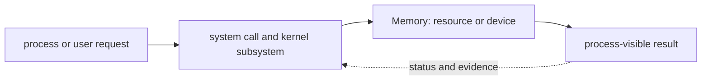

# Memory

<!-- chapter-guide:start -->
> **Step 021 of 373 — 02.06**
>
> **Builds on:** [systemd](../05-systemd/README.md)
>
> **Now:** Learn **Memory** from its mental model through production ownership.
>
> **Then:** Rehearse the linked questions and continue to [CPU performance](../07-cpu-performance/README.md).
<!-- chapter-guide:end -->

> [Interview questions and answers](questions-and-answers.md) · [Master curriculum](../../curriculum/master-curriculum.txt) · Official starting point: <https://docs.kernel.org/>

## Explanation

### What it is and why it exists

**Memory** is easiest to understand as one part of a larger path. The subject lives across user space and the Linux kernel. A process asks the kernel for CPU, memory, files, devices or network access through system calls; the kernel enforces identity, isolation, accounting and lifecycle rules.

The chapter focuses on Virtual memory, Resident memory, Shared memory, Page cache. These are connected mechanisms, not vocabulary to memorize. Memory is the part of Linux and operating systems that connects the listed mechanisms to effective runtime state, observable behavior and production outcomes The explanations below first build the simple model, then add the exact system behavior and production consequences.

### History and evolution

Linux inherits the Unix process, file and permission model developed from the late 1960s. Linus Torvalds released the Linux kernel in 1991; networking, loadable modules, namespaces, cgroups, modern filesystems and service managers later turned it into the common substrate for servers, containers and Kubernetes nodes.

In this chapter, **Memory** is the next layer of that evolution. Its modern purpose is to memory is the part of Linux and operating systems that connects the listed mechanisms to effective runtime state, observable behavior and production outcomes. The exact product surface may change by version, but the underlying state, request path and failure boundaries remain the durable ideas to learn.

### How it works: the end-to-end path



The path begins with a concrete input: a user request, configuration revision, packet, job, model request or operational symptom. The relevant subsystem validates that input, reads current state, performs or schedules work and exposes a result. Some transitions complete before the caller receives a response; others acknowledge the request and converge later. That difference determines whether a timeout means "nothing happened," "the operation failed," or "the final result is still unknown."

For **Memory**, the important stages are Virtual memory, Resident memory, Shared memory, Page cache, Buffers, Swap, Memory pressure, Out-of-memory killer, Memory leaks, Huge pages, NUMA. Their boundaries explain where identity is checked, where state becomes durable, where capacity is consumed, how failures propagate and which signal can distinguish one layer from another. A production explanation should follow the actual path rather than treating each term as an isolated definition.


### Core concepts explained in detail

#### Virtual memory

**What it is.** Virtual memory is the per-process address space presented by the kernel. A virtual address is not a RAM location; page tables map it to a physical frame, a file-backed page, a shared frame, a swapped-out page or no page at all.

**Junior mental model.** Think of virtual addresses as apartment numbers and physical frames as rooms. Every process can use apartment 0x1000, while its private page table directs that number to a different room and permissions decide whether the room may be read, written or executed.

**How it works.** When code reserves memory, the kernel usually creates a virtual mapping without immediately allocating every physical page. First access raises a page fault; the kernel validates the mapping, obtains or loads a page, updates the page table and resumes the instruction. The MMU and TLB accelerate later translations. Copy-on-write lets processes initially share a page and creates a private copy only after a write.

**What it looks like in production.** `VSZ` can therefore be much larger than RAM without indicating a leak. Investigate RSS, proportional set size, anonymous versus file-backed pages, minor and major faults, swap and cgroup limits. Address-space exhaustion, permission faults, TLB pressure and overcommit/OOM behavior are distinct failure modes.

#### Resident memory

**What it is.** Resident memory is the subset of a process's mapped pages currently present in physical RAM. RSS counts resident pages but can double-count shared pages across processes, so it is not the same as uniquely owned memory.

**Junior mental model.** If virtual memory is a catalog of possible pages, resident memory is the set currently on the desk. Pages can enter on allocation or fault and leave through reclaim, unmapping, process exit or swap.

**How it works.** The kernel updates mappings as pages are faulted in and reclaimed. Anonymous heap/stack, shared libraries, memory-mapped files and page-cache-backed mappings can all contribute to RSS. Proportional set size divides shared pages between users and is often better for estimating a process's real contribution.

**What it looks like in production.** A healthy service has an RSS distribution compatible with its workload and cgroup limit. A steadily growing anonymous RSS, rising reclaim stalls or repeated cgroup `oom_kill` events is stronger leak or capacity evidence than one large VSZ value.

#### Shared memory

**What it is.** Shared memory maps the same physical pages into more than one process so processes can exchange data without copying it through a socket or file for every operation. POSIX shared memory, System V shared memory and shared `mmap` mappings provide related interfaces.

**Junior mental model.** It is like several workers using the same whiteboard: updates are immediately visible, but the whiteboard does not decide whose turn it is or whether a reader sees a complete multi-step update.

**How it works.** The kernel creates a shared object or file-backed mapping and installs references to its pages in each participating process's page tables. The CPU cache-coherence system makes memory updates visible, while the application must use mutexes, semaphores, atomics or another protocol for ordering and consistency.

**What it looks like in production.** Shared memory reduces copy and serialization cost but expands the corruption and synchronization blast radius. Inspect mapping size, ownership and permissions plus application lock contention; stale segments, permissive modes, false sharing and a crashed writer leaving inconsistent data are common failures.

#### Page cache

**What it is.** The page cache is RAM used by the Linux kernel to cache file contents. Reads can be served without another device access, and buffered writes modify cached pages before writeback makes them durable.

**Junior mental model.** It is a reusable reading desk for filesystem pages: keeping recently used pages nearby is faster than fetching them from storage again, and the desk can be cleared when applications need the space.

**How it works.** A file read faults or copies pages into cache; later reads reuse them. A buffered write marks pages dirty, background writeback flushes them according to kernel thresholds, and `fsync` or related application ordering asks for durability under the storage contract. Clean cache is readily reclaimable, while dirty-page pressure can force foreground work to wait.

**What it looks like in production.** High cache usage is normally healthy. Diagnose cache hit behavior, dirty/writeback pages, major faults, I/O latency and PSI together. Dropping caches in production destroys useful state and usually hides the real workload or storage bottleneck.

#### Buffers

**What it is.** In modern Linux memory reporting, buffers are primarily kernel memory used for block-device metadata and related I/O bookkeeping, while cached file contents are accounted mainly as page cache. The historical `buffers/cache` grouping is why the terms are often confused.

**Junior mental model.** Think of buffers as the labels and transfer paperwork around blocks, while the page cache is the file data being kept close for reuse.

**How it works.** Kernel subsystems allocate buffer heads or other metadata structures to describe block mappings and I/O. These structures participate in reclaim and are reported separately or inside broader reclaimable slab/cache counters depending on the kernel and tool.

**What it looks like in production.** Do not diagnose a leak from the `buff/cache` column alone. Use `/proc/meminfo`, slab information, reclaim and workload evidence to separate file cache, reclaimable kernel objects and unreclaimable slab growth.

#### Swap

**What it is.** Swap is disk- or device-backed space that can hold eligible anonymous memory pages evicted from RAM. It extends reclaim choices but is much slower than RAM and is not a substitute for sufficient capacity.

**Junior mental model.** Swap is an overflow storeroom: it can keep an infrequently used page instead of killing a process, but repeatedly walking to the storeroom makes active work very slow.

**How it works.** Under pressure, the kernel selects cold anonymous pages, writes them to a swap area and updates their page-table entries. Access later causes a major fault and reads the page back. `swappiness`, memory cgroups, workload locking and platform policy influence use; file-backed clean pages can usually be dropped and reread instead.

**What it looks like in production.** Some swap use can be harmless after an old pressure event. Sustained `si/so`, major faults and PSI with user latency indicates thrashing. Disabling swap changes failure behavior toward earlier OOM and may be required or discouraged by specific orchestration versions, so treat it as a workload/platform decision.

#### Memory pressure

**What it is.** Memory pressure is the condition in which workloads spend time reclaiming, compacting or waiting for memory because readily usable capacity is scarce. It is about stalled useful work, not merely a low `MemFree` value.

**Junior mental model.** A crowded room is not yet a problem if people can move; pressure begins when people must repeatedly stop, rearrange the room or leave before useful work continues.

**How it works.** Allocation crosses watermarks and wakes background reclaim; heavier demand enters direct reclaim in the allocating task. The kernel drops cache, writes dirty pages, swaps eligible anonymous pages or compacts memory for contiguous allocations. If progress is impossible inside a host or cgroup boundary, OOM handling begins.

**What it looks like in production.** Use memory PSI, reclaim scans, major faults, swap, dirty/writeback pages, cgroup `memory.events` and latency. A full page cache with low stalls is healthy; rising `some/full` PSI, allocation latency and OOM events is actionable pressure.

#### Out-of-memory killer

**What it is.** The OOM killer is the kernel's last-resort recovery mechanism when an allocation cannot make progress through reclaim under the applicable host or cgroup limit. It selects a process to terminate so memory becomes available.

**Junior mental model.** It is an emergency circuit breaker, not a fair workload scheduler: the kernel sacrifices a process to keep the rest of the system or constrained group alive.

**How it works.** The kernel calculates badness using memory footprint and adjustments such as `oom_score_adj`; a memory-cgroup OOM normally chooses within that cgroup, while a global OOM can affect the host. Termination is recorded in kernel logs and cgroup counters, and an orchestrator may then restart the process.

**What it looks like in production.** A restart can hide the event while data loss or a crash loop continues. Correlate kernel/cgroup OOM evidence with the limit, workload peak and restart reason. Durable fixes address leaks, sizing, admission or workload behavior rather than disabling the killer or granting unbounded memory.

#### Memory leaks

**What it is.** A memory leak occurs when a program retains allocations that are no longer useful, preventing the allocator and kernel from reclaiming them for other work. Growth can be in heap objects, native allocations, mappings, caches or kernel resources and is not always visible to one language profiler.

**Junior mental model.** It is like keeping every completed task on the active desk because a forgotten reference says it might still be needed.

**How it works.** The allocator obtains pages from the operating system and suballocates objects. If reachable references, native handles or cache policy retain those objects, garbage collection cannot release them; even freed objects may stay in allocator arenas instead of immediately reducing RSS. The diagnostic method must match the allocation layer.

**What it looks like in production.** Look for memory growth normalized by traffic and over a long enough window, then compare heap profiles, RSS/PSS, mappings and allocator metrics. A bounded cache, fragmentation and a true leak have different steady-state shapes and remediations; restart is containment, not the source repair.

#### Huge pages

**What it is.** Huge pages map memory with pages larger than the usual base page, reducing page-table entries and TLB misses for large, stable working sets. Linux supports explicitly reserved HugeTLB pages and transparent huge pages with different allocation behavior.

**Junior mental model.** A huge page is a large map tile: fewer tiles cover the same territory, so translation is cheaper, but finding one large contiguous empty space is harder and wasting part of a tile costs more.

**How it works.** The kernel installs a larger page-table mapping and the TLB covers more bytes per entry. HugeTLB pools are reserved and explicitly consumed; transparent huge pages attempt promotion and may perform compaction. NUMA placement and application access patterns determine whether the reduction in translation overhead helps.

**What it looks like in production.** Measure TLB misses and application throughput/latency before enabling broadly. Allocation failures, long compaction stalls, internal fragmentation and scarce reserved pages are common trade-offs; databases and model runtimes often require workload-specific qualification.

#### NUMA

**What it is.** NUMA divides a multi-socket or large machine into nodes where CPUs access local memory faster than memory attached to another node. Total free memory can look sufficient while the local node needed by a workload is pressured.

**Junior mental model.** It resembles workers seated near different supply cabinets: every worker can reach every cabinet, but crossing the room for every item is slower and congests the shared path.

**How it works.** Firmware exposes topology, Linux schedules threads and allocates pages using policy and first-touch behavior, and applications or runtimes may pin CPUs and memory. A thread migrating away from the node holding its pages increases remote accesses; multi-GPU workloads also depend on CPU, memory, PCIe and NIC locality.

**What it looks like in production.** Inspect `numactl --hardware`, per-node memory and counters plus CPU/device topology. Poor pinning, unbalanced first touch and container CPU/memory policies can reduce throughput even when aggregate utilization appears moderate.

### Worked command and configuration example

The following is a diagnostic example, not an unexplained command dump. Define every uppercase placeholder first—for example `NAME`, `RESOURCE`, `PROJECT`, `REGION`, `NAMESPACE`, `URL`, `IMAGE` or `CONTAINER`—and use a sandbox or read-only production role.

```bash
free -h; vmstat 1
cat /proc/meminfo; cat /proc/pressure/memory
ps -eo pid,comm,rss,vsz,pmem --sort=-rss | head
cat /sys/fs/cgroup/memory.current; cat /sys/fs/cgroup/memory.events
```

What the example demonstrates:

- `free -h; vmstat 1` captures a read-oriented state snapshot that must be interpreted against a healthy baseline, the exact target and the next adjacent dependency.
- `cat /proc/meminfo; cat /proc/pressure/memory` captures a read-oriented state snapshot that must be interpreted against a healthy baseline, the exact target and the next adjacent dependency.
- `ps -eo pid,comm,rss,vsz,pmem --sort=-rss | head` captures a read-oriented state snapshot that must be interpreted against a healthy baseline, the exact target and the next adjacent dependency.
- `cat /sys/fs/cgroup/memory.current; cat /sys/fs/cgroup/memory.events` captures a read-oriented state snapshot that must be interpreted against a healthy baseline, the exact target and the next adjacent dependency.

A healthy run returns the intended identity/context, exits successfully and shows the expected object or response without a new warning, retry loop or saturation signal. A failure is useful evidence: preserve the exact exit code, status/reason, timestamp and target, then inspect the immediately adjacent layer before changing anything. This makes the example part of the explanation of **Memory**, not merely a list to copy.

### Security, reliability and production ownership

Security controls who can initiate a transition and what data or resource that transition may affect. Authentication, authorization, network reachability, encryption and audit solve different problems and must align at each boundary. Short-lived attributable identities, least privilege, explicit tenant separation and tested key/certificate rotation reduce blast radius. Logs and traces need their own data controls because copying a secret or customer payload into telemetry defeats the primary protection.

Reliability depends on every synchronous dependency and on the eventual convergence of asynchronous work. Timeouts bound waiting; idempotency makes an ambiguous retry safe; backpressure and load shedding keep demand within useful capacity; replication and failover help only across independent failure domains. Recovery must be tested from protected state and verified through the original user outcome, not inferred from a green administrative status.

Ownership makes these mechanisms operable. Every production resource or service needs an accountable team, source-of-truth revision, environment and data classification, SLO, runbook, cost center and retirement policy. Reversible mitigation can stabilize an incident, but the durable repair belongs in Git, IaC, policy or the owning application so reconciliation does not reintroduce the fault.

### Observability, performance and cost

Metrics, logs, traces, profiles and audit events are complementary. A useful diagnostic path starts with time, identity, exact target and user symptom, then compares desired and observed state before moving through reconciliation, network/protocol, runtime, dependency and saturation layers. High-cardinality request or object IDs belong in sampled logs or traces rather than metric labels; alerts should represent actionable user-impact risk or leading exhaustion.

Performance is governed by work distribution, queueing and bottlenecks. Rate, latency percentiles, errors, saturation, queue depth or age and service-specific limits reveal more than average utilization. Application replicas and underlying machines, storage or provider quota scale through separate loops with different cold delays. Cost includes idle headroom, requests or work units, storage/retention, network transfer, telemetry, support and recovery capacity; optimize cost per successful outcome rather than the cheapest isolated resource.

### What you should be able to explain

The table remains as a revision checklist. Read the explanations above first; afterward, use each row to check whether you can explain the concept without relying on memorized wording.

| # | Topic | What you must understand and demonstrate |
|---:|---|---|
| 1 | **Virtual memory** | is part of Memory; learn its precise definition, mechanism and lifecycle, nearest alternatives, configuration interface, failure/limit, security boundary, observable evidence and production trade-off |
| 2 | **Resident memory** | is part of Memory; learn its precise definition, mechanism and lifecycle, nearest alternatives, configuration interface, failure/limit, security boundary, observable evidence and production trade-off |
| 3 | **Shared memory** | is part of Memory; learn its precise definition, mechanism and lifecycle, nearest alternatives, configuration interface, failure/limit, security boundary, observable evidence and production trade-off |
| 4 | **Page cache** | uses reclaimable RAM for file data to reduce I/O; it is not automatically a leak, but writeback and dirty-page pressure affect latency |
| 5 | **Buffers** | is part of Memory; learn its precise definition, mechanism and lifecycle, nearest alternatives, configuration interface, failure/limit, security boundary, observable evidence and production trade-off |
| 6 | **Swap** | is part of Memory; learn its precise definition, mechanism and lifecycle, nearest alternatives, configuration interface, failure/limit, security boundary, observable evidence and production trade-off |
| 7 | **Memory pressure** | is part of Memory; learn its precise definition, mechanism and lifecycle, nearest alternatives, configuration interface, failure/limit, security boundary, observable evidence and production trade-off |
| 8 | **Out-of-memory killer** | selects a victim when memory cannot be reclaimed; host and cgroup OOM scopes, scores and memory events reveal why |
| 9 | **Memory leaks** | is part of Memory; learn its precise definition, mechanism and lifecycle, nearest alternatives, configuration interface, failure/limit, security boundary, observable evidence and production trade-off |
| 10 | **Huge pages** | is part of Memory; learn its precise definition, mechanism and lifecycle, nearest alternatives, configuration interface, failure/limit, security boundary, observable evidence and production trade-off |
| 11 | **NUMA** | groups CPUs and local memory; remote-memory access and poor placement can reduce throughput even when aggregate capacity looks free |

## Practice

### Practice objective

Build a small, safe proof of **Memory** and explain the result in your own words. The goal is not command completion; it is to connect input, internal mechanism, observable state and user outcome.

### Prerequisites and setup

Use a disposable Linux VM or container. Record `date -u`, `uname -a`, distribution, effective user and cgroup before the topic commands. Capture a healthy baseline, run one command with an intentionally nonexistent PID/path/unit to learn its error and exit code, then return to the real object and explain the discriminating fields. Do not change mounts, firewall, users, kernel settings or services on a shared host. Cleanup: exit and delete the disposable environment.

Record tool and platform versions because flags, APIs and defaults can change. Define every uppercase placeholder before use and keep secrets out of shell history and committed files.

### Activity 1: establish a healthy baseline

Run the read-oriented example first:

```bash
free -h; vmstat 1
cat /proc/meminfo; cat /proc/pressure/memory
ps -eo pid,comm,rss,vsz,pmem --sort=-rss | head
cat /sys/fs/cgroup/memory.current; cat /sys/fs/cgroup/memory.events
```

For each line, write down the layer it inspects, the expected healthy field or response, and one thing it cannot prove. The expected result is an attributable request against the intended target plus enough state to draw the path from input to outcome.

### Activity 2: create or review the smallest working example

Put the smallest relevant command, configuration, manifest or code sample in source control. Validate or lint it, produce a preview/diff where the tool supports one, and apply only inside the disposable boundary. Record the exact revision and resulting resource or process ID. If the topic is observational rather than configurable, save a sanitized baseline and an automated assertion instead of mutating the system.

### Activity 3: controlled failure and troubleshooting

Introduce one bounded failure: use a definitely nonexistent resource name, an invalid sandbox-only value, a denied test identity, a closed test port or a stopped disposable dependency. Capture the exact error and classify it as identity/policy, input/configuration, control-plane reconciliation, network/protocol, dependency or capacity. Test one discriminating hypothesis at a time; do not widen access or restart unrelated components.

Expected failure evidence is a specific non-zero exit, status/reason, event or protocol response that disappears when the controlled fault is removed. If healthy and failing runs look identical, the chosen signal does not explain the phenomenon and the exercise is not complete.

### Verification

Repeat the original client or user-facing check, not only an administrative status command. Confirm the desired revision, data correctness where applicable, error and latency recovery, and absence of a continuing retry/backlog/saturation condition. Explain why this evidence proves recovery and what uncertainty remains.

### Cleanup and rollback

Revert the configuration in its source of truth and review the rollback diff before applying it. Delete only the named sandbox resources, stop disposable processes, remove temporary credentials and verify that no billable resource, volume, artifact, queue item or background job remains. Read-only activities require no infrastructure rollback, but sanitized captures must still follow retention policy.

### Harder extension

Automate the healthy and failing paths in CI, use short-lived identity, add one SLI/alert or policy assertion, and write a five-step runbook another engineer can execute without hidden context. Then explain how the design changes for two tenants, a zonal or dependency failure, 10× load and a strict cost or recovery target.

<!-- reading-navigation:start -->
---

**Reading path:** [← Back: systemd](../05-systemd/README.md) · [Questions](questions-and-answers.md) · [Next: CPU performance →](../07-cpu-performance/README.md)

<!-- reading-navigation:end -->
