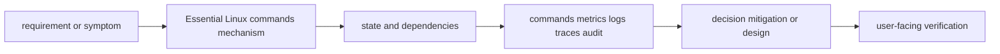

# Essential Linux commands

<!-- chapter-guide:start -->
> **Step 027 of 373 — 02.12**
>
> **Builds on:** [Linux logs and troubleshooting](../11-linux-logs-and-troubleshooting/README.md)
>
> **Now:** Learn **Essential Linux commands** from its mental model through production ownership.
>
> **Then:** Rehearse the linked questions and continue to [Networking](../../03-networking/README.md).
<!-- chapter-guide:end -->

> [Interview questions and answers](questions-and-answers.md) · [Master curriculum](../../curriculum/master-curriculum.txt) · Official starting point: <https://docs.kernel.org/>

## Easy mode: mental model

Master Essential Linux commands from first principles through safe production operation and senior architecture decisions.

Learn this topic in layers: name the object or mechanism, trace its lifecycle/data path, configure it safely, observe a healthy and failed state, recover it, and then design it across failure domains and team boundaries.



## Complete curriculum checklist

| # | Topic | What you must understand and demonstrate |
|---:|---|---|
| 1 | **Navigation: pwd, cd, ls, find, locate** | is part of Essential Linux commands; learn its precise definition, mechanism and lifecycle, nearest alternatives, configuration interface, failure/limit, security boundary, observable evidence and production trade-off. |
| 2 | **Files: cp, mv, rm, touch, mkdir, stat** | is part of Essential Linux commands; learn its precise definition, mechanism and lifecycle, nearest alternatives, configuration interface, failure/limit, security boundary, observable evidence and production trade-off. |
| 3 | **Text: cat, less, head, tail, grep, awk, sed, cut, sort, uniq** | is part of Essential Linux commands; learn its precise definition, mechanism and lifecycle, nearest alternatives, configuration interface, failure/limit, security boundary, observable evidence and production trade-off. |
| 4 | **Permissions: chmod, chown, getfacl, setfacl** | is part of Essential Linux commands; learn its precise definition, mechanism and lifecycle, nearest alternatives, configuration interface, failure/limit, security boundary, observable evidence and production trade-off. |
| 5 | **Processes: ps, top, htop, pgrep, kill, pkill** | is part of Essential Linux commands; learn its precise definition, mechanism and lifecycle, nearest alternatives, configuration interface, failure/limit, security boundary, observable evidence and production trade-off. |
| 6 | **Services: systemctl, journalctl** | is part of Essential Linux commands; learn its precise definition, mechanism and lifecycle, nearest alternatives, configuration interface, failure/limit, security boundary, observable evidence and production trade-off. |
| 7 | **Storage: df, du, lsblk, mount, fdisk, lsof, iostat** | is part of Essential Linux commands; learn its precise definition, mechanism and lifecycle, nearest alternatives, configuration interface, failure/limit, security boundary, observable evidence and production trade-off. |
| 8 | **Memory: free, vmstat** | is part of Essential Linux commands; learn its precise definition, mechanism and lifecycle, nearest alternatives, configuration interface, failure/limit, security boundary, observable evidence and production trade-off. |
| 9 | **CPU: uptime, mpstat, pidstat** | is part of Essential Linux commands; learn its precise definition, mechanism and lifecycle, nearest alternatives, configuration interface, failure/limit, security boundary, observable evidence and production trade-off. |
| 10 | **Network: ip, ss, ping, traceroute, dig, nslookup, curl, wget, tcpdump** | is part of Essential Linux commands; learn its precise definition, mechanism and lifecycle, nearest alternatives, configuration interface, failure/limit, security boundary, observable evidence and production trade-off. |
| 11 | **Archives: tar, gzip, zip, rsync** | is part of Essential Linux commands; learn its precise definition, mechanism and lifecycle, nearest alternatives, configuration interface, failure/limit, security boundary, observable evidence and production trade-off. |
| 12 | **Security: sudo, ssh, scp, openssl** | defines a trust/control boundary: identify actor, protected asset, decision/enforcement point, least privilege, bypass path, audit evidence, rotation/revocation and recovery. |
| 13 | **Scheduling: cron, crontab, systemd timers** | is part of Essential Linux commands; learn its precise definition, mechanism and lifecycle, nearest alternatives, configuration interface, failure/limit, security boundary, observable evidence and production trade-off. |

## Beginner → mid-level → senior learning path

1. **Beginner:** define every term; identify the relevant file, object, protocol, API, or command; explain one normal use.
2. **Mid-level:** configure it from source control, inspect effective runtime state, diagnose two failure modes, automate a safe change, and explain one trade-off.
3. **Senior:** clarify ambiguous requirements, map trust and failure domains, quantify capacity/SLO/RPO/RTO/cost, compare alternatives, plan migration/rollback, and assign ownership.

## Command and configuration lab

Run read-only checks first in a sandbox. For each command, predict healthy output, one failing result, the next discriminating check, and the safe rollback for any later mutation.

```bash
pwd; ls -la; stat PATH; find ROOT -xdev -type f -size +1G
rg -n 'PATTERN' ROOT; awk '{count[$1]++} END {for (k in count) print count[k],k}' FILE
ps -ef; ss -lntup; lsof -p PID
tar -tzf ARCHIVE; rsync -aHAXn SOURCE/ DEST/
```

## Hands-on practice: setup → failure → verification → cleanup

Use a disposable Linux VM or container. Record `date -u`, `uname -a`, distribution, effective user and cgroup before the topic commands. Capture a healthy baseline, run one command with an intentionally nonexistent PID/path/unit to learn its error and exit code, then return to the real object and explain the discriminating fields. Do not change mounts, firewall, users, kernel settings or services on a shared host. Cleanup: exit and delete the disposable environment.

Expected result: you can show the healthy evidence, reproduce a safe failure, explain why each command distinguishes one layer from another, restore the baseline, and prove cleanup. Hard extension: automate the lab from source control, add a test or alert for the injected failure, and write a five-step runbook another engineer can execute.

For code/configuration, be ready to review an intentionally unsafe diff and improve idempotency, secret handling, timeouts, validation, logging, tests, and rollback.

## Senior design checklist

State assumptions for tenants, traffic/work units, latency and availability targets, data classification/residency, recovery, team skills and budget. Draw control/data planes and synchronous/asynchronous dependencies. Cover identity, policy, encryption/key lifecycle, delivery provenance, observability, capacity, unit cost, operational ownership, migration and exit criteria. Name the evidence that would cause you to revise the design.

## Revision and practice

Complete the separate [checkbox interview bank](questions-and-answers.md). Do not memorize wording: speak in the order **definition → mechanism → evidence/configuration → failure/trade-off → production example**. For procedures use **stabilize → scope → inspect → hypothesize → test → mitigate → verify → prevent**.

<!-- reading-navigation:start -->
---

**Reading path:** [← Back: Linux logs and troubleshooting](../11-linux-logs-and-troubleshooting/README.md) · [Questions](questions-and-answers.md) · [Next: Networking →](../../03-networking/README.md)

<!-- reading-navigation:end -->
