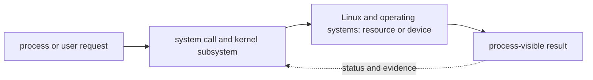

# Linux and operating systems

<!-- chapter-guide:start -->
> **Step 015 of 373 — 02**
>
> **Builds on:** [Architecture styles](../01-foundations/07-architecture-styles/README.md)
>
> **Now:** Learn **Linux and operating systems** from its mental model through production ownership.
>
> **Then:** Rehearse the linked questions and continue to [Linux architecture](01-linux-architecture/README.md).
<!-- chapter-guide:end -->

<!-- explanation-practice-normalizer:v1 -->


## Explanation

### What this chapter is and why it exists

**Linux and operating systems** is easiest to understand as one part of a larger path. The subject lives across user space and the Linux kernel. A process asks the kernel for CPU, memory, files, devices or network access through system calls; the kernel enforces identity, isolation, accounting and lifecycle rules.

The chapter focuses on Linux and operating systems. These are connected mechanisms, not vocabulary to memorize. The Linux branch explains how processes use kernel-managed CPU, memory, files, devices, identity and networking and how those layers produce application symptoms The explanations below first build the simple model, then add the exact system behavior and production consequences.

### History and evolution

Linux inherits the Unix process, file and permission model developed from the late 1960s. Linus Torvalds released the Linux kernel in 1991; networking, loadable modules, namespaces, cgroups, modern filesystems and service managers later turned it into the common substrate for servers, containers and Kubernetes nodes.

In this chapter, **Linux and operating systems** is the next layer of that evolution. Its modern purpose is to the Linux branch explains how processes use kernel-managed CPU, memory, files, devices, identity and networking and how those layers produce application symptoms. The exact product surface may change by version, but the underlying state, request path and failure boundaries remain the durable ideas to learn.

### How the complete branch works



A branch overview connects child mechanisms into one lifecycle. The input crosses identity and policy, a control or decision plane, the runtime data path and its dependencies before producing a user-visible result. Status and telemetry travel back through the loop so operators and controllers can correct drift or failure. Reading the child chapters adds precision, but this overview explains why those chapters depend on one another.

A useful test of understanding is to trace one concrete request or change from origin to outcome and name the authoritative state at each boundary. That trace reveals where work is synchronous or asynchronous, which failure domains are independent, what a timeout can prove, and which evidence distinguishes accepted intent from healthy behavior.

### Architecture and boot

The kernel schedules tasks, manages virtual memory, filesystems, devices, networking and security; user space interacts through system calls. Firmware (BIOS/UEFI) selects a bootloader, which loads kernel/initramfs; the kernel initializes hardware and mounts an early root; the init system (`systemd` commonly PID 1) mounts filesystems and starts targets/units. Diagnose boot by locating the earliest failed layer rather than editing random service files.

`systemd` units declare dependencies/order/conditions, environment, identity, sandboxing, restart and resource controls. `After=` orders but does not pull a unit in; `Requires=` and `Wants=` express dependency strength. Use drop-in overrides rather than editing vendor units. Restart loops need start-limit awareness and root-cause logs.

### Filesystems, identity and processes

The VFS presents filesystems such as ext4/XFS/NFS/OverlayFS. A directory maps names to inodes; an inode stores metadata/data pointers. Hard links reference one inode and cannot normally cross filesystems; symlinks store a path. Space can fail from blocks or inodes. Mount options and filesystem semantics matter for durability/performance/security.

Permissions combine owner/group/other rwx, ACLs, umask and special bits. SUID/SGID execute with file identity; sticky bit constrains deletion in shared directories. Linux capabilities split root-like powers; PAM composes authentication/session policy. Effective access also depends on mount options, SELinux/AppArmor, ACL and namespace.

A process has PID/PPID, address space, descriptors, credentials, namespaces/cgroups and states. `fork` creates a child; `exec` replaces its image; exit leaves status until the parent waits (zombie). Orphans are reparented. Signals request actions; `SIGKILL` cannot be handled, so use graceful `SIGTERM` first. `nice` affects scheduler priority; affinity/NUMA can help or harm. Limits constrain descriptors/processes/memory.

### Memory, CPU and storage

Virtual memory maps process pages; RSS is resident physical memory; page cache accelerates file I/O and is reclaimable; swap extends pressure handling at latency cost. Diagnose memory from workload/RSS/cache/swap/PSI/cgroup limits and allocation failures, not `free` alone. The OOM killer selects a victim under unreclaimable pressure; containers can be cgroup-OOM killed while the host has memory.

Load average counts runnable and uninterruptible tasks, not CPU percent. User/system/iowait/steal time, run queue, context switches, interrupts, throttling and per-core distribution reveal bottlenecks. High load with low CPU can be blocked I/O. CPU quotas can throttle a container despite idle host cores.

Storage path: application buffers → syscall/page cache → block layer/queue → device. IOPS, throughput and latency interact with I/O size/queue depth/read-write mix/fsync. LVM maps logical to physical storage; RAID trades capacity/performance/failure tolerance but is not backup. Expand device/partition/PV/LV/filesystem in the correct order. `fsync` durability depends on application/filesystem/device guarantees.

### Linux networking and security

Interfaces have addresses/routes; longest-prefix route selects next hop; ARP/neighbor discovery maps local next-hop addresses; sockets consume local/remote tuples and descriptors. Namespaces isolate stacks; veth pairs connect them; bridges switch frames. Conntrack underpins stateful NAT/firewalling and can exhaust. Ephemeral port/TIME_WAIT exhaustion appears as intermittent outbound failure.

Use nftables/iptables according to distribution, host firewalls, SSH keys/MFA/bastions or session systems, least privilege/capabilities, SELinux/AppArmor, seccomp, audited admin activity, signed repositories, patch cadence and minimized services. A disabled mandatory-access-control profile is not a fix.

### Layered troubleshooting

1. State impact/time/recent change and preserve evidence.
2. `uptime`, `systemctl --failed`, `journalctl -b -p warning`, `dmesg`, PSI/resource overview.
3. CPU/process: `top`, `ps`, `pidstat`, `mpstat`; memory: `free`, `vmstat`, `/proc`, cgroups; storage: `df -h`, `df -i`, `lsblk`, `iostat`, `lsof`; network: `ip`, `ss`, `dig`, `curl`, `tcpdump`.
4. Follow the specific process/service dependency and syscall/resource path; correlate logs/time.
5. Mitigate reversibly, verify user symptoms, repair configuration/source and add detection/runbook.

### Essential Linux commands and diagnostic paths

#### Command habits

Read before writing; capture timestamp/host/user; quote variables; use `--`; avoid parsing human output when a machine format exists; limit destructive commands by path, preview and backup; check exit status. `sudo` changes privilege, not correctness. In incidents, preserve evidence and avoid clearing logs/restarting before observing state unless immediate mitigation requires it.

#### Files and text

```bash
pwd; ls -la; stat PATH; find ROOT -xdev -type f -size +1G
du -xhd1 PATH | sort -h; df -hT; df -i
tail -F LOG; less +F LOG; rg -n 'pattern' PATH
awk '{count[$1]++} END {for (k in count) print count[k],k}' FILE | sort -nr
sed -n 'START,ENDp' FILE; cut -d: -f1 /etc/passwd; sort | uniq -c
```

Know the question each answers: `df` shows filesystem allocation, `du` sums reachable file sizes, and `lsof +L1` reveals deleted-but-open files. `stat` exposes metadata, `find` performs controlled traversal, `rg`/`grep` filter, `awk` aggregates records and fields, and `sed` transforms streams. Quote paths and print exact matches before any destructive `find` action.

#### Processes, services and logs

```bash
ps -eo pid,ppid,user,state,ni,pcpu,pmem,rss,etime,cmd --sort=-pcpu
top; pidstat -dur 1; pgrep -af NAME; pstree -ap
kill -TERM PID; sleep 5; kill -KILL PID
systemctl status UNIT; systemctl cat UNIT; systemctl show UNIT
journalctl -u UNIT --since '-30 min' -o short-iso
journalctl -b -1 -p warning; coredumpctl list
```

`kill` sends a signal; it does not guarantee termination. Diagnose `D` state, zombie-parent behavior, restart policy, and cgroup limits. Use unit drop-ins with `systemctl edit`, reload deliberately, and verify the effective unit, environment, identity, limits, and dependencies.

#### CPU and memory

```bash
uptime; mpstat -P ALL 1; vmstat 1; pidstat -wru 1
free -h; cat /proc/pressure/{cpu,memory,io}
cat /proc/PID/status; cat /proc/PID/limits
systemctl status UNIT
```

Interpret trends together: run queue, user/system/iowait/steal, context switches, major faults, swap-in/out, PSI stalls, process RSS, cgroup `memory.events`, and CPU throttling. A single snapshot is weak evidence.

#### Storage

```bash
lsblk -f; blkid; findmnt; mount
iostat -xz 1; lsof +L1; fuser -vm MOUNT
pvs; vgs; lvs -a -o +devices
smartctl -a DEVICE
```

Before expansion or repair, identify device → partition → RAID/LVM → filesystem → mount and take a valid backup or snapshot. `fsck` is filesystem-specific and normally offline; XFS uses its own tools. Never run repair commands blindly against mounted production storage.

#### Networking, DNS and TLS

```bash
ip -br addr; ip route; ip rule; ip neigh
ss -lntup; ss -s; ss -tan state time-wait
dig +trace NAME; dig @SERVER NAME TYPE; getent ahosts NAME
curl -v --connect-timeout 3 --max-time 10 URL
openssl s_client -connect HOST:443 -servername HOST -showcerts </dev/null
traceroute HOST; tracepath HOST
tcpdump -ni IFACE 'host IP and port PORT'
nft list ruleset; conntrack -S
```

`dig` tests DNS directly but may bypass the application's NSS path; `getent` follows it. `ping` tests ICMP rather than an application port. `traceroute` may be filtered or asymmetric. `ss` shows sockets. `tcpdump` proves that packets reached an interface, not why the application rejected them.

#### Archives, transfer, crypto and scheduling

```bash
tar -tzf archive.tgz; tar -xzf archive.tgz -C SAFE_DIR
rsync -aHAXn --delete SRC/ DEST/
ssh -vvv HOST; scp FILE HOST:PATH
openssl x509 -in CERT -noout -subject -issuer -dates -ext subjectAltName
systemctl list-timers; crontab -l
```

Preserve owners, ACLs, and xattrs only when intended and trusted. Defend archive extraction from path traversal. With `rsync --delete`, a trailing slash changes semantics—dry-run and inspect. Prefer systemd timers when dependency, persistence, and journal integration help.

#### Safe shell baseline

```bash
#!/usr/bin/env bash
set -Eeuo pipefail
trap 'rc=$?; printf "failed rc=%s line=%s\n" "$rc" "$LINENO" >&2' ERR
```

This is a starting point, not proof. Understand commands that legitimately return nonzero, quote arrays and variables, use `mktemp` with cleanup traps, validate inputs, bound retries and timeouts, make operations idempotent, and log decisions without secrets.

### Revision summary

- Diagnose from kernel resource and service dependency models.
- Free blocks, inodes, descriptors, ports, memory and cgroup quotas are separate limits.
- Load average is not CPU utilization.
- Graceful signals and correct service lifecycle prevent corruption.
- Security combines Unix permissions with capabilities, MAC, namespaces, mounts and identity.
- Every command must answer a specific hypothesis; collect evidence before mutation.

### Read further

- [The Linux kernel documentation](https://docs.kernel.org/) — authoritative subsystem, administration, tracing, security and development documentation; check the running kernel version before applying version-sensitive guidance.

## Practice

### Practice this chapter

Prerequisite: a disposable Linux VM or container where you can become root without affecting shared work. Record identity, kernel, distribution, cgroup and mount context; capture a healthy CPU, memory, disk, process, service and network observability baseline; then trigger one bounded failure mode such as a nonexistent unit, a low test-process memory limit or a filled temporary filesystem. Explain the reliability effect and evidence, reverse only the change you introduced, verify the original command path, and delete the disposable environment. The harder extension is to turn the diagnosis into a repeatable script that emits evidence without mutating the host.

### Practice objective

Build a small, safe proof of **Linux and operating systems** and explain the result in your own words. The goal is not command completion; it is to connect input, internal mechanism, observable state and user outcome.

### Prerequisites and setup

Use a disposable local environment, sandbox account/project or isolated namespace. Confirm the effective identity and target, record the start time, and set a cost limit before creating anything.

Record tool and platform versions because flags, APIs and defaults can change. Define every uppercase placeholder before use and keep secrets out of shell history and committed files.

### Activity 1: establish a healthy baseline

Run the read-oriented example first:

```bash
uname -a
systemctl --failed
journalctl -b -p warning --no-pager
```

For each line, write down the layer it inspects, the expected healthy field or response, and one thing it cannot prove. The expected result is an attributable request against the intended target plus enough state to draw the path from input to outcome.

### Activity 2: create or review the smallest working example

Put the smallest relevant command, configuration, manifest or code sample in source control. Validate or lint it, produce a preview/diff where the tool supports one, and apply only inside the disposable boundary. Record the exact revision and resulting resource or process ID. If the topic is observational rather than configurable, save a sanitized baseline and an automated assertion instead of mutating the system.

### Activity 3: controlled failure and troubleshooting

Introduce one bounded failure: use a definitely nonexistent resource name, an invalid sandbox-only value, a denied test identity, a closed test port or a stopped disposable dependency. Capture the exact error and classify it as identity/policy, input/configuration, control-plane reconciliation, network/protocol, dependency or capacity. Test one discriminating hypothesis at a time; do not widen access or restart unrelated components.

Expected failure evidence is a specific non-zero exit, status/reason, event or protocol response that disappears when the controlled fault is removed. If healthy and failing runs look identical, the chosen signal does not explain the phenomenon and the exercise is not complete.

### Verification

Repeat the original client or user-facing check, not only an administrative status command. Confirm the desired revision, data correctness where applicable, error and latency recovery, and absence of a continuing retry/backlog/saturation condition. Explain why this evidence proves recovery and what uncertainty remains.

### Cleanup and rollback

Revert the configuration in its source of truth and review the rollback diff before applying it. Delete only the named sandbox resources, stop disposable processes, remove temporary credentials and verify that no billable resource, volume, artifact, queue item or background job remains. Read-only activities require no infrastructure rollback, but sanitized captures must still follow retention policy.

### Harder extension

Automate the healthy and failing paths in CI, use short-lived identity, add one SLI/alert or policy assertion, and write a five-step runbook another engineer can execute without hidden context. Then explain how the design changes for two tenants, a zonal or dependency failure, 10× load and a strict cost or recovery target.

<!-- reading-navigation:start -->
---

**Reading path:** [← Back: Architecture styles](../01-foundations/07-architecture-styles/README.md) · [Questions](questions-and-answers.md) · [Next: Linux architecture →](01-linux-architecture/README.md)

<!-- reading-navigation:end -->
