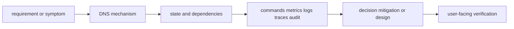

# DNS

<!-- chapter-guide:start -->
> **Step 034 of 373 — 03.06**
>
> **Builds on:** [TCP and UDP](../05-tcp-and-udp/README.md)
>
> **Now:** Learn **DNS** from its mental model through production ownership.
>
> **Then:** Rehearse the linked questions and continue to [HTTP](../07-http/README.md).
<!-- chapter-guide:end -->

> [Interview questions and answers](questions-and-answers.md) · [Master curriculum](../../curriculum/master-curriculum.txt) · Official starting point: <https://www.rfc-editor.org/>

## Easy mode: mental model

Master DNS from first principles through safe production operation and senior architecture decisions.

Learn this topic in layers: name the object or mechanism, trace its lifecycle/data path, configure it safely, observe a healthy and failed state, recover it, and then design it across failure domains and team boundaries.



## Complete curriculum checklist

| # | Topic | What you must understand and demonstrate |
|---:|---|---|
| 1 | **DNS hierarchy** | is part of DNS; learn its precise definition, mechanism and lifecycle, nearest alternatives, configuration interface, failure/limit, security boundary, observable evidence and production trade-off. |
| 2 | **Recursive and authoritative resolvers** | is part of DNS; learn its precise definition, mechanism and lifecycle, nearest alternatives, configuration interface, failure/limit, security boundary, observable evidence and production trade-off. |
| 3 | **A, AAAA, CNAME, MX, TXT, NS and SRV records** | is part of DNS; learn its precise definition, mechanism and lifecycle, nearest alternatives, configuration interface, failure/limit, security boundary, observable evidence and production trade-off. |
| 4 | **TTL** | is part of DNS; learn its precise definition, mechanism and lifecycle, nearest alternatives, configuration interface, failure/limit, security boundary, observable evidence and production trade-off. |
| 5 | **Negative caching** | is part of DNS; learn its precise definition, mechanism and lifecycle, nearest alternatives, configuration interface, failure/limit, security boundary, observable evidence and production trade-off. |
| 6 | **Split-horizon DNS** | is part of DNS; learn its precise definition, mechanism and lifecycle, nearest alternatives, configuration interface, failure/limit, security boundary, observable evidence and production trade-off. |
| 7 | **DNSSEC** | authenticates DNS data with a signed chain of trust but does not encrypt queries and requires careful key/delegation rollover. |
| 8 | **Service discovery** | is part of DNS; learn its precise definition, mechanism and lifecycle, nearest alternatives, configuration interface, failure/limit, security boundary, observable evidence and production trade-off. |
| 9 | **DNS troubleshooting** | requires a layer-by-layer, evidence-first path from user impact and recent change through identity, configuration, runtime, dependency and resource saturation, followed by reversible mitigation and verified repair. |
| 10 | **DNS hierarchy** | is part of DNS; learn its precise definition, mechanism and lifecycle, nearest alternatives, configuration interface, failure/limit, security boundary, observable evidence and production trade-off. |
| 11 | **Recursive and authoritative resolvers** | is part of DNS; learn its precise definition, mechanism and lifecycle, nearest alternatives, configuration interface, failure/limit, security boundary, observable evidence and production trade-off. |
| 12 | **A, AAAA, CNAME, MX, TXT, NS and SRV records** | is part of DNS; learn its precise definition, mechanism and lifecycle, nearest alternatives, configuration interface, failure/limit, security boundary, observable evidence and production trade-off. |
| 13 | **TTL** | is part of DNS; learn its precise definition, mechanism and lifecycle, nearest alternatives, configuration interface, failure/limit, security boundary, observable evidence and production trade-off. |
| 14 | **Negative caching** | is part of DNS; learn its precise definition, mechanism and lifecycle, nearest alternatives, configuration interface, failure/limit, security boundary, observable evidence and production trade-off. |
| 15 | **Split-horizon DNS** | is part of DNS; learn its precise definition, mechanism and lifecycle, nearest alternatives, configuration interface, failure/limit, security boundary, observable evidence and production trade-off. |
| 16 | **DNSSEC** | authenticates DNS data with a signed chain of trust but does not encrypt queries and requires careful key/delegation rollover. |
| 17 | **Service discovery** | is part of DNS; learn its precise definition, mechanism and lifecycle, nearest alternatives, configuration interface, failure/limit, security boundary, observable evidence and production trade-off. |
| 18 | **DNS troubleshooting** | requires a layer-by-layer, evidence-first path from user impact and recent change through identity, configuration, runtime, dependency and resource saturation, followed by reversible mitigation and verified repair. |

## Beginner → mid-level → senior learning path

1. **Beginner:** define every term; identify the relevant file, object, protocol, API, or command; explain one normal use.
2. **Mid-level:** configure it from source control, inspect effective runtime state, diagnose two failure modes, automate a safe change, and explain one trade-off.
3. **Senior:** clarify ambiguous requirements, map trust and failure domains, quantify capacity/SLO/RPO/RTO/cost, compare alternatives, plan migration/rollback, and assign ownership.

## Command and configuration lab

Run read-only checks first in a sandbox. For each command, predict healthy output, one failing result, the next discriminating check, and the safe rollback for any later mutation.

```bash
getent ahosts NAME
dig NAME A; dig NAME AAAA; dig NAME CNAME
dig +trace NAME
dig @SERVER NAME TYPE +norecurse
```

## Hands-on practice: setup → failure → verification → cleanup

Create a disposable network lab: `docker network create devops-net-lab`; start `docker run -d --name web-lab --network devops-net-lab nginx:1.27-alpine`; verify with `docker run --rm --network devops-net-lab curlimages/curl:8.10.1 -sv http://web-lab/`. Controlled failure: query a wrong name and a closed port, compare DNS versus TCP evidence, then inspect the Docker network. Cleanup: `docker rm -f web-lab` and `docker network rm devops-net-lab`. Pulling images uses network/bandwidth; pin a verified digest in a governed environment.

Expected result: you can show the healthy evidence, reproduce a safe failure, explain why each command distinguishes one layer from another, restore the baseline, and prove cleanup. Hard extension: automate the lab from source control, add a test or alert for the injected failure, and write a five-step runbook another engineer can execute.

For code/configuration, be ready to review an intentionally unsafe diff and improve idempotency, secret handling, timeouts, validation, logging, tests, and rollback.

## Senior design checklist

State assumptions for tenants, traffic/work units, latency and availability targets, data classification/residency, recovery, team skills and budget. Draw control/data planes and synchronous/asynchronous dependencies. Cover identity, policy, encryption/key lifecycle, delivery provenance, observability, capacity, unit cost, operational ownership, migration and exit criteria. Name the evidence that would cause you to revise the design.

## Revision and practice

Complete the separate [checkbox interview bank](questions-and-answers.md). Do not memorize wording: speak in the order **definition → mechanism → evidence/configuration → failure/trade-off → production example**. For procedures use **stabilize → scope → inspect → hypothesize → test → mitigate → verify → prevent**.

<!-- reading-navigation:start -->
---

**Reading path:** [← Back: TCP and UDP](../05-tcp-and-udp/README.md) · [Questions](questions-and-answers.md) · [Next: HTTP →](../07-http/README.md)

<!-- reading-navigation:end -->
