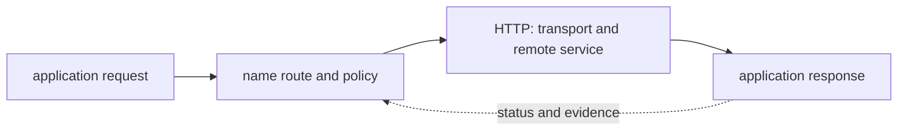

# HTTP

<!-- chapter-guide:start -->
> **Step 035 of 373 — 03.07**
>
> **Builds on:** [DNS](../06-dns/README.md)
>
> **Now:** Learn **HTTP** from its mental model through production ownership.
>
> **Then:** Rehearse the linked questions and continue to [TLS and certificates](../08-tls-and-certificates/README.md).
<!-- chapter-guide:end -->

> [Interview questions and answers](questions-and-answers.md) · [Master curriculum](../../curriculum/master-curriculum.txt) · Official starting point: <https://www.rfc-editor.org/>

## Explanation

### What it is and why it exists

**HTTP** is easiest to understand as one part of a larger path. The subject is part of an end-to-end packet path. An application names a peer, the host selects a route and next hop, transports establish communication, and application protocols interpret the bytes returned.

The chapter focuses on HTTP methods, Headers, Status codes, Cookies. These are connected mechanisms, not vocabulary to memorize. HTTP is the part of Networking that connects the listed mechanisms to effective runtime state, observable behavior and production outcomes The explanations below first build the simple model, then add the exact system behavior and production consequences.

### History and evolution

Packet networking developed from early research networks into the TCP/IP Internet; ARPANET adopted TCP/IP in 1983, DNS replaced a centrally maintained host list, and HTTP/TLS later made the network an application platform. Modern overlays, proxies and cloud load balancers add layers, but every request still depends on naming, forwarding, transport and application contracts agreeing.

In this chapter, **HTTP** is the next layer of that evolution. Its modern purpose is to hTTP is the part of Networking that connects the listed mechanisms to effective runtime state, observable behavior and production outcomes. The exact product surface may change by version, but the underlying state, request path and failure boundaries remain the durable ideas to learn.

### How it works: the end-to-end path



The path begins with a concrete input: a user request, configuration revision, packet, job, model request or operational symptom. The relevant subsystem validates that input, reads current state, performs or schedules work and exposes a result. Some transitions complete before the caller receives a response; others acknowledge the request and converge later. That difference determines whether a timeout means "nothing happened," "the operation failed," or "the final result is still unknown."

For **HTTP**, the important stages are HTTP methods, Headers, Status codes, Cookies, Keep-alive, HTTP/1.1, HTTP/2, HTTP/3, Chunked encoding, Streaming, WebSockets, Server-sent events. Their boundaries explain where identity is checked, where state becomes durable, where capacity is consumed, how failures propagate and which signal can distinguish one layer from another. A production explanation should follow the actual path rather than treating each term as an isolated definition.


### Core concepts explained in detail

#### HTTP methods

**What it is.** The term HTTP methods refers to a protocol or forwarding mechanism that changes how endpoints identify peers, move packets or interpret a response within HTTP.

**Junior mental model.** A useful analogy is a parcel journey: the name identifies the destination, routing selects each next hop, policy decides whether the parcel may pass, transport tracks delivery, and the application decides what the contents mean.

**How it works.** A real request crosses several independent states: name resolution returns an address, the source selects a route and source address, link or overlay forwarding reaches the next hop, stateful or stateless policy evaluates the flow, transport establishes communication, and TLS/application protocols negotiate their own contract. The return path must also work.

**What it looks like in production.** Healthy evidence progresses layer by layer: correct name/address, expected route, permitted flow, listening endpoint, successful handshake and valid application response. Timeouts, refusals, resets and protocol errors mean different layers; packet loss, MTU, asymmetric paths, connection-state exhaustion and proxy timeout mismatch are common production failures.

#### Headers

**What it is.** The term Headers refers to a protocol or forwarding mechanism that changes how endpoints identify peers, move packets or interpret a response within HTTP.

**Junior mental model.** A useful analogy is a parcel journey: the name identifies the destination, routing selects each next hop, policy decides whether the parcel may pass, transport tracks delivery, and the application decides what the contents mean.

**How it works.** A real request crosses several independent states: name resolution returns an address, the source selects a route and source address, link or overlay forwarding reaches the next hop, stateful or stateless policy evaluates the flow, transport establishes communication, and TLS/application protocols negotiate their own contract. The return path must also work.

**What it looks like in production.** Healthy evidence progresses layer by layer: correct name/address, expected route, permitted flow, listening endpoint, successful handshake and valid application response. Timeouts, refusals, resets and protocol errors mean different layers; packet loss, MTU, asymmetric paths, connection-state exhaustion and proxy timeout mismatch are common production failures.

#### Status codes

**What it is.** The term Status codes refers to a protocol or forwarding mechanism that changes how endpoints identify peers, move packets or interpret a response within HTTP.

**Junior mental model.** A useful analogy is a parcel journey: the name identifies the destination, routing selects each next hop, policy decides whether the parcel may pass, transport tracks delivery, and the application decides what the contents mean.

**How it works.** A real request crosses several independent states: name resolution returns an address, the source selects a route and source address, link or overlay forwarding reaches the next hop, stateful or stateless policy evaluates the flow, transport establishes communication, and TLS/application protocols negotiate their own contract. The return path must also work.

**What it looks like in production.** Healthy evidence progresses layer by layer: correct name/address, expected route, permitted flow, listening endpoint, successful handshake and valid application response. Timeouts, refusals, resets and protocol errors mean different layers; packet loss, MTU, asymmetric paths, connection-state exhaustion and proxy timeout mismatch are common production failures.

#### Cookies

**What it is.** The term Cookies refers to a protocol or forwarding mechanism that changes how endpoints identify peers, move packets or interpret a response within HTTP.

**Junior mental model.** A useful analogy is a parcel journey: the name identifies the destination, routing selects each next hop, policy decides whether the parcel may pass, transport tracks delivery, and the application decides what the contents mean.

**How it works.** A real request crosses several independent states: name resolution returns an address, the source selects a route and source address, link or overlay forwarding reaches the next hop, stateful or stateless policy evaluates the flow, transport establishes communication, and TLS/application protocols negotiate their own contract. The return path must also work.

**What it looks like in production.** Healthy evidence progresses layer by layer: correct name/address, expected route, permitted flow, listening endpoint, successful handshake and valid application response. Timeouts, refusals, resets and protocol errors mean different layers; packet loss, MTU, asymmetric paths, connection-state exhaustion and proxy timeout mismatch are common production failures.

#### Keep-alive

**What it is.** The term Keep-alive refers to a protocol or forwarding mechanism that changes how endpoints identify peers, move packets or interpret a response within HTTP.

**Junior mental model.** A useful analogy is a parcel journey: the name identifies the destination, routing selects each next hop, policy decides whether the parcel may pass, transport tracks delivery, and the application decides what the contents mean.

**How it works.** A real request crosses several independent states: name resolution returns an address, the source selects a route and source address, link or overlay forwarding reaches the next hop, stateful or stateless policy evaluates the flow, transport establishes communication, and TLS/application protocols negotiate their own contract. The return path must also work.

**What it looks like in production.** Healthy evidence progresses layer by layer: correct name/address, expected route, permitted flow, listening endpoint, successful handshake and valid application response. Timeouts, refusals, resets and protocol errors mean different layers; packet loss, MTU, asymmetric paths, connection-state exhaustion and proxy timeout mismatch are common production failures.

#### HTTP/1.1

**What it is.** The term HTTP/1.1 refers to a protocol or forwarding mechanism that changes how endpoints identify peers, move packets or interpret a response within HTTP.

**Junior mental model.** A useful analogy is a parcel journey: the name identifies the destination, routing selects each next hop, policy decides whether the parcel may pass, transport tracks delivery, and the application decides what the contents mean.

**How it works.** A real request crosses several independent states: name resolution returns an address, the source selects a route and source address, link or overlay forwarding reaches the next hop, stateful or stateless policy evaluates the flow, transport establishes communication, and TLS/application protocols negotiate their own contract. The return path must also work.

**What it looks like in production.** Healthy evidence progresses layer by layer: correct name/address, expected route, permitted flow, listening endpoint, successful handshake and valid application response. Timeouts, refusals, resets and protocol errors mean different layers; packet loss, MTU, asymmetric paths, connection-state exhaustion and proxy timeout mismatch are common production failures.

#### HTTP/2

**What it is.** Multiplexes streams over one TCP connection with header compression, but connection loss and transport head-of-line effects remain.

**Junior mental model.** A useful analogy is a parcel journey: the name identifies the destination, routing selects each next hop, policy decides whether the parcel may pass, transport tracks delivery, and the application decides what the contents mean.

**How it works.** A real request crosses several independent states: name resolution returns an address, the source selects a route and source address, link or overlay forwarding reaches the next hop, stateful or stateless policy evaluates the flow, transport establishes communication, and TLS/application protocols negotiate their own contract. The return path must also work.

**What it looks like in production.** Healthy evidence progresses layer by layer: correct name/address, expected route, permitted flow, listening endpoint, successful handshake and valid application response. Timeouts, refusals, resets and protocol errors mean different layers; packet loss, MTU, asymmetric paths, connection-state exhaustion and proxy timeout mismatch are common production failures.

#### HTTP/3

**What it is.** The term HTTP/3 refers to a protocol or forwarding mechanism that changes how endpoints identify peers, move packets or interpret a response within HTTP.

**Junior mental model.** A useful analogy is a parcel journey: the name identifies the destination, routing selects each next hop, policy decides whether the parcel may pass, transport tracks delivery, and the application decides what the contents mean.

**How it works.** A real request crosses several independent states: name resolution returns an address, the source selects a route and source address, link or overlay forwarding reaches the next hop, stateful or stateless policy evaluates the flow, transport establishes communication, and TLS/application protocols negotiate their own contract. The return path must also work.

**What it looks like in production.** Healthy evidence progresses layer by layer: correct name/address, expected route, permitted flow, listening endpoint, successful handshake and valid application response. Timeouts, refusals, resets and protocol errors mean different layers; packet loss, MTU, asymmetric paths, connection-state exhaustion and proxy timeout mismatch are common production failures.

#### Chunked encoding

**What it is.** The term Chunked encoding refers to a protocol or forwarding mechanism that changes how endpoints identify peers, move packets or interpret a response within HTTP.

**Junior mental model.** A useful analogy is a parcel journey: the name identifies the destination, routing selects each next hop, policy decides whether the parcel may pass, transport tracks delivery, and the application decides what the contents mean.

**How it works.** A real request crosses several independent states: name resolution returns an address, the source selects a route and source address, link or overlay forwarding reaches the next hop, stateful or stateless policy evaluates the flow, transport establishes communication, and TLS/application protocols negotiate their own contract. The return path must also work.

**What it looks like in production.** Healthy evidence progresses layer by layer: correct name/address, expected route, permitted flow, listening endpoint, successful handshake and valid application response. Timeouts, refusals, resets and protocol errors mean different layers; packet loss, MTU, asymmetric paths, connection-state exhaustion and proxy timeout mismatch are common production failures.

#### Streaming

**What it is.** The term Streaming is an asynchronous hand-off mechanism that decouples producers from consumers and therefore must define ordering, retention, delivery, acknowledgement, retry and backlog behavior within HTTP.

**Junior mental model.** A queue is like a numbered waiting line: producers can hand off work without waiting for completion, but someone must define ordering, capacity, acknowledgement and what happens when a worker disappears.

**How it works.** A producer serializes and publishes a message, the service stores or routes it, a consumer receives it under a delivery contract, and acknowledgement advances or removes the item. At-least-once systems can redeliver after an unknown outcome, so stable operation identifiers and idempotent state changes are part of correctness.

**What it looks like in production.** Healthy evidence includes publish and consume rates, queue depth and age, processing latency, retry/dead-letter counts and end-to-end business completion. Poison messages, hot partitions, backlog growth, duplicate effects and retry storms are common; adding consumers helps only when the downstream dependency and partition model can absorb them.

#### WebSockets

**What it is.** The term WebSockets refers to a protocol or forwarding mechanism that changes how endpoints identify peers, move packets or interpret a response within HTTP.

**Junior mental model.** A useful analogy is a parcel journey: the name identifies the destination, routing selects each next hop, policy decides whether the parcel may pass, transport tracks delivery, and the application decides what the contents mean.

**How it works.** A real request crosses several independent states: name resolution returns an address, the source selects a route and source address, link or overlay forwarding reaches the next hop, stateful or stateless policy evaluates the flow, transport establishes communication, and TLS/application protocols negotiate their own contract. The return path must also work.

**What it looks like in production.** Healthy evidence progresses layer by layer: correct name/address, expected route, permitted flow, listening endpoint, successful handshake and valid application response. Timeouts, refusals, resets and protocol errors mean different layers; packet loss, MTU, asymmetric paths, connection-state exhaustion and proxy timeout mismatch are common production failures.

#### Server-sent events

**What it is.** The term Server-sent events is an asynchronous hand-off mechanism that decouples producers from consumers and therefore must define ordering, retention, delivery, acknowledgement, retry and backlog behavior within HTTP.

**Junior mental model.** Telemetry is the instrument panel, not the system itself. Metrics summarize trends, logs preserve discrete context, traces connect work across boundaries, profiles attribute resource use, and audit events record security-relevant actions.

**How it works.** Instrumentation observes a defined event or state, attaches bounded context, transports the signal, stores it under retention rules and makes it queryable. A useful signal has documented semantics and can distinguish at least two competing explanations; correlation identifiers belong in logs or traces rather than unbounded metric labels.

**What it looks like in production.** Healthy evidence includes coverage of the user journey, known collection delay and actionable SLO or saturation views. Missing telemetry, sampling bias, cardinality explosions, sensitive payload capture and alert thresholds disconnected from user impact are failures of the observability system itself.

### Worked command and configuration example

The following is a diagnostic example, not an unexplained command dump. Define every uppercase placeholder first—for example `NAME`, `RESOURCE`, `PROJECT`, `REGION`, `NAMESPACE`, `URL`, `IMAGE` or `CONTAINER`—and use a sandbox or read-only production role.

```bash
curl -sv --connect-timeout 3 --max-time 10 URL -o /dev/null
curl -sS -D- -o /dev/null URL
curl --http2 -v URL
openssl s_client -connect HOST:443 -servername HOST </dev/null
```

What the example demonstrates:

- `curl -sv --connect-timeout 3 --max-time 10 URL -o /dev/null` tests one part of the end-to-end request path and preserves protocol-level evidence such as resolution, connection, handshake, status or packet direction.
- `curl -sS -D- -o /dev/null URL` tests one part of the end-to-end request path and preserves protocol-level evidence such as resolution, connection, handshake, status or packet direction.
- `curl --http2 -v URL` tests one part of the end-to-end request path and preserves protocol-level evidence such as resolution, connection, handshake, status or packet direction.
- `openssl s_client -connect HOST:443 -servername HOST </dev/null` tests one part of the end-to-end request path and preserves protocol-level evidence such as resolution, connection, handshake, status or packet direction.

A healthy run returns the intended identity/context, exits successfully and shows the expected object or response without a new warning, retry loop or saturation signal. A failure is useful evidence: preserve the exact exit code, status/reason, timestamp and target, then inspect the immediately adjacent layer before changing anything. This makes the example part of the explanation of **HTTP**, not merely a list to copy.

### Security, reliability and production ownership

Security controls who can initiate a transition and what data or resource that transition may affect. Authentication, authorization, network reachability, encryption and audit solve different problems and must align at each boundary. Short-lived attributable identities, least privilege, explicit tenant separation and tested key/certificate rotation reduce blast radius. Logs and traces need their own data controls because copying a secret or customer payload into telemetry defeats the primary protection.

Reliability depends on every synchronous dependency and on the eventual convergence of asynchronous work. Timeouts bound waiting; idempotency makes an ambiguous retry safe; backpressure and load shedding keep demand within useful capacity; replication and failover help only across independent failure domains. Recovery must be tested from protected state and verified through the original user outcome, not inferred from a green administrative status.

Ownership makes these mechanisms operable. Every production resource or service needs an accountable team, source-of-truth revision, environment and data classification, SLO, runbook, cost center and retirement policy. Reversible mitigation can stabilize an incident, but the durable repair belongs in Git, IaC, policy or the owning application so reconciliation does not reintroduce the fault.

### Observability, performance and cost

Metrics, logs, traces, profiles and audit events are complementary. A useful diagnostic path starts with time, identity, exact target and user symptom, then compares desired and observed state before moving through reconciliation, network/protocol, runtime, dependency and saturation layers. High-cardinality request or object IDs belong in sampled logs or traces rather than metric labels; alerts should represent actionable user-impact risk or leading exhaustion.

Performance is governed by work distribution, queueing and bottlenecks. Rate, latency percentiles, errors, saturation, queue depth or age and service-specific limits reveal more than average utilization. Application replicas and underlying machines, storage or provider quota scale through separate loops with different cold delays. Cost includes idle headroom, requests or work units, storage/retention, network transfer, telemetry, support and recovery capacity; optimize cost per successful outcome rather than the cheapest isolated resource.

### What you should be able to explain

The table remains as a revision checklist. Read the explanations above first; afterward, use each row to check whether you can explain the concept without relying on memorized wording.

| # | Topic | What you must understand and demonstrate |
|---:|---|---|
| 1 | **HTTP methods** | is part of HTTP; learn its precise definition, mechanism and lifecycle, nearest alternatives, configuration interface, failure/limit, security boundary, observable evidence and production trade-off |
| 2 | **Headers** | is part of HTTP; learn its precise definition, mechanism and lifecycle, nearest alternatives, configuration interface, failure/limit, security boundary, observable evidence and production trade-off |
| 3 | **Status codes** | is part of HTTP; learn its precise definition, mechanism and lifecycle, nearest alternatives, configuration interface, failure/limit, security boundary, observable evidence and production trade-off |
| 4 | **Cookies** | is part of HTTP; learn its precise definition, mechanism and lifecycle, nearest alternatives, configuration interface, failure/limit, security boundary, observable evidence and production trade-off |
| 5 | **Keep-alive** | is part of HTTP; learn its precise definition, mechanism and lifecycle, nearest alternatives, configuration interface, failure/limit, security boundary, observable evidence and production trade-off |
| 6 | **HTTP/1.1** | is part of HTTP; learn its precise definition, mechanism and lifecycle, nearest alternatives, configuration interface, failure/limit, security boundary, observable evidence and production trade-off |
| 7 | **HTTP/2** | multiplexes streams over one TCP connection with header compression, but connection loss and transport head-of-line effects remain |
| 8 | **HTTP/3** | is part of HTTP; learn its precise definition, mechanism and lifecycle, nearest alternatives, configuration interface, failure/limit, security boundary, observable evidence and production trade-off |
| 9 | **Chunked encoding** | is part of HTTP; learn its precise definition, mechanism and lifecycle, nearest alternatives, configuration interface, failure/limit, security boundary, observable evidence and production trade-off |
| 10 | **Streaming** | is part of HTTP; learn its precise definition, mechanism and lifecycle, nearest alternatives, configuration interface, failure/limit, security boundary, observable evidence and production trade-off |
| 11 | **WebSockets** | is part of HTTP; learn its precise definition, mechanism and lifecycle, nearest alternatives, configuration interface, failure/limit, security boundary, observable evidence and production trade-off |
| 12 | **Server-sent events** | is part of HTTP; learn its precise definition, mechanism and lifecycle, nearest alternatives, configuration interface, failure/limit, security boundary, observable evidence and production trade-off |

## Practice

### Practice objective

Build a small, safe proof of **HTTP** and explain the result in your own words. The goal is not command completion; it is to connect input, internal mechanism, observable state and user outcome.

### Prerequisites and setup

Create a disposable network lab: `docker network create devops-net-lab`; start `docker run -d --name web-lab --network devops-net-lab nginx:1.27-alpine`; verify with `docker run --rm --network devops-net-lab curlimages/curl:8.10.1 -sv http://web-lab/`. Controlled failure: query a wrong name and a closed port, compare DNS versus TCP evidence, then inspect the Docker network. Cleanup: `docker rm -f web-lab` and `docker network rm devops-net-lab`. Pulling images uses network/bandwidth; pin a verified digest in a governed environment.

Record tool and platform versions because flags, APIs and defaults can change. Define every uppercase placeholder before use and keep secrets out of shell history and committed files.

### Activity 1: establish a healthy baseline

Run the read-oriented example first:

```bash
curl -sv --connect-timeout 3 --max-time 10 URL -o /dev/null
curl -sS -D- -o /dev/null URL
curl --http2 -v URL
openssl s_client -connect HOST:443 -servername HOST </dev/null
```

For each line, write down the layer it inspects, the expected healthy field or response, and one thing it cannot prove. The expected result is an attributable request against the intended target plus enough state to draw the path from input to outcome.

### Activity 2: create or review the smallest working example

Put the smallest relevant command, configuration, manifest or code sample in source control. Validate or lint it, produce a preview/diff where the tool supports one, and apply only inside the disposable boundary. Record the exact revision and resulting resource or process ID. If the topic is observational rather than configurable, save a sanitized baseline and an automated assertion instead of mutating the system.

### Activity 3: controlled failure and troubleshooting

Introduce one bounded failure: use a definitely nonexistent resource name, an invalid sandbox-only value, a denied test identity, a closed test port or a stopped disposable dependency. Capture the exact error and classify it as identity/policy, input/configuration, control-plane reconciliation, network/protocol, dependency or capacity. Test one discriminating hypothesis at a time; do not widen access or restart unrelated components.

Expected failure evidence is a specific non-zero exit, status/reason, event or protocol response that disappears when the controlled fault is removed. If healthy and failing runs look identical, the chosen signal does not explain the phenomenon and the exercise is not complete.

### Verification

Repeat the original client or user-facing check, not only an administrative status command. Confirm the desired revision, data correctness where applicable, error and latency recovery, and absence of a continuing retry/backlog/saturation condition. Explain why this evidence proves recovery and what uncertainty remains.

### Cleanup and rollback

Revert the configuration in its source of truth and review the rollback diff before applying it. Delete only the named sandbox resources, stop disposable processes, remove temporary credentials and verify that no billable resource, volume, artifact, queue item or background job remains. Read-only activities require no infrastructure rollback, but sanitized captures must still follow retention policy.

### Harder extension

Automate the healthy and failing paths in CI, use short-lived identity, add one SLI/alert or policy assertion, and write a five-step runbook another engineer can execute without hidden context. Then explain how the design changes for two tenants, a zonal or dependency failure, 10× load and a strict cost or recovery target.

<!-- reading-navigation:start -->
---

**Reading path:** [← Back: DNS](../06-dns/README.md) · [Questions](questions-and-answers.md) · [Next: TLS and certificates →](../08-tls-and-certificates/README.md)

<!-- reading-navigation:end -->
