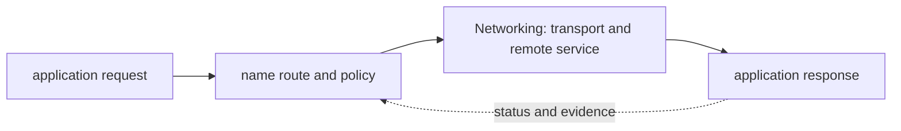

# Networking

<!-- chapter-guide:start -->
> **Step 028 of 373 — 03**
>
> **Builds on:** [Essential Linux commands](../02-linux/12-essential-linux-commands/README.md)
>
> **Now:** Learn **Networking** from its mental model through production ownership.
>
> **Then:** Rehearse the linked questions and continue to [OSI and TCP/IP models](01-osi-and-tcp-ip-models/README.md).
<!-- chapter-guide:end -->

<!-- explanation-practice-normalizer:v1 -->


## Explanation

### What this chapter is and why it exists

**Networking** is easiest to understand as one part of a larger path. The subject is part of an end-to-end packet path. An application names a peer, the host selects a route and next hop, transports establish communication, and application protocols interpret the bytes returned.

The chapter focuses on Networking. These are connected mechanisms, not vocabulary to memorize. The networking branch explains the complete path from a name and application request through packets, routes, policy, transport, TLS and the remote response The explanations below first build the simple model, then add the exact system behavior and production consequences.

### History and evolution

Packet networking developed from early research networks into the TCP/IP Internet; ARPANET adopted TCP/IP in 1983, DNS replaced a centrally maintained host list, and HTTP/TLS later made the network an application platform. Modern overlays, proxies and cloud load balancers add layers, but every request still depends on naming, forwarding, transport and application contracts agreeing.

In this chapter, **Networking** is the next layer of that evolution. Its modern purpose is to the networking branch explains the complete path from a name and application request through packets, routes, policy, transport, TLS and the remote response. The exact product surface may change by version, but the underlying state, request path and failure boundaries remain the durable ideas to learn.

### How the complete branch works



A branch overview connects child mechanisms into one lifecycle. The input crosses identity and policy, a control or decision plane, the runtime data path and its dependencies before producing a user-visible result. Status and telemetry travel back through the loop so operators and controllers can correct drift or failure. Reading the child chapters adds precision, but this overview explains why those chapters depend on one another.

A useful test of understanding is to trace one concrete request or change from origin to outcome and name the authoritative state at each boundary. That trace reveals where work is synchronous or asynchronous, which failure domains are independent, what a timeout can prove, and which evidence distinguishes accepted intent from healthy behavior.

### Packet mental model

Applications write bytes/messages to sockets; transport segments/datagrams them; IP routes packets; links frame them. Encapsulation adds headers and MTU pressure. Every diagnosis should state source/destination address, port, protocol, namespace, expected path, return path and failure phase: name resolution, connect/handshake, TLS, request/response or application.

IPv4/IPv6 CIDR represents prefix length; subnetting allocates address ranges and broadcast domains. Longest-prefix match selects routes. Private addressing is not security. NAT rewrites addresses/ports and requires conntrack/state; it can exhaust ports and obscures identity. IPv6 changes addressing/NAT expectations but still needs routing/firewalling.

At Layer 2, switches forward by MAC, ARP/ND resolves local next hops, VLANs segment broadcast domains and STP prevents loops. At Layer 3, routers use static/dynamic routes; BGP exchanges reachability under policy, not latency promises. ECMP spreads flows across equal-cost paths. Asymmetric routing can break stateful firewalls/NAT.

### TCP, UDP and QUIC

TCP establishes state with SYN/SYN-ACK/ACK, numbers bytes, acknowledges/retransmits, applies receive-window flow control and congestion control. Latency/loss affects throughput; keepalive is not an application health check. `TIME_WAIT` protects old segments; mass outbound connections can exhaust ephemeral ports. UDP has no built-in delivery/order/congestion contract. QUIC provides encrypted multiplexed transport over UDP and moves recovery/streams into user space.

### DNS, HTTP and TLS

Stub resolvers query recursive resolvers, which follow delegation to authoritative servers and cache positive/negative answers by TTL. A/AAAA address, CNAME aliases, MX mail, TXT metadata, NS delegation and SRV service records. Split-horizon views differ by client network; DNSSEC authenticates signed data, not confidentiality. Diagnose application resolver/search/hosts/cache as well as `dig`.

HTTP methods have safety/idempotency semantics, status classes and headers controlling content/auth/cache/connection. HTTP/1.1 reuses connections; HTTP/2 multiplexes streams; HTTP/3 runs over QUIC. WebSockets upgrade to bidirectional messages; SSE streams server events. Align proxy/app timeouts, cancellation and streaming buffering.

TLS negotiates version/cipher/key agreement, validates certificate chain/hostname/time and derives symmetric session keys. SANs identify hosts; SNI selects virtual host/cert; mTLS authenticates both sides. Termination, re-encryption and passthrough have different visibility/trust. Rotate before expiry and verify clients/trust bundles.

### Load balancing, proxies and firewalls

L4 balances connections; L7 routes requests. Algorithms include round robin, least connections, weighted and consistent hashing. Health readiness, draining, stickiness and cross-zone/global distribution determine failure behavior. Forward proxies act for clients; reverse/API gateways act for servers; sidecars/service meshes add per-workload policy/telemetry at complexity cost.

Stateful firewalls remember flows; stateless rules require both directions. SNAT changes source, DNAT destination, PAT ports. Rate limiting protects fairness/quotas; load shedding protects survival; neither is the same as autoscaling.

### Troubleshooting sequence

1. Reproduce from the affected namespace/client and timestamp it.
2. Resolve name through the same resolver path; validate address/family/TTL.
3. Inspect local address, route/rules/neighbor and MTU.
4. Observe handshake with `ss`, `curl -v`, `openssl s_client` and packet capture.
5. Inspect every routing/NAT/firewall/LB/proxy hop and return path.
6. Separate connect, TLS, upstream timeout/reset/status and application saturation.
7. Mitigate reversibly, verify end-to-end and create a synthetic path check.

Common traps: ICMP success does not prove TCP; a listening socket does not prove readiness; DNS may return multiple/family-specific answers; traceroute is not the exact application path; opening a firewall cannot repair missing routes; retries can worsen loss/overload.

### Revision summary

- Follow name → route → filter/NAT → handshake → TLS → HTTP/application → return.
- TCP reliability is scoped to a connection, not end-to-end business success.
- TTL/caches shape DNS failover.
- TLS identity validation is as important as encryption.
- Stateful middleboxes and asymmetric paths are a frequent hidden failure.

### Read further

- [RFC Editor](https://www.rfc-editor.org/) — the primary index for Internet standards and RFCs. Follow the specific protocol links in the child chapters and verify whether an RFC is current, updated or obsolete.

## Practice

### Practice this chapter

Prerequisite: a disposable container network. Create an isolated bridge and a small HTTP server, verify name resolution and a successful request, then test a wrong name, a closed port and one deliberately blocked path. For each failure, distinguish DNS, route, transport and application evidence before changing anything. Treat packet, flow, proxy and application signals as one network observability path. Roll back the rule you added, verify the original client path, remove the named containers and network, and confirm no listener or namespace remains. The harder extension is a packet-path diagram annotated with the exact observation available at each hop.

### Practice objective

Build a small, safe proof of **Networking** and explain the result in your own words. The goal is not command completion; it is to connect input, internal mechanism, observable state and user outcome.

### Prerequisites and setup

Use a disposable local environment, sandbox account/project or isolated namespace. Confirm the effective identity and target, record the start time, and set a cost limit before creating anything.

Record tool and platform versions because flags, APIs and defaults can change. Define every uppercase placeholder before use and keep secrets out of shell history and committed files.

### Activity 1: establish a healthy baseline

Run the read-oriented example first:

```bash
ip -br addr
ip route
getent ahosts NAME
curl -v URL
```

For each line, write down the layer it inspects, the expected healthy field or response, and one thing it cannot prove. The expected result is an attributable request against the intended target plus enough state to draw the path from input to outcome.

### Activity 2: create or review the smallest working example

Put the smallest relevant command, configuration, manifest or code sample in source control. Validate or lint it, produce a preview/diff where the tool supports one, and apply only inside the disposable boundary. Record the exact revision and resulting resource or process ID. If the topic is observational rather than configurable, save a sanitized baseline and an automated assertion instead of mutating the system.

### Activity 3: controlled failure and troubleshooting

Introduce one bounded failure: use a definitely nonexistent resource name, an invalid sandbox-only value, a denied test identity, a closed test port or a stopped disposable dependency. Capture the exact error and classify it as identity/policy, input/configuration, control-plane reconciliation, network/protocol, dependency or capacity. Test one discriminating hypothesis at a time; do not widen access or restart unrelated components.

Expected failure evidence is a specific non-zero exit, status/reason, event or protocol response that disappears when the controlled fault is removed. If healthy and failing runs look identical, the chosen signal does not explain the phenomenon and the exercise is not complete.

### Verification

Repeat the original client or user-facing check, not only an administrative status command. Confirm the desired revision, data correctness where applicable, error and latency recovery, and absence of a continuing retry/backlog/saturation condition. Explain why this evidence proves recovery and what uncertainty remains.

### Cleanup and rollback

Revert the configuration in its source of truth and review the rollback diff before applying it. Delete only the named sandbox resources, stop disposable processes, remove temporary credentials and verify that no billable resource, volume, artifact, queue item or background job remains. Read-only activities require no infrastructure rollback, but sanitized captures must still follow retention policy.

### Harder extension

Automate the healthy and failing paths in CI, use short-lived identity, add one SLI/alert or policy assertion, and write a five-step runbook another engineer can execute without hidden context. Then explain how the design changes for two tenants, a zonal or dependency failure, 10× load and a strict cost or recovery target.

<!-- reading-navigation:start -->
---

**Reading path:** [← Back: Essential Linux commands](../02-linux/12-essential-linux-commands/README.md) · [Questions](questions-and-answers.md) · [Next: OSI and TCP/IP models →](01-osi-and-tcp-ip-models/README.md)

<!-- reading-navigation:end -->
