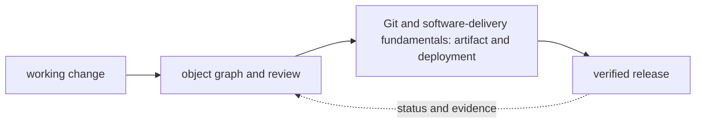

# Git and software-delivery fundamentals

<!-- chapter-guide:start -->
> **Step 041 of 373 — 04**
>
> **Builds on:** [Network troubleshooting](../03-networking/12-network-troubleshooting/README.md)
>
> **Now:** Learn **Git and software-delivery fundamentals** from its mental model through production ownership.
>
> **Then:** Rehearse the linked questions and continue to [Git object model](01-git-object-model/README.md).
<!-- chapter-guide:end -->

<!-- explanation-practice-normalizer:v1 -->


## Explanation

### What this chapter is and why it exists

**Git and software-delivery fundamentals** is easiest to understand as one part of a larger path. The subject is part of a content-addressed change graph. Files become immutable objects, commits connect snapshots to parents, refs name graph tips, and review and automation decide which graph state may become a release.

The chapter focuses on Git and software-delivery fundamentals. These are connected mechanisms, not vocabulary to memorize. The Git delivery branch explains how content becomes commits and refs, how histories integrate, and how reviewed revisions become trustworthy releases The explanations below first build the simple model, then add the exact system behavior and production consequences.

### History and evolution

Version control evolved from local file histories to centralized systems and then distributed commit graphs. Git was created in 2005 for Linux kernel development; content-addressed objects and cheap branches made distributed collaboration fast, while hosted review, signing and CI/CD added governance around the graph.

In this chapter, **Git and software-delivery fundamentals** is the next layer of that evolution. Its modern purpose is to the Git delivery branch explains how content becomes commits and refs, how histories integrate, and how reviewed revisions become trustworthy releases. The exact product surface may change by version, but the underlying state, request path and failure boundaries remain the durable ideas to learn.

### How the complete branch works



A branch overview connects child mechanisms into one lifecycle. The input crosses identity and policy, a control or decision plane, the runtime data path and its dependencies before producing a user-visible result. Status and telemetry travel back through the loop so operators and controllers can correct drift or failure. Reading the child chapters adds precision, but this overview explains why those chapters depend on one another.

A useful test of understanding is to trace one concrete request or change from origin to outcome and name the authoritative state at each boundary. That trace reveals where work is synchronous or asynchronous, which failure domains are independent, what a timeout can prove, and which evidence distinguishes accepted intent from healthy behavior.

### Object and collaboration model

Git stores content-addressed blobs, trees and commits; refs point to commits; `HEAD` identifies the checked-out ref/commit; the index stages the next tree. A commit records snapshot, parents, author/committer and message. Understanding the graph makes merge/rebase/reset/revert predictable.

Merge preserves both histories with a merge commit when needed. Rebase copies commits onto a new base and rewrites IDs; avoid rewriting shared protected history. Cherry-pick copies selected changes. Revert adds an inverse commit and is the safe public-history undo. Reset moves a ref/index/worktree depending on mode and is dangerous on shared work. Use reflog for local recovery while entries remain.

Trunk-based development uses small changes and flags for integration speed; feature branches isolate review; GitFlow adds release branches and overhead. Choose from release cadence, compliance and team coordination. Branch protection, required checks/reviews, CODEOWNERS and merge queues encode governance but need emergency and stale-owner procedures.

### Releases and security

Semantic versions communicate compatibility only if the project defines/enforces its contract. Tags identify commits; release artifacts must be immutable and linked to commit, build, dependencies, SBOM, signature/provenance and tests. Promote the same artifact; do not rebuild production from a mutable branch. Changelogs emphasize user/operational impact and migration/rollback.

Sign commits/tags where identity assurance matters, protect signing keys and verify in automation. Use least-privilege repository/app/token permissions, SSO/MFA, protected environments, ephemeral CI identity, secret scanning with rotation, dependency updates and pinned actions/dependencies. A deleted secret is still compromised in history/logs/caches; revoke first, then rewrite history only with coordination.

### Safe workflows

```bash
git status --short
git log --graph --decorate --oneline --all
git diff; git diff --staged
git switch -c feature/name
git fetch --prune
git rebase origin/main       # only for an appropriate private branch
git revert COMMIT
git reflog
git show --show-signature TAG
```

Resolve conflicts by understanding both intentions and running tests, not choosing “ours/theirs” blindly. For incidents, map deployed artifact/digest back to commit and pipeline evidence. Hotfix the smallest safe change, preserve normal review where time allows, and merge the fix back to all maintained lines.

### Revision summary

- Git is a content-addressed commit graph plus movable refs.
- Rebase/reset rewrite/move history; revert records a safe public undo.
- Small integrated changes reduce merge and rollback risk.
- Releases bind source to immutable artifact and evidence.
- Rotate leaked secrets before repository history cleanup.

Production ownership includes failure recovery, reliability, observability and cost: preserve reflogs and immutable release evidence, measure pipeline and review latency, make rollback versus revert explicit, and avoid repository or CI designs whose storage and runner cost grows without ownership.

### Read further

- [Git reference documentation](https://git-scm.com/docs) — authoritative command and behavior reference; use the child chapters to connect individual commands to safe collaboration and delivery workflows.

## Practice

### Practice objective

Build a small, safe proof of **Git and software-delivery fundamentals** and explain the result in your own words. The goal is not command completion; it is to connect input, internal mechanism, observable state and user outcome.

### Prerequisites and setup

Use a disposable local environment, sandbox account/project or isolated namespace. Confirm the effective identity and target, record the start time, and set a cost limit before creating anything.

Record tool and platform versions because flags, APIs and defaults can change. Define every uppercase placeholder before use and keep secrets out of shell history and committed files.

### Activity 1: establish a healthy baseline

Run the read-oriented example first:

```bash
git status --short
git log --graph --oneline --decorate -10
git diff --check
```

For each line, write down the layer it inspects, the expected healthy field or response, and one thing it cannot prove. The expected result is an attributable request against the intended target plus enough state to draw the path from input to outcome.

### Activity 2: create or review the smallest working example

Put the smallest relevant command, configuration, manifest or code sample in source control. Validate or lint it, produce a preview/diff where the tool supports one, and apply only inside the disposable boundary. Record the exact revision and resulting resource or process ID. If the topic is observational rather than configurable, save a sanitized baseline and an automated assertion instead of mutating the system.

### Activity 3: controlled failure and troubleshooting

Introduce one bounded failure: use a definitely nonexistent resource name, an invalid sandbox-only value, a denied test identity, a closed test port or a stopped disposable dependency. Capture the exact error and classify it as identity/policy, input/configuration, control-plane reconciliation, network/protocol, dependency or capacity. Test one discriminating hypothesis at a time; do not widen access or restart unrelated components.

Expected failure evidence is a specific non-zero exit, status/reason, event or protocol response that disappears when the controlled fault is removed. If healthy and failing runs look identical, the chosen signal does not explain the phenomenon and the exercise is not complete.

### Verification

Repeat the original client or user-facing check, not only an administrative status command. Confirm the desired revision, data correctness where applicable, error and latency recovery, and absence of a continuing retry/backlog/saturation condition. Explain why this evidence proves recovery and what uncertainty remains.

### Cleanup and rollback

Revert the configuration in its source of truth and review the rollback diff before applying it. Delete only the named sandbox resources, stop disposable processes, remove temporary credentials and verify that no billable resource, volume, artifact, queue item or background job remains. Read-only activities require no infrastructure rollback, but sanitized captures must still follow retention policy.

### Harder extension

Automate the healthy and failing paths in CI, use short-lived identity, add one SLI/alert or policy assertion, and write a five-step runbook another engineer can execute without hidden context. Then explain how the design changes for two tenants, a zonal or dependency failure, 10× load and a strict cost or recovery target.

<!-- reading-navigation:start -->
---

**Reading path:** [← Back: Network troubleshooting](../03-networking/12-network-troubleshooting/README.md) · [Questions](questions-and-answers.md) · [Next: Git object model →](01-git-object-model/README.md)

<!-- reading-navigation:end -->
