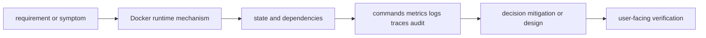

# Docker runtime

<!-- chapter-guide:start -->
> **Step 051 of 373 — 05.03**
>
> **Builds on:** [Docker images](../02-docker-images/README.md)
>
> **Now:** Learn **Docker runtime** from its mental model through production ownership.
>
> **Then:** Rehearse the linked questions and continue to [Container networking](../04-container-networking/README.md).
<!-- chapter-guide:end -->

> [Interview questions and answers](questions-and-answers.md) · [Master curriculum](../../curriculum/master-curriculum.txt) · Official starting point: <https://opencontainers.org/>

## Easy mode: mental model

Master Docker runtime from first principles through safe production operation and senior architecture decisions.

Learn this topic in layers: name the object or mechanism, trace its lifecycle/data path, configure it safely, observe a healthy and failed state, recover it, and then design it across failure domains and team boundaries.



## Complete curriculum checklist

| # | Topic | What you must understand and demonstrate |
|---:|---|---|
| 1 | **Container lifecycle** | is part of Docker runtime; learn its precise definition, mechanism and lifecycle, nearest alternatives, configuration interface, failure/limit, security boundary, observable evidence and production trade-off. |
| 2 | **Entrypoint versus command** | is a design comparison: define both sides, contrast mechanism and guarantees, then select using workload, failure, security, ownership and cost evidence rather than preference. |
| 3 | **Environment variables** | is part of Docker runtime; learn its precise definition, mechanism and lifecycle, nearest alternatives, configuration interface, failure/limit, security boundary, observable evidence and production trade-off. |
| 4 | **Signals** | deliver asynchronous process notifications; SIGTERM enables cleanup while SIGKILL cannot be caught and risks unfinished work. |
| 5 | **Graceful shutdown** | is part of Docker runtime; learn its precise definition, mechanism and lifecycle, nearest alternatives, configuration interface, failure/limit, security boundary, observable evidence and production trade-off. |
| 6 | **Health checks** | is part of Docker runtime; learn its precise definition, mechanism and lifecycle, nearest alternatives, configuration interface, failure/limit, security boundary, observable evidence and production trade-off. |
| 7 | **Restart policies** | is part of Docker runtime; learn its precise definition, mechanism and lifecycle, nearest alternatives, configuration interface, failure/limit, security boundary, observable evidence and production trade-off. |
| 8 | **Resource limits** | is part of Docker runtime; learn its precise definition, mechanism and lifecycle, nearest alternatives, configuration interface, failure/limit, security boundary, observable evidence and production trade-off. |
| 9 | **Container lifecycle** | is part of Docker runtime; learn its precise definition, mechanism and lifecycle, nearest alternatives, configuration interface, failure/limit, security boundary, observable evidence and production trade-off. |
| 10 | **Entrypoint versus command** | is a design comparison: define both sides, contrast mechanism and guarantees, then select using workload, failure, security, ownership and cost evidence rather than preference. |
| 11 | **Environment variables** | is part of Docker runtime; learn its precise definition, mechanism and lifecycle, nearest alternatives, configuration interface, failure/limit, security boundary, observable evidence and production trade-off. |
| 12 | **Signals** | deliver asynchronous process notifications; SIGTERM enables cleanup while SIGKILL cannot be caught and risks unfinished work. |
| 13 | **Graceful shutdown** | is part of Docker runtime; learn its precise definition, mechanism and lifecycle, nearest alternatives, configuration interface, failure/limit, security boundary, observable evidence and production trade-off. |
| 14 | **Health checks** | is part of Docker runtime; learn its precise definition, mechanism and lifecycle, nearest alternatives, configuration interface, failure/limit, security boundary, observable evidence and production trade-off. |
| 15 | **Restart policies** | is part of Docker runtime; learn its precise definition, mechanism and lifecycle, nearest alternatives, configuration interface, failure/limit, security boundary, observable evidence and production trade-off. |
| 16 | **Resource limits** | is part of Docker runtime; learn its precise definition, mechanism and lifecycle, nearest alternatives, configuration interface, failure/limit, security boundary, observable evidence and production trade-off. |

## Beginner → mid-level → senior learning path

1. **Beginner:** define every term; identify the relevant file, object, protocol, API, or command; explain one normal use.
2. **Mid-level:** configure it from source control, inspect effective runtime state, diagnose two failure modes, automate a safe change, and explain one trade-off.
3. **Senior:** clarify ambiguous requirements, map trust and failure domains, quantify capacity/SLO/RPO/RTO/cost, compare alternatives, plan migration/rollback, and assign ownership.

## Command and configuration lab

Run read-only checks first in a sandbox. For each command, predict healthy output, one failing result, the next discriminating check, and the safe rollback for any later mutation.

```bash
docker run --rm --read-only --cap-drop=ALL IMAGE COMMAND
docker inspect CONTAINER
docker logs --timestamps CONTAINER
docker events --since 30m
```

## Hands-on practice: setup → failure → verification → cleanup

Use a disposable local runtime. Run a small container with explicit CPU/memory/pid limits, read-only root, dropped capabilities and a temporary writable mount; inspect effective state, logs, processes, namespaces and limits. Trigger a safe failure with a nonexistent command or an over-tight test limit, explain the exit status/event, then recreate from source configuration. Cleanup the named lab container, network and volume; confirm with the runtime inventory.

Expected result: you can show the healthy evidence, reproduce a safe failure, explain why each command distinguishes one layer from another, restore the baseline, and prove cleanup. Hard extension: automate the lab from source control, add a test or alert for the injected failure, and write a five-step runbook another engineer can execute.

For code/configuration, be ready to review an intentionally unsafe diff and improve idempotency, secret handling, timeouts, validation, logging, tests, and rollback.

## Senior design checklist

State assumptions for tenants, traffic/work units, latency and availability targets, data classification/residency, recovery, team skills and budget. Draw control/data planes and synchronous/asynchronous dependencies. Cover identity, policy, encryption/key lifecycle, delivery provenance, observability, capacity, unit cost, operational ownership, migration and exit criteria. Name the evidence that would cause you to revise the design.

## Revision and practice

Complete the separate [checkbox interview bank](questions-and-answers.md). Do not memorize wording: speak in the order **definition → mechanism → evidence/configuration → failure/trade-off → production example**. For procedures use **stabilize → scope → inspect → hypothesize → test → mitigate → verify → prevent**.

<!-- reading-navigation:start -->
---

**Reading path:** [← Back: Docker images](../02-docker-images/README.md) · [Questions](questions-and-answers.md) · [Next: Container networking →](../04-container-networking/README.md)

<!-- reading-navigation:end -->
