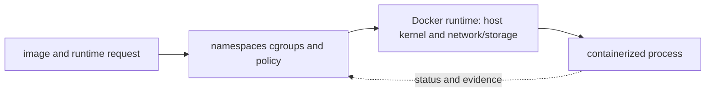

# Docker runtime

<!-- chapter-guide:start -->
> **Step 051 of 373 — 05.03**
>
> **Builds on:** [Docker images](../02-docker-images/README.md)
>
> **Now:** Learn **Docker runtime** from its mental model through production ownership.
>
> **Then:** Rehearse the linked questions and continue to [Container networking](../04-container-networking/README.md).
<!-- chapter-guide:end -->

> [Interview questions and answers](questions-and-answers.md) · [Master curriculum](../../curriculum/master-curriculum.txt) · Official starting point: <https://opencontainers.org/>

## Explanation

### What it is and why it exists

**Docker runtime** is easiest to understand as one part of a larger path. The subject combines an immutable image with an ordinary host process constrained by namespaces, cgroups, capabilities, seccomp, mounts and network setup. A container is isolation and packaging, not a separate kernel or a complete security boundary.

The chapter focuses on Container lifecycle, Entrypoint versus command, Environment variables, Signals. These are connected mechanisms, not vocabulary to memorize. Docker runtime is the part of Container fundamentals that connects the listed mechanisms to effective runtime state, observable behavior and production outcomes The explanations below first build the simple model, then add the exact system behavior and production consequences.

### History and evolution

Container isolation did not begin with Docker. Unix `chroot`, FreeBSD jails, Linux namespaces and cgroups gradually supplied filesystem, identity and resource boundaries; Docker made image-based workflows popular in 2013, and the OCI later standardized image and runtime contracts.

In this chapter, **Docker runtime** is the next layer of that evolution. Its modern purpose is to docker runtime is the part of Container fundamentals that connects the listed mechanisms to effective runtime state, observable behavior and production outcomes. The exact product surface may change by version, but the underlying state, request path and failure boundaries remain the durable ideas to learn.

### How it works: the end-to-end path



The path begins with a concrete input: a user request, configuration revision, packet, job, model request or operational symptom. The relevant subsystem validates that input, reads current state, performs or schedules work and exposes a result. Some transitions complete before the caller receives a response; others acknowledge the request and converge later. That difference determines whether a timeout means "nothing happened," "the operation failed," or "the final result is still unknown."

For **Docker runtime**, the important stages are Container lifecycle, Entrypoint versus command, Environment variables, Signals, Graceful shutdown, Health checks, Restart policies, Resource limits. Their boundaries explain where identity is checked, where state becomes durable, where capacity is consumed, how failures propagate and which signal can distinguish one layer from another. A production explanation should follow the actual path rather than treating each term as an isolated definition.


### Core concepts explained in detail

#### Container lifecycle

**What it is.** The term Container lifecycle describes the ordered states from creation or submission through active use, change, failure, recovery and retirement, including who owns each transition within Docker runtime.

**Junior mental model.** Think of a scheduler as allocating seats and time slots: a request states what it needs, available workers advertise capacity, and policy chooses a placement. Requested capacity, usable capacity and completed useful work are different quantities.

**How it works.** Work enters a runnable or pending state, eligibility filters remove incompatible placements, scoring or queue policy selects a worker, and a runtime creates the process and accounts for CPU, memory, devices and time. Autoscaling observes demand, requests more replicas or machines, and waits through provisioning and warm-up before capacity becomes useful.

**What it looks like in production.** Healthy evidence connects queue delay, placement, utilization, throttling, memory/device pressure, runtime readiness and successful work. Fragmentation, inaccurate requests, quota, topology, cold starts and a saturated downstream service can leave capacity apparently free while latency and pending work grow.

#### Entrypoint versus command

**What it is.** Is a design comparison: define both sides, contrast mechanism and guarantees, then select using workload, failure, security, ownership and cost evidence rather than preference.

**Junior mental model.** Think of a scheduler as allocating seats and time slots: a request states what it needs, available workers advertise capacity, and policy chooses a placement. Requested capacity, usable capacity and completed useful work are different quantities.

**How it works.** Work enters a runnable or pending state, eligibility filters remove incompatible placements, scoring or queue policy selects a worker, and a runtime creates the process and accounts for CPU, memory, devices and time. Autoscaling observes demand, requests more replicas or machines, and waits through provisioning and warm-up before capacity becomes useful.

**What it looks like in production.** Healthy evidence connects queue delay, placement, utilization, throttling, memory/device pressure, runtime readiness and successful work. Fragmentation, inaccurate requests, quota, topology, cold starts and a saturated downstream service can leave capacity apparently free while latency and pending work grow.

#### Environment variables

**What it is.** The term Environment variables refers to an image, runtime or kernel-isolation mechanism that changes the filesystem, resource or security view of a process within Docker runtime.

**Junior mental model.** Treat delivery like a controlled assembly line: reviewed source becomes an immutable artifact, the artifact is promoted without being rebuilt, and each environment records exactly which revision is effective.

**How it works.** The lifecycle begins with versioned intent, validates syntax and policy, resolves dependencies, builds or selects immutable inputs, produces a diff or release plan, changes the target in bounded waves, and records status. Reconciliation keeps desired and observed state aligned; rollback is another tested state transition, not merely a command name.

**What it looks like in production.** Healthy evidence links source revision, review, test, artifact digest, signer/provenance, deployment target and user-facing verification. Mutable tags, environment-specific rebuilds, unpinned dependencies, non-idempotent migrations and controllers fighting emergency changes are recurring failure modes.

#### Signals

**What it is.** Deliver asynchronous process notifications; SIGTERM enables cleanup while SIGKILL cannot be caught and risks unfinished work.

**Junior mental model.** Treat delivery like a controlled assembly line: reviewed source becomes an immutable artifact, the artifact is promoted without being rebuilt, and each environment records exactly which revision is effective.

**How it works.** The lifecycle begins with versioned intent, validates syntax and policy, resolves dependencies, builds or selects immutable inputs, produces a diff or release plan, changes the target in bounded waves, and records status. Reconciliation keeps desired and observed state aligned; rollback is another tested state transition, not merely a command name.

**What it looks like in production.** Healthy evidence links source revision, review, test, artifact digest, signer/provenance, deployment target and user-facing verification. Mutable tags, environment-specific rebuilds, unpinned dependencies, non-idempotent migrations and controllers fighting emergency changes are recurring failure modes.

#### Graceful shutdown

**What it is.** The term Graceful shutdown refers to an image, runtime or kernel-isolation mechanism that changes the filesystem, resource or security view of a process within Docker runtime.

**Junior mental model.** Think of a scheduler as allocating seats and time slots: a request states what it needs, available workers advertise capacity, and policy chooses a placement. Requested capacity, usable capacity and completed useful work are different quantities.

**How it works.** Work enters a runnable or pending state, eligibility filters remove incompatible placements, scoring or queue policy selects a worker, and a runtime creates the process and accounts for CPU, memory, devices and time. Autoscaling observes demand, requests more replicas or machines, and waits through provisioning and warm-up before capacity becomes useful.

**What it looks like in production.** Healthy evidence connects queue delay, placement, utilization, throttling, memory/device pressure, runtime readiness and successful work. Fragmentation, inaccurate requests, quota, topology, cold starts and a saturated downstream service can leave capacity apparently free while latency and pending work grow.

#### Health checks

**What it is.** The term Health checks refers to an image, runtime or kernel-isolation mechanism that changes the filesystem, resource or security view of a process within Docker runtime.

**Junior mental model.** Failure controls are traffic rules for unhealthy conditions: they bound how long work waits, how often it retries, how much enters the system and what reduced service remains possible.

**How it works.** A caller assigns a deadline and attempt budget, classifies an error, applies bounded backoff with jitter only when retry is safe, and propagates capacity limits upstream. Circuit breakers, bulkheads and load shedding prevent one dependency from consuming every worker; recovery probes and gradual traffic return avoid a second overload.

**What it looks like in production.** Healthy evidence shows bounded queues, stable retry ratios and recovery within an objective. Unbounded retries, identical timeouts at every layer, non-idempotent replays, shared resource pools and failover to an unqualified target commonly turn a small fault into an outage.

#### Restart policies

**What it is.** The term Restart policies refers to an image, runtime or kernel-isolation mechanism that changes the filesystem, resource or security view of a process within Docker runtime.

**Junior mental model.** Think of a scheduler as allocating seats and time slots: a request states what it needs, available workers advertise capacity, and policy chooses a placement. Requested capacity, usable capacity and completed useful work are different quantities.

**How it works.** Work enters a runnable or pending state, eligibility filters remove incompatible placements, scoring or queue policy selects a worker, and a runtime creates the process and accounts for CPU, memory, devices and time. Autoscaling observes demand, requests more replicas or machines, and waits through provisioning and warm-up before capacity becomes useful.

**What it looks like in production.** Healthy evidence connects queue delay, placement, utilization, throttling, memory/device pressure, runtime readiness and successful work. Fragmentation, inaccurate requests, quota, topology, cold starts and a saturated downstream service can leave capacity apparently free while latency and pending work grow.

#### Resource limits

**What it is.** The term Resource limits refers to an image, runtime or kernel-isolation mechanism that changes the filesystem, resource or security view of a process within Docker runtime.

**Junior mental model.** Treat delivery like a controlled assembly line: reviewed source becomes an immutable artifact, the artifact is promoted without being rebuilt, and each environment records exactly which revision is effective.

**How it works.** The lifecycle begins with versioned intent, validates syntax and policy, resolves dependencies, builds or selects immutable inputs, produces a diff or release plan, changes the target in bounded waves, and records status. Reconciliation keeps desired and observed state aligned; rollback is another tested state transition, not merely a command name.

**What it looks like in production.** Healthy evidence links source revision, review, test, artifact digest, signer/provenance, deployment target and user-facing verification. Mutable tags, environment-specific rebuilds, unpinned dependencies, non-idempotent migrations and controllers fighting emergency changes are recurring failure modes.

### Worked command and configuration example

The following is a diagnostic example, not an unexplained command dump. Define every uppercase placeholder first—for example `NAME`, `RESOURCE`, `PROJECT`, `REGION`, `NAMESPACE`, `URL`, `IMAGE` or `CONTAINER`—and use a sandbox or read-only production role.

```bash
docker run --rm --read-only --cap-drop=ALL IMAGE COMMAND
docker inspect CONTAINER
docker logs --timestamps CONTAINER
docker events --since 30m
```

What the example demonstrates:

- `docker run --rm --read-only --cap-drop=ALL IMAGE COMMAND` shows image or runtime state so you can separate declared container configuration from the host process, namespaces and resource limits that actually exist.
- `docker inspect CONTAINER` shows image or runtime state so you can separate declared container configuration from the host process, namespaces and resource limits that actually exist.
- `docker logs --timestamps CONTAINER` shows image or runtime state so you can separate declared container configuration from the host process, namespaces and resource limits that actually exist.
- `docker events --since 30m` shows image or runtime state so you can separate declared container configuration from the host process, namespaces and resource limits that actually exist.

A healthy run returns the intended identity/context, exits successfully and shows the expected object or response without a new warning, retry loop or saturation signal. A failure is useful evidence: preserve the exact exit code, status/reason, timestamp and target, then inspect the immediately adjacent layer before changing anything. This makes the example part of the explanation of **Docker runtime**, not merely a list to copy.

### Security, reliability and production ownership

Security controls who can initiate a transition and what data or resource that transition may affect. Authentication, authorization, network reachability, encryption and audit solve different problems and must align at each boundary. Short-lived attributable identities, least privilege, explicit tenant separation and tested key/certificate rotation reduce blast radius. Logs and traces need their own data controls because copying a secret or customer payload into telemetry defeats the primary protection.

Reliability depends on every synchronous dependency and on the eventual convergence of asynchronous work. Timeouts bound waiting; idempotency makes an ambiguous retry safe; backpressure and load shedding keep demand within useful capacity; replication and failover help only across independent failure domains. Recovery must be tested from protected state and verified through the original user outcome, not inferred from a green administrative status.

Ownership makes these mechanisms operable. Every production resource or service needs an accountable team, source-of-truth revision, environment and data classification, SLO, runbook, cost center and retirement policy. Reversible mitigation can stabilize an incident, but the durable repair belongs in Git, IaC, policy or the owning application so reconciliation does not reintroduce the fault.

### Observability, performance and cost

Metrics, logs, traces, profiles and audit events are complementary. A useful diagnostic path starts with time, identity, exact target and user symptom, then compares desired and observed state before moving through reconciliation, network/protocol, runtime, dependency and saturation layers. High-cardinality request or object IDs belong in sampled logs or traces rather than metric labels; alerts should represent actionable user-impact risk or leading exhaustion.

Performance is governed by work distribution, queueing and bottlenecks. Rate, latency percentiles, errors, saturation, queue depth or age and service-specific limits reveal more than average utilization. Application replicas and underlying machines, storage or provider quota scale through separate loops with different cold delays. Cost includes idle headroom, requests or work units, storage/retention, network transfer, telemetry, support and recovery capacity; optimize cost per successful outcome rather than the cheapest isolated resource.

### What you should be able to explain

The table remains as a revision checklist. Read the explanations above first; afterward, use each row to check whether you can explain the concept without relying on memorized wording.

| # | Topic | What you must understand and demonstrate |
|---:|---|---|
| 1 | **Container lifecycle** | is part of Docker runtime; learn its precise definition, mechanism and lifecycle, nearest alternatives, configuration interface, failure/limit, security boundary, observable evidence and production trade-off |
| 2 | **Entrypoint versus command** | is a design comparison: define both sides, contrast mechanism and guarantees, then select using workload, failure, security, ownership and cost evidence rather than preference |
| 3 | **Environment variables** | is part of Docker runtime; learn its precise definition, mechanism and lifecycle, nearest alternatives, configuration interface, failure/limit, security boundary, observable evidence and production trade-off |
| 4 | **Signals** | deliver asynchronous process notifications; SIGTERM enables cleanup while SIGKILL cannot be caught and risks unfinished work |
| 5 | **Graceful shutdown** | is part of Docker runtime; learn its precise definition, mechanism and lifecycle, nearest alternatives, configuration interface, failure/limit, security boundary, observable evidence and production trade-off |
| 6 | **Health checks** | is part of Docker runtime; learn its precise definition, mechanism and lifecycle, nearest alternatives, configuration interface, failure/limit, security boundary, observable evidence and production trade-off |
| 7 | **Restart policies** | is part of Docker runtime; learn its precise definition, mechanism and lifecycle, nearest alternatives, configuration interface, failure/limit, security boundary, observable evidence and production trade-off |
| 8 | **Resource limits** | is part of Docker runtime; learn its precise definition, mechanism and lifecycle, nearest alternatives, configuration interface, failure/limit, security boundary, observable evidence and production trade-off |

## Practice

### Practice objective

Build a small, safe proof of **Docker runtime** and explain the result in your own words. The goal is not command completion; it is to connect input, internal mechanism, observable state and user outcome.

### Prerequisites and setup

Use a disposable local runtime. Run a small container with explicit CPU/memory/pid limits, read-only root, dropped capabilities and a temporary writable mount; inspect effective state, logs, processes, namespaces and limits. Trigger a safe failure with a nonexistent command or an over-tight test limit, explain the exit status/event, then recreate from source configuration. Cleanup the named lab container, network and volume; confirm with the runtime inventory.

Record tool and platform versions because flags, APIs and defaults can change. Define every uppercase placeholder before use and keep secrets out of shell history and committed files.

### Activity 1: establish a healthy baseline

Run the read-oriented example first:

```bash
docker run --rm --read-only --cap-drop=ALL IMAGE COMMAND
docker inspect CONTAINER
docker logs --timestamps CONTAINER
docker events --since 30m
```

For each line, write down the layer it inspects, the expected healthy field or response, and one thing it cannot prove. The expected result is an attributable request against the intended target plus enough state to draw the path from input to outcome.

### Activity 2: create or review the smallest working example

Put the smallest relevant command, configuration, manifest or code sample in source control. Validate or lint it, produce a preview/diff where the tool supports one, and apply only inside the disposable boundary. Record the exact revision and resulting resource or process ID. If the topic is observational rather than configurable, save a sanitized baseline and an automated assertion instead of mutating the system.

### Activity 3: controlled failure and troubleshooting

Introduce one bounded failure: use a definitely nonexistent resource name, an invalid sandbox-only value, a denied test identity, a closed test port or a stopped disposable dependency. Capture the exact error and classify it as identity/policy, input/configuration, control-plane reconciliation, network/protocol, dependency or capacity. Test one discriminating hypothesis at a time; do not widen access or restart unrelated components.

Expected failure evidence is a specific non-zero exit, status/reason, event or protocol response that disappears when the controlled fault is removed. If healthy and failing runs look identical, the chosen signal does not explain the phenomenon and the exercise is not complete.

### Verification

Repeat the original client or user-facing check, not only an administrative status command. Confirm the desired revision, data correctness where applicable, error and latency recovery, and absence of a continuing retry/backlog/saturation condition. Explain why this evidence proves recovery and what uncertainty remains.

### Cleanup and rollback

Revert the configuration in its source of truth and review the rollback diff before applying it. Delete only the named sandbox resources, stop disposable processes, remove temporary credentials and verify that no billable resource, volume, artifact, queue item or background job remains. Read-only activities require no infrastructure rollback, but sanitized captures must still follow retention policy.

### Harder extension

Automate the healthy and failing paths in CI, use short-lived identity, add one SLI/alert or policy assertion, and write a five-step runbook another engineer can execute without hidden context. Then explain how the design changes for two tenants, a zonal or dependency failure, 10× load and a strict cost or recovery target.

<!-- reading-navigation:start -->
---

**Reading path:** [← Back: Docker images](../02-docker-images/README.md) · [Questions](questions-and-answers.md) · [Next: Container networking →](../04-container-networking/README.md)

<!-- reading-navigation:end -->
