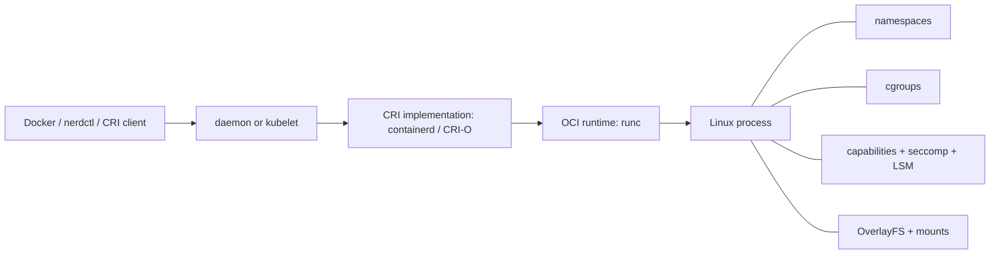

# Container fundamentals

<!-- child-topic-toc:start -->
## Table of contents and deeper notes

This parent note explains how the child topics work together. Follow each child link for the deeper mechanism, real commands/configuration, hands-on practice, authoritative documentation, and its local interview bank.

- [Container internals](container-internals/README.md) — [questions and answers](container-internals/questions-and-answers.md)
- [Container networking](container-networking/README.md) — [questions and answers](container-networking/questions-and-answers.md)
- [Container security](container-security/README.md) — [questions and answers](container-security/questions-and-answers.md)
- [Container storage](container-storage/README.md) — [questions and answers](container-storage/questions-and-answers.md)
- [Docker images](docker-images/README.md) — [questions and answers](docker-images/questions-and-answers.md)
- [Docker runtime](docker-runtime/README.md) — [questions and answers](docker-runtime/questions-and-answers.md)
- [Registries](registries/README.md) — [questions and answers](registries/questions-and-answers.md)
<!-- child-topic-toc:end -->
## Easy mode: the mental model

A container is a normal host process with isolated views (namespaces), resource accounting/limits (cgroups), constrained privileges (capabilities/seccomp/LSM) and a layered root filesystem. An image is an OCI content-addressed manifest/config/layer graph; a registry distributes it. The runtime unpacks an image and asks a low-level runtime to create the process. Containers do not contain a kernel.



Namespaces isolate PID, mount, network, IPC, UTS, user and cgroup views. Cgroups v2 organize CPU, memory, I/O and process limits. OverlayFS combines immutable image layers with a writable container layer; volumes/bind mounts bypass that layer. A capability is a sliced kernel privilege; seccomp limits syscalls; SELinux/AppArmor constrain object access.

## Image construction: easy to production

Bad image:

```dockerfile
FROM ubuntu:latest
COPY . /app
RUN apt-get update && apt-get install -y python3 python3-pip
RUN pip3 install -r /app/requirements.txt
CMD python3 /app/app.py
```

Problems: mutable base, huge context, cache invalidation, package indexes retained, root runtime, shell-form signal handling, unpinned dependencies and secrets possibly copied.

Production-oriented Python example:

```dockerfile
# syntax=docker/dockerfile:1.7
FROM python:3.12.4-slim@sha256:REPLACE_WITH_VERIFIED_DIGEST AS build
ENV PIP_DISABLE_PIP_VERSION_CHECK=1 PIP_NO_CACHE_DIR=1
WORKDIR /src

RUN --mount=type=cache,target=/root/.cache/pip \
    python -m venv /venv
ENV PATH=/venv/bin:$PATH
COPY requirements.txt requirements.lock ./
RUN --mount=type=cache,target=/root/.cache/pip \
    pip install --require-hashes -r requirements.lock
COPY pyproject.toml ./
COPY src ./src
RUN pip install --no-deps .

FROM python:3.12.4-slim@sha256:REPLACE_WITH_VERIFIED_DIGEST
ENV PATH=/venv/bin:$PATH PYTHONUNBUFFERED=1
RUN groupadd --gid 10001 app && useradd --uid 10001 --gid app --no-create-home app
COPY --from=build /venv /venv
USER 10001:10001
WORKDIR /app
EXPOSE 8080
STOPSIGNAL SIGTERM
ENTRYPOINT ["python", "-m", "my_service"]
```

`.dockerignore`:

```gitignore
.git
.env*
**/__pycache__
**/*.pyc
.venv
tests
dist
secrets
```

Build and inspect:

```bash
docker buildx build --platform linux/amd64,linux/arm64 \
  --provenance=true --sbom=true -t registry.example/app:1.4.2 --push .

docker image inspect registry.example/app:1.4.2
docker history --no-trunc registry.example/app:1.4.2
docker buildx imagetools inspect registry.example/app:1.4.2
docker run --rm --entrypoint /bin/sh registry.example/app:1.4.2 -c 'id; cat /etc/os-release'
```

Use secret/cache mounts during build; never `ARG`/`COPY` long-lived secrets because layers/metadata can retain them. Pin base digests but automate digest updates and rebuilds. A multi-architecture tag points to a manifest index; each platform has a distinct digest.

## Runtime configuration and lifecycle

`ENTRYPOINT` defines the executable; `CMD` supplies default arguments. JSON/exec form makes the process PID 1 and receives signals directly. PID 1 has special signal/zombie behavior; use an init when the application does not reap children. On stop, runtime sends configured signal, waits grace, then kills. Applications must stop accepting work, drain, flush/checkpoint within the deadline and exit.

```bash
docker run --name api --read-only --tmpfs /tmp:rw,noexec,nosuid,size=64m \
  --user 10001:10001 --cap-drop ALL --security-opt no-new-privileges \
  --memory 512m --cpus 1.5 --pids-limit 256 \
  --health-cmd 'wget -qO- http://127.0.0.1:8080/ready || exit 1' \
  --env-file runtime.env -p 127.0.0.1:8080:8080 \
  registry.example/app@sha256:VERIFIED_DIGEST

docker inspect api
docker stats --no-stream api
docker logs --since 10m --timestamps api
docker exec -it api sh
docker top api
docker stop --time 30 api
```

CPU limits are scheduler bandwidth, memory limits can cause cgroup OOM, and writable-layer quotas vary. Health checks should be cheap and separate liveness from dependency readiness at an orchestrator. Restart policies can turn a deterministic crash into a noisy loop.

## Networking and storage

A bridge network connects container veth interfaces through a host bridge and NAT/port publishing. Host networking shares the host stack. Overlay networks encapsulate between nodes. DNS/service discovery is runtime/orchestrator-specific.

```bash
docker network create --subnet 172.28.0.0/16 appnet
docker run -d --name db --network appnet postgres:16
docker run --rm --network appnet nicolaka/netshoot dig db
nsenter -t "$(docker inspect -f '{{.State.Pid}}' db)" -n ip addr
ss -lntp
```

Writable layers disappear with the container and perform poorly for some write workloads. Named volumes have runtime-managed locations/lifecycle; bind mounts expose host paths and security semantics. Back up application-consistently, not by copying live database files blindly.

```bash
docker volume create pgdata
docker run -d --name db --mount type=volume,src=pgdata,dst=/var/lib/postgresql/data postgres:16
docker inspect db --format '{{json .Mounts}}'
docker system df -v
```

## Registry and supply-chain controls

Pipeline: source commit → hermetic build → tests → SBOM → vulnerability/license/policy scan → signature/provenance → immutable digest → promotion → admission verification → runtime monitoring. A tag is mutable unless registry policy prevents it; production should record the digest.

```bash
skopeo inspect docker://registry.example/app:1.4.2
crane digest registry.example/app:1.4.2
syft registry.example/app:1.4.2 -o spdx-json
grype registry.example/app:1.4.2
cosign verify --certificate-identity-regexp 'https://github.com/example/repo/' \
  --certificate-oidc-issuer https://token.actions.githubusercontent.com \
  registry.example/app@sha256:DIGEST
```

## Hard-mode debugging

```bash
# Runtime/process
docker inspect CONTAINER | jq '.[0].State, .[0].HostConfig'
docker events --since 30m
nsenter -t PID -p -m -n -u -i sh

# cgroups v2 examples (exact path varies)
cat /sys/fs/cgroup/.../memory.events
cat /sys/fs/cgroup/.../cpu.stat
cat /proc/PID/status
cat /proc/PID/limits

# containerd / Kubernetes node
crictl ps -a
crictl inspect CONTAINER_ID
crictl logs CONTAINER_ID
ctr -n k8s.io images list
journalctl -u containerd -u kubelet --since '-30 min'
```

Debug path: image/architecture/digest → entrypoint/config/secret → process/signal → cgroup/host pressure → mount/permissions/full disk → namespace/DNS/route/firewall → registry/auth/certificate → runtime logs. Prefer an ephemeral debug container/toolbox to modifying a minimal production image.

## Real-world lab

Build the sample image, run it rootless/read-only, send traffic, stop it during a long request, observe signal/drain, lower memory until OOM, inspect `memory.events`, fill `/tmp`, test DNS on an isolated bridge, scan/sign by digest, then document which control prevented each failure from becoming supply-chain or production risk.

## Revision summary

- Containers are isolated/constrained host processes; images are OCI content graphs.
- Build minimal reproducible multi-stage images and run by immutable digest.
- PID 1, signals, cgroups, mounts and network namespaces explain many failures.
- Registry scanning is not enough: provenance, signing, admission and runtime policy matter.
- Debug the host/runtime boundary with `crictl`, `nsenter`, cgroups and logs.

<!-- generated-topic-index:start -->
## Deep topic folders

- [5.1 Container internals](container-internals/README.md) — [Q&A](container-internals/questions-and-answers.md)
- [5.2 Docker images](docker-images/README.md) — [Q&A](docker-images/questions-and-answers.md)
- [5.3 Docker runtime](docker-runtime/README.md) — [Q&A](docker-runtime/questions-and-answers.md)
- [5.4 Container networking](container-networking/README.md) — [Q&A](container-networking/questions-and-answers.md)
- [5.5 Container storage](container-storage/README.md) — [Q&A](container-storage/questions-and-answers.md)
- [5.6 Registries](registries/README.md) — [Q&A](registries/questions-and-answers.md)
- [5.7 Container security](container-security/README.md) — [Q&A](container-security/questions-and-answers.md)
<!-- generated-topic-index:end -->
