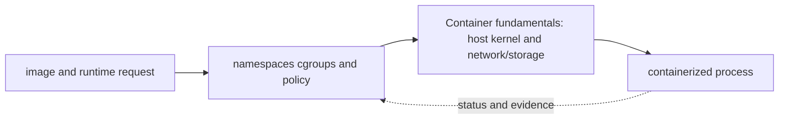
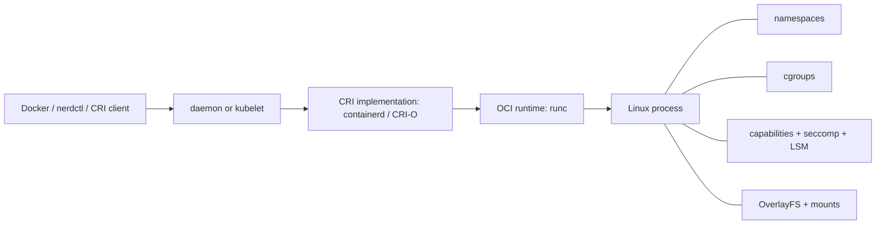

# Container fundamentals

<!-- chapter-guide:start -->
> **Step 048 of 373 — 05**
>
> **Builds on:** [Git security](../04-git-delivery/06-git-security/README.md)
>
> **Now:** Learn **Container fundamentals** from its mental model through production ownership.
>
> **Then:** Rehearse the linked questions and continue to [Container internals](01-container-internals/README.md).
<!-- chapter-guide:end -->

<!-- explanation-practice-normalizer:v1 -->


## Explanation

### What this chapter is and why it exists

**Container fundamentals** is easiest to understand as one part of a larger path. The subject combines an immutable image with an ordinary host process constrained by namespaces, cgroups, capabilities, seccomp, mounts and network setup. A container is isolation and packaging, not a separate kernel or a complete security boundary.

The chapter focuses on Container fundamentals. These are connected mechanisms, not vocabulary to memorize. The containers branch explains how images, runtime configuration and Linux isolation create a portable process environment and where that boundary can fail The explanations below first build the simple model, then add the exact system behavior and production consequences.

### History and evolution

Container isolation did not begin with Docker. Unix `chroot`, FreeBSD jails, Linux namespaces and cgroups gradually supplied filesystem, identity and resource boundaries; Docker made image-based workflows popular in 2013, and the OCI later standardized image and runtime contracts.

In this chapter, **Container fundamentals** is the next layer of that evolution. Its modern purpose is to the containers branch explains how images, runtime configuration and Linux isolation create a portable process environment and where that boundary can fail. The exact product surface may change by version, but the underlying state, request path and failure boundaries remain the durable ideas to learn.

### How the complete branch works



A branch overview connects child mechanisms into one lifecycle. The input crosses identity and policy, a control or decision plane, the runtime data path and its dependencies before producing a user-visible result. Status and telemetry travel back through the loop so operators and controllers can correct drift or failure. Reading the child chapters adds precision, but this overview explains why those chapters depend on one another.

A useful test of understanding is to trace one concrete request or change from origin to outcome and name the authoritative state at each boundary. That trace reveals where work is synchronous or asynchronous, which failure domains are independent, what a timeout can prove, and which evidence distinguishes accepted intent from healthy behavior.

### Easy mode: the mental model

A container is a normal host process with isolated views (namespaces), resource accounting/limits (cgroups), constrained privileges (capabilities/seccomp/LSM) and a layered root filesystem. An image is an OCI content-addressed manifest/config/layer graph; a registry distributes it. The runtime unpacks an image and asks a low-level runtime to create the process. Containers do not contain a kernel.



Namespaces isolate PID, mount, network, IPC, UTS, user and cgroup views. Cgroups v2 organize CPU, memory, I/O and process limits. OverlayFS combines immutable image layers with a writable container layer; volumes/bind mounts bypass that layer. A capability is a sliced kernel privilege; seccomp limits syscalls; SELinux/AppArmor constrain object access.

### Image construction: easy to production

Bad image:

```dockerfile
FROM ubuntu:latest
COPY . /app
RUN apt-get update && apt-get install -y python3 python3-pip
RUN pip3 install -r /app/requirements.txt
CMD python3 /app/app.py
```

Problems: mutable base, huge context, cache invalidation, package indexes retained, root runtime, shell-form signal handling, unpinned dependencies and secrets possibly copied.

Production-oriented Python example:

```dockerfile
# syntax=docker/dockerfile:1.7
FROM python:3.12.4-slim@sha256:REPLACE_WITH_VERIFIED_DIGEST AS build
ENV PIP_DISABLE_PIP_VERSION_CHECK=1 PIP_NO_CACHE_DIR=1
WORKDIR /src

RUN --mount=type=cache,target=/root/.cache/pip \
    python -m venv /venv
ENV PATH=/venv/bin:$PATH
COPY requirements.txt requirements.lock ./
RUN --mount=type=cache,target=/root/.cache/pip \
    pip install --require-hashes -r requirements.lock
COPY pyproject.toml ./
COPY src ./src
RUN pip install --no-deps .

FROM python:3.12.4-slim@sha256:REPLACE_WITH_VERIFIED_DIGEST
ENV PATH=/venv/bin:$PATH PYTHONUNBUFFERED=1
RUN groupadd --gid 10001 app && useradd --uid 10001 --gid app --no-create-home app
COPY --from=build /venv /venv
USER 10001:10001
WORKDIR /app
EXPOSE 8080
STOPSIGNAL SIGTERM
ENTRYPOINT ["python", "-m", "my_service"]
```

`.dockerignore`:

```gitignore
.git
.env*
**/__pycache__
**/*.pyc
.venv
tests
dist
secrets
```

Build and inspect:

```bash
docker buildx build --platform linux/amd64,linux/arm64 \
  --provenance=true --sbom=true -t registry.example/app:1.4.2 --push .

docker image inspect registry.example/app:1.4.2
docker history --no-trunc registry.example/app:1.4.2
docker buildx imagetools inspect registry.example/app:1.4.2
docker run --rm --entrypoint /bin/sh registry.example/app:1.4.2 -c 'id; cat /etc/os-release'
```

Use secret/cache mounts during build; never `ARG`/`COPY` long-lived secrets because layers/metadata can retain them. Pin base digests but automate digest updates and rebuilds. A multi-architecture tag points to a manifest index; each platform has a distinct digest.

### Runtime configuration and lifecycle

`ENTRYPOINT` defines the executable; `CMD` supplies default arguments. JSON/exec form makes the process PID 1 and receives signals directly. PID 1 has special signal/zombie behavior; use an init when the application does not reap children. On stop, runtime sends configured signal, waits grace, then kills. Applications must stop accepting work, drain, flush/checkpoint within the deadline and exit.

```bash
docker run --name api --read-only --tmpfs /tmp:rw,noexec,nosuid,size=64m \
  --user 10001:10001 --cap-drop ALL --security-opt no-new-privileges \
  --memory 512m --cpus 1.5 --pids-limit 256 \
  --health-cmd 'wget -qO- http://127.0.0.1:8080/ready || exit 1' \
  --env-file runtime.env -p 127.0.0.1:8080:8080 \
  registry.example/app@sha256:VERIFIED_DIGEST

docker inspect api
docker stats --no-stream api
docker logs --since 10m --timestamps api
docker exec -it api sh
docker top api
docker stop --time 30 api
```

CPU limits are scheduler bandwidth, memory limits can cause cgroup OOM, and writable-layer quotas vary. Health checks should be cheap and separate liveness from dependency readiness at an orchestrator. Restart policies can turn a deterministic crash into a noisy loop.

### Networking and storage

A bridge network connects container veth interfaces through a host bridge and NAT/port publishing. Host networking shares the host stack. Overlay networks encapsulate between nodes. DNS/service discovery is runtime/orchestrator-specific.

```bash
docker network create --subnet 172.28.0.0/16 appnet
docker run -d --name db --network appnet postgres:16
docker run --rm --network appnet nicolaka/netshoot dig db
nsenter -t "$(docker inspect -f '{{.State.Pid}}' db)" -n ip addr
ss -lntp
```

Writable layers disappear with the container and perform poorly for some write workloads. Named volumes have runtime-managed locations/lifecycle; bind mounts expose host paths and security semantics. Back up application-consistently, not by copying live database files blindly.

```bash
docker volume create pgdata
docker run -d --name db --mount type=volume,src=pgdata,dst=/var/lib/postgresql/data postgres:16
docker inspect db --format '{{json .Mounts}}'
docker system df -v
```

### Registry and supply-chain controls

Pipeline: source commit → hermetic build → tests → SBOM → vulnerability/license/policy scan → signature/provenance → immutable digest → promotion → admission verification → runtime monitoring. A tag is mutable unless registry policy prevents it; production should record the digest.

```bash
skopeo inspect docker://registry.example/app:1.4.2
crane digest registry.example/app:1.4.2
syft registry.example/app:1.4.2 -o spdx-json
grype registry.example/app:1.4.2
cosign verify --certificate-identity-regexp 'https://github.com/example/repo/' \
  --certificate-oidc-issuer https://token.actions.githubusercontent.com \
  registry.example/app@sha256:DIGEST
```

### Hard-mode debugging

```bash
# Runtime/process
docker inspect CONTAINER | jq '.[0].State, .[0].HostConfig'
docker events --since 30m
nsenter -t PID -p -m -n -u -i sh

# cgroups v2 examples (exact path varies)
cat /sys/fs/cgroup/.../memory.events
cat /sys/fs/cgroup/.../cpu.stat
cat /proc/PID/status
cat /proc/PID/limits

# containerd / Kubernetes node
crictl ps -a
crictl inspect CONTAINER_ID
crictl logs CONTAINER_ID
ctr -n k8s.io images list
journalctl -u containerd -u kubelet --since '-30 min'
```

Debug path: image/architecture/digest → entrypoint/config/secret → process/signal → cgroup/host pressure → mount/permissions/full disk → namespace/DNS/route/firewall → registry/auth/certificate → runtime logs. Prefer an ephemeral debug container/toolbox to modifying a minimal production image.

### Revision summary

- Containers are isolated/constrained host processes; images are OCI content graphs.
- Build minimal reproducible multi-stage images and run by immutable digest.
- PID 1, signals, cgroups, mounts and network namespaces explain many failures.
- Registry scanning is not enough: provenance, signing, admission and runtime policy matter.
- Debug the host/runtime boundary with `crictl`, `nsenter`, cgroups and logs.

### Read further

- [Open Container Initiative](https://opencontainers.org/) — upstream image, runtime and distribution specifications and projects; confirm the specification/runtime versions assumed by an example.

## Practice

### Real-world lab

Build the sample image, run it rootless/read-only, send traffic, stop it during a long request, observe signal/drain, lower memory until OOM, inspect `memory.events`, fill `/tmp`, test DNS on an isolated bridge, scan/sign by digest, then document which control prevented each failure from becoming supply-chain or production risk.

Cleanup: stop and remove only the named lab containers, network, volumes and locally built image; verify the runtime inventory and disk usage returned to baseline. Record latency, restarts, resource pressure and image size so reliability, observability and cost claims are evidence-based.

### Practice objective

Build a small, safe proof of **Container fundamentals** and explain the result in your own words. The goal is not command completion; it is to connect input, internal mechanism, observable state and user outcome.

### Prerequisites and setup

Use a disposable local environment, sandbox account/project or isolated namespace. Confirm the effective identity and target, record the start time, and set a cost limit before creating anything.

Record tool and platform versions because flags, APIs and defaults can change. Define every uppercase placeholder before use and keep secrets out of shell history and committed files.

### Activity 1: establish a healthy baseline

Run the read-oriented example first:

```bash
docker image inspect IMAGE
docker inspect CONTAINER
docker stats --no-stream CONTAINER
```

For each line, write down the layer it inspects, the expected healthy field or response, and one thing it cannot prove. The expected result is an attributable request against the intended target plus enough state to draw the path from input to outcome.

### Activity 2: create or review the smallest working example

Put the smallest relevant command, configuration, manifest or code sample in source control. Validate or lint it, produce a preview/diff where the tool supports one, and apply only inside the disposable boundary. Record the exact revision and resulting resource or process ID. If the topic is observational rather than configurable, save a sanitized baseline and an automated assertion instead of mutating the system.

### Activity 3: controlled failure and troubleshooting

Introduce one bounded failure: use a definitely nonexistent resource name, an invalid sandbox-only value, a denied test identity, a closed test port or a stopped disposable dependency. Capture the exact error and classify it as identity/policy, input/configuration, control-plane reconciliation, network/protocol, dependency or capacity. Test one discriminating hypothesis at a time; do not widen access or restart unrelated components.

Expected failure evidence is a specific non-zero exit, status/reason, event or protocol response that disappears when the controlled fault is removed. If healthy and failing runs look identical, the chosen signal does not explain the phenomenon and the exercise is not complete.

### Verification

Repeat the original client or user-facing check, not only an administrative status command. Confirm the desired revision, data correctness where applicable, error and latency recovery, and absence of a continuing retry/backlog/saturation condition. Explain why this evidence proves recovery and what uncertainty remains.

### Cleanup and rollback

Revert the configuration in its source of truth and review the rollback diff before applying it. Delete only the named sandbox resources, stop disposable processes, remove temporary credentials and verify that no billable resource, volume, artifact, queue item or background job remains. Read-only activities require no infrastructure rollback, but sanitized captures must still follow retention policy.

### Harder extension

Automate the healthy and failing paths in CI, use short-lived identity, add one SLI/alert or policy assertion, and write a five-step runbook another engineer can execute without hidden context. Then explain how the design changes for two tenants, a zonal or dependency failure, 10× load and a strict cost or recovery target.

<!-- reading-navigation:start -->
---

**Reading path:** [← Back: Git security](../04-git-delivery/06-git-security/README.md) · [Questions](questions-and-answers.md) · [Next: Container internals →](01-container-internals/README.md)

<!-- reading-navigation:end -->
