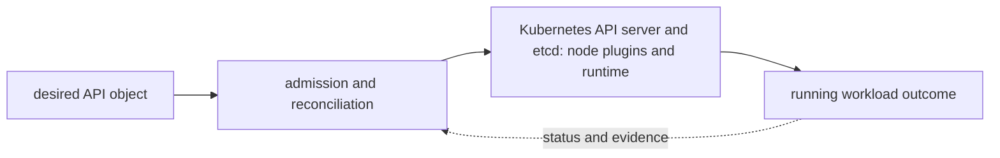

# Kubernetes API server and etcd

<!-- chapter-guide:start -->
> **Step 058 of 373 — 06.01.01**
>
> **Builds on:** [Architecture](../README.md)
>
> **Now:** Learn **Kubernetes API server and etcd** from its mental model through production ownership.
>
> **Then:** Rehearse the linked questions and continue to [Scheduler, controllers and kubelet](../02-scheduler-controllers-kubelet/README.md).
<!-- chapter-guide:end -->

> Interview bank: [questions-and-answers.md](questions-and-answers.md) · Official documentation: <https://kubernetes.io/docs/concepts/overview/kubernetes-api/>

## Explanation

### What it is and why it exists

**Kubernetes API server and etcd** is easiest to understand as one part of a larger path. The subject is governed through an API-driven feedback system. A client writes desired state, controllers compare it with observed state, the scheduler chooses placement, and node agents and plugins produce the running data plane.

The chapter focuses on API groups/versions, Request path, Watch, ResourceVersion. These are connected mechanisms, not vocabulary to memorize. Operate the authoritative API, admission/storage path and consistent etcd quorum under bounded load The explanations below first build the simple model, then add the exact system behavior and production consequences.

### History and evolution

Kubernetes grew from lessons learned running large fleets at Google and was released as open source in 2014. It joined the CNCF as its first project and evolved from basic container scheduling into an extensible API and reconciliation platform with standardized networking, storage, policy and custom-resource interfaces.

In this chapter, **Kubernetes API server and etcd** is the next layer of that evolution. Its modern purpose is to operate the authoritative API, admission/storage path and consistent etcd quorum under bounded load. The exact product surface may change by version, but the underlying state, request path and failure boundaries remain the durable ideas to learn.

### How it works: the end-to-end path



The diagram is a feedback loop rather than a one-way provisioning sequence. A caller supplies identity and intent; the control plane validates and records that intent; asynchronous controllers, runtimes or managed infrastructure create the effective data plane; and status and telemetry feed the next decision. A successful API response can therefore mean only "the request was accepted," not "the workload outcome is healthy."

For **Kubernetes API server and etcd**, the mechanisms participating in that loop are API groups/versions, Request path, Watch, ResourceVersion, Server-side apply, etcd quorum, Compaction, Defragmentation, Encryption at rest, API priority/fairness. Some run synchronously on the caller's request, while others converge later. This timing distinction explains many production surprises: the desired object can exist before capacity is ready, a data path can continue while its control plane is impaired, and a timeout can leave the final side effect unknown.

### Core concepts explained in detail

#### API groups/versions

**What it is.** Kubernetes API groups organize related resource kinds and versions define the schema contract served to clients. A served version can differ from the storage version used in etcd, with conversion translating between them.

**Junior mental model.** Think of API versions as supported editions of a form: clients may submit an older or newer edition, while the records office keeps one canonical internal edition.

**How it works.** The API server resolves group, version and resource from the URL, decodes and validates that schema, defaults fields and converts the object to an internal representation. Before persistence it converts to the configured storage version; reads reverse the conversion for the requested served version. CRDs can use conversion webhooks when schemas differ materially.

**What it looks like in production.** Discovery endpoints and CRD/APIService status show what is served; `status.storedVersions` and deprecation metrics reveal migration work. Removing a served version before clients/manifests/controllers migrate causes request failure, while leaving old stored objects can break later conversion or rollback plans.

#### Request path

**What it is.** The Kubernetes API request path is the ordered chain that turns an HTTPS request into an authorized, admitted and persisted object or a precise rejection.

**Junior mental model.** It is a guarded records office: prove identity, check authority, apply controlled edits, validate the final form, then commit it to the ledger.

**How it works.** After TLS termination and request parsing, authentication establishes user and groups; authorization evaluates the verb/resource/name/namespace; mutating admission can change the object; schema defaulting and validation establish a valid representation; validating admission enforces final policy; the registry layer applies concurrency and persistence through etcd. Audit stages can record receipt, response start and completion.

**What it looks like in production.** HTTP status, audit events, admission messages, API latency histograms and etcd metrics localize failure. Webhook timeouts or broad failure-closed policies can block unrelated writes, while failure-open can bypass policy, so webhook scope, timeout and availability are production design decisions.

#### Watch

**What it is.** A Kubernetes watch is a long-lived API stream of resource changes after a known revision. Controllers use list-then-watch to maintain a local cache without repeatedly listing every object.

**Junior mental model.** It resembles subscribing to ledger updates after taking an initial snapshot: the snapshot gives current state and the update stream keeps the local copy current.

**How it works.** A client lists objects and records the returned `resourceVersion`, starts a watch from that revision, then processes ADDED, MODIFIED, DELETED and BOOKMARK events. Client libraries relist or resume after disconnect. etcd compaction eventually removes old revisions, so a client that falls too far behind receives an expired-resource response and must rebuild its cache.

**What it looks like in production.** Watch count, event rate, cache/list latency and client relist loops reveal health. Slow consumers, oversized objects, very broad watches and synchronized relists can overload the API server and etcd even when ordinary point reads still succeed.

#### ResourceVersion

**What it is.** `resourceVersion` is Kubernetes' opaque concurrency and change-stream token for an observed object or collection state. It is not a wall-clock timestamp, generation number or value applications should numerically interpret.

**Junior mental model.** Treat it like a receipt number from the storage timeline: it lets the API detect whether you are updating the version you actually read and tells a watch where to continue.

**How it works.** The API server returns the token on reads and lists. A conditional update includes the last observed value; if another writer changed the object, optimistic concurrency rejects the stale update. Watches use a collection revision to request later events, subject to cache and compaction semantics.

**What it looks like in production.** Conflicts are normal evidence of concurrent writers and should trigger read-modify-retry with bounded logic, not forced overwrite. Expired versions require relist; copying tokens between unrelated objects or treating them as timestamps leads to incorrect ordering assumptions.

#### Server-side apply

**What it is.** Server-side apply is Kubernetes' declarative merge mechanism that records which field manager owns each field and reports conflicts when another manager tries to change owned intent.

**Junior mental model.** It is shared-document editing with named owners for individual fields rather than one owner for the entire file.

**How it works.** A client sends an apply patch with a field-manager name. The API server compares the submitted field set with `managedFields`, merges associative structures using the schema, removes fields that manager previously owned but now omitted and rejects conflicting changes unless ownership is deliberately forced.

**What it looks like in production.** Inspect `metadata.managedFields` and conflict responses to find competing controllers or tools. Reusing one manager name across unrelated automation hides ownership; forcing conflicts can steal fields from an active controller and cause an endless reconciliation fight.

#### etcd quorum

**What it is.** An etcd quorum is the majority of voting members required for Raft to elect a leader and commit writes. In a three-member cluster, two members form quorum; losing two preserves data on disk but stops consistent progress.

**Junior mental model.** It is a committee rule: a proposal becomes official only after a majority records it, so any two majorities overlap and cannot approve conflicting histories.

**How it works.** The leader appends a log entry and replicates it to followers; after a majority acknowledges durable log state, the entry commits and the state machine applies it. Leader election also requires majority communication. Adding members increases fault tolerance only at particular odd sizes and increases replication latency and operational complexity.

**What it looks like in production.** Endpoint status, leader changes, proposal latency/failures and peer network/disk latency show health. Spreading members across unreliable high-latency links, losing quorum during maintenance or restoring members independently can threaten availability or consistency; recovery follows the documented snapshot/member procedure.

#### Compaction

**What it is.** etcd compaction discards old MVCC history before a selected revision while retaining current key values. It bounds historical revision growth but means a watch cannot resume from a compacted revision.

**Junior mental model.** It is removing old ledger pages after keeping the latest balance: current truth remains, but a subscriber that last read an old page must request a fresh snapshot.

**How it works.** etcd stores multiple key revisions. Periodic or explicit compaction marks older revisions unavailable; later backend maintenance can reclaim physical space. Kubernetes clients that receive an expired revision relist current objects and restart their watch from the new list revision.

**What it looks like in production.** Revision age, database size, watch expiry/relist rate and API list load must be considered together. Compacting does not immediately shrink the backend file, and overly slow clients can cause expensive relist storms after their revision disappears.

#### Defragmentation

**What it is.** etcd defragmentation rewrites the backend database to release free pages left after deletes and compaction. Compaction removes logical history; defragmentation is the separate physical space-reclamation step.

**Junior mental model.** Compaction crosses old entries out of a ledger; defragmentation copies the remaining entries into a clean, smaller book.

**How it works.** The member rebuilds its backend file without unused pages. Defragmentation is performed per member and can block that member's reads and writes while it runs, so healthy quorum, load, free disk and member order matter.

**What it looks like in production.** Compare logical database use with allocated backend size and watch request latency during maintenance. Running all members simultaneously or waiting until disk is nearly full can turn routine maintenance into control-plane unavailability.

#### Encryption at rest

**What it is.** Kubernetes encryption at rest transforms selected API resource values before the API server stores them in etcd. It protects raw etcd data or snapshots from directly revealing those values but does not prevent an authorized API read.

**Junior mental model.** It is an encrypted filing cabinet behind the API desk: stealing the cabinet contents is harder, while a clerk with permission can still retrieve and decrypt a record.

**How it works.** The API server evaluates encryption providers in configuration order. The first provider writes new data and matching providers can read older ciphertext; envelope KMS providers use an external key service for key protection. Changing configuration affects new writes, so existing objects require a controlled rewrite to migrate ciphertext.

**What it looks like in production.** Test key availability, rotation, API read/write behavior and snapshot recovery. Losing key access can make the control plane unable to read protected objects; leaving `identity` first silently stores plaintext, and encrypting secrets does not fix overly broad RBAC or secret exposure in workloads and logs.

#### API priority/fairness

**What it is.** API Priority and Fairness classifies Kubernetes API requests into priority levels and flow queues so a noisy client cannot consume every API-server concurrency slot.

**Junior mental model.** It is a multi-lane service desk: emergency control traffic receives protected capacity, while callers within a class share queues instead of one caller occupying every clerk.

**How it works.** Flow schemas match request attributes and assign a priority level. The API server queues requests into shuffled subqueues, executes them within the level's concurrency share and rejects excess waiting after limits. Long-running watches receive special treatment because their concurrency behavior differs from short mutating requests.

**What it looks like in production.** Observe queue length, wait duration, rejected requests and per-flow classification together with client retry behavior. Incorrect broad matches can starve critical controllers, while aggressive retries after 429 responses can defeat fairness and increase control-plane load.

### Worked command and configuration example

The following is a diagnostic example, not an unexplained command dump. Define every uppercase placeholder first—for example `NAME`, `RESOURCE`, `PROJECT`, `REGION`, `NAMESPACE`, `URL`, `IMAGE` or `CONTAINER`—and use a sandbox or read-only production role.

```bash
kubectl get --raw '/readyz?verbose'
kubectl get --raw '/metrics' | rg 'apiserver|etcd'
kubectl api-resources
ETCDCTL_API=3 etcdctl endpoint status --cluster -w table
```

What the example demonstrates:

- `kubectl get --raw '/readyz?verbose'` reads Kubernetes API desired/status state or recent reconciliation evidence without treating a single `Ready` value as proof of the user journey.
- `kubectl get --raw '/metrics' | rg 'apiserver|etcd'` reads Kubernetes API desired/status state or recent reconciliation evidence without treating a single `Ready` value as proof of the user journey.
- `kubectl api-resources` reads Kubernetes API desired/status state or recent reconciliation evidence without treating a single `Ready` value as proof of the user journey.
- `ETCDCTL_API=3 etcdctl endpoint status --cluster -w table` captures a read-oriented state snapshot that must be interpreted against a healthy baseline, the exact target and the next adjacent dependency.

A healthy run returns the intended identity/context, exits successfully and shows the expected object or response without a new warning, retry loop or saturation signal. A failure is useful evidence: preserve the exact exit code, status/reason, timestamp and target, then inspect the immediately adjacent layer before changing anything. This makes the example part of the explanation of **Kubernetes API server and etcd**, not merely a list to copy.

### Security and trust boundaries

Security begins with the actor and the exact operation, not with a network location. Human, workload, CI and service identities have different lifecycles; every hop must authenticate the relevant identity and authorize the action against the resource and current conditions. Network controls reduce reachable paths, while resource policy and application authorization decide what an already-reachable caller may do. Encryption protects data in transit or at rest, but key access, rotation, revocation and recovery are part of the same system.

The safe design minimizes public paths, long-lived credentials, wildcard permissions and implicit cross-tenant trust. It also protects the evidence plane: audit logs, traces and command history must not become a second copy of secrets or customer content. A production review should be able to identify the enforcement point, default behavior, bypass path, break-glass owner and proof that revoked access actually stops working.

### Reliability and failure behavior

Availability is an end-to-end property. The service depends on identity, quota, API/control-plane health, DNS and network paths, capacity, downstream services and any durable state required to recover. Replicas improve availability only when they occupy independent failure domains and clients can reach a healthy replica; a managed-service label does not remove customer responsibility for configuration, load, data correctness or recovery testing.

Timeouts, bounded retry budgets with jitter, idempotency, backpressure, load shedding and graceful drain control how failures spread. They must match the protocol and side-effect model. A timeout is ambiguous because the remote operation may have completed; blind retry is unsafe when the operation is not idempotent. Recovery is complete only when the original user action works and data, latency, error rate and backlog have returned to acceptable bounds.

### Performance, scaling and cost

Capacity planning starts with a work unit and a distribution, not an average utilization percentage. Relevant signals include request or job arrival rate, work size, latency percentiles, errors, queue age, saturation and service-specific limits. Scaling application replicas and provisioning underlying nodes, storage or provider quota are separate feedback loops with different delays. Cold starts and warm-up determine whether newly allocated capacity helps before the burst is over.

Total cost includes idle headroom, request or token work, storage and retention, cross-zone or cross-Region transfer, NAT/egress, observability, licenses and recovery capacity. The useful optimization target is cost per successful SLO- or quality-controlled outcome. A cheaper configuration that increases retries, operator toil, data risk or missed objectives can raise total cost.

### Observability and troubleshooting

Diagnosis follows the same path as the request. First establish time, user impact, identity and exact target; then compare desired configuration with observed status and recent changes. Continue through control-plane reconciliation, network and protocol evidence, runtime state, dependencies and resource saturation. Metrics show trends, logs explain discrete events, traces connect boundaries, profiles attribute resource use and audit logs explain security decisions.

The most useful next check is the one that distinguishes competing causes. A permission denial calls for policy-evaluation evidence, not a restart; a connection refusal means something different from a timeout; a pending resource with a scheduling reason differs from a running resource whose application is unready. Reversible mitigation stabilizes impact, while the durable repair updates Git, IaC, policy or the owning service and adds a regression test or alert.

### What you should be able to explain

Use this table only after reading the explanations above. It is a revision checklist, not a substitute for the lesson.

| # | Concept | What you must be able to explain |
|---:|---|---|
| 1 | **API groups/versions** | resource kinds evolve through served/storage versions and conversion |
| 2 | **Request path** | authentication, authorization, mutating admission, schema/defaulting, validating admission and persistence |
| 3 | **Watch** | streams resource changes from a revision and powers controllers efficiently |
| 4 | **ResourceVersion** | identifies observed revisions for concurrency/watch rather than a user timestamp |
| 5 | **Server-side apply** | merges declarative fields by field manager and reports ownership conflicts |
| 6 | **etcd quorum** | majority of voting members is required for writes and consistent operation |
| 7 | **Compaction** | removes old MVCC revisions so watches must restart when too old |
| 8 | **Defragmentation** | reclaims backend file space after compaction under operational care |
| 9 | **Encryption at rest** | protects selected API resource values with key/provider lifecycle |
| 10 | **API priority/fairness** | queues/shares requests to protect critical flows from noisy clients |

### Common interview traps

- Naming a feature without explaining request/resource lifecycle or failure semantics.
- Treating an allow, encryption checkbox, replica count or managed-service label as a complete security/reliability design.
- Mutating production before capturing identity, status, events, metrics, logs, audit and recent changes.
- Scaling the wrong layer or retrying overload/permanent errors.
- Omitting quotas, cold start, deletion/restore, observability cost or customer/tenant boundaries.

## Practice

### Practice objective

Build a small, safe proof of **Kubernetes API server and etcd** and explain the result in your own words. The goal is not command completion; it is to connect input, internal mechanism, observable state and user outcome.

### Prerequisites and setup

Use a disposable local environment, sandbox account/project or isolated namespace. Confirm the effective identity and target, record the start time, and set a cost limit before creating anything.

Record tool and platform versions because flags, APIs and defaults can change. Define every uppercase placeholder before use and keep secrets out of shell history and committed files.

### Activity 1: establish a healthy baseline

Run the read-oriented example first:

```bash
kubectl get --raw '/readyz?verbose'
kubectl get --raw '/metrics' | rg 'apiserver|etcd'
kubectl api-resources
ETCDCTL_API=3 etcdctl endpoint status --cluster -w table
```

For each line, write down the layer it inspects, the expected healthy field or response, and one thing it cannot prove. The expected result is an attributable request against the intended target plus enough state to draw the path from input to outcome.

### Activity 2: create or review the smallest working example

Put the smallest relevant command, configuration, manifest or code sample in source control. Validate or lint it, produce a preview/diff where the tool supports one, and apply only inside the disposable boundary. Record the exact revision and resulting resource or process ID. If the topic is observational rather than configurable, save a sanitized baseline and an automated assertion instead of mutating the system.

### Activity 3: controlled failure and troubleshooting

Introduce one bounded failure: use a definitely nonexistent resource name, an invalid sandbox-only value, a denied test identity, a closed test port or a stopped disposable dependency. Capture the exact error and classify it as identity/policy, input/configuration, control-plane reconciliation, network/protocol, dependency or capacity. Test one discriminating hypothesis at a time; do not widen access or restart unrelated components.

Expected failure evidence is a specific non-zero exit, status/reason, event or protocol response that disappears when the controlled fault is removed. If healthy and failing runs look identical, the chosen signal does not explain the phenomenon and the exercise is not complete.

### Verification

Repeat the original client or user-facing check, not only an administrative status command. Confirm the desired revision, data correctness where applicable, error and latency recovery, and absence of a continuing retry/backlog/saturation condition. Explain why this evidence proves recovery and what uncertainty remains.

### Cleanup and rollback

Revert the configuration in its source of truth and review the rollback diff before applying it. Delete only the named sandbox resources, stop disposable processes, remove temporary credentials and verify that no billable resource, volume, artifact, queue item or background job remains. Read-only activities require no infrastructure rollback, but sanitized captures must still follow retention policy.

### Harder extension

Automate the healthy and failing paths in CI, use short-lived identity, add one SLI/alert or policy assertion, and write a five-step runbook another engineer can execute without hidden context. Then explain how the design changes for two tenants, a zonal or dependency failure, 10× load and a strict cost or recovery target.

<!-- reading-navigation:start -->
---

**Reading path:** [← Back: Architecture](../README.md) · [Questions](questions-and-answers.md) · [Next: Scheduler, controllers and kubelet →](../02-scheduler-controllers-kubelet/README.md)

<!-- reading-navigation:end -->
