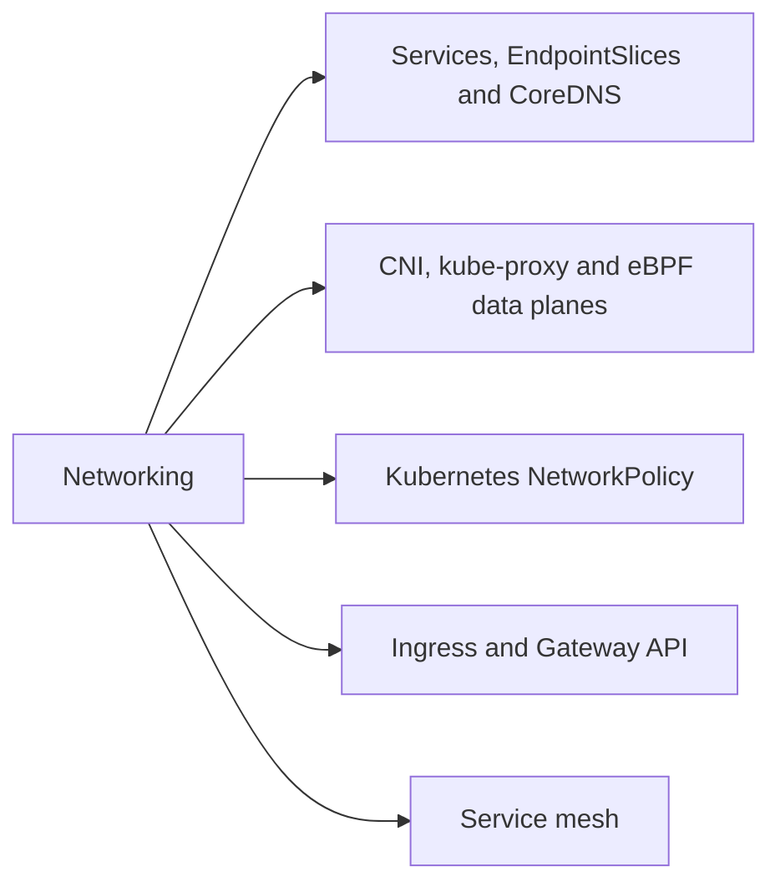
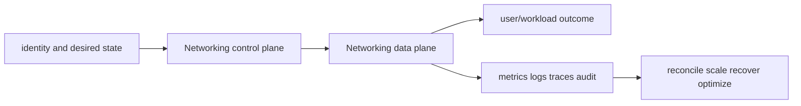

# Networking

<!-- chapter-guide:start -->
> **Step 066 of 373 — 06.03**
>
> **Builds on:** [Probes and container lifecycle](../02-workloads/05-probes-lifecycle/README.md)
>
> **Now:** Learn **Networking** from its mental model through production ownership.
>
> **Then:** Rehearse the linked questions and continue to [Services, EndpointSlices and CoreDNS](01-services-endpoints-dns/README.md).
<!-- chapter-guide:end -->

This branch README is both the study note and the map. Each service leaf keeps its notes in its own README and its answered interview bank in a separate file.




## Branch learning contract

Learn the easy mental model first, run the read-only commands in a sandbox, render/apply the examples only in disposable environments, then break and repair one dependency at a time. Be able to connect these topics across the branch: ClusterIP, NodePort, LoadBalancer, Kubernetes network model, CNI plugin, IPAM, Pod selection, Isolation direction, Additive policy, IngressClass/controller, Ingress rule, GatewayClass, Data-plane proxy, Control plane, Workload identity.

## Branch interview bank

See [questions-and-answers.md](questions-and-answers.md) for 60 additional branch-level questions and answers. Service-specific banks contain another 60 per service.

> Interview bank: [questions-and-answers.md](questions-and-answers.md) · Official documentation: <https://kubernetes.io/docs/concepts/services-networking/service/>

## Easy mode: purpose and mental model

Integrate the networking branch as one production capability rather than isolated products.



## Detailed learning notes

| # | Concept | What you must be able to explain |
|---:|---|---|
| 1 | **ClusterIP** | virtual internal IP implemented by the cluster service data plane. |
| 2 | **NodePort** | reserves a port on nodes and routes to Service endpoints. |
| 3 | **Kubernetes network model** | Pods have cluster-routable IP identity and communicate without required NAT inside the model. |
| 4 | **CNI plugin** | configures Pod interface, address, route and cleanup when runtime creates sandbox. |
| 5 | **Pod selection** | policy applies only to Pods matched in its namespace. |
| 6 | **Isolation direction** | selecting a Pod for ingress/egress isolates that direction to allowed union. |
| 7 | **IngressClass/controller** | selects implementation and controller-specific features. |
| 8 | **Ingress rule** | host/path routes HTTP(S) to a Service backend under limited portable API. |
| 9 | **Data-plane proxy** | sidecar/ambient/node proxy intercepts workload traffic under mode-specific boundaries. |
| 10 | **Control plane** | distributes service discovery, certificates and policy to proxies. |

## Architecture and lifecycle

Trace this service from request/authentication and desired configuration through provisioning, steady-state data path, scaling, change, failure, recovery and retirement. Bind every production resource to an owner, environment, data classification, source-of-truth revision, SLO, runbook, cost center and deletion/retention policy.

For Networking, draw a real request/resource path and label where these mechanisms act: ClusterIP, NodePort, Kubernetes network model, CNI plugin, Pod selection, Isolation direction, IngressClass/controller, Ingress rule, Data-plane proxy, Control plane. State which parts are control plane versus data plane, regional versus zonal/global, synchronous versus asynchronous, and customer versus provider responsibility.

## Security model

Start with the caller/workload identity and evaluate every applicable identity, resource, organization, network-endpoint, encryption-key and admission policy. Minimize public paths, long-lived credentials, wildcard actions/resources and unreviewed cross-account/tenant trust. Encrypt in transit/at rest where applicable, but include key/certificate rotation and recovery. Protect audit evidence and prevent secrets/customer content from entering command history, logs, traces or metric labels.

## Availability and failure modes

List dependencies and failure domains before claiming high availability. Test quota/capacity, identity/control-plane, DNS/network/TLS, configuration drift, downstream saturation, zonal/Regional/node failure and recovery from protected state. Use bounded timeout, retry budget, jitter, idempotency, backpressure, load shedding and graceful drain according to protocol. A green resource status is not a user-facing recovery check.

## Performance, scaling and cost

Measure workload distribution and SLI before sizing. Track rate/work units, latency distribution, errors, saturation/queue and service-specific limits. Separate replica/task scaling from infrastructure/capacity scaling and include cold-start/provisioning delay. Cost includes idle/provisioned capacity, requests/work units, storage/retention, cross-AZ/Region/egress/NAT, observability, licenses/support and failure headroom. Optimize cost per successful SLO/quality-controlled task.

## Observability

Correlate a request/change across user, route/resource, dependency and underlying compute/storage/network. Use stable owner/environment/region/service dimensions; put high-cardinality request/object IDs in sampled logs/traces rather than metric labels. Alert on actionable SLO burn and leading exhaustion. Monitor the telemetry path and keep a read-only diagnostic role.

## Command lab

Run in a sandbox with the correct account/context/Region. Read and explain output before mutation.

```bash
kubectl get svc,endpoints,endpointslice -A -o wide
kubectl get ds -n kube-system
kubectl get networkpolicy -A -o yaml
kubectl get ingressclass,ingress,gatewayclass,gateway,httproute,grpcroute -A
kubectl get pods -A -o jsonpath='{range .items[*]}{.metadata.namespace}{"/"}{.metadata.name}{" "}{.spec.containers[*].name}{"\n"}{end}' | rg 'proxy'
```

For each command, record: identity/context, exact resource, expected healthy fields, one failing output, the next command/query, and which mutation would be reversible. Never paste secrets/tokens into committed notes or shared terminal history.

## Real-world exercise: easy → hard

1. **Easy:** inventory one healthy Networking resource and draw identity/control/data/dependency paths.
2. **Intermediate:** reproduce a safe configuration change with IaC, preview/diff, apply to a sandbox, verify and roll back.
3. **Hard:** inject one policy/network/quota/capacity/dependency failure, diagnose from user symptom to root mechanism, mitigate without widening access, then add an alert/test/runbook.
4. **Senior:** design the service for two tenants, multi-zone/Region failure, RPO/RTO, regulated data, 10× demand and a 30% cost reduction; quantify trade-offs.

## Common interview traps

- Naming a feature without explaining request/resource lifecycle or failure semantics.
- Treating an allow, encryption checkbox, replica count or managed-service label as a complete security/reliability design.
- Mutating production before capturing identity, status, events, metrics, logs, audit and recent changes.
- Scaling the wrong layer or retrying overload/permanent errors.
- Omitting quotas, cold start, deletion/restore, observability cost or customer/tenant boundaries.

## Revision summary

Explain Networking in five passes: purpose/selection, mechanism/lifecycle, security/failure, operation/commands, and architecture/economics. Then complete the separate [answered question bank](questions-and-answers.md) without looking at these notes.

<!-- reading-navigation:start -->
---

**Reading path:** [← Back: Probes and container lifecycle](../02-workloads/05-probes-lifecycle/README.md) · [Questions](questions-and-answers.md) · [Next: Services, EndpointSlices and CoreDNS →](01-services-endpoints-dns/README.md)

<!-- reading-navigation:end -->
