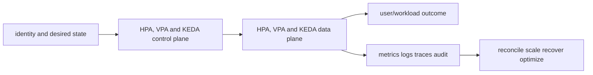

# HPA, VPA and KEDA

<!-- chapter-guide:start -->
> **Step 084 of 373 — 06.06.03**
>
> **Builds on:** [Affinity, taints and topology placement](../02-placement/README.md)
>
> **Now:** Learn **HPA, VPA and KEDA** from its mental model through production ownership.
>
> **Then:** Rehearse the linked questions and continue to [Cluster Autoscaler, Karpenter and node lifecycle](../04-node-autoscaling/README.md).
<!-- chapter-guide:end -->

> Interview bank: [questions-and-answers.md](questions-and-answers.md) · Official documentation: <https://kubernetes.io/docs/tasks/run-application/horizontal-pod-autoscale/>

## Easy mode: purpose and mental model

Scale replicas/resources from stable demand signals while avoiding feedback, metric loss and unsafe churn.



## Detailed learning notes

| # | Concept | What you must be able to explain |
|---:|---|---|
| 1 | **HPA ratio** | desired replicas derives current/target metric with tolerance and missing/not-ready handling. |
| 2 | **Resource utilization** | usage divided by requests means bad/missing requests break CPU/memory scaling. |
| 3 | **Custom/external metric** | adapter exposes application/provider signal with availability/cardinality semantics. |
| 4 | **HPA behavior** | stabilization and policies bound scale-up/down rate. |
| 5 | **VPA recommendation** | learns requests from usage history and can restart Pods to apply changes. |
| 6 | **VPA/HPA interaction** | both changing CPU requests/replicas can create feedback without design. |
| 7 | **KEDA trigger** | event source drives Scale subresource and supports activation/scale-to-zero. |
| 8 | **Queue age/depth** | leading demand signal but must account for service time/token work. |
| 9 | **Scale-to-zero** | cold start and missing metric/activation path must meet SLO. |
| 10 | **Downstream protection** | replica scale cannot exceed database/provider/tenant capacity. |

## Architecture and lifecycle

Trace this service from request/authentication and desired configuration through provisioning, steady-state data path, scaling, change, failure, recovery and retirement. Bind every production resource to an owner, environment, data classification, source-of-truth revision, SLO, runbook, cost center and deletion/retention policy.

For HPA, VPA and KEDA, draw a real request/resource path and label where these mechanisms act: HPA ratio, Resource utilization, Custom/external metric, HPA behavior, VPA recommendation, VPA/HPA interaction, KEDA trigger, Queue age/depth, Scale-to-zero, Downstream protection. State which parts are control plane versus data plane, regional versus zonal/global, synchronous versus asynchronous, and customer versus provider responsibility.

## Security model

Start with the caller/workload identity and evaluate every applicable identity, resource, organization, network-endpoint, encryption-key and admission policy. Minimize public paths, long-lived credentials, wildcard actions/resources and unreviewed cross-account/tenant trust. Encrypt in transit/at rest where applicable, but include key/certificate rotation and recovery. Protect audit evidence and prevent secrets/customer content from entering command history, logs, traces or metric labels.

## Availability and failure modes

List dependencies and failure domains before claiming high availability. Test quota/capacity, identity/control-plane, DNS/network/TLS, configuration drift, downstream saturation, zonal/Regional/node failure and recovery from protected state. Use bounded timeout, retry budget, jitter, idempotency, backpressure, load shedding and graceful drain according to protocol. A green resource status is not a user-facing recovery check.

## Performance, scaling and cost

Measure workload distribution and SLI before sizing. Track rate/work units, latency distribution, errors, saturation/queue and service-specific limits. Separate replica/task scaling from infrastructure/capacity scaling and include cold-start/provisioning delay. Cost includes idle/provisioned capacity, requests/work units, storage/retention, cross-AZ/Region/egress/NAT, observability, licenses/support and failure headroom. Optimize cost per successful SLO/quality-controlled task.

## Observability

Correlate a request/change across user, route/resource, dependency and underlying compute/storage/network. Use stable owner/environment/region/service dimensions; put high-cardinality request/object IDs in sampled logs/traces rather than metric labels. Alert on actionable SLO burn and leading exhaustion. Monitor the telemetry path and keep a read-only diagnostic role.

## Command lab

Run in a sandbox with the correct account/context/Region. Read and explain output before mutation.

```bash
kubectl get hpa -A
kubectl describe hpa NAME -n NS
kubectl get --raw /apis/custom.metrics.k8s.io/v1beta1 | jq
kubectl get scaledobject -A
kubectl get vpa -A
```

For each command, record: identity/context, exact resource, expected healthy fields, one failing output, the next command/query, and which mutation would be reversible. Never paste secrets/tokens into committed notes or shared terminal history.

## Real-world exercise: easy → hard

1. **Easy:** inventory one healthy HPA, VPA and KEDA resource and draw identity/control/data/dependency paths.
2. **Intermediate:** reproduce a safe configuration change with IaC, preview/diff, apply to a sandbox, verify and roll back.
3. **Hard:** inject one policy/network/quota/capacity/dependency failure, diagnose from user symptom to root mechanism, mitigate without widening access, then add an alert/test/runbook.
4. **Senior:** design the service for two tenants, multi-zone/Region failure, RPO/RTO, regulated data, 10× demand and a 30% cost reduction; quantify trade-offs.

## Common interview traps

- Naming a feature without explaining request/resource lifecycle or failure semantics.
- Treating an allow, encryption checkbox, replica count or managed-service label as a complete security/reliability design.
- Mutating production before capturing identity, status, events, metrics, logs, audit and recent changes.
- Scaling the wrong layer or retrying overload/permanent errors.
- Omitting quotas, cold start, deletion/restore, observability cost or customer/tenant boundaries.

## Revision summary

Explain HPA, VPA and KEDA in five passes: purpose/selection, mechanism/lifecycle, security/failure, operation/commands, and architecture/economics. Then complete the separate [answered question bank](questions-and-answers.md) without looking at these notes.

<!-- reading-navigation:start -->
---

**Reading path:** [← Back: Affinity, taints and topology placement](../02-placement/README.md) · [Questions](questions-and-answers.md) · [Next: Cluster Autoscaler, Karpenter and node lifecycle →](../04-node-autoscaling/README.md)

<!-- reading-navigation:end -->
