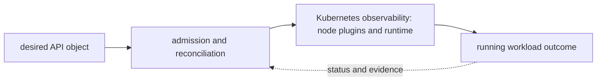

# Kubernetes observability

<!-- chapter-guide:start -->
> **Step 092 of 373 — 06.08.01**
>
> **Builds on:** [Operations](../README.md)
>
> **Now:** Learn **Kubernetes observability** from its mental model through production ownership.
>
> **Then:** Rehearse the linked questions and continue to [Kubernetes upgrades and API deprecations](../02-upgrades/README.md).
<!-- chapter-guide:end -->

> Interview bank: [questions-and-answers.md](questions-and-answers.md) · Official documentation: <https://kubernetes.io/docs/concepts/cluster-administration/system-metrics/>

## Explanation

### What it is and why it exists

**Kubernetes observability** is easiest to understand as one part of a larger path. The subject is governed through an API-driven feedback system. A client writes desired state, controllers compare it with observed state, the scheduler chooses placement, and node agents and plugins produce the running data plane.

The chapter focuses on kube-state-metrics, Metrics Server, kubelet/cAdvisor, Control-plane metrics. These are connected mechanisms, not vocabulary to memorize. Correlate API/control-plane, node, workload, network, storage and application signals without uncontrolled telemetry cost The explanations below first build the simple model, then add the exact system behavior and production consequences.

### History and evolution

Kubernetes grew from lessons learned running large fleets at Google and was released as open source in 2014. It joined the CNCF as its first project and evolved from basic container scheduling into an extensible API and reconciliation platform with standardized networking, storage, policy and custom-resource interfaces.

In this chapter, **Kubernetes observability** is the next layer of that evolution. Its modern purpose is to correlate API/control-plane, node, workload, network, storage and application signals without uncontrolled telemetry cost. The exact product surface may change by version, but the underlying state, request path and failure boundaries remain the durable ideas to learn.

### How it works: the end-to-end path



The diagram is a feedback loop rather than a one-way provisioning sequence. A caller supplies identity and intent; the control plane validates and records that intent; asynchronous controllers, runtimes or managed infrastructure create the effective data plane; and status and telemetry feed the next decision. A successful API response can therefore mean only "the request was accepted," not "the workload outcome is healthy."

For **Kubernetes observability**, the mechanisms participating in that loop are kube-state-metrics, Metrics Server, kubelet/cAdvisor, Control-plane metrics, Events, Audit log, Container logs, Network telemetry, Storage telemetry, Cardinality. Some run synchronously on the caller's request, while others converge later. This timing distinction explains many production surprises: the desired object can exist before capacity is ready, a data path can continue while its control plane is impaired, and a timeout can leave the final side effect unknown.

### Core concepts explained in detail

#### kube-state-metrics

**What it is.** Exposes object desired/status metrics rather than container usage.

**Junior mental model.** Telemetry is the instrument panel, not the system itself. Metrics summarize trends, logs preserve discrete context, traces connect work across boundaries, profiles attribute resource use, and audit events record security-relevant actions.

**How it works.** Instrumentation observes a defined event or state, attaches bounded context, transports the signal, stores it under retention rules and makes it queryable. A useful signal has documented semantics and can distinguish at least two competing explanations; correlation identifiers belong in logs or traces rather than unbounded metric labels.

**What it looks like in production.** Healthy evidence includes coverage of the user journey, known collection delay and actionable SLO or saturation views. Missing telemetry, sampling bias, cardinality explosions, sensitive payload capture and alert thresholds disconnected from user impact are failures of the observability system itself.

#### Metrics Server

**What it is.** Lightweight resource metrics for top/HPA, not a long-term monitoring backend.

**Junior mental model.** Telemetry is the instrument panel, not the system itself. Metrics summarize trends, logs preserve discrete context, traces connect work across boundaries, profiles attribute resource use, and audit events record security-relevant actions.

**How it works.** Instrumentation observes a defined event or state, attaches bounded context, transports the signal, stores it under retention rules and makes it queryable. A useful signal has documented semantics and can distinguish at least two competing explanations; correlation identifiers belong in logs or traces rather than unbounded metric labels.

**What it looks like in production.** Healthy evidence includes coverage of the user journey, known collection delay and actionable SLO or saturation views. Missing telemetry, sampling bias, cardinality explosions, sensitive payload capture and alert thresholds disconnected from user impact are failures of the observability system itself.

#### kubelet/cAdvisor

**What it is.** Node/container CPU/memory/filesystem/network metrics under version/runtime coverage.

**Junior mental model.** The simplest mental model is a state machine: an input is checked, current state is read, a rule computes the next state, and an observable result tells callers whether the transition succeeded.

**How it works.** The mechanism receives configuration or runtime input, validates preconditions, changes or derives state, and exposes status to the next component. Synchronous parts return a direct outcome; asynchronous parts need durable status, reconciliation and idempotency because the original caller may disappear.

**What it looks like in production.** Healthy evidence shows the expected state transition and its owner, timestamp and reason. Invalid input, stale state, conflicting writers, hidden limits and dependencies that partially complete are the most useful failure categories to distinguish.

#### Control-plane metrics

**What it is.** API latency/errors/inflight, scheduler attempts, controller queue and etcd latency/space.

**Junior mental model.** Telemetry is the instrument panel, not the system itself. Metrics summarize trends, logs preserve discrete context, traces connect work across boundaries, profiles attribute resource use, and audit events record security-relevant actions.

**How it works.** Instrumentation observes a defined event or state, attaches bounded context, transports the signal, stores it under retention rules and makes it queryable. A useful signal has documented semantics and can distinguish at least two competing explanations; correlation identifiers belong in logs or traces rather than unbounded metric labels.

**What it looks like in production.** Healthy evidence includes coverage of the user journey, known collection delay and actionable SLO or saturation views. Missing telemetry, sampling bias, cardinality explosions, sensitive payload capture and alert thresholds disconnected from user impact are failures of the observability system itself.

#### Events

**What it is.** Best-effort short-retention diagnostic records, not an audit log.

**Junior mental model.** Telemetry is the instrument panel, not the system itself. Metrics summarize trends, logs preserve discrete context, traces connect work across boundaries, profiles attribute resource use, and audit events record security-relevant actions.

**How it works.** Instrumentation observes a defined event or state, attaches bounded context, transports the signal, stores it under retention rules and makes it queryable. A useful signal has documented semantics and can distinguish at least two competing explanations; correlation identifiers belong in logs or traces rather than unbounded metric labels.

**What it looks like in production.** Healthy evidence includes coverage of the user journey, known collection delay and actionable SLO or saturation views. Missing telemetry, sampling bias, cardinality explosions, sensitive payload capture and alert thresholds disconnected from user impact are failures of the observability system itself.

#### Audit log

**What it is.** API request identity/verb/resource/stage evidence with privacy/volume policy.

**Junior mental model.** Think of this as a badge plus a checkpoint: identity says who or what is acting, while policy decides whether that actor may perform this exact action on this exact target under the current conditions.

**How it works.** At runtime a caller presents or derives an identity, the enforcement point gathers identity, resource and request context, and applicable rules produce allow or deny. The effective decision is the intersection of all guardrails; encryption protects bytes but does not replace authorization, and audit records explain which decision was made.

**What it looks like in production.** Healthy evidence includes a short-lived attributable identity, narrowly scoped access and an audit event for the intended resource. Failures commonly come from expired credentials, mismatched trust, an overriding deny, wrong resource scope or key/certificate lifecycle problems; widening access may hide the cause while creating a breach path.

#### Container logs

**What it is.** Stdout/stderr rotation/collection requires node agent and structured context.

**Junior mental model.** Telemetry is the instrument panel, not the system itself. Metrics summarize trends, logs preserve discrete context, traces connect work across boundaries, profiles attribute resource use, and audit events record security-relevant actions.

**How it works.** Instrumentation observes a defined event or state, attaches bounded context, transports the signal, stores it under retention rules and makes it queryable. A useful signal has documented semantics and can distinguish at least two competing explanations; correlation identifiers belong in logs or traces rather than unbounded metric labels.

**What it looks like in production.** Healthy evidence includes coverage of the user journey, known collection delay and actionable SLO or saturation views. Missing telemetry, sampling bias, cardinality explosions, sensitive payload capture and alert thresholds disconnected from user impact are failures of the observability system itself.

#### Network telemetry

**What it is.** DNS/CNI/conntrack/eBPF/flow/LB signals locate service paths.

**Junior mental model.** Telemetry is the instrument panel, not the system itself. Metrics summarize trends, logs preserve discrete context, traces connect work across boundaries, profiles attribute resource use, and audit events record security-relevant actions.

**How it works.** Instrumentation observes a defined event or state, attaches bounded context, transports the signal, stores it under retention rules and makes it queryable. A useful signal has documented semantics and can distinguish at least two competing explanations; correlation identifiers belong in logs or traces rather than unbounded metric labels.

**What it looks like in production.** Healthy evidence includes coverage of the user journey, known collection delay and actionable SLO or saturation views. Missing telemetry, sampling bias, cardinality explosions, sensitive payload capture and alert thresholds disconnected from user impact are failures of the observability system itself.

#### Storage telemetry

**What it is.** CSI operations, attach/mount, volume latency/capacity and snapshot state.

**Junior mental model.** Telemetry is the instrument panel, not the system itself. Metrics summarize trends, logs preserve discrete context, traces connect work across boundaries, profiles attribute resource use, and audit events record security-relevant actions.

**How it works.** Instrumentation observes a defined event or state, attaches bounded context, transports the signal, stores it under retention rules and makes it queryable. A useful signal has documented semantics and can distinguish at least two competing explanations; correlation identifiers belong in logs or traces rather than unbounded metric labels.

**What it looks like in production.** Healthy evidence includes coverage of the user journey, known collection delay and actionable SLO or saturation views. Missing telemetry, sampling bias, cardinality explosions, sensitive payload capture and alert thresholds disconnected from user impact are failures of the observability system itself.

#### Cardinality

**What it is.** Pod/container/UID labels already churn; user/request IDs must not become metric labels.

**Junior mental model.** The simplest mental model is a state machine: an input is checked, current state is read, a rule computes the next state, and an observable result tells callers whether the transition succeeded.

**How it works.** The mechanism receives configuration or runtime input, validates preconditions, changes or derives state, and exposes status to the next component. Synchronous parts return a direct outcome; asynchronous parts need durable status, reconciliation and idempotency because the original caller may disappear.

**What it looks like in production.** Healthy evidence shows the expected state transition and its owner, timestamp and reason. Invalid input, stale state, conflicting writers, hidden limits and dependencies that partially complete are the most useful failure categories to distinguish.

### Worked command and configuration example

The following is a diagnostic example, not an unexplained command dump. Define every uppercase placeholder first—for example `NAME`, `RESOURCE`, `PROJECT`, `REGION`, `NAMESPACE`, `URL`, `IMAGE` or `CONTAINER`—and use a sandbox or read-only production role.

```bash
kubectl top node && kubectl top pod -A --containers
kubectl get --raw /metrics | head
kubectl get events -A --sort-by=.metadata.creationTimestamp
kubectl logs -n monitoring deploy/prometheus --since=30m
```

What the example demonstrates:

- `kubectl top node && kubectl top pod -A --containers` reads Kubernetes API desired/status state or recent reconciliation evidence without treating a single `Ready` value as proof of the user journey.
- `kubectl get --raw /metrics | head` reads Kubernetes API desired/status state or recent reconciliation evidence without treating a single `Ready` value as proof of the user journey.
- `kubectl get events -A --sort-by=.metadata.creationTimestamp` reads Kubernetes API desired/status state or recent reconciliation evidence without treating a single `Ready` value as proof of the user journey.
- `kubectl logs -n monitoring deploy/prometheus --since=30m` reads Kubernetes API desired/status state or recent reconciliation evidence without treating a single `Ready` value as proof of the user journey.

A healthy run returns the intended identity/context, exits successfully and shows the expected object or response without a new warning, retry loop or saturation signal. A failure is useful evidence: preserve the exact exit code, status/reason, timestamp and target, then inspect the immediately adjacent layer before changing anything. This makes the example part of the explanation of **Kubernetes observability**, not merely a list to copy.

### Security and trust boundaries

Security begins with the actor and the exact operation, not with a network location. Human, workload, CI and service identities have different lifecycles; every hop must authenticate the relevant identity and authorize the action against the resource and current conditions. Network controls reduce reachable paths, while resource policy and application authorization decide what an already-reachable caller may do. Encryption protects data in transit or at rest, but key access, rotation, revocation and recovery are part of the same system.

The safe design minimizes public paths, long-lived credentials, wildcard permissions and implicit cross-tenant trust. It also protects the evidence plane: audit logs, traces and command history must not become a second copy of secrets or customer content. A production review should be able to identify the enforcement point, default behavior, bypass path, break-glass owner and proof that revoked access actually stops working.

### Reliability and failure behavior

Availability is an end-to-end property. The service depends on identity, quota, API/control-plane health, DNS and network paths, capacity, downstream services and any durable state required to recover. Replicas improve availability only when they occupy independent failure domains and clients can reach a healthy replica; a managed-service label does not remove customer responsibility for configuration, load, data correctness or recovery testing.

Timeouts, bounded retry budgets with jitter, idempotency, backpressure, load shedding and graceful drain control how failures spread. They must match the protocol and side-effect model. A timeout is ambiguous because the remote operation may have completed; blind retry is unsafe when the operation is not idempotent. Recovery is complete only when the original user action works and data, latency, error rate and backlog have returned to acceptable bounds.

### Performance, scaling and cost

Capacity planning starts with a work unit and a distribution, not an average utilization percentage. Relevant signals include request or job arrival rate, work size, latency percentiles, errors, queue age, saturation and service-specific limits. Scaling application replicas and provisioning underlying nodes, storage or provider quota are separate feedback loops with different delays. Cold starts and warm-up determine whether newly allocated capacity helps before the burst is over.

Total cost includes idle headroom, request or token work, storage and retention, cross-zone or cross-Region transfer, NAT/egress, observability, licenses and recovery capacity. The useful optimization target is cost per successful SLO- or quality-controlled outcome. A cheaper configuration that increases retries, operator toil, data risk or missed objectives can raise total cost.

### Observability and troubleshooting

Diagnosis follows the same path as the request. First establish time, user impact, identity and exact target; then compare desired configuration with observed status and recent changes. Continue through control-plane reconciliation, network and protocol evidence, runtime state, dependencies and resource saturation. Metrics show trends, logs explain discrete events, traces connect boundaries, profiles attribute resource use and audit logs explain security decisions.

The most useful next check is the one that distinguishes competing causes. A permission denial calls for policy-evaluation evidence, not a restart; a connection refusal means something different from a timeout; a pending resource with a scheduling reason differs from a running resource whose application is unready. Reversible mitigation stabilizes impact, while the durable repair updates Git, IaC, policy or the owning service and adds a regression test or alert.

### What you should be able to explain

Use this table only after reading the explanations above. It is a revision checklist, not a substitute for the lesson.

| # | Concept | What you must be able to explain |
|---:|---|---|
| 1 | **kube-state-metrics** | exposes object desired/status metrics rather than container usage |
| 2 | **Metrics Server** | lightweight resource metrics for top/HPA, not a long-term monitoring backend |
| 3 | **kubelet/cAdvisor** | node/container CPU/memory/filesystem/network metrics under version/runtime coverage |
| 4 | **Control-plane metrics** | API latency/errors/inflight, scheduler attempts, controller queue and etcd latency/space |
| 5 | **Events** | best-effort short-retention diagnostic records, not an audit log |
| 6 | **Audit log** | API request identity/verb/resource/stage evidence with privacy/volume policy |
| 7 | **Container logs** | stdout/stderr rotation/collection requires node agent and structured context |
| 8 | **Network telemetry** | DNS/CNI/conntrack/eBPF/flow/LB signals locate service paths |
| 9 | **Storage telemetry** | CSI operations, attach/mount, volume latency/capacity and snapshot state |
| 10 | **Cardinality** | Pod/container/UID labels already churn; user/request IDs must not become metric labels |

### Common interview traps

- Naming a feature without explaining request/resource lifecycle or failure semantics.
- Treating an allow, encryption checkbox, replica count or managed-service label as a complete security/reliability design.
- Mutating production before capturing identity, status, events, metrics, logs, audit and recent changes.
- Scaling the wrong layer or retrying overload/permanent errors.
- Omitting quotas, cold start, deletion/restore, observability cost or customer/tenant boundaries.

## Practice

### Practice objective

Build a small, safe proof of **Kubernetes observability** and explain the result in your own words. The goal is not command completion; it is to connect input, internal mechanism, observable state and user outcome.

### Prerequisites and setup

Use a disposable local environment, sandbox account/project or isolated namespace. Confirm the effective identity and target, record the start time, and set a cost limit before creating anything.

Record tool and platform versions because flags, APIs and defaults can change. Define every uppercase placeholder before use and keep secrets out of shell history and committed files.

### Activity 1: establish a healthy baseline

Run the read-oriented example first:

```bash
kubectl top node && kubectl top pod -A --containers
kubectl get --raw /metrics | head
kubectl get events -A --sort-by=.metadata.creationTimestamp
kubectl logs -n monitoring deploy/prometheus --since=30m
```

For each line, write down the layer it inspects, the expected healthy field or response, and one thing it cannot prove. The expected result is an attributable request against the intended target plus enough state to draw the path from input to outcome.

### Activity 2: create or review the smallest working example

Put the smallest relevant command, configuration, manifest or code sample in source control. Validate or lint it, produce a preview/diff where the tool supports one, and apply only inside the disposable boundary. Record the exact revision and resulting resource or process ID. If the topic is observational rather than configurable, save a sanitized baseline and an automated assertion instead of mutating the system.

### Activity 3: controlled failure and troubleshooting

Introduce one bounded failure: use a definitely nonexistent resource name, an invalid sandbox-only value, a denied test identity, a closed test port or a stopped disposable dependency. Capture the exact error and classify it as identity/policy, input/configuration, control-plane reconciliation, network/protocol, dependency or capacity. Test one discriminating hypothesis at a time; do not widen access or restart unrelated components.

Expected failure evidence is a specific non-zero exit, status/reason, event or protocol response that disappears when the controlled fault is removed. If healthy and failing runs look identical, the chosen signal does not explain the phenomenon and the exercise is not complete.

### Verification

Repeat the original client or user-facing check, not only an administrative status command. Confirm the desired revision, data correctness where applicable, error and latency recovery, and absence of a continuing retry/backlog/saturation condition. Explain why this evidence proves recovery and what uncertainty remains.

### Cleanup and rollback

Revert the configuration in its source of truth and review the rollback diff before applying it. Delete only the named sandbox resources, stop disposable processes, remove temporary credentials and verify that no billable resource, volume, artifact, queue item or background job remains. Read-only activities require no infrastructure rollback, but sanitized captures must still follow retention policy.

### Harder extension

Automate the healthy and failing paths in CI, use short-lived identity, add one SLI/alert or policy assertion, and write a five-step runbook another engineer can execute without hidden context. Then explain how the design changes for two tenants, a zonal or dependency failure, 10× load and a strict cost or recovery target.

<!-- reading-navigation:start -->
---

**Reading path:** [← Back: Operations](../README.md) · [Questions](questions-and-answers.md) · [Next: Kubernetes upgrades and API deprecations →](../02-upgrades/README.md)

<!-- reading-navigation:end -->
