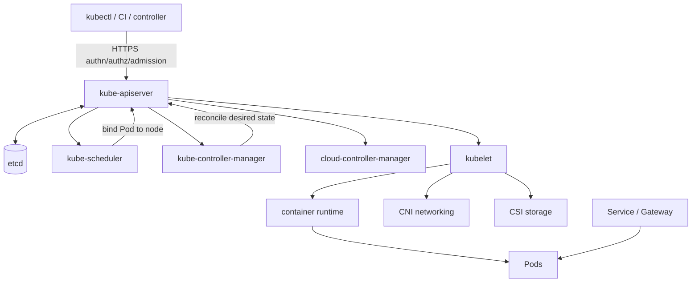
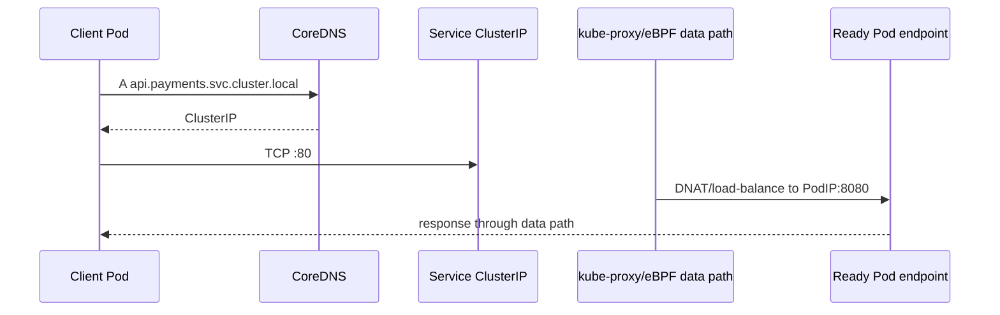
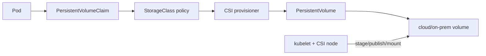

# Kubernetes core platform

<!-- child-topic-toc:start -->
## Table of contents and deeper notes

This parent note explains how the child topics work together. Follow each child link for the deeper mechanism, real commands/configuration, hands-on practice, authoritative documentation, and its local interview bank.

- [Architecture](architecture/README.md) — [questions and answers](architecture/questions-and-answers.md)
- [Gpu Llmops](gpu-llmops/README.md) — [questions and answers](gpu-llmops/questions-and-answers.md)
- [Networking](networking/README.md) — [questions and answers](networking/questions-and-answers.md)
- [Operations](operations/README.md) — [questions and answers](operations/questions-and-answers.md)
- [Packaging Extensions](packaging-extensions/README.md) — [questions and answers](packaging-extensions/questions-and-answers.md)
- [Scheduling Autoscaling](scheduling-autoscaling/README.md) — [questions and answers](scheduling-autoscaling/questions-and-answers.md)
- [Security](security/README.md) — [questions and answers](security/questions-and-answers.md)
- [Storage](storage/README.md) — [questions and answers](storage/questions-and-answers.md)
- [Workloads](workloads/README.md) — [questions and answers](workloads/questions-and-answers.md)
<!-- child-topic-toc:end -->
## 1. Easy mode: architecture and reconciliation

Kubernetes is an API-driven reconciliation system. You submit desired state; controllers compare it with observed state and make idempotent changes. The scheduler assigns unscheduled Pods to nodes; kubelet makes assigned Pods run through a CRI runtime; networking/storage plugins implement data-plane contracts.



The API object has `apiVersion`, `kind`, metadata, `spec` (desired) and `status` (observed). `generation` increments when desired state changes; controllers set `observedGeneration` and conditions. Owner references enable garbage collection; finalizers block deletion until cleanup; deletion sets a timestamp first. Server-side apply tracks field managers and conflicts.

```bash
kubectl api-resources
kubectl api-versions
kubectl explain deployment.spec.template.spec.containers --recursive
kubectl get --raw /readyz?verbose
kubectl get --raw /livez?verbose
kubectl get --raw /metrics | head
```

## 2. A complete production-shaped workload

Namespace, service account, configuration, Deployment, Service, PDB, NetworkPolicy and autoscaling:

```yaml
apiVersion: v1
kind: Namespace
metadata:
  name: payments
  labels:
    pod-security.kubernetes.io/enforce: restricted
    pod-security.kubernetes.io/audit: restricted
    pod-security.kubernetes.io/warn: restricted
---
apiVersion: v1
kind: ServiceAccount
metadata:
  name: api
  namespace: payments
automountServiceAccountToken: false
---
apiVersion: v1
kind: ConfigMap
metadata:
  name: api-config
  namespace: payments
data:
  LOG_LEVEL: info
  config.yaml: |
    upstreamTimeout: 2s
    maxInflight: 200
---
apiVersion: apps/v1
kind: Deployment
metadata:
  name: api
  namespace: payments
  labels: {app.kubernetes.io/name: api}
spec:
  replicas: 3
  revisionHistoryLimit: 5
  minReadySeconds: 10
  progressDeadlineSeconds: 600
  strategy:
    type: RollingUpdate
    rollingUpdate: {maxUnavailable: 0, maxSurge: 1}
  selector:
    matchLabels: {app.kubernetes.io/name: api}
  template:
    metadata:
      labels: {app.kubernetes.io/name: api}
      annotations:
        checksum/config: "replace-with-rendered-config-hash"
    spec:
      serviceAccountName: api
      automountServiceAccountToken: false
      terminationGracePeriodSeconds: 45
      securityContext:
        runAsNonRoot: true
        seccompProfile: {type: RuntimeDefault}
      topologySpreadConstraints:
        - maxSkew: 1
          topologyKey: topology.kubernetes.io/zone
          whenUnsatisfiable: DoNotSchedule
          labelSelector:
            matchLabels: {app.kubernetes.io/name: api}
      containers:
        - name: api
          image: registry.example/payments/api@sha256:verified-digest
          imagePullPolicy: IfNotPresent
          ports:
            - {name: http, containerPort: 8080, protocol: TCP}
          envFrom:
            - configMapRef: {name: api-config}
          volumeMounts:
            - {name: config, mountPath: /etc/api, readOnly: true}
            - {name: tmp, mountPath: /tmp}
          resources:
            requests: {cpu: 250m, memory: 256Mi}
            limits: {memory: 512Mi}
          startupProbe:
            httpGet: {path: /startup, port: http}
            periodSeconds: 5
            failureThreshold: 24
          readinessProbe:
            httpGet: {path: /ready, port: http}
            periodSeconds: 5
            timeoutSeconds: 2
            failureThreshold: 2
          livenessProbe:
            httpGet: {path: /live, port: http}
            periodSeconds: 10
            timeoutSeconds: 2
            failureThreshold: 3
          lifecycle:
            preStop:
              exec: {command: ["/bin/sh", "-c", "sleep 10"]}
          securityContext:
            allowPrivilegeEscalation: false
            readOnlyRootFilesystem: true
            capabilities: {drop: ["ALL"]}
      volumes:
        - name: config
          configMap: {name: api-config}
        - name: tmp
          emptyDir: {sizeLimit: 64Mi}
---
apiVersion: v1
kind: Service
metadata: {name: api, namespace: payments}
spec:
  selector: {app.kubernetes.io/name: api}
  ports:
    - {name: http, port: 80, targetPort: http}
---
apiVersion: policy/v1
kind: PodDisruptionBudget
metadata: {name: api, namespace: payments}
spec:
  minAvailable: 2
  selector:
    matchLabels: {app.kubernetes.io/name: api}
---
apiVersion: networking.k8s.io/v1
kind: NetworkPolicy
metadata: {name: api-default, namespace: payments}
spec:
  podSelector: {matchLabels: {app.kubernetes.io/name: api}}
  policyTypes: [Ingress, Egress]
  ingress:
    - from:
        - namespaceSelector: {matchLabels: {kubernetes.io/metadata.name: ingress-system}}
      ports: [{protocol: TCP, port: 8080}]
  egress:
    - to:
        - namespaceSelector: {matchLabels: {kubernetes.io/metadata.name: kube-system}}
      ports:
        - {protocol: UDP, port: 53}
        - {protocol: TCP, port: 53}
---
apiVersion: autoscaling/v2
kind: HorizontalPodAutoscaler
metadata: {name: api, namespace: payments}
spec:
  scaleTargetRef: {apiVersion: apps/v1, kind: Deployment, name: api}
  minReplicas: 3
  maxReplicas: 30
  behavior:
    scaleUp:
      stabilizationWindowSeconds: 0
      policies: [{type: Percent, value: 100, periodSeconds: 60}]
    scaleDown:
      stabilizationWindowSeconds: 300
      policies: [{type: Percent, value: 25, periodSeconds: 60}]
  metrics:
    - type: Resource
      resource:
        name: cpu
        target: {type: Utilization, averageUtilization: 65}
```

Points to explain in an interview: selector immutability; requests drive scheduling and HPA utilization; no CPU limit can avoid latency from CFS throttling but needs workload/tenant controls; memory limit prevents node-wide damage but can OOM the container; startup shields slow initialization from liveness; readiness removes endpoints; PDB covers voluntary disruption only; NetworkPolicy requires a capable CNI and the shown egress may need explicit application destinations; the sleep-based preStop is a simple drain buffer, not an application-aware ideal.

Apply safely:

```bash
kubectl diff -f workload.yaml
kubectl apply --server-side --field-manager=platform-ci -f workload.yaml
kubectl rollout status deployment/api -n payments --timeout=10m
kubectl get deployment,rs,pod,svc,endpointslice,hpa,pdb,networkpolicy -n payments -o wide
kubectl wait -n payments --for=condition=Available deployment/api --timeout=10m
```

## 3. Workload controllers and Pod lifecycle

- Deployment manages ReplicaSets and stateless rolling rollout.
- StatefulSet gives stable ordinal identity and per-Pod claims; it does not make a database correct.
- DaemonSet runs a Pod on eligible nodes for agents/plugins.
- Job runs to completion; CronJob schedules Jobs and needs concurrency/deadline/history/idempotency decisions.
- Init containers run sequentially before app containers; native/sidecar patterns have version-specific semantics; ephemeral containers are for debugging and not restarted.

StatefulSet example:

```yaml
apiVersion: apps/v1
kind: StatefulSet
metadata: {name: index, namespace: search}
spec:
  serviceName: index-headless
  replicas: 3
  podManagementPolicy: Parallel
  updateStrategy: {type: RollingUpdate}
  selector: {matchLabels: {app: index}}
  template:
    metadata: {labels: {app: index}}
    spec:
      terminationGracePeriodSeconds: 120
      containers:
        - name: index
          image: example/index@sha256:digest
          ports: [{name: peer, containerPort: 9300}]
          resources:
            requests: {cpu: "2", memory: 8Gi}
            limits: {memory: 8Gi}
          volumeMounts: [{name: data, mountPath: /var/lib/index}]
  volumeClaimTemplates:
    - metadata: {name: data}
      spec:
        accessModes: [ReadWriteOnce]
        storageClassName: fast-rwo
        resources: {requests: {storage: 500Gi}}
```

Lifecycle commands:

```bash
kubectl get pod -A --field-selector=status.phase=Pending
kubectl describe pod POD -n NS
kubectl get pod POD -n NS -o jsonpath='{.status.conditions}' | jq
kubectl logs POD -n NS -c CONTAINER --since=30m --timestamps
kubectl logs POD -n NS -c CONTAINER --previous
kubectl exec -n NS POD -c CONTAINER -- COMMAND
kubectl attach -n NS POD -c CONTAINER
kubectl cp NS/POD:/path ./local -c CONTAINER
kubectl port-forward -n NS svc/api 8080:80
kubectl delete pod POD -n NS --grace-period=60
```

Avoid force deletion unless you understand split-brain/storage effects. A terminating Pod can be blocked by finalizers, unreachable kubelet, volume detach or long grace.

## 4. Scheduling, resources and disruption

Scheduler filters then scores nodes based on requests and constraints. Requests reserve scheduling capacity; limits are enforced by kubelet/runtime/cgroups. QoS: Guaranteed (equal CPU+memory requests/limits for all containers), Burstable, BestEffort. Eviction under node pressure is different from container OOM. Extended resources such as GPUs normally appear only in limits and are not overcommitted.

```yaml
spec:
  priorityClassName: production-high
  nodeSelector:
    workload.example.com/class: inference
  tolerations:
    - key: workload.example.com/gpu
      operator: Equal
      value: "true"
      effect: NoSchedule
  affinity:
    nodeAffinity:
      requiredDuringSchedulingIgnoredDuringExecution:
        nodeSelectorTerms:
          - matchExpressions:
              - {key: topology.kubernetes.io/zone, operator: In, values: [eu-a, eu-b]}
    podAntiAffinity:
      preferredDuringSchedulingIgnoredDuringExecution:
        - weight: 100
          podAffinityTerm:
            topologyKey: kubernetes.io/hostname
            labelSelector: {matchLabels: {app: api}}
```

```bash
kubectl get nodes --show-labels
kubectl describe node NODE
kubectl top node; kubectl top pod -A --containers
kubectl get events -A --field-selector=reason=FailedScheduling
kubectl taint nodes NODE dedicated=gpu:NoSchedule
kubectl label node NODE workload.example.com/class=inference
kubectl cordon NODE
kubectl drain NODE --ignore-daemonsets --delete-emptydir-data --grace-period=120 --timeout=20m
kubectl uncordon NODE
```

PDBs limit concurrent voluntary eviction, not node crashes, and can block drain. Priority/preemption can evict lower-priority Pods but must not turn overload into starvation. Topology spread is often clearer than hard anti-affinity. Cluster autoscalers respond to unschedulable requests; they cannot help if constraints are impossible, quotas/capacity/IPs fail, or a Pod lacks correct requests.

## 5. Services, DNS and network path



Service types: ClusterIP, NodePort, LoadBalancer and ExternalName. Headless `clusterIP: None` returns endpoint addresses. EndpointSlices are the scalable backend source. A Service selects labels; readiness controls endpoint eligibility. `externalTrafficPolicy: Local` can preserve client source and reduce hop but needs local healthy endpoints and affects distribution.

```bash
kubectl get svc,endpoints,endpointslice -n payments -o wide
kubectl describe svc api -n payments
kubectl get endpointslice -n payments -l kubernetes.io/service-name=api -o yaml
kubectl run netshoot -n payments --rm -it --image=nicolaka/netshoot -- bash
# inside
dig api.payments.svc.cluster.local
curl -sv http://api.payments.svc.cluster.local/ready
ip route; ss -tan; tcpdump -ni any port 8080
```

NetworkPolicy is additive: once a Pod is selected for a direction, only unioned allows apply. Both source egress and destination ingress may need to allow. Policies operate at IP/port; DNS names need CNI-specific policy or egress proxy. Test default-deny with DNS and required control/telemetry paths.

## 6. Ingress and Gateway API

Ingress is a portable HTTP routing resource implemented by a controller. Gateway API separates infrastructure (`GatewayClass`, `Gateway`, listeners) from app routes (`HTTPRoute`, `GRPCRoute`) and supports explicit cross-namespace attachment/reference grants.

```yaml
apiVersion: gateway.networking.k8s.io/v1
kind: Gateway
metadata: {name: public, namespace: ingress-system}
spec:
  gatewayClassName: managed-l7
  listeners:
    - name: https
      protocol: HTTPS
      port: 443
      hostname: api.example.com
      tls:
        mode: Terminate
        certificateRefs: [{kind: Secret, name: api-tls}]
      allowedRoutes:
        namespaces:
          from: Selector
          selector: {matchLabels: {expose: public}}
---
apiVersion: gateway.networking.k8s.io/v1
kind: HTTPRoute
metadata: {name: api, namespace: payments}
spec:
  parentRefs: [{name: public, namespace: ingress-system, sectionName: https}]
  hostnames: [api.example.com]
  rules:
    - matches: [{path: {type: PathPrefix, value: /v1}}]
      backendRefs:
        - {name: api-v1, port: 80, weight: 90}
        - {name: api-v2, port: 80, weight: 10}
```

```bash
kubectl get gatewayclass,gateway,httproute -A
kubectl describe gateway public -n ingress-system
kubectl get httproute api -n payments -o jsonpath='{.status.parents}' | jq
kubectl get crd | rg gateway
```

Always inspect controller-specific status/events/cloud resources. Route accepted does not guarantee resolved references or healthy backends. Align TLS, proxy and app timeouts; configure streaming/gRPC/WebSocket behavior explicitly.

## 7. Configuration and secrets

ConfigMaps/Secrets can be environment variables or projected volumes. Env does not update in a running process; mounted projection updates eventually via atomic symlink, but applications must reload. `subPath` mounts do not receive normal projected updates. Kubernetes Secrets are base64-encoded, not inherently encrypted at rest; enable API encryption, restrictive RBAC and external secret/KMS workflows.

```bash
kubectl create configmap app --from-file=config.yaml --dry-run=client -o yaml
kubectl create secret generic db --from-literal=username=app --from-file=password=./password \
  --dry-run=client -o yaml
kubectl get secret db -o jsonpath='{.data.username}' | base64 -d
kubectl auth can-i get secrets --as=system:serviceaccount:payments:api -n payments
```

Do not pass secrets on shared shell command lines/history; the commands above are learning examples. In production use secret stores/sealed/encrypted Git workflows, rotation, workload identity and process-safe injection.

## 8. Storage and CSI



PVC requests class, capacity and access mode; dynamic provisioner creates PV; binding may wait for first consumer to choose topology. Reclaim policy controls PV after claim deletion. CSI handles provision/attach/mount/snapshot/expand. Access mode describes supported attachment semantics, not application locking.

```yaml
apiVersion: storage.k8s.io/v1
kind: StorageClass
metadata: {name: fast-rwo}
provisioner: ebs.csi.aws.com
parameters: {type: gp3, encrypted: "true"}
reclaimPolicy: Retain
allowVolumeExpansion: true
volumeBindingMode: WaitForFirstConsumer
---
apiVersion: v1
kind: PersistentVolumeClaim
metadata: {name: data, namespace: payments}
spec:
  accessModes: [ReadWriteOnce]
  storageClassName: fast-rwo
  resources: {requests: {storage: 100Gi}}
```

```bash
kubectl get sc,pv,pvc -A
kubectl describe pvc data -n payments
kubectl get volumeattachment
kubectl get csidriver,csinode
kubectl get volumesnapshot -A
kubectl patch pvc data -n payments -p '{"spec":{"resources":{"requests":{"storage":"200Gi"}}}}'
```

Backup must include application-consistent data plus Kubernetes desired state and encryption/access dependencies. Test restore into an isolated environment and validate the application, not only PVC `Bound`.

## 9. Authentication, RBAC and admission

Authentication identifies; authorization decides verb/resource/subresource/name/namespace; admission validates/mutates after authorization before persistence. ServiceAccounts are namespaced identities. OIDC/cert/external integrations authenticate people; use short-lived credentials. RBAC Roles/ClusterRoles define rules; Bindings attach subjects. Avoid wildcards, secret read, pod exec/attach, impersonation, bind/escalate and workload-create paths that enable privilege escalation.

```yaml
apiVersion: rbac.authorization.k8s.io/v1
kind: Role
metadata: {name: deployer, namespace: payments}
rules:
  - apiGroups: [apps]
    resources: [deployments]
    verbs: [get, list, watch, patch, update]
  - apiGroups: [""]
    resources: [pods, pods/log]
    verbs: [get, list, watch]
---
apiVersion: rbac.authorization.k8s.io/v1
kind: RoleBinding
metadata: {name: deployer, namespace: payments}
subjects:
  - {kind: Group, name: team-payments, apiGroup: rbac.authorization.k8s.io}
roleRef: {kind: Role, name: deployer, apiGroup: rbac.authorization.k8s.io}
```

```bash
kubectl auth whoami
kubectl auth can-i --list -n payments
kubectl auth can-i patch deployments -n payments --as=USER --as-group=team-payments
kubectl get role,rolebinding -n payments
kubectl get clusterrole,clusterrolebinding
kubectl create token api -n payments --duration=10m
```

Admission examples include Pod Security Admission, ValidatingAdmissionPolicy/CEL and webhooks. Webhooks are control-plane dependencies: bound timeouts, failure policy by risk, namespace selectors, HA, certificate rotation and monitoring.

## 10. Packaging, apply and GitOps

```bash
helm lint ./chart
helm template api ./chart -f values-prod.yaml | kubeconform -strict
helm upgrade --install api ./chart -n payments --create-namespace \
  -f values-prod.yaml --atomic --timeout 10m
helm history api -n payments
helm rollback api REVISION -n payments

kubectl kustomize overlays/prod
kubectl diff -k overlays/prod
kubectl apply --server-side -k overlays/prod
```

Helm values/hooks and release state need testing; hooks can perform irreversible side effects outside rollback. Kustomize patches overlays without templates. GitOps controllers continuously reconcile Git: an emergency imperative change may be reverted, so update/freeze the source deliberately. Store no plaintext secrets in Git.

## 11. CRDs and operators

CRDs extend the API; controllers watch desired state and reconcile external/internal resources. A robust reconciler is level-based/idempotent, uses finalizers for external cleanup, conditions with observed generation, exponential rate limiting, ownership, bounded work and safe retries.

```yaml
apiVersion: platform.example.io/v1alpha1
kind: ModelDeployment
metadata:
  name: summarizer
  finalizers: [platform.example.io/model-cleanup]
spec:
  model: s3://models/summarizer/v7
  replicas: 2
status:
  observedGeneration: 3
  conditions:
    - {type: Ready, status: "True", reason: Serving, observedGeneration: 3}
```

```bash
kubectl get crd modeldeployments.platform.example.io -o yaml
kubectl get modeldeployment summarizer -o yaml
kubectl api-resources --api-group=platform.example.io
kubectl get events --field-selector involvedObject.kind=ModelDeployment
kubectl patch modeldeployment summarizer --type=merge -p '{"metadata":{"finalizers":[]}}'
```

Removing finalizers manually can leak external resources; do it only after understanding/performing cleanup. Version CRDs with conversion/defaulting/storage migration and compatibility plans.

## 12. Upgrades, etcd and disaster recovery

etcd is a consistent replicated key-value store; quorum requires a majority. Back up snapshots with encryption material and exact procedure, verify snapshot status and perform restore drills. Compaction removes old revisions; defragmentation reclaims backend space. Do not casually operate managed control-plane etcd as if self-managed.

Upgrade sequence: inventory versions/APIs/add-ons/webhooks/CRDs → read skew/deprecation notes → test backup/rebuild → upgrade control plane within supported skew → core add-ons/controllers → canary node pool → drain/replace nodes → workloads → validate SLO/audit/DR → complete rollout. Use API deprecation scanners and server-side dry runs; rollback may require cluster migration because control-plane downgrade is generally not available.

```bash
kubectl version
kubectl get --raw /version
kubectl get apiservice
kubectl get --raw /metrics | rg apiserver_requested_deprecated_apis
kubectl get componentstatuses  # legacy; know its limitations
ETCDCTL_API=3 etcdctl endpoint status --cluster -w table
ETCDCTL_API=3 etcdctl snapshot save snapshot.db
ETCDCTL_API=3 etcdctl snapshot status snapshot.db -w table
```

## 13. The kubectl field guide

Context/output/selection:

```bash
kubectl config get-contexts
kubectl config use-context CONTEXT
kubectl config set-context --current --namespace=NS
kubectl get pods -A -o wide
kubectl get pods -l app=api --show-labels
kubectl get pods --field-selector=status.phase=Running
kubectl get pod POD -o yaml
kubectl get pod POD -o json | jq '.status.containerStatuses'
kubectl get pods -o custom-columns='NS:.metadata.namespace,NAME:.metadata.name,NODE:.spec.nodeName,PHASE:.status.phase'
kubectl get pods -o jsonpath='{range .items[*]}{.metadata.namespace}{"\t"}{.metadata.name}{"\n"}{end}'
kubectl get pods -w
```

Create/update/patch/delete:

```bash
kubectl create deployment demo --image=nginx --dry-run=client -o yaml
kubectl expose deployment demo --port=80 --target-port=80 --dry-run=client -o yaml
kubectl apply --server-side -f FILE --field-manager=OWNER
kubectl diff -f FILE
kubectl set image deployment/api api=registry/api@sha256:DIGEST -n NS
kubectl set resources deployment/api -c api --requests=cpu=250m,memory=256Mi -n NS
kubectl patch deployment api -n NS --type=merge -p '{"spec":{"replicas":5}}'
kubectl patch deployment api -n NS --type=json -p='[{"op":"replace","path":"/spec/replicas","value":5}]'
kubectl scale deployment/api --replicas=5 -n NS
kubectl delete -f FILE --wait=true
```

Rollouts and ownership:

```bash
kubectl rollout status deployment/api -n NS
kubectl rollout history deployment/api -n NS
kubectl rollout pause deployment/api -n NS
kubectl rollout resume deployment/api -n NS
kubectl rollout undo deployment/api -n NS --to-revision=3
kubectl rollout restart deployment/api -n NS
kubectl get deployment api -n NS -o jsonpath='{.metadata.managedFields[*].manager}'
```

Debugging:

```bash
kubectl describe pod POD -n NS
kubectl logs POD -n NS --all-containers --prefix --since=1h
kubectl logs -f deploy/api -n NS --all-containers
kubectl debug -it POD -n NS --image=nicolaka/netshoot --target=CONTAINER
kubectl debug node/NODE -it --image=ubuntu
kubectl exec deploy/api -n NS -c api -- sh -c 'id; env | sort'
kubectl port-forward deploy/api 8080:8080 -n NS
kubectl proxy
kubectl get events -A --sort-by=.metadata.creationTimestamp
kubectl cluster-info dump --namespaces NS --output-directory ./dump
```

Raw API and audit-friendly dry run:

```bash
kubectl get --raw '/api/v1/namespaces/NS/pods?limit=100'
kubectl create --raw /api/v1/namespaces/NS/serviceaccounts/NAME/token \
  -f token-request.json
kubectl apply --dry-run=server -f FILE -o yaml
kubectl delete pod POD --dry-run=server -o yaml
```

Completion/reference:

```bash
source <(kubectl completion zsh)
kubectl options
kubectl explain RESOURCE.FIELD
kubectl api-resources --verbs=list --namespaced=true
kubectl auth reconcile -f rbac.yaml --dry-run=client
```

Prefer declarative source for lasting changes. Imperative commands are excellent for observation, controlled debugging and generating starter YAML; record any incident mutation and reconcile it to source.

## 14. Symptom-to-command troubleshooting table

| Symptom | First evidence | Common branches |
|---|---|---|
| Pending | describe/events, scheduler/autoscaler logs | requests, affinity/taint, PVC topology, quota, capacity, IP, autoscaler constraints |
| ImagePullBackOff | Pod events, imagePullSecrets, node runtime | name/digest/arch, auth, DNS/TLS/egress, rate limit, registry outage |
| CrashLoopBackOff | current/previous logs, exit code, config | app crash, bad command, permission/readonly FS, dependency, liveness, OOM |
| OOMKilled | status, limits, cgroup/node memory | leak, working set, cache, bad limit/request, node eviction |
| Not Ready | probe result/endpoints/app logs | dependency/startup, wrong path/port, overload, NetworkPolicy |
| Service unreachable | DNS, Service, EndpointSlice, route/policy | selector/readiness, targetPort, CNI/kube-proxy, NetworkPolicy, LB |
| PVC Pending | PVC events, SC/CSI/topology | no class, unsupported mode, quota/capacity, topology |
| Node NotReady | conditions/events, kubelet/runtime/CNI | disk/memory/PID, cert, network, runtime, cloud instance |
| API slow | apiserver/etcd metrics, audit, clients | etcd latency/space, list/watch load, webhook, controller storm |
| Drain blocked | PDB, finalizer, local storage | strict budget, unhealthy replica, DaemonSet, volume, grace |

## 15. Real-world labs

1. Deploy the complete workload; break selectors, targetPort, readiness, DNS egress and image architecture one at a time; diagnose without reading the answer.
2. Roll from v1→v2 with a deliberately failing readiness probe; observe ReplicaSets/conditions and safely undo.
3. Fill `emptyDir`, exceed memory, throttle CPU and compare container status, node pressure and HPA behavior.
4. Create default-deny, then minimally allow DNS, ingress and one database; prove both directions.
5. Provision/expand/snapshot/restore a PVC into a new namespace and validate application data.
6. Cordon/drain a node with Deployment, StatefulSet, DaemonSet, PDB and local `emptyDir`; explain every blocked eviction.
7. Create an overprivileged Role, demonstrate escalation path in a sandbox, then minimize it with `kubectl auth can-i` tests.
8. Install a CRD/controller in a local cluster; observe reconciliation, status, deletion timestamp and finalizer cleanup.

## Common interview traps

- A Deployment manages ReplicaSets, not Pods directly.
- A Service does not route to unready endpoints by default; check EndpointSlices.
- Requests drive scheduling; limits drive enforcement; metrics drive autoscaling.
- PDB does not protect involuntary node/AZ failure.
- NetworkPolicy has no effect without an enforcing CNI.
- Secret base64 is not encryption.
- StatefulSet identity/order does not supply database replication or backup.
- `kubectl apply` success means API acceptance, not workload readiness.
- Finalizers are cleanup contracts, not mysterious stuck deletion flags.
- Force deletion can create duplicate stateful actors.

## Revision summary

- Follow desired state through API/admission/controller/scheduler/kubelet/runtime/network/storage.
- Conditions, events and EndpointSlices reveal controller truth.
- Safe production manifests specify identity, resources, probes, security, topology, disruption and lifecycle.
- Debug with read-only evidence first, then reversible mitigation and source reconciliation.
- Kubernetes expertise is explaining why each field exists and how it fails, not memorizing YAML.
