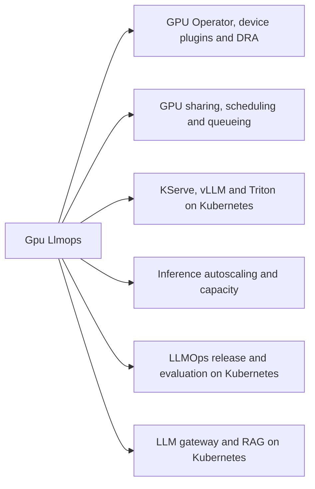
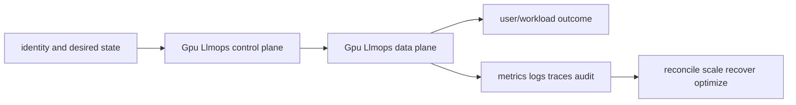
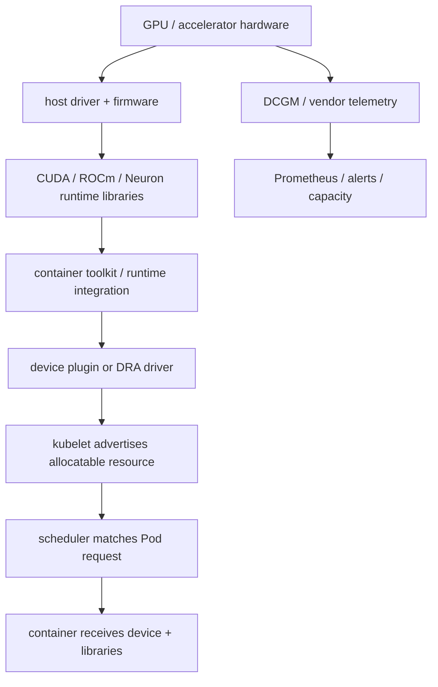
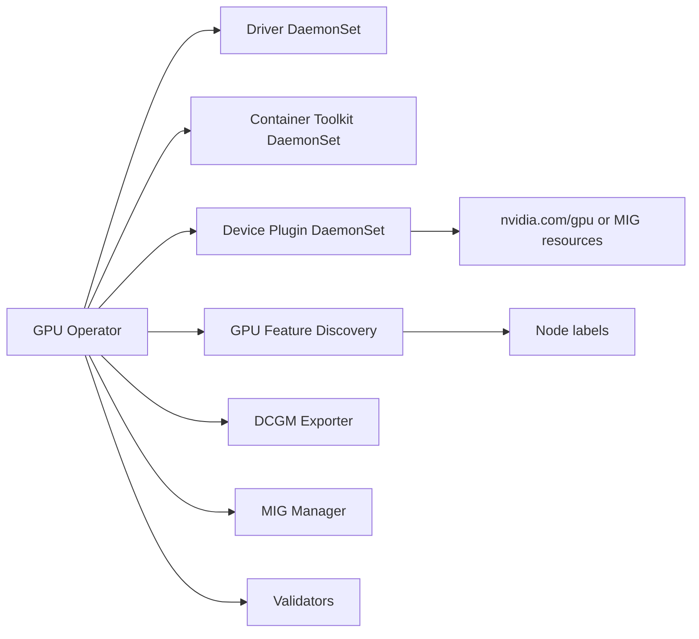
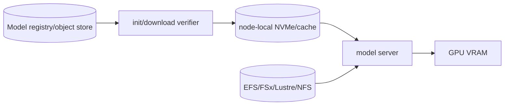
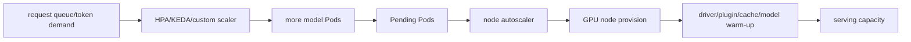

# Gpu Llmops

<!-- child-topic-toc:start -->
## Table of contents and deeper notes

This parent note explains how the child topics work together. Follow each child link for the deeper mechanism, real commands/configuration, hands-on practice, authoritative documentation, and its local interview bank.

- [Gpu Llmops service leaves](services/README.md) — [questions and answers](services/questions-and-answers.md)
<!-- child-topic-toc:end -->
This branch README is both the study note and the map. Each service leaf keeps its notes in its own README and its answered interview bank in a separate file.



## Service leaves

- [GPU Operator, device plugins and DRA](services/gpu-operator-dra/README.md) — [Q&A](services/gpu-operator-dra/questions-and-answers.md)
- [GPU sharing, scheduling and queueing](services/gpu-sharing-scheduling/README.md) — [Q&A](services/gpu-sharing-scheduling/questions-and-answers.md)
- [KServe, vLLM and Triton on Kubernetes](services/model-serving/README.md) — [Q&A](services/model-serving/questions-and-answers.md)
- [Inference autoscaling and capacity](services/inference-autoscaling/README.md) — [Q&A](services/inference-autoscaling/questions-and-answers.md)
- [LLMOps release and evaluation on Kubernetes](services/llmops-release-evaluation/README.md) — [Q&A](services/llmops-release-evaluation/questions-and-answers.md)
- [LLM gateway and RAG on Kubernetes](services/gateway-rag/README.md) — [Q&A](services/gateway-rag/questions-and-answers.md)

## Branch learning contract

Learn the easy mental model first, run the read-only commands in a sandbox, render/apply the examples only in disposable environments, then break and repair one dependency at a time. Be able to connect these topics across the branch: Driver, Container toolkit, Device plugin, Whole GPU, MIG, Time-slicing, InferenceService, ServingRuntime, vLLM continuous batching, Queue depth/age, Predicted token work, TTFT/inter-token, Release manifest, Golden dataset, Offline evaluation, Gateway identity, Model route, Token quota.

## Branch interview bank

See [questions-and-answers.md](questions-and-answers.md) for 60 additional branch-level questions and answers. Service-specific banks contain another 60 per service.

> Interview bank: [questions-and-answers.md](questions-and-answers.md) · Official documentation: <https://docs.nvidia.com/datacenter/cloud-native/gpu-operator/latest/>

## Easy mode: purpose and mental model

Integrate the gpu llmops branch as one production capability rather than isolated products.



## Detailed learning notes

| # | Concept | What you must be able to explain |
|---:|---|---|
| 1 | **Driver** | host kernel module/firmware is the foundation and must match hardware/kernel/runtime. |
| 2 | **Container toolkit** | injects device/library/runtime configuration into GPU containers. |
| 3 | **Whole GPU** | simple exclusive allocation offers strongest default isolation at fragmentation cost. |
| 4 | **MIG** | supported GPUs partition hardware memory/fault domains into fixed profiles. |
| 5 | **InferenceService** | KServe resource declares predictor/runtime/storage/traffic under deployment mode. |
| 6 | **ServingRuntime** | reusable supported model format/container/protocol contract. |
| 7 | **Queue depth/age** | leading overload signal when arrival work exceeds serving goodput. |
| 8 | **Predicted token work** | input/output length estimate better reflects heterogeneous request cost. |
| 9 | **Release manifest** | exact model/tokenizer/template/adapter/runtime/image/flags/hardware/index/evaluator identity. |
| 10 | **Golden dataset** | versioned owned task examples and edge/adversarial cases. |

## Architecture and lifecycle

Trace this service from request/authentication and desired configuration through provisioning, steady-state data path, scaling, change, failure, recovery and retirement. Bind every production resource to an owner, environment, data classification, source-of-truth revision, SLO, runbook, cost center and deletion/retention policy.

For Gpu Llmops, draw a real request/resource path and label where these mechanisms act: Driver, Container toolkit, Whole GPU, MIG, InferenceService, ServingRuntime, Queue depth/age, Predicted token work, Release manifest, Golden dataset. State which parts are control plane versus data plane, regional versus zonal/global, synchronous versus asynchronous, and customer versus provider responsibility.

## Security model

Start with the caller/workload identity and evaluate every applicable identity, resource, organization, network-endpoint, encryption-key and admission policy. Minimize public paths, long-lived credentials, wildcard actions/resources and unreviewed cross-account/tenant trust. Encrypt in transit/at rest where applicable, but include key/certificate rotation and recovery. Protect audit evidence and prevent secrets/customer content from entering command history, logs, traces or metric labels.

## Availability and failure modes

List dependencies and failure domains before claiming high availability. Test quota/capacity, identity/control-plane, DNS/network/TLS, configuration drift, downstream saturation, zonal/Regional/node failure and recovery from protected state. Use bounded timeout, retry budget, jitter, idempotency, backpressure, load shedding and graceful drain according to protocol. A green resource status is not a user-facing recovery check.

## Performance, scaling and cost

Measure workload distribution and SLI before sizing. Track rate/work units, latency distribution, errors, saturation/queue and service-specific limits. Separate replica/task scaling from infrastructure/capacity scaling and include cold-start/provisioning delay. Cost includes idle/provisioned capacity, requests/work units, storage/retention, cross-AZ/Region/egress/NAT, observability, licenses/support and failure headroom. Optimize cost per successful SLO/quality-controlled task.

## Observability

Correlate a request/change across user, route/resource, dependency and underlying compute/storage/network. Use stable owner/environment/region/service dimensions; put high-cardinality request/object IDs in sampled logs/traces rather than metric labels. Alert on actionable SLO burn and leading exhaustion. Monitor the telemetry path and keep a read-only diagnostic role.

## Command lab

Run in a sandbox with the correct account/context/Region. Read and explain output before mutation.

```bash
kubectl get pods -n gpu-operator -o wide
kubectl describe node GPU_NODE
kubectl get inferenceservice,servingruntime -A
kubectl describe hpa NAME -n NS
kubectl get deployment,inferenceservice -n inference -o yaml
kubectl get gateway,httproute,networkpolicy -A
```

For each command, record: identity/context, exact resource, expected healthy fields, one failing output, the next command/query, and which mutation would be reversible. Never paste secrets/tokens into committed notes or shared terminal history.

## Real-world exercise: easy → hard

1. **Easy:** inventory one healthy Gpu Llmops resource and draw identity/control/data/dependency paths.
2. **Intermediate:** reproduce a safe configuration change with IaC, preview/diff, apply to a sandbox, verify and roll back.
3. **Hard:** inject one policy/network/quota/capacity/dependency failure, diagnose from user symptom to root mechanism, mitigate without widening access, then add an alert/test/runbook.
4. **Senior:** design the service for two tenants, multi-zone/Region failure, RPO/RTO, regulated data, 10× demand and a 30% cost reduction; quantify trade-offs.

## Common interview traps

- Naming a feature without explaining request/resource lifecycle or failure semantics.
- Treating an allow, encryption checkbox, replica count or managed-service label as a complete security/reliability design.
- Mutating production before capturing identity, status, events, metrics, logs, audit and recent changes.
- Scaling the wrong layer or retrying overload/permanent errors.
- Omitting quotas, cold start, deletion/restore, observability cost or customer/tenant boundaries.

## Revision summary

Explain Gpu Llmops in five passes: purpose/selection, mechanism/lifecycle, security/failure, operation/commands, and architecture/economics. Then complete the separate [answered question bank](questions-and-answers.md) without looking at these notes.

<!-- merged-06-KUBERNETES-GPU-PLATFORM-MD:start -->
## Practical deep dive

## 1. Easy mode: from silicon to a schedulable resource



A GPU workload needs a compatible chain: hardware → firmware/driver → kernel → container toolkit/runtime → device plugin/DRA → CUDA libraries/framework → model. “CUDA version” can refer to driver capability, toolkit or application build; diagnose exact versions. CPU, RAM, PCIe, network and storage can starve an apparently idle GPU.

GPU selection considers compute capability, tensor precision, VRAM, memory bandwidth, interconnect (PCIe/NVLink/NVSwitch), network/RDMA, power/cooling, availability and cost. Inference often needs enough VRAM for weights + KV cache + runtime workspace; training adds optimizer/gradient/activation memory.

Approximate weight memory:

```text
weight_bytes ≈ parameters × bits_per_parameter / 8
70B at FP16 ≈ 140 GB before KV cache, workspace, fragmentation and runtime overhead
```

KV cache scales roughly with layers × KV heads/head dimension × sequence tokens × concurrent sequences × bytes × keys+values; use runtime/model-specific formulas and measure.

## 2. Device plugins and basic scheduling

Traditional NVIDIA device plugin advertises an extended resource such as `nvidia.com/gpu`. Extended resources are integer and not overcommitted. Put GPU request in `limits`; Kubernetes treats request equal to limit for this resource.

```yaml
apiVersion: v1
kind: Pod
metadata: {name: cuda-check, namespace: ai}
spec:
  restartPolicy: Never
  nodeSelector:
    accelerator.example.com/vendor: nvidia
  tolerations:
    - {key: accelerator.example.com/gpu, operator: Equal, value: "true", effect: NoSchedule}
  containers:
    - name: check
      image: nvidia/cuda:12.6.3-base-ubuntu22.04
      command: ["bash", "-lc", "nvidia-smi && sleep 30"]
      resources:
        limits:
          nvidia.com/gpu: 1
```

```bash
kubectl get nodes -o custom-columns='NAME:.metadata.name,GPU:.status.allocatable.nvidia\.com/gpu'
kubectl describe node GPU_NODE | sed -n '/Capacity:/,/System Info:/p'
kubectl apply -f cuda-check.yaml
kubectl logs -n ai cuda-check
kubectl exec -n ai cuda-check -- nvidia-smi -L
kubectl get pod -n ai cuda-check -o jsonpath='{.spec.containers[0].resources}' | jq
```

If no GPU appears: confirm cloud/bare-metal device, host `lspci`, driver `nvidia-smi`, container runtime config, toolkit, plugin/Operator Pods/logs, node labels/taints and kubelet allocatable. A Pod can remain Pending because requested GPU type/count and node constraints cannot coexist even when total cluster GPUs appear free.

## 3. Dynamic Resource Allocation (DRA)

DRA models devices through drivers, `ResourceSlice` inventory, `DeviceClass` policy and `ResourceClaim`/templates. It can filter device attributes and coordinate preparation. Feature/API states change by Kubernetes version; verify cluster/runtime/driver support before designing around it.

Conceptual example (exact API/version depends on cluster):

```yaml
apiVersion: resource.k8s.io/v1
kind: DeviceClass
metadata: {name: inference-gpu}
spec:
  selectors:
    - cel:
        expression: device.driver == 'gpu.example.com' &&
          device.attributes['gpu.example.com'].memory.capacity.compareTo(quantity('40Gi')) >= 0
---
apiVersion: resource.k8s.io/v1
kind: ResourceClaimTemplate
metadata: {name: inference-gpu, namespace: ai}
spec:
  spec:
    devices:
      requests:
        - name: gpu
          exactly:
            deviceClassName: inference-gpu
            count: 1
---
apiVersion: v1
kind: Pod
metadata: {name: dra-model, namespace: ai}
spec:
  resourceClaims:
    - {name: gpu, resourceClaimTemplateName: inference-gpu}
  containers:
    - name: server
      image: registry.example/model@sha256:digest
      resources:
        claims: [{name: gpu}]
```

```bash
kubectl api-resources | rg 'deviceclass|resourceclaim|resourceslice'
kubectl get deviceclass
kubectl get resourceclaim -A -o wide
kubectl describe resourceclaim CLAIM -n ai
kubectl get resourceslice -o yaml
kubectl get pod dra-model -n ai -o jsonpath='{.status.containerStatuses[*].allocatedResourcesStatus}' | jq
```

Understand allocation timing, node eligibility, driver preparation, claim lifecycle/ownership, device health and current preemption limitations. Treat device-driver status as external input that needs validation/security hardening.

## 4. NVIDIA GPU Operator

The Operator can reconcile driver containers, NVIDIA Container Toolkit, device plugin, GPU Feature Discovery, Node Feature Discovery dependencies, DCGM/DCGM Exporter, validators and MIG Manager. Decide whether drivers are host-baked or Operator-managed; do not let two owners race.



Example Helm values (pin a tested chart version and consult its schema):

```yaml
driver:
  enabled: true
toolkit:
  enabled: true
devicePlugin:
  enabled: true
dcgmExporter:
  enabled: true
  serviceMonitor:
    enabled: true
mig:
  strategy: mixed
operator:
  defaultRuntime: containerd
```

```bash
helm repo add nvidia https://helm.ngc.nvidia.com/nvidia
helm repo update
helm show values nvidia/gpu-operator --version PINNED_VERSION > values.reference.yaml
helm upgrade --install gpu-operator nvidia/gpu-operator \
  --namespace gpu-operator --create-namespace --version PINNED_VERSION \
  -f values.yaml --atomic --timeout 20m

kubectl get pods -n gpu-operator -o wide
kubectl get daemonset -n gpu-operator
kubectl logs -n gpu-operator -l app=gpu-operator --since=30m
kubectl logs -n gpu-operator -l app=nvidia-device-plugin-daemonset -c nvidia-device-plugin
kubectl get clusterpolicy -o yaml
kubectl get node GPU_NODE --show-labels | tr ',' '\n' | rg nvidia
```

Upgrade with a compatibility matrix and canary GPU pool: cordon/drain, preserve capacity, upgrade driver/toolkit/operator/runtime, run CUDA/NCCL/inference qualification, then roll. Driver updates can unload modules/reboot nodes; MIG reconfiguration can stop GPU clients and reboot.

## 5. Whole GPU, MIG, time-slicing and MPS

| Mode | Isolation | Sharing model | Best fit | Main risk |
|---|---|---|---|---|
| Whole GPU | strongest simple allocation | one/few Pods own device | large/latency-sensitive workloads | fragmentation/low utilization |
| MIG | hardware memory/fault isolation on supported GPUs/profiles | fixed GPU instances | predictable multi-tenant slices | rigid geometry/reconfiguration disruption |
| Time-slicing | no memory/fault isolation | processes interleave | bursty/dev/small jobs | noisy neighbor/OOM/security/weak attribution |
| CUDA MPS | process concurrency/address-space features vary | coordinated CUDA processes | compatible throughput workloads | operational/compatibility/isolation complexity |

Time-slicing device plugin configuration concept:

```yaml
version: v1
sharing:
  timeSlicing:
    renameByDefault: true
    failRequestsGreaterThanOne: true
    resources:
      - name: nvidia.com/gpu
        replicas: 4
```

MIG configuration is GPU/model/profile specific. Example label flow:

```bash
kubectl label node GPU_NODE nvidia.com/mig.config=all-1g.10gb --overwrite
kubectl get node GPU_NODE -o jsonpath='{.metadata.labels.nvidia\.com/mig\.config\.state}{"\n"}'
kubectl logs -n gpu-operator -l app=nvidia-mig-manager -f
kubectl describe node GPU_NODE | rg 'nvidia.com/mig|Allocatable' -A20
```

Drain real workloads and verify profile support before changing geometry. With time-slicing, a request for multiple advertised shares does not necessarily guarantee proportional compute, and per-container DCGM attribution can be limited. Enforce tenant policy above the raw resource advertisement.

## 6. Node pools, topology and queues

Separate accelerator pools by compatible driver/image lifecycle, hardware class, tenancy and interruption policy. Label with controlled well-known keys; taint to keep general workloads off expensive nodes. Size CPU/RAM/ephemeral disk/network to feed GPUs. Protect system DaemonSets and model-cache disk.

```yaml
spec:
  priorityClassName: inference-critical
  nodeSelector:
    accelerator.example.com/model: l40s
  tolerations:
    - {key: accelerator.example.com/gpu, operator: Exists, effect: NoSchedule}
  affinity:
    nodeAffinity:
      preferredDuringSchedulingIgnoredDuringExecution:
        - weight: 100
          preference:
            matchExpressions:
              - {key: capacity.example.com/type, operator: In, values: [reserved]}
  topologySpreadConstraints:
    - maxSkew: 1
      topologyKey: topology.kubernetes.io/zone
      whenUnsatisfiable: ScheduleAnyway
      labelSelector: {matchLabels: {model: summarizer}}
```

Single Pods needing multiple GPUs must land on one node unless the application is distributed across Pods. Multi-worker training/inference often needs gang scheduling: start all workers or none. Queue systems add cohort/fair-share/quota/admission/preemption semantics. Test deadlock/starvation and who may preempt scarce production GPUs.

## 7. Model distribution and storage



Trade-offs:

- Bake model in image: immutable/simple, but huge pulls and model/runtime coupling.
- Init download from object store: flexible, but repeated cold start and egress/auth dependency.
- Shared filesystem: central cache, but metadata/throughput/mount dependency.
- Node-local cache: fast repeated load, but placement/eviction/poisoning/version management.

Always bind exact model revision/digest, tokenizer/config/chat template and adapter. Verify signature/hash before load; use atomic staging then rename; isolate tenant models; report cache state; clean safely under disk pressure.

Example init/cache pattern:

```yaml
initContainers:
  - name: fetch-model
    image: registry.example/model-fetcher@sha256:digest
    args: ["--uri=s3://models/summarizer/v7", "--sha256=EXPECTED", "--dest=/models/v7"]
    resources: {requests: {cpu: "2", memory: 2Gi}}
    volumeMounts: [{name: models, mountPath: /models}]
containers:
  - name: server
    image: registry.example/vllm@sha256:digest
    args: ["--model=/models/v7", "--tensor-parallel-size=1"]
    volumeMounts: [{name: models, mountPath: /models, readOnly: true}]
volumes:
  - name: models
    hostPath: {path: /var/lib/model-cache, type: Directory}
```

`hostPath` carries serious security/portability/lifecycle risk; a CSI/local cache operator is preferable for a governed platform.

## 8. Autoscaling the two-stage system



Queue depth/age or predicted token work is often the leading Pod-scale signal. TTFT, KV-cache utilization/concurrency and target goodput are guards. GPU utilization alone is lagging/ambiguous. Node scaler reacts only after unschedulable Pod demand; provisioning + driver + image + model warmup may take minutes, so keep warm capacity, scheduled/predictive scale or route approved fallback.

Prometheus Adapter custom metric HPA concept:

```yaml
metrics:
  - type: Pods
    pods:
      metric: {name: inference_queue_depth}
      target: {type: AverageValue, averageValue: "4"}
```

KEDA concept:

```yaml
apiVersion: keda.sh/v1alpha1
kind: ScaledObject
metadata: {name: model-queue, namespace: ai}
spec:
  scaleTargetRef: {name: model-server}
  minReplicaCount: 1
  maxReplicaCount: 20
  cooldownPeriod: 300
  triggers:
    - type: prometheus
      metadata:
        serverAddress: http://prometheus.monitoring.svc:9090
        metricName: model_queue_depth
        query: sum(model_queue_depth{model="summarizer"})
        threshold: "4"
```

Ensure metric query is tenant/model scoped, available during incidents, and does not scale from per-replica values that disappear at zero without activation logic.

## 9. Observability and health

Collect:

- Hardware: temperature, power, clocks/throttling, ECC, retired pages, XID, PCIe/NVLink throughput.
- Allocation: allocatable/used GPUs/MIG profiles, pending reason, fragmentation, queue/fair-share/quota.
- Runtime: GPU memory, SM/tensor utilization, cache utilization, batch/concurrency, CUDA/NCCL errors.
- Serving: load/warm time, TTFT, inter-token latency, tokens/s, queue, goodput, errors/cancellation.
- Capacity/cost: node boot/ready time, interruption, reserved/Spot mix, idle GPU hours, cost per successful task/tenant/model.

```bash
kubectl port-forward -n gpu-operator svc/nvidia-dcgm-exporter 9400:9400
curl -s localhost:9400/metrics | rg 'DCGM_FI_DEV_(GPU_UTIL|FB_USED|XID_ERRORS|ECC)'
kubectl top pod -A --containers
kubectl get --raw /apis/custom.metrics.k8s.io/v1beta1 | jq

# on node/debug Pod
nvidia-smi
nvidia-smi -q
nvidia-smi dmon -s pucvmet
nvidia-smi topo -m
nvidia-smi mig -lgi
dcgmi discovery -l
```

Alert on user impact/leading exhaustion plus actionable hardware conditions. A single high temperature sample is not an incident; sustained throttling plus goodput/latency change is.

## 10. Distributed workload networking

NCCL selects paths among NVLink/NVSwitch/PCIe and network transports. Multi-node performance depends on placement, NIC/GPU topology, MTU, RDMA/EFA drivers/plugins, security rules and collective algorithm. Test with `nccl-tests` under the same topology/image as production.

```bash
nvidia-smi topo -m
ibv_devinfo
rdma link
ethtool -i INTERFACE
ip link show INTERFACE
# Example in a controlled MPI/NCCL test environment
mpirun -np 8 -H host1:4,host2:4 ./all_reduce_perf -b 8M -e 8G -f 2 -g 1
```

For a hang, find which ranks/nodes, enable bounded NCCL diagnostics, validate peer reachability/MTU/routes/SG, topology and version consistency, then isolate a node/NIC/GPU. Avoid infinite timeouts that strand all capacity.

## 11. Failure runbooks

### GPU not advertised

```bash
kubectl get node NODE -o jsonpath='{.status.allocatable}' | jq
kubectl get pods -n gpu-operator -o wide --field-selector spec.nodeName=NODE
kubectl logs -n gpu-operator DS_POD -c nvidia-device-plugin --previous
kubectl debug node/NODE -it --image=ubuntu
# host namespace in node debug shell, path varies
chroot /host nvidia-smi
journalctl -u kubelet -u containerd --since '-1 hour'
```

Trace hardware → driver → toolkit/runtime → plugin socket/log → kubelet capacity. Cordon/quarantine unhealthy nodes; do not endlessly restart plugin if driver is broken.

### CUDA/driver mismatch

Capture host driver, container CUDA/runtime, framework and error. Check documented compatibility, recent image/node rollout and mixed pools. Roll back the smaller changed layer or move workload to qualified pool; rebuild/test the matrix.

### XID/ECC/thermal failure

Correlate XID code/time with Pod/model and DCGM/node logs; stop scheduling, drain/checkpoint if safe, reset/reboot only per vendor/cloud guidance, replace/quarantine if persistent, run qualification before uncordon and track fleet recurrence.

### GPU OOM/fragmentation

Distinguish weights, KV cache, batch/concurrency, long context, adapter and leak. Reduce admission/concurrency/context, route/restart safely, inspect per-process memory, then tune batching/cache/quantization/tensor parallelism with quality and latency tests. More replicas may worsen memory/capacity pressure.

### Pending GPU Pods/autoscaler failure

Read scheduler events, requests and all constraints; confirm compatible node template labels/taints, per-node GPU count, zone/volume affinity, quota and real capacity. Inspect autoscaler decisions/launch failures, diversify compatible types/AZs or use reserved buffer; never remove correctness constraints merely to schedule.

## 12. Hard-mode production design

For a multi-tenant inference platform, separate control plane from model data plane; define hardware classes and queue cohorts; offer whole/MIG/shared tiers with explicit isolation SLO; use signed immutable model/runtime manifests; schedule from model memory/topology; prefetch verified artifacts; autoscale from token queue with warm buffers; meter tenant/model tokens and GPU seconds; enforce gateway quotas; trace request→queue→replica→GPU; canary driver/runtime/model independently; maintain capacity reservations and approved provider fallback; test node/AZ/provider shortage.

## 13. Hands-on labs

1. Install GPU Operator in a disposable cluster; inventory every DaemonSet, label and resource.
2. Run CUDA sample and intentionally use an incompatible image; collect exact error chain.
3. Configure time-slicing, run competing memory/compute workloads and measure isolation/attribution.
4. On MIG-capable hardware, drain/reconfigure profiles, observe resources and recover a failed geometry.
5. Deploy vLLM/KServe, load test prompt/output distributions, graph TTFT/tokens/s/KV cache/GPU.
6. Scale Pods from queue and nodes from Pending; measure total cold-start and size a warm buffer.
7. Run NCCL tests across one node and two nodes; change topology/MTU in a lab and compare.
8. Simulate XID/unhealthy node via taint/quarantine workflow and verify capacity/SLO recovery.

## Common interview traps

- `nvidia.com/gpu: 1` does not specify memory/model/topology unless labels/DRA policy do.
- A device plugin advertises devices; it does not install/fix a broken host driver.
- Time-slicing is not MIG isolation.
- High GPU utilization is not automatically goodput; low utilization can be CPU/I/O/queue behavior.
- HPA adds Pods; a node autoscaler adds nodes. Both have cold-start delays.
- Quota approval does not guarantee cloud capacity.
- More batching improves throughput but can hurt TTFT/tail latency.
- Model OOM can be KV cache/concurrency/context, not only weight size.
- PDBs and do-not-disrupt policies can protect work while preventing consolidation; budget the cost.

## Revision summary

- Treat the accelerator stack as a tested compatibility chain.
- Schedule hardware characteristics/topology, not only integer GPU count.
- Choose whole/MIG/time-slice/MPS from isolation and workload requirements.
- Scale the request queue, model replicas and GPU nodes as one delayed system.
- Operate from model SLO/goodput plus hardware health and unit economics.


<!-- merged-06-KUBERNETES-GPU-PLATFORM-MD:end -->
