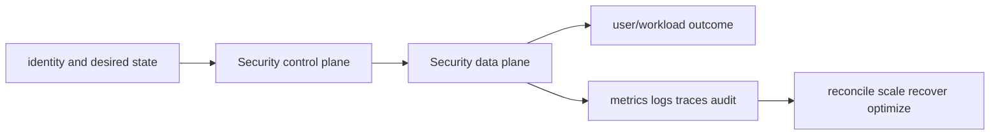

# Security service leaves

<!-- child-topic-toc:start -->
## Table of contents and deeper notes

This parent note explains how the child topics work together. Follow each child link for the deeper mechanism, real commands/configuration, hands-on practice, authoritative documentation, and its local interview bank.

- [Kubernetes admission policies and webhooks](admission-policies-webhooks/README.md) — [questions and answers](admission-policies-webhooks/questions-and-answers.md)
- [Kubernetes authentication, RBAC and ServiceAccounts](authn-rbac-serviceaccounts/README.md) — [questions and answers](authn-rbac-serviceaccounts/questions-and-answers.md)
- [Kubernetes multi-tenancy](multitenancy/README.md) — [questions and answers](multitenancy/questions-and-answers.md)
- [Pod and node workload security](pod-security/README.md) — [questions and answers](pod-security/questions-and-answers.md)
- [Kubernetes Secrets and ConfigMaps](secrets-configmaps/README.md) — [questions and answers](secrets-configmaps/questions-and-answers.md)
<!-- child-topic-toc:end -->
- [Kubernetes authentication, RBAC and ServiceAccounts](authn-rbac-serviceaccounts/README.md) — [Q&A](authn-rbac-serviceaccounts/questions-and-answers.md)
- [Pod and node workload security](pod-security/README.md) — [Q&A](pod-security/questions-and-answers.md)
- [Kubernetes Secrets and ConfigMaps](secrets-configmaps/README.md) — [Q&A](secrets-configmaps/questions-and-answers.md)
- [Kubernetes admission policies and webhooks](admission-policies-webhooks/README.md) — [Q&A](admission-policies-webhooks/questions-and-answers.md)
- [Kubernetes multi-tenancy](multitenancy/README.md) — [Q&A](multitenancy/questions-and-answers.md)

> Interview bank: [questions-and-answers.md](questions-and-answers.md) · Official documentation: <https://kubernetes.io/docs/reference/access-authn-authz/rbac/>

## Easy mode: purpose and mental model

Integrate the security branch as one production capability rather than isolated products.



## Detailed learning notes

| # | Concept | What you must be able to explain |
|---:|---|---|
| 1 | **Authentication** | client cert, bearer token, OIDC/webhook identifies user/groups or ServiceAccount. |
| 2 | **Authorization** | RBAC/webhook/node/ABAC modes decide a request after authentication. |
| 3 | **runAsNonRoot** | prevents UID 0 execution when image/runtime identity can be determined. |
| 4 | **allowPrivilegeEscalation** | blocks gaining more privilege through exec/setuid and is affected by privilege/capabilities. |
| 5 | **ConfigMap** | non-secret key/file configuration consumed via API, env or projected volume. |
| 6 | **Secret** | API object whose data is base64-encoded and requires encryption/RBAC controls. |
| 7 | **Admission sequence** | mutation precedes object schema/defaulting stages and validation before persistence. |
| 8 | **ValidatingAdmissionPolicy** | CEL policy in API server avoids external webhook network dependency. |
| 9 | **Namespace tenancy** | soft/shared control boundary needing RBAC, policy, quotas and trusted cluster admins. |
| 10 | **Cluster-per-tenant** | stronger failure/control isolation at fleet cost and operational scale. |

## Architecture and lifecycle

Trace this service from request/authentication and desired configuration through provisioning, steady-state data path, scaling, change, failure, recovery and retirement. Bind every production resource to an owner, environment, data classification, source-of-truth revision, SLO, runbook, cost center and deletion/retention policy.

For Security, draw a real request/resource path and label where these mechanisms act: Authentication, Authorization, runAsNonRoot, allowPrivilegeEscalation, ConfigMap, Secret, Admission sequence, ValidatingAdmissionPolicy, Namespace tenancy, Cluster-per-tenant. State which parts are control plane versus data plane, regional versus zonal/global, synchronous versus asynchronous, and customer versus provider responsibility.

## Security model

Start with the caller/workload identity and evaluate every applicable identity, resource, organization, network-endpoint, encryption-key and admission policy. Minimize public paths, long-lived credentials, wildcard actions/resources and unreviewed cross-account/tenant trust. Encrypt in transit/at rest where applicable, but include key/certificate rotation and recovery. Protect audit evidence and prevent secrets/customer content from entering command history, logs, traces or metric labels.

## Availability and failure modes

List dependencies and failure domains before claiming high availability. Test quota/capacity, identity/control-plane, DNS/network/TLS, configuration drift, downstream saturation, zonal/Regional/node failure and recovery from protected state. Use bounded timeout, retry budget, jitter, idempotency, backpressure, load shedding and graceful drain according to protocol. A green resource status is not a user-facing recovery check.

## Performance, scaling and cost

Measure workload distribution and SLI before sizing. Track rate/work units, latency distribution, errors, saturation/queue and service-specific limits. Separate replica/task scaling from infrastructure/capacity scaling and include cold-start/provisioning delay. Cost includes idle/provisioned capacity, requests/work units, storage/retention, cross-AZ/Region/egress/NAT, observability, licenses/support and failure headroom. Optimize cost per successful SLO/quality-controlled task.

## Observability

Correlate a request/change across user, route/resource, dependency and underlying compute/storage/network. Use stable owner/environment/region/service dimensions; put high-cardinality request/object IDs in sampled logs/traces rather than metric labels. Alert on actionable SLO burn and leading exhaustion. Monitor the telemetry path and keep a read-only diagnostic role.

## Command lab

Run in a sandbox with the correct account/context/Region. Read and explain output before mutation.

```bash
kubectl auth whoami
kubectl get ns --show-labels
kubectl get configmap,secret -n NS
kubectl get validatingadmissionpolicy,validatingadmissionpolicybinding
kubectl get resourcequota,limitrange,networkpolicy,rolebinding -A
```

For each command, record: identity/context, exact resource, expected healthy fields, one failing output, the next command/query, and which mutation would be reversible. Never paste secrets/tokens into committed notes or shared terminal history.

## Real-world exercise: easy → hard

1. **Easy:** inventory one healthy Security resource and draw identity/control/data/dependency paths.
2. **Intermediate:** reproduce a safe configuration change with IaC, preview/diff, apply to a sandbox, verify and roll back.
3. **Hard:** inject one policy/network/quota/capacity/dependency failure, diagnose from user symptom to root mechanism, mitigate without widening access, then add an alert/test/runbook.
4. **Senior:** design the service for two tenants, multi-zone/Region failure, RPO/RTO, regulated data, 10× demand and a 30% cost reduction; quantify trade-offs.

## Common interview traps

- Naming a feature without explaining request/resource lifecycle or failure semantics.
- Treating an allow, encryption checkbox, replica count or managed-service label as a complete security/reliability design.
- Mutating production before capturing identity, status, events, metrics, logs, audit and recent changes.
- Scaling the wrong layer or retrying overload/permanent errors.
- Omitting quotas, cold start, deletion/restore, observability cost or customer/tenant boundaries.

## Revision summary

Explain Security in five passes: purpose/selection, mechanism/lifecycle, security/failure, operation/commands, and architecture/economics. Then complete the separate [answered question bank](questions-and-answers.md) without looking at these notes.
