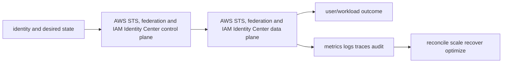

# AWS STS, federation and IAM Identity Center

<!-- chapter-guide:start -->
> **Step 107 of 373 — 07.01.03**
>
> **Builds on:** [AWS Organizations](../02-organizations/README.md)
>
> **Now:** Learn **AWS STS, federation and IAM Identity Center** from its mental model through production ownership.
>
> **Then:** Rehearse the linked questions and continue to [AWS Control Tower, tagging, quotas and governance](../04-control-tower-governance/README.md).
<!-- chapter-guide:end -->

> Interview bank: [questions-and-answers.md](questions-and-answers.md) · Official documentation: <https://docs.aws.amazon.com/STS/latest/APIReference/welcome.html>

## Easy mode: purpose and mental model

Issue short-lived human, workload, CI and cross-account sessions with explicit trust and attribution.



## Detailed learning notes

| # | Concept | What you must be able to explain |
|---:|---|---|
| 1 | **AssumeRole** | exchanges an authenticated caller for temporary role credentials subject to trust and permissions. |
| 2 | **Trust policy** | controls which principal and conditions may assume a role. |
| 3 | **Role permissions** | control what the resulting session can do after assumption. |
| 4 | **External ID** | mitigates confused-deputy risk for third-party cross-account role assumption. |
| 5 | **OIDC web identity** | exchanges a signed workload token with issuer, audience and subject conditions. |
| 6 | **SAML federation** | maps enterprise identity assertions into AWS role sessions. |
| 7 | **Identity Center** | centralizes workforce assignments and permission sets across accounts. |
| 8 | **Role chaining** | assumes another role from a role session and has duration/attribution constraints. |
| 9 | **Session tags/source identity** | propagate authorized attribution/context into policy and audit. |
| 10 | **Credential refresh** | applications must refresh before expiry and avoid persisting temporary credentials. |

## Architecture and lifecycle

Trace this service from request/authentication and desired configuration through provisioning, steady-state data path, scaling, change, failure, recovery and retirement. Bind every production resource to an owner, environment, data classification, source-of-truth revision, SLO, runbook, cost center and deletion/retention policy.

For AWS STS, federation and IAM Identity Center, draw a real request/resource path and label where these mechanisms act: AssumeRole, Trust policy, Role permissions, External ID, OIDC web identity, SAML federation, Identity Center, Role chaining, Session tags/source identity, Credential refresh. State which parts are control plane versus data plane, regional versus zonal/global, synchronous versus asynchronous, and customer versus provider responsibility.

## Security model

Start with the caller/workload identity and evaluate every applicable identity, resource, organization, network-endpoint, encryption-key and admission policy. Minimize public paths, long-lived credentials, wildcard actions/resources and unreviewed cross-account/tenant trust. Encrypt in transit/at rest where applicable, but include key/certificate rotation and recovery. Protect audit evidence and prevent secrets/customer content from entering command history, logs, traces or metric labels.

## Availability and failure modes

List dependencies and failure domains before claiming high availability. Test quota/capacity, identity/control-plane, DNS/network/TLS, configuration drift, downstream saturation, zonal/Regional/node failure and recovery from protected state. Use bounded timeout, retry budget, jitter, idempotency, backpressure, load shedding and graceful drain according to protocol. A green resource status is not a user-facing recovery check.

## Performance, scaling and cost

Measure workload distribution and SLI before sizing. Track rate/work units, latency distribution, errors, saturation/queue and service-specific limits. Separate replica/task scaling from infrastructure/capacity scaling and include cold-start/provisioning delay. Cost includes idle/provisioned capacity, requests/work units, storage/retention, cross-AZ/Region/egress/NAT, observability, licenses/support and failure headroom. Optimize cost per successful SLO/quality-controlled task.

## Observability

Correlate a request/change across user, route/resource, dependency and underlying compute/storage/network. Use stable owner/environment/region/service dimensions; put high-cardinality request/object IDs in sampled logs/traces rather than metric labels. Alert on actionable SLO burn and leading exhaustion. Monitor the telemetry path and keep a read-only diagnostic role.

## Command lab

Run in a sandbox with the correct account/context/Region. Read and explain output before mutation.

```bash
aws sts assume-role --role-arn ROLE_ARN --role-session-name NAME
aws sts decode-authorization-message --encoded-message MESSAGE
aws sso login --profile PROFILE
aws configure export-credentials --profile PROFILE
```

For each command, record: identity/context, exact resource, expected healthy fields, one failing output, the next command/query, and which mutation would be reversible. Never paste secrets/tokens into committed notes or shared terminal history.

## Real-world exercise: easy → hard

1. **Easy:** inventory one healthy AWS STS, federation and IAM Identity Center resource and draw identity/control/data/dependency paths.
2. **Intermediate:** reproduce a safe configuration change with IaC, preview/diff, apply to a sandbox, verify and roll back.
3. **Hard:** inject one policy/network/quota/capacity/dependency failure, diagnose from user symptom to root mechanism, mitigate without widening access, then add an alert/test/runbook.
4. **Senior:** design the service for two tenants, multi-zone/Region failure, RPO/RTO, regulated data, 10× demand and a 30% cost reduction; quantify trade-offs.

## Common interview traps

- Naming a feature without explaining request/resource lifecycle or failure semantics.
- Treating an allow, encryption checkbox, replica count or managed-service label as a complete security/reliability design.
- Mutating production before capturing identity, status, events, metrics, logs, audit and recent changes.
- Scaling the wrong layer or retrying overload/permanent errors.
- Omitting quotas, cold start, deletion/restore, observability cost or customer/tenant boundaries.

## Revision summary

Explain AWS STS, federation and IAM Identity Center in five passes: purpose/selection, mechanism/lifecycle, security/failure, operation/commands, and architecture/economics. Then complete the separate [answered question bank](questions-and-answers.md) without looking at these notes.

<!-- reading-navigation:start -->
---

**Reading path:** [← Back: AWS Organizations](../02-organizations/README.md) · [Questions](questions-and-answers.md) · [Next: AWS Control Tower, tagging, quotas and governance →](../04-control-tower-governance/README.md)

<!-- reading-navigation:end -->
