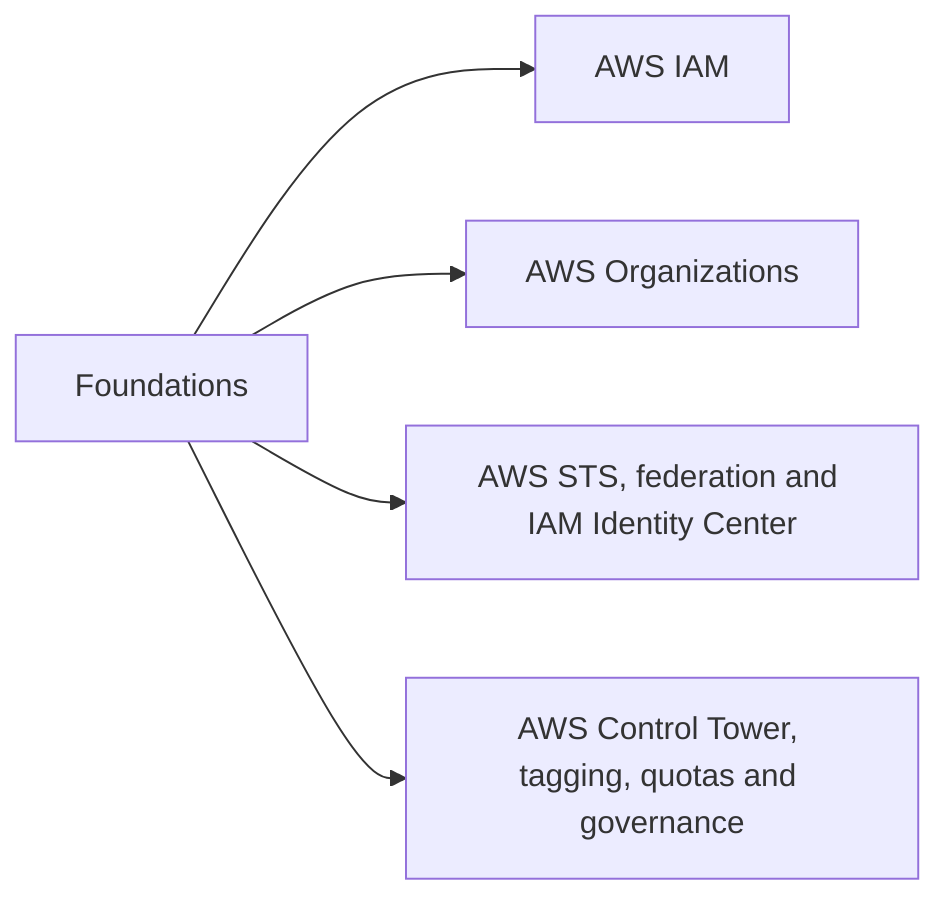
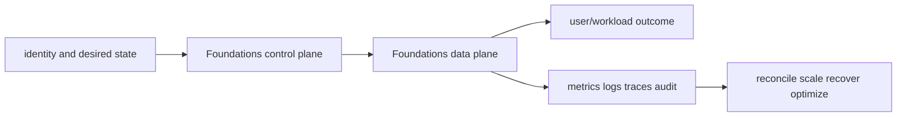

# Foundations

<!-- chapter-guide:start -->
> **Step 104 of 373 — 07.01**
>
> **Builds on:** [AWS interview curriculum tree](../README.md)
>
> **Now:** Learn **Foundations** from its mental model through production ownership.
>
> **Then:** Rehearse the linked questions and continue to [AWS IAM](01-iam/README.md).
<!-- chapter-guide:end -->

This branch README is both the study note and the map. Each service leaf keeps its notes in its own README and its answered interview bank in a separate file.




## Branch learning contract

Learn the easy mental model first, run the read-only commands in a sandbox, render/apply the examples only in disposable environments, then break and repair one dependency at a time. Be able to connect these topics across the branch: Principals, Identity policies, Resource policies, Management account, Member accounts, Organizational units, AssumeRole, Trust policy, Role permissions, Landing zone, Control Tower controls, Tag taxonomy.

## Branch interview bank

See [questions-and-answers.md](questions-and-answers.md) for 60 additional branch-level questions and answers. Service-specific banks contain another 60 per service.

> Interview bank: [questions-and-answers.md](questions-and-answers.md) · Official documentation: <https://docs.aws.amazon.com/IAM/latest/UserGuide/introduction.html>

## Easy mode: purpose and mental model

Integrate the foundations branch as one production capability rather than isolated products.



## Detailed learning notes

| # | Concept | What you must be able to explain |
|---:|---|---|
| 1 | **Principals** | users, roles, sessions, federated identities and AWS services can make requests under different identity lifecycles. |
| 2 | **Identity policies** | attached policies grant or deny actions to a principal within the rest of the policy intersection. |
| 3 | **Management account** | owns the organization and must be tightly protected rather than used for workloads. |
| 4 | **Member accounts** | separate workloads, environments, teams and blast radii with independent quotas and root identities. |
| 5 | **AssumeRole** | exchanges an authenticated caller for temporary role credentials subject to trust and permissions. |
| 6 | **Trust policy** | controls which principal and conditions may assume a role. |
| 7 | **Landing zone** | standardized multi-account identity, logging, security and network foundation. |
| 8 | **Control Tower controls** | preventive, detective and proactive controls differ in enforcement timing and mechanism. |

## Architecture and lifecycle

Trace this service from request/authentication and desired configuration through provisioning, steady-state data path, scaling, change, failure, recovery and retirement. Bind every production resource to an owner, environment, data classification, source-of-truth revision, SLO, runbook, cost center and deletion/retention policy.

For Foundations, draw a real request/resource path and label where these mechanisms act: Principals, Identity policies, Management account, Member accounts, AssumeRole, Trust policy, Landing zone, Control Tower controls. State which parts are control plane versus data plane, regional versus zonal/global, synchronous versus asynchronous, and customer versus provider responsibility.

## Security model

Start with the caller/workload identity and evaluate every applicable identity, resource, organization, network-endpoint, encryption-key and admission policy. Minimize public paths, long-lived credentials, wildcard actions/resources and unreviewed cross-account/tenant trust. Encrypt in transit/at rest where applicable, but include key/certificate rotation and recovery. Protect audit evidence and prevent secrets/customer content from entering command history, logs, traces or metric labels.

## Availability and failure modes

List dependencies and failure domains before claiming high availability. Test quota/capacity, identity/control-plane, DNS/network/TLS, configuration drift, downstream saturation, zonal/Regional/node failure and recovery from protected state. Use bounded timeout, retry budget, jitter, idempotency, backpressure, load shedding and graceful drain according to protocol. A green resource status is not a user-facing recovery check.

## Performance, scaling and cost

Measure workload distribution and SLI before sizing. Track rate/work units, latency distribution, errors, saturation/queue and service-specific limits. Separate replica/task scaling from infrastructure/capacity scaling and include cold-start/provisioning delay. Cost includes idle/provisioned capacity, requests/work units, storage/retention, cross-AZ/Region/egress/NAT, observability, licenses/support and failure headroom. Optimize cost per successful SLO/quality-controlled task.

## Observability

Correlate a request/change across user, route/resource, dependency and underlying compute/storage/network. Use stable owner/environment/region/service dimensions; put high-cardinality request/object IDs in sampled logs/traces rather than metric labels. Alert on actionable SLO burn and leading exhaustion. Monitor the telemetry path and keep a read-only diagnostic role.

## Command lab

Run in a sandbox with the correct account/context/Region. Read and explain output before mutation.

```bash
aws sts get-caller-identity
aws organizations describe-organization
aws sts assume-role --role-arn ROLE_ARN --role-session-name NAME
aws controltower list-enabled-controls --target-identifier OU_ARN
```

For each command, record: identity/context, exact resource, expected healthy fields, one failing output, the next command/query, and which mutation would be reversible. Never paste secrets/tokens into committed notes or shared terminal history.

## Real-world exercise: easy → hard

1. **Easy:** inventory one healthy Foundations resource and draw identity/control/data/dependency paths.
2. **Intermediate:** reproduce a safe configuration change with IaC, preview/diff, apply to a sandbox, verify and roll back.
3. **Hard:** inject one policy/network/quota/capacity/dependency failure, diagnose from user symptom to root mechanism, mitigate without widening access, then add an alert/test/runbook.
4. **Senior:** design the service for two tenants, multi-zone/Region failure, RPO/RTO, regulated data, 10× demand and a 30% cost reduction; quantify trade-offs.

## Common interview traps

- Naming a feature without explaining request/resource lifecycle or failure semantics.
- Treating an allow, encryption checkbox, replica count or managed-service label as a complete security/reliability design.
- Mutating production before capturing identity, status, events, metrics, logs, audit and recent changes.
- Scaling the wrong layer or retrying overload/permanent errors.
- Omitting quotas, cold start, deletion/restore, observability cost or customer/tenant boundaries.

## Revision summary

Explain Foundations in five passes: purpose/selection, mechanism/lifecycle, security/failure, operation/commands, and architecture/economics. Then complete the separate [answered question bank](questions-and-answers.md) without looking at these notes.

<!-- merged-07-AWS-FOUNDATIONS-IAM-GOVERNANCE-MD:start -->
## Practical deep dive

## Purpose and mental model

An AWS account is the primary isolation, ownership, billing and quota boundary. Organizations arranges accounts under OUs; SCPs set the maximum available permissions but grant nothing. IAM answers **who can perform which action on which resource under which conditions**. A mature platform uses federation and short-lived roles, separate workload accounts, centralized security/logging, and automated guardrails.

## Architecture and lifecycle

AWS Regions contain multiple Availability Zones; most resources are regional or AZ-scoped while some control planes are global. Design with explicit failure domains and verify service-specific behavior. Start an organization with management, security/audit, log archive, shared services/network, and workload accounts. Apply SCPs at root/OU/account, delegate service administration, vend accounts through a landing zone, and record owner/environment/data classification/cost center.

An IAM request is authenticated, builds a request context, and is evaluated across identity/resource policies plus guardrails. An explicit deny wins. Effective permissions are limited by identity policies, resource policies where applicable, permissions boundaries, session policies, SCPs/RCPs, and service-specific controls such as KMS key or VPC endpoint policies. `AssumeRole` returns temporary STS credentials. Trust policy controls who may assume; permissions policy controls what the resulting session may do.

Prefer Identity Center/federation for people, instance/task/pod/workload identities for software, OIDC for CI, and external IDs for confused-deputy protection in third-party cross-account access. Avoid IAM users and access keys except for narrowly justified legacy cases. Separate deployment, runtime, read-only and break-glass roles.

## Security, reliability and operations

- Deny leaving approved Regions, disabling audit/security services, making critical storage public, or using unapproved identity paths where the service semantics support it.
- Use least privilege from observed access, condition keys (`aws:PrincipalOrgID`, resource/request tags, source VPC/endpoint, MFA), Access Analyzer, credential reports and periodic access reviews.
- Protect the management account, require phishing-resistant MFA, monitor root use, keep break-glass access offline and test it.
- Centralize organization CloudTrail and Config with immutable storage and independent security-account access. Detect organization/account/policy changes.
- Treat quotas as capacity dependencies: inventory, alert before thresholds, request increases early, diversify Regions/types when appropriate.
- Tag policies improve consistency but enforcement may require SCPs, service policies, IaC validation or Config remediation. Never rely on tags alone as a security boundary unless the full mutation path is constrained.

## Availability, cost and practical diagnosis

Identity and organization control-plane dependencies can block every workload. Cache no long-lived privileges as a workaround. Build tested emergency roles, multiple federation administrators, and recovery procedures. Consolidated billing enables commitment sharing and allocation, but ownership still requires activated cost-allocation tags, account boundaries and usage dimensions.

Read-only diagnostic path:

```bash
aws sts get-caller-identity
aws iam simulate-principal-policy --policy-source-arn ROLE_ARN --action-names ACTION
aws accessanalyzer validate-policy --policy-document file://policy.json --policy-type IDENTITY_POLICY
aws organizations list-parents --child-id ACCOUNT_ID
aws service-quotas get-service-quota --service-code SERVICE --quota-code QUOTA
```

For `AccessDenied`, capture principal/session ARN, action, resource ARN, Region/account, request conditions and request ID. Check explicit denies and guardrails before adding permissions. CloudTrail may show the denied call, but authorization details vary; use policy simulation and service-specific context.

## Revision summary

- Accounts are blast-radius and ownership boundaries; OUs are policy groupings.
- SCPs constrain; they do not grant.
- Trust controls role assumption; permissions control the session.
- Short-lived federated/workload identity is the default.
- Diagnose the complete policy intersection and conditions, not only the attached role policy.


<!-- merged-07-AWS-FOUNDATIONS-IAM-GOVERNANCE-MD:end -->

<!-- reading-navigation:start -->
---

**Reading path:** [← Back: AWS interview curriculum tree](../README.md) · [Questions](questions-and-answers.md) · [Next: AWS IAM →](01-iam/README.md)

<!-- reading-navigation:end -->
