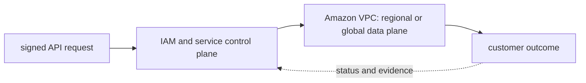

# Amazon VPC

<!-- chapter-guide:start -->
> **Step 110 of 373 — 07.02.01**
>
> **Builds on:** [Networking](../README.md)
>
> **Now:** Learn **Amazon VPC** from its mental model through production ownership.
>
> **Then:** Rehearse the linked questions and continue to [Security groups and network ACLs](../02-security-groups-nacls/README.md).
<!-- chapter-guide:end -->

> Interview bank: [questions-and-answers.md](questions-and-answers.md) · Official documentation: <https://docs.aws.amazon.com/vpc/latest/userguide/what-is-amazon-vpc.html>

## Explanation

### What it is and why it exists

**Amazon VPC** is easiest to understand as one part of a larger path. The subject has an API control plane and a workload data plane. An authenticated request is authorized, validated and persisted; managed controllers then create or reconfigure regional or global resources that serve traffic or process data.

The chapter focuses on VPC CIDR, Subnet, Route table, Internet gateway. These are connected mechanisms, not vocabulary to memorize. Design regional IP, subnet and routing domains and reason about every forward and return packet path The explanations below first build the simple model, then add the exact system behavior and production consequences.

### History and evolution

AWS helped turn infrastructure into an on-demand API with services such as S3 and EC2 in 2006. The platform expanded from individual virtual resources into regional managed control planes, global identity and governance, event-driven services and specialized data and AI systems; automation therefore became as important as resource creation.

In this chapter, **Amazon VPC** is the next layer of that evolution. Its modern purpose is to design regional IP, subnet and routing domains and reason about every forward and return packet path. The exact product surface may change by version, but the underlying state, request path and failure boundaries remain the durable ideas to learn.

### How it works: the end-to-end path



The diagram is a feedback loop rather than a one-way provisioning sequence. A caller supplies identity and intent; the control plane validates and records that intent; asynchronous controllers, runtimes or managed infrastructure create the effective data plane; and status and telemetry feed the next decision. A successful API response can therefore mean only "the request was accepted," not "the workload outcome is healthy."

For **Amazon VPC**, the mechanisms participating in that loop are VPC CIDR, Subnet, Route table, Internet gateway, Egress-only internet gateway, ENI, IPAM, DHCP options, VPC Flow Logs, Reachability Analyzer. Some run synchronously on the caller's request, while others converge later. This timing distinction explains many production surprises: the desired object can exist before capacity is ready, a data path can continue while its control plane is impaired, and a timeout can leave the final side effect unknown.

### Core concepts explained in detail

#### VPC CIDR

**What it is.** Regional IPv4/IPv6 address space must avoid overlap and leave room for workloads, pods and growth.

**Junior mental model.** A useful analogy is a parcel journey: the name identifies the destination, routing selects each next hop, policy decides whether the parcel may pass, transport tracks delivery, and the application decides what the contents mean.

**How it works.** A real request crosses several independent states: name resolution returns an address, the source selects a route and source address, link or overlay forwarding reaches the next hop, stateful or stateless policy evaluates the flow, transport establishes communication, and TLS/application protocols negotiate their own contract. The return path must also work.

**What it looks like in production.** Healthy evidence progresses layer by layer: correct name/address, expected route, permitted flow, listening endpoint, successful handshake and valid application response. Timeouts, refusals, resets and protocol errors mean different layers; packet loss, MTU, asymmetric paths, connection-state exhaustion and proxy timeout mismatch are common production failures.

#### Subnet

**What it is.** AZ-scoped address range whose route table and address behavior determine public/private/isolated use.

**Junior mental model.** A useful analogy is a parcel journey: the name identifies the destination, routing selects each next hop, policy decides whether the parcel may pass, transport tracks delivery, and the application decides what the contents mean.

**How it works.** A real request crosses several independent states: name resolution returns an address, the source selects a route and source address, link or overlay forwarding reaches the next hop, stateful or stateless policy evaluates the flow, transport establishes communication, and TLS/application protocols negotiate their own contract. The return path must also work.

**What it looks like in production.** Healthy evidence progresses layer by layer: correct name/address, expected route, permitted flow, listening endpoint, successful handshake and valid application response. Timeouts, refusals, resets and protocol errors mean different layers; packet loss, MTU, asymmetric paths, connection-state exhaustion and proxy timeout mismatch are common production failures.

#### Route table

**What it is.** Longest-prefix match selects a next hop such as local, IGW, NAT, TGW, peering or endpoint.

**Junior mental model.** A useful analogy is a parcel journey: the name identifies the destination, routing selects each next hop, policy decides whether the parcel may pass, transport tracks delivery, and the application decides what the contents mean.

**How it works.** A real request crosses several independent states: name resolution returns an address, the source selects a route and source address, link or overlay forwarding reaches the next hop, stateful or stateless policy evaluates the flow, transport establishes communication, and TLS/application protocols negotiate their own contract. The return path must also work.

**What it looks like in production.** Healthy evidence progresses layer by layer: correct name/address, expected route, permitted flow, listening endpoint, successful handshake and valid application response. Timeouts, refusals, resets and protocol errors mean different layers; packet loss, MTU, asymmetric paths, connection-state exhaustion and proxy timeout mismatch are common production failures.

#### Internet gateway

**What it is.** VPC edge target that supports public internet routing for appropriately addressed resources.

**Junior mental model.** A useful analogy is a parcel journey: the name identifies the destination, routing selects each next hop, policy decides whether the parcel may pass, transport tracks delivery, and the application decides what the contents mean.

**How it works.** A real request crosses several independent states: name resolution returns an address, the source selects a route and source address, link or overlay forwarding reaches the next hop, stateful or stateless policy evaluates the flow, transport establishes communication, and TLS/application protocols negotiate their own contract. The return path must also work.

**What it looks like in production.** Healthy evidence progresses layer by layer: correct name/address, expected route, permitted flow, listening endpoint, successful handshake and valid application response. Timeouts, refusals, resets and protocol errors mean different layers; packet loss, MTU, asymmetric paths, connection-state exhaustion and proxy timeout mismatch are common production failures.

#### Egress-only internet gateway

**What it is.** Permits initiated IPv6 egress while blocking unsolicited inbound routing.

**Junior mental model.** A useful analogy is a parcel journey: the name identifies the destination, routing selects each next hop, policy decides whether the parcel may pass, transport tracks delivery, and the application decides what the contents mean.

**How it works.** A real request crosses several independent states: name resolution returns an address, the source selects a route and source address, link or overlay forwarding reaches the next hop, stateful or stateless policy evaluates the flow, transport establishes communication, and TLS/application protocols negotiate their own contract. The return path must also work.

**What it looks like in production.** Healthy evidence progresses layer by layer: correct name/address, expected route, permitted flow, listening endpoint, successful handshake and valid application response. Timeouts, refusals, resets and protocol errors mean different layers; packet loss, MTU, asymmetric paths, connection-state exhaustion and proxy timeout mismatch are common production failures.

#### ENI

**What it is.** Carries addresses, security groups and attachment state for compute and managed-service data planes.

**Junior mental model.** The simplest mental model is a state machine: an input is checked, current state is read, a rule computes the next state, and an observable result tells callers whether the transition succeeded.

**How it works.** The mechanism receives configuration or runtime input, validates preconditions, changes or derives state, and exposes status to the next component. Synchronous parts return a direct outcome; asynchronous parts need durable status, reconciliation and idempotency because the original caller may disappear.

**What it looks like in production.** Healthy evidence shows the expected state transition and its owner, timestamp and reason. Invalid input, stale state, conflicting writers, hidden limits and dependencies that partially complete are the most useful failure categories to distinguish.

#### IPAM

**What it is.** Plans, allocates and audits address space across accounts/Regions.

**Junior mental model.** The simplest mental model is a state machine: an input is checked, current state is read, a rule computes the next state, and an observable result tells callers whether the transition succeeded.

**How it works.** The mechanism receives configuration or runtime input, validates preconditions, changes or derives state, and exposes status to the next component. Synchronous parts return a direct outcome; asynchronous parts need durable status, reconciliation and idempotency because the original caller may disappear.

**What it looks like in production.** Healthy evidence shows the expected state transition and its owner, timestamp and reason. Invalid input, stale state, conflicting writers, hidden limits and dependencies that partially complete are the most useful failure categories to distinguish.

#### DHCP options

**What it is.** Influence resolver/domain/NTP settings delivered to instances.

**Junior mental model.** The simplest mental model is a state machine: an input is checked, current state is read, a rule computes the next state, and an observable result tells callers whether the transition succeeded.

**How it works.** The mechanism receives configuration or runtime input, validates preconditions, changes or derives state, and exposes status to the next component. Synchronous parts return a direct outcome; asynchronous parts need durable status, reconciliation and idempotency because the original caller may disappear.

**What it looks like in production.** Healthy evidence shows the expected state transition and its owner, timestamp and reason. Invalid input, stale state, conflicting writers, hidden limits and dependencies that partially complete are the most useful failure categories to distinguish.

#### VPC Flow Logs

**What it is.** Capture accepted/rejected flow metadata, not packet payload or every application event.

**Junior mental model.** A useful analogy is a parcel journey: the name identifies the destination, routing selects each next hop, policy decides whether the parcel may pass, transport tracks delivery, and the application decides what the contents mean.

**How it works.** A real request crosses several independent states: name resolution returns an address, the source selects a route and source address, link or overlay forwarding reaches the next hop, stateful or stateless policy evaluates the flow, transport establishes communication, and TLS/application protocols negotiate their own contract. The return path must also work.

**What it looks like in production.** Healthy evidence progresses layer by layer: correct name/address, expected route, permitted flow, listening endpoint, successful handshake and valid application response. Timeouts, refusals, resets and protocol errors mean different layers; packet loss, MTU, asymmetric paths, connection-state exhaustion and proxy timeout mismatch are common production failures.

#### Reachability Analyzer

**What it is.** Evaluates configured network path models and complements runtime packet evidence.

**Junior mental model.** The simplest mental model is a state machine: an input is checked, current state is read, a rule computes the next state, and an observable result tells callers whether the transition succeeded.

**How it works.** The mechanism receives configuration or runtime input, validates preconditions, changes or derives state, and exposes status to the next component. Synchronous parts return a direct outcome; asynchronous parts need durable status, reconciliation and idempotency because the original caller may disappear.

**What it looks like in production.** Healthy evidence shows the expected state transition and its owner, timestamp and reason. Invalid input, stale state, conflicting writers, hidden limits and dependencies that partially complete are the most useful failure categories to distinguish.

### Worked command and configuration example

The following is a diagnostic example, not an unexplained command dump. Define every uppercase placeholder first—for example `NAME`, `RESOURCE`, `PROJECT`, `REGION`, `NAMESPACE`, `URL`, `IMAGE` or `CONTAINER`—and use a sandbox or read-only production role.

```bash
aws ec2 describe-vpcs --vpc-ids VPC_ID
aws ec2 describe-subnets --filters Name=vpc-id,Values=VPC_ID
aws ec2 describe-route-tables --filters Name=vpc-id,Values=VPC_ID
aws ec2 start-network-insights-analysis --network-insights-path-id PATH_ID
```

What the example demonstrates:

- `aws ec2 describe-vpcs --vpc-ids VPC_ID` queries the AWS service control plane; IDs, Region, status/reason fields and request attribution should be correlated with CloudTrail and service metrics.
- `aws ec2 describe-subnets --filters Name=vpc-id,Values=VPC_ID` queries the AWS service control plane; IDs, Region, status/reason fields and request attribution should be correlated with CloudTrail and service metrics.
- `aws ec2 describe-route-tables --filters Name=vpc-id,Values=VPC_ID` queries the AWS service control plane; IDs, Region, status/reason fields and request attribution should be correlated with CloudTrail and service metrics.
- `aws ec2 start-network-insights-analysis --network-insights-path-id PATH_ID` queries the AWS service control plane; IDs, Region, status/reason fields and request attribution should be correlated with CloudTrail and service metrics.

A healthy run returns the intended identity/context, exits successfully and shows the expected object or response without a new warning, retry loop or saturation signal. A failure is useful evidence: preserve the exact exit code, status/reason, timestamp and target, then inspect the immediately adjacent layer before changing anything. This makes the example part of the explanation of **Amazon VPC**, not merely a list to copy.

### Security and trust boundaries

Security begins with the actor and the exact operation, not with a network location. Human, workload, CI and service identities have different lifecycles; every hop must authenticate the relevant identity and authorize the action against the resource and current conditions. Network controls reduce reachable paths, while resource policy and application authorization decide what an already-reachable caller may do. Encryption protects data in transit or at rest, but key access, rotation, revocation and recovery are part of the same system.

The safe design minimizes public paths, long-lived credentials, wildcard permissions and implicit cross-tenant trust. It also protects the evidence plane: audit logs, traces and command history must not become a second copy of secrets or customer content. A production review should be able to identify the enforcement point, default behavior, bypass path, break-glass owner and proof that revoked access actually stops working.

### Reliability and failure behavior

Availability is an end-to-end property. The service depends on identity, quota, API/control-plane health, DNS and network paths, capacity, downstream services and any durable state required to recover. Replicas improve availability only when they occupy independent failure domains and clients can reach a healthy replica; a managed-service label does not remove customer responsibility for configuration, load, data correctness or recovery testing.

Timeouts, bounded retry budgets with jitter, idempotency, backpressure, load shedding and graceful drain control how failures spread. They must match the protocol and side-effect model. A timeout is ambiguous because the remote operation may have completed; blind retry is unsafe when the operation is not idempotent. Recovery is complete only when the original user action works and data, latency, error rate and backlog have returned to acceptable bounds.

### Performance, scaling and cost

Capacity planning starts with a work unit and a distribution, not an average utilization percentage. Relevant signals include request or job arrival rate, work size, latency percentiles, errors, queue age, saturation and service-specific limits. Scaling application replicas and provisioning underlying nodes, storage or provider quota are separate feedback loops with different delays. Cold starts and warm-up determine whether newly allocated capacity helps before the burst is over.

Total cost includes idle headroom, request or token work, storage and retention, cross-zone or cross-Region transfer, NAT/egress, observability, licenses and recovery capacity. The useful optimization target is cost per successful SLO- or quality-controlled outcome. A cheaper configuration that increases retries, operator toil, data risk or missed objectives can raise total cost.

### Observability and troubleshooting

Diagnosis follows the same path as the request. First establish time, user impact, identity and exact target; then compare desired configuration with observed status and recent changes. Continue through control-plane reconciliation, network and protocol evidence, runtime state, dependencies and resource saturation. Metrics show trends, logs explain discrete events, traces connect boundaries, profiles attribute resource use and audit logs explain security decisions.

The most useful next check is the one that distinguishes competing causes. A permission denial calls for policy-evaluation evidence, not a restart; a connection refusal means something different from a timeout; a pending resource with a scheduling reason differs from a running resource whose application is unready. Reversible mitigation stabilizes impact, while the durable repair updates Git, IaC, policy or the owning service and adds a regression test or alert.

### What you should be able to explain

Use this table only after reading the explanations above. It is a revision checklist, not a substitute for the lesson.

| # | Concept | What you must be able to explain |
|---:|---|---|
| 1 | **VPC CIDR** | regional IPv4/IPv6 address space must avoid overlap and leave room for workloads, pods and growth |
| 2 | **Subnet** | AZ-scoped address range whose route table and address behavior determine public/private/isolated use |
| 3 | **Route table** | longest-prefix match selects a next hop such as local, IGW, NAT, TGW, peering or endpoint |
| 4 | **Internet gateway** | VPC edge target that supports public internet routing for appropriately addressed resources |
| 5 | **Egress-only internet gateway** | permits initiated IPv6 egress while blocking unsolicited inbound routing |
| 6 | **ENI** | carries addresses, security groups and attachment state for compute and managed-service data planes |
| 7 | **IPAM** | plans, allocates and audits address space across accounts/Regions |
| 8 | **DHCP options** | influence resolver/domain/NTP settings delivered to instances |
| 9 | **VPC Flow Logs** | capture accepted/rejected flow metadata, not packet payload or every application event |
| 10 | **Reachability Analyzer** | evaluates configured network path models and complements runtime packet evidence |

### Common interview traps

- Naming a feature without explaining request/resource lifecycle or failure semantics.
- Treating an allow, encryption checkbox, replica count or managed-service label as a complete security/reliability design.
- Mutating production before capturing identity, status, events, metrics, logs, audit and recent changes.
- Scaling the wrong layer or retrying overload/permanent errors.
- Omitting quotas, cold start, deletion/restore, observability cost or customer/tenant boundaries.

## Practice

### Practice objective

Build a small, safe proof of **Amazon VPC** and explain the result in your own words. The goal is not command completion; it is to connect input, internal mechanism, observable state and user outcome.

### Prerequisites and setup

Use a disposable local environment, sandbox account/project or isolated namespace. Confirm the effective identity and target, record the start time, and set a cost limit before creating anything.

Record tool and platform versions because flags, APIs and defaults can change. Define every uppercase placeholder before use and keep secrets out of shell history and committed files.

### Activity 1: establish a healthy baseline

Run the read-oriented example first:

```bash
aws ec2 describe-vpcs --vpc-ids VPC_ID
aws ec2 describe-subnets --filters Name=vpc-id,Values=VPC_ID
aws ec2 describe-route-tables --filters Name=vpc-id,Values=VPC_ID
aws ec2 start-network-insights-analysis --network-insights-path-id PATH_ID
```

For each line, write down the layer it inspects, the expected healthy field or response, and one thing it cannot prove. The expected result is an attributable request against the intended target plus enough state to draw the path from input to outcome.

### Activity 2: create or review the smallest working example

Put the smallest relevant command, configuration, manifest or code sample in source control. Validate or lint it, produce a preview/diff where the tool supports one, and apply only inside the disposable boundary. Record the exact revision and resulting resource or process ID. If the topic is observational rather than configurable, save a sanitized baseline and an automated assertion instead of mutating the system.

### Activity 3: controlled failure and troubleshooting

Introduce one bounded failure: use a definitely nonexistent resource name, an invalid sandbox-only value, a denied test identity, a closed test port or a stopped disposable dependency. Capture the exact error and classify it as identity/policy, input/configuration, control-plane reconciliation, network/protocol, dependency or capacity. Test one discriminating hypothesis at a time; do not widen access or restart unrelated components.

Expected failure evidence is a specific non-zero exit, status/reason, event or protocol response that disappears when the controlled fault is removed. If healthy and failing runs look identical, the chosen signal does not explain the phenomenon and the exercise is not complete.

### Verification

Repeat the original client or user-facing check, not only an administrative status command. Confirm the desired revision, data correctness where applicable, error and latency recovery, and absence of a continuing retry/backlog/saturation condition. Explain why this evidence proves recovery and what uncertainty remains.

### Cleanup and rollback

Revert the configuration in its source of truth and review the rollback diff before applying it. Delete only the named sandbox resources, stop disposable processes, remove temporary credentials and verify that no billable resource, volume, artifact, queue item or background job remains. Read-only activities require no infrastructure rollback, but sanitized captures must still follow retention policy.

### Harder extension

Automate the healthy and failing paths in CI, use short-lived identity, add one SLI/alert or policy assertion, and write a five-step runbook another engineer can execute without hidden context. Then explain how the design changes for two tenants, a zonal or dependency failure, 10× load and a strict cost or recovery target.

<!-- reading-navigation:start -->
---

**Reading path:** [← Back: Networking](../README.md) · [Questions](questions-and-answers.md) · [Next: Security groups and network ACLs →](../02-security-groups-nacls/README.md)

<!-- reading-navigation:end -->
