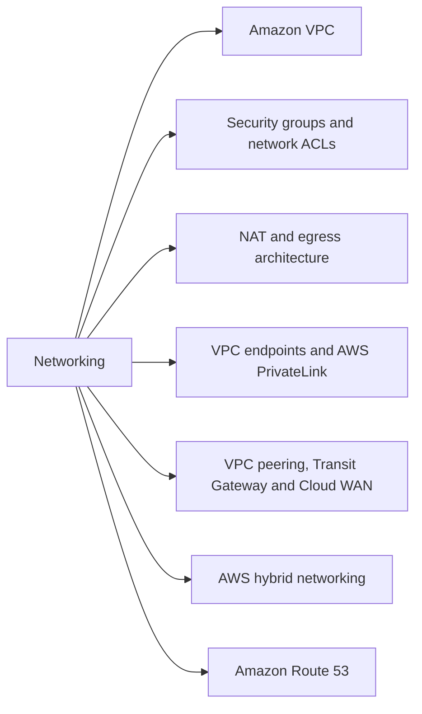
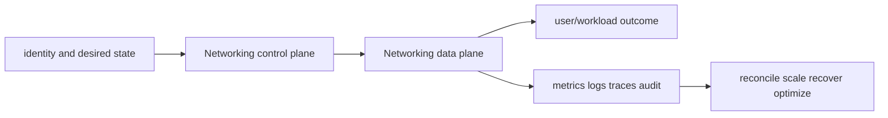

# Networking

<!-- chapter-guide:start -->
> **Step 109 of 373 — 07.02**
>
> **Builds on:** [AWS Control Tower, tagging, quotas and governance](../01-foundations/04-control-tower-governance/README.md)
>
> **Now:** Learn **Networking** from its mental model through production ownership.
>
> **Then:** Rehearse the linked questions and continue to [Amazon VPC](01-vpc/README.md).
<!-- chapter-guide:end -->

This branch README is both the study note and the map. Each service leaf keeps its notes in its own README and its answered interview bank in a separate file.




## Branch learning contract

Learn the easy mental model first, run the read-only commands in a sandbox, render/apply the examples only in disposable environments, then break and repair one dependency at a time. Be able to connect these topics across the branch: VPC CIDR, Subnet, Route table, Security group state, Security group reference, Outbound rules, NAT gateway, NAT instance, Centralized egress, Gateway endpoint, Interface endpoint, Private DNS, VPC peering, Transit Gateway attachments, TGW route association, Site-to-Site VPN, BGP, Direct Connect, Hosted zone, Alias record, Weighted routing.

## Branch interview bank

See [questions-and-answers.md](questions-and-answers.md) for 60 additional branch-level questions and answers. Service-specific banks contain another 60 per service.

> Interview bank: [questions-and-answers.md](questions-and-answers.md) · Official documentation: <https://docs.aws.amazon.com/vpc/latest/userguide/what-is-amazon-vpc.html>

## Easy mode: purpose and mental model

Integrate the networking branch as one production capability rather than isolated products.



## Detailed learning notes

| # | Concept | What you must be able to explain |
|---:|---|---|
| 1 | **VPC CIDR** | regional IPv4/IPv6 address space must avoid overlap and leave room for workloads, pods and growth. |
| 2 | **Subnet** | AZ-scoped address range whose route table and address behavior determine public/private/isolated use. |
| 3 | **Security group state** | allowed connections automatically permit tracked return traffic. |
| 4 | **Security group reference** | supported paths can allow traffic from ENIs associated with another group. |
| 5 | **NAT gateway** | managed AZ-scoped IPv4 translation with hourly and data-processing cost. |
| 6 | **NAT instance** | customer-managed translation with patching, throughput and failover responsibility. |
| 7 | **Gateway endpoint** | route-table target for supported services such as S3/DynamoDB without endpoint ENIs. |
| 8 | **Interface endpoint** | PrivateLink ENIs in subnets with security groups and per-hour/data cost. |
| 9 | **VPC peering** | direct non-transitive connectivity that requires non-overlap and routes on both sides. |
| 10 | **Transit Gateway attachments** | connect VPC, VPN, Direct Connect gateway or peering into a routed hub. |

## Architecture and lifecycle

Trace this service from request/authentication and desired configuration through provisioning, steady-state data path, scaling, change, failure, recovery and retirement. Bind every production resource to an owner, environment, data classification, source-of-truth revision, SLO, runbook, cost center and deletion/retention policy.

For Networking, draw a real request/resource path and label where these mechanisms act: VPC CIDR, Subnet, Security group state, Security group reference, NAT gateway, NAT instance, Gateway endpoint, Interface endpoint, VPC peering, Transit Gateway attachments. State which parts are control plane versus data plane, regional versus zonal/global, synchronous versus asynchronous, and customer versus provider responsibility.

## Security model

Start with the caller/workload identity and evaluate every applicable identity, resource, organization, network-endpoint, encryption-key and admission policy. Minimize public paths, long-lived credentials, wildcard actions/resources and unreviewed cross-account/tenant trust. Encrypt in transit/at rest where applicable, but include key/certificate rotation and recovery. Protect audit evidence and prevent secrets/customer content from entering command history, logs, traces or metric labels.

## Availability and failure modes

List dependencies and failure domains before claiming high availability. Test quota/capacity, identity/control-plane, DNS/network/TLS, configuration drift, downstream saturation, zonal/Regional/node failure and recovery from protected state. Use bounded timeout, retry budget, jitter, idempotency, backpressure, load shedding and graceful drain according to protocol. A green resource status is not a user-facing recovery check.

## Performance, scaling and cost

Measure workload distribution and SLI before sizing. Track rate/work units, latency distribution, errors, saturation/queue and service-specific limits. Separate replica/task scaling from infrastructure/capacity scaling and include cold-start/provisioning delay. Cost includes idle/provisioned capacity, requests/work units, storage/retention, cross-AZ/Region/egress/NAT, observability, licenses/support and failure headroom. Optimize cost per successful SLO/quality-controlled task.

## Observability

Correlate a request/change across user, route/resource, dependency and underlying compute/storage/network. Use stable owner/environment/region/service dimensions; put high-cardinality request/object IDs in sampled logs/traces rather than metric labels. Alert on actionable SLO burn and leading exhaustion. Monitor the telemetry path and keep a read-only diagnostic role.

## Command lab

Run in a sandbox with the correct account/context/Region. Read and explain output before mutation.

```bash
aws ec2 describe-vpcs --vpc-ids VPC_ID
aws ec2 describe-security-groups --group-ids SG_ID
aws ec2 describe-nat-gateways
aws ec2 describe-vpc-endpoints --filters Name=vpc-id,Values=VPC_ID
aws ec2 describe-vpc-peering-connections
aws ec2 describe-vpn-connections
aws route53 list-hosted-zones
```

For each command, record: identity/context, exact resource, expected healthy fields, one failing output, the next command/query, and which mutation would be reversible. Never paste secrets/tokens into committed notes or shared terminal history.

## Real-world exercise: easy → hard

1. **Easy:** inventory one healthy Networking resource and draw identity/control/data/dependency paths.
2. **Intermediate:** reproduce a safe configuration change with IaC, preview/diff, apply to a sandbox, verify and roll back.
3. **Hard:** inject one policy/network/quota/capacity/dependency failure, diagnose from user symptom to root mechanism, mitigate without widening access, then add an alert/test/runbook.
4. **Senior:** design the service for two tenants, multi-zone/Region failure, RPO/RTO, regulated data, 10× demand and a 30% cost reduction; quantify trade-offs.

## Common interview traps

- Naming a feature without explaining request/resource lifecycle or failure semantics.
- Treating an allow, encryption checkbox, replica count or managed-service label as a complete security/reliability design.
- Mutating production before capturing identity, status, events, metrics, logs, audit and recent changes.
- Scaling the wrong layer or retrying overload/permanent errors.
- Omitting quotas, cold start, deletion/restore, observability cost or customer/tenant boundaries.

## Revision summary

Explain Networking in five passes: purpose/selection, mechanism/lifecycle, security/failure, operation/commands, and architecture/economics. Then complete the separate [answered question bank](questions-and-answers.md) without looking at these notes.

<!-- merged-07-AWS-VPC-NETWORKING-MD:start -->
## Practical deep dive

## Purpose and mental model

A VPC is a regional virtual network. Subnets are AZ-scoped address ranges. A packet succeeds only when naming, source selection, routes, stateful/stateless filtering, translation, return path and destination listener all agree. Draw both directions of the packet path; “the security group is open” is never a complete diagnosis.

## Addressing, subnets and routes

Plan non-overlapping IPv4/IPv6 CIDRs with growth, secondary ranges, pod/service addressing and hybrid routes in mind; use IPAM where scale justifies it. A subnet is public when its route table sends internet-bound traffic to an internet gateway and the workload has a usable public address. Private subnets normally egress through per-AZ NAT gateways, centralized egress, a proxy, or service endpoints. Isolated subnets have no general internet path.

Routing uses longest-prefix match. Local VPC routes enable internal reachability; IGW, NAT, egress-only IGW, TGW, peering, virtual/private gateways and ENIs are possible targets. NAT gateways translate IPv4 connections and can exhaust ports per destination; they are AZ resources, so cross-AZ designs add dependency and cost. IPv6 uses routing and egress-only gateways rather than IPv4-style NAT as the primary model.

Security groups are stateful and attached to ENIs; return traffic for an allowed connection is automatically tracked. NACLs are stateless ordered subnet rules, so both directions and ephemeral ports matter. Referencing security groups expresses identity-like relationships in supported paths, but does not create routes.

## Private, multi-VPC and hybrid connectivity

Gateway endpoints provide route-table paths for supported services such as S3/DynamoDB. Interface endpoints create PrivateLink ENIs with security groups and optional private DNS. Check endpoint policy, service/resource policy and DNS. VPC peering is non-transitive. Transit Gateway is a routed hub with attachment/propagation/association tables; Cloud WAN adds managed wide-area policy. VPC sharing lets accounts deploy into centrally owned subnets.

Site-to-Site VPN uses redundant tunnels and typically BGP; Direct Connect supplies dedicated connectivity but should be designed with redundant locations/links and often VPN fallback. Hybrid DNS uses Route 53 Resolver inbound/outbound endpoints and conditional forwarding. Avoid loops, overlapping CIDRs, asymmetric appliance paths and accidental route propagation.

Route 53 public/private hosted zones answer DNS; routing policies select records, not packets. Weighted, latency, failover, geolocation/geoproximity and multivalue policies have distinct semantics. DNS health checks cannot repair an unhealthy application design. TTL trades failover agility for query/cache load; clients may cache differently.

## Security, availability, performance, observability and cost

- Segment by account/VPC/subnet/SG; use endpoints and controlled egress; log DNS and flows where justified; inspect traffic through symmetric GWLB/appliance paths.
- Use multi-AZ NAT/endpoints/TGW attachments and redundant hybrid links. Validate failure, not only diagram symmetry.
- Watch IP availability, ENI/pod density, NAT ports/errors/bytes, TGW drops, VPN tunnel/BGP state, DX virtual interfaces, Resolver health and DNS latency.
- VPC Flow Logs record metadata, not payload. Reachability Analyzer reasons about configured paths, while packet capture/mirroring and application telemetry address runtime behavior.
- Cost hotspots include NAT hourly/data processing, cross-AZ transfer, TGW processing, interface endpoint hours/data, Resolver queries/endpoints, DX ports and internet egress.

## Packet-path runbook

1. Define source/destination IP/port/protocol, time window, expected DNS answer and whether failure is connect, TLS or application.
2. Resolve DNS from the failing namespace/host; inspect split-horizon/private endpoint behavior.
3. Inspect source ENI/subnet/route, next hop, destination route and return route.
4. Evaluate source/destination SGs and both-direction NACL rules including ephemeral ports.
5. Check NAT/TGW/peering/endpoint/VPN/DX attachment state, policies, propagation and capacity.
6. Use Flow Logs/Reachability Analyzer, host `ip route`, `ss`, `dig`, `curl`, `traceroute` and `tcpdump` as applicable.
7. Verify listener/target/app, then test from the original client and add a synthetic check.

```bash
aws ec2 describe-route-tables --filters Name=vpc-id,Values=VPC_ID
aws ec2 describe-security-groups --group-ids SG_ID
aws ec2 describe-network-acls --filters Name=association.subnet-id,Values=SUBNET_ID
aws ec2 describe-vpc-endpoints --filters Name=vpc-id,Values=VPC_ID
aws ec2 describe-nat-gateways --filter Name=vpc-id,Values=VPC_ID
```

## Revision summary

- DNS → route → filter → translation → listener → return path.
- SG statefulness and NACL statelessness have different troubleshooting implications.
- Peering is non-transitive; TGW is transitive only as configured.
- Endpoints alter DNS/path/policy and can reduce NAT exposure/cost.
- Design hybrid connectivity and DNS with explicit redundancy and loop prevention.


<!-- merged-07-AWS-VPC-NETWORKING-MD:end -->

<!-- reading-navigation:start -->
---

**Reading path:** [← Back: AWS Control Tower, tagging, quotas and governance](../01-foundations/04-control-tower-governance/README.md) · [Questions](questions-and-answers.md) · [Next: Amazon VPC →](01-vpc/README.md)

<!-- reading-navigation:end -->
