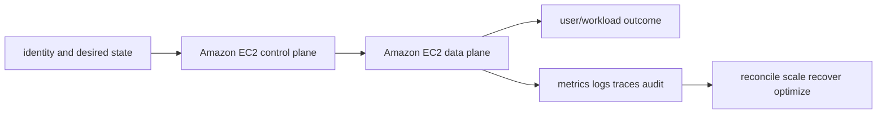

# Amazon EC2

<!-- chapter-guide:start -->
> **Step 118 of 373 — 07.03.01**
>
> **Builds on:** [Compute](../README.md)
>
> **Now:** Learn **Amazon EC2** from its mental model through production ownership.
>
> **Then:** Rehearse the linked questions and continue to [AMIs, Image Builder and golden images](../02-amis-image-builder/README.md).
<!-- chapter-guide:end -->

> Interview bank: [questions-and-answers.md](questions-and-answers.md) · Official documentation: <https://docs.aws.amazon.com/ec2/latest/instancetypes/instance-types.html>

## Easy mode: purpose and mental model

Select, secure, operate and troubleshoot virtual machines from measured compute, memory, storage, network and accelerator needs.



## Detailed learning notes

| # | Concept | What you must be able to explain |
|---:|---|---|
| 1 | **Instance family** | general, compute, memory, storage and accelerator families target different bottlenecks. |
| 2 | **CPU architecture** | x86 and Graviton/ARM require compatible AMIs, agents and multi-architecture artifacts. |
| 3 | **Nitro system** | underpins modern isolation, ENA/EBS and hardware-offload capabilities. |
| 4 | **Instance lifecycle** | pending/running/stopping/stopped/hibernated/terminated transitions affect billing and storage. |
| 5 | **Status checks** | system and instance checks distinguish AWS host from guest reachability signals. |
| 6 | **Instance profile** | delivers temporary role credentials to the instance rather than static keys. |
| 7 | **IMDSv2** | session-oriented metadata access reduces SSRF credential exposure when enforced/configured correctly. |
| 8 | **ENA/EFA** | enhanced networking and EFA support high throughput/low latency under compatible instances/workloads. |
| 9 | **Placement groups** | cluster/partition/spread strategies trade locality, scale and correlated failure. |
| 10 | **Purchase/capacity** | On-Demand, Spot, commitments, dedicated tenancy and reservations solve different price/capacity needs. |

## Architecture and lifecycle

Trace this service from request/authentication and desired configuration through provisioning, steady-state data path, scaling, change, failure, recovery and retirement. Bind every production resource to an owner, environment, data classification, source-of-truth revision, SLO, runbook, cost center and deletion/retention policy.

For Amazon EC2, draw a real request/resource path and label where these mechanisms act: Instance family, CPU architecture, Nitro system, Instance lifecycle, Status checks, Instance profile, IMDSv2, ENA/EFA, Placement groups, Purchase/capacity. State which parts are control plane versus data plane, regional versus zonal/global, synchronous versus asynchronous, and customer versus provider responsibility.

## Security model

Start with the caller/workload identity and evaluate every applicable identity, resource, organization, network-endpoint, encryption-key and admission policy. Minimize public paths, long-lived credentials, wildcard actions/resources and unreviewed cross-account/tenant trust. Encrypt in transit/at rest where applicable, but include key/certificate rotation and recovery. Protect audit evidence and prevent secrets/customer content from entering command history, logs, traces or metric labels.

## Availability and failure modes

List dependencies and failure domains before claiming high availability. Test quota/capacity, identity/control-plane, DNS/network/TLS, configuration drift, downstream saturation, zonal/Regional/node failure and recovery from protected state. Use bounded timeout, retry budget, jitter, idempotency, backpressure, load shedding and graceful drain according to protocol. A green resource status is not a user-facing recovery check.

## Performance, scaling and cost

Measure workload distribution and SLI before sizing. Track rate/work units, latency distribution, errors, saturation/queue and service-specific limits. Separate replica/task scaling from infrastructure/capacity scaling and include cold-start/provisioning delay. Cost includes idle/provisioned capacity, requests/work units, storage/retention, cross-AZ/Region/egress/NAT, observability, licenses/support and failure headroom. Optimize cost per successful SLO/quality-controlled task.

## Observability

Correlate a request/change across user, route/resource, dependency and underlying compute/storage/network. Use stable owner/environment/region/service dimensions; put high-cardinality request/object IDs in sampled logs/traces rather than metric labels. Alert on actionable SLO burn and leading exhaustion. Monitor the telemetry path and keep a read-only diagnostic role.

## Command lab

Run in a sandbox with the correct account/context/Region. Read and explain output before mutation.

```bash
aws ec2 describe-instances --instance-ids INSTANCE_ID
aws ec2 describe-instance-status --include-all-instances
aws ec2 describe-instance-types --instance-types TYPE
aws ssm start-session --target INSTANCE_ID
```

For each command, record: identity/context, exact resource, expected healthy fields, one failing output, the next command/query, and which mutation would be reversible. Never paste secrets/tokens into committed notes or shared terminal history.

## Real-world exercise: easy → hard

1. **Easy:** inventory one healthy Amazon EC2 resource and draw identity/control/data/dependency paths.
2. **Intermediate:** reproduce a safe configuration change with IaC, preview/diff, apply to a sandbox, verify and roll back.
3. **Hard:** inject one policy/network/quota/capacity/dependency failure, diagnose from user symptom to root mechanism, mitigate without widening access, then add an alert/test/runbook.
4. **Senior:** design the service for two tenants, multi-zone/Region failure, RPO/RTO, regulated data, 10× demand and a 30% cost reduction; quantify trade-offs.

## Common interview traps

- Naming a feature without explaining request/resource lifecycle or failure semantics.
- Treating an allow, encryption checkbox, replica count or managed-service label as a complete security/reliability design.
- Mutating production before capturing identity, status, events, metrics, logs, audit and recent changes.
- Scaling the wrong layer or retrying overload/permanent errors.
- Omitting quotas, cold start, deletion/restore, observability cost or customer/tenant boundaries.

## Revision summary

Explain Amazon EC2 in five passes: purpose/selection, mechanism/lifecycle, security/failure, operation/commands, and architecture/economics. Then complete the separate [answered question bank](questions-and-answers.md) without looking at these notes.

<!-- reading-navigation:start -->
---

**Reading path:** [← Back: Compute](../README.md) · [Questions](questions-and-answers.md) · [Next: AMIs, Image Builder and golden images →](../02-amis-image-builder/README.md)

<!-- reading-navigation:end -->
