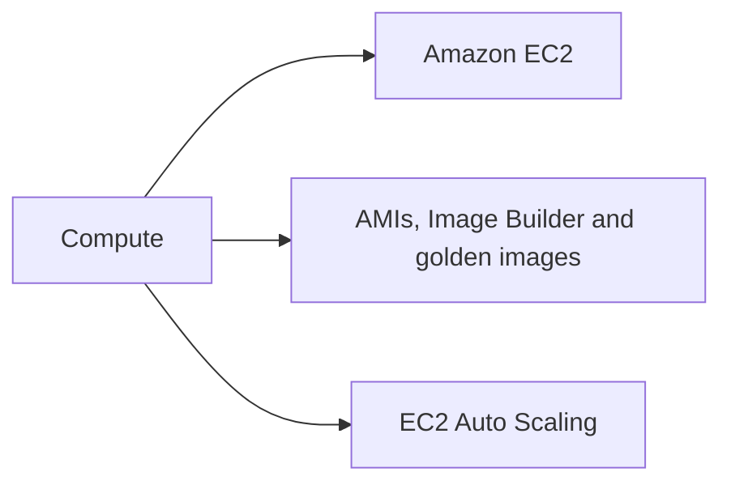
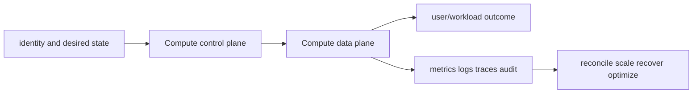

# Compute

<!-- chapter-guide:start -->
> **Step 117 of 373 — 07.03**
>
> **Builds on:** [Amazon Route 53](../02-networking/07-route53/README.md)
>
> **Now:** Learn **Compute** from its mental model through production ownership.
>
> **Then:** Rehearse the linked questions and continue to [Amazon EC2](01-ec2/README.md).
<!-- chapter-guide:end -->

This branch README is both the study note and the map. Each service leaf keeps its notes in its own README and its answered interview bank in a separate file.




## Branch learning contract

Learn the easy mental model first, run the read-only commands in a sandbox, render/apply the examples only in disposable environments, then break and repair one dependency at a time. Be able to connect these topics across the branch: Instance family, CPU architecture, Nitro system, AMI, Golden image, Image Builder pipeline, Launch template, Min/max/desired, Target tracking.

## Branch interview bank

See [questions-and-answers.md](questions-and-answers.md) for 60 additional branch-level questions and answers. Service-specific banks contain another 60 per service.

> Interview bank: [questions-and-answers.md](questions-and-answers.md) · Official documentation: <https://docs.aws.amazon.com/ec2/latest/instancetypes/instance-types.html>

## Easy mode: purpose and mental model

Integrate the compute branch as one production capability rather than isolated products.



## Detailed learning notes

| # | Concept | What you must be able to explain |
|---:|---|---|
| 1 | **Instance family** | general, compute, memory, storage and accelerator families target different bottlenecks. |
| 2 | **CPU architecture** | x86 and Graviton/ARM require compatible AMIs, agents and multi-architecture artifacts. |
| 3 | **AMI** | boot image metadata and snapshots define instance root and launch compatibility. |
| 4 | **Golden image** | centrally hardened/tested base reduces bootstrap drift and replacement time. |
| 5 | **Launch template** | versions instance image/type/network/role/storage/bootstrap inputs. |
| 6 | **Min/max/desired** | bound fleet capacity while policies adjust desired count. |

## Architecture and lifecycle

Trace this service from request/authentication and desired configuration through provisioning, steady-state data path, scaling, change, failure, recovery and retirement. Bind every production resource to an owner, environment, data classification, source-of-truth revision, SLO, runbook, cost center and deletion/retention policy.

For Compute, draw a real request/resource path and label where these mechanisms act: Instance family, CPU architecture, AMI, Golden image, Launch template, Min/max/desired. State which parts are control plane versus data plane, regional versus zonal/global, synchronous versus asynchronous, and customer versus provider responsibility.

## Security model

Start with the caller/workload identity and evaluate every applicable identity, resource, organization, network-endpoint, encryption-key and admission policy. Minimize public paths, long-lived credentials, wildcard actions/resources and unreviewed cross-account/tenant trust. Encrypt in transit/at rest where applicable, but include key/certificate rotation and recovery. Protect audit evidence and prevent secrets/customer content from entering command history, logs, traces or metric labels.

## Availability and failure modes

List dependencies and failure domains before claiming high availability. Test quota/capacity, identity/control-plane, DNS/network/TLS, configuration drift, downstream saturation, zonal/Regional/node failure and recovery from protected state. Use bounded timeout, retry budget, jitter, idempotency, backpressure, load shedding and graceful drain according to protocol. A green resource status is not a user-facing recovery check.

## Performance, scaling and cost

Measure workload distribution and SLI before sizing. Track rate/work units, latency distribution, errors, saturation/queue and service-specific limits. Separate replica/task scaling from infrastructure/capacity scaling and include cold-start/provisioning delay. Cost includes idle/provisioned capacity, requests/work units, storage/retention, cross-AZ/Region/egress/NAT, observability, licenses/support and failure headroom. Optimize cost per successful SLO/quality-controlled task.

## Observability

Correlate a request/change across user, route/resource, dependency and underlying compute/storage/network. Use stable owner/environment/region/service dimensions; put high-cardinality request/object IDs in sampled logs/traces rather than metric labels. Alert on actionable SLO burn and leading exhaustion. Monitor the telemetry path and keep a read-only diagnostic role.

## Command lab

Run in a sandbox with the correct account/context/Region. Read and explain output before mutation.

```bash
aws ec2 describe-instances --instance-ids INSTANCE_ID
aws ec2 describe-images --owners self
aws autoscaling describe-auto-scaling-groups --auto-scaling-group-names ASG
```

For each command, record: identity/context, exact resource, expected healthy fields, one failing output, the next command/query, and which mutation would be reversible. Never paste secrets/tokens into committed notes or shared terminal history.

## Real-world exercise: easy → hard

1. **Easy:** inventory one healthy Compute resource and draw identity/control/data/dependency paths.
2. **Intermediate:** reproduce a safe configuration change with IaC, preview/diff, apply to a sandbox, verify and roll back.
3. **Hard:** inject one policy/network/quota/capacity/dependency failure, diagnose from user symptom to root mechanism, mitigate without widening access, then add an alert/test/runbook.
4. **Senior:** design the service for two tenants, multi-zone/Region failure, RPO/RTO, regulated data, 10× demand and a 30% cost reduction; quantify trade-offs.

## Common interview traps

- Naming a feature without explaining request/resource lifecycle or failure semantics.
- Treating an allow, encryption checkbox, replica count or managed-service label as a complete security/reliability design.
- Mutating production before capturing identity, status, events, metrics, logs, audit and recent changes.
- Scaling the wrong layer or retrying overload/permanent errors.
- Omitting quotas, cold start, deletion/restore, observability cost or customer/tenant boundaries.

## Revision summary

Explain Compute in five passes: purpose/selection, mechanism/lifecycle, security/failure, operation/commands, and architecture/economics. Then complete the separate [answered question bank](questions-and-answers.md) without looking at these notes.

<!-- merged-07-AWS-EC2-AUTO-SCALING-MD:start -->
## Practical deep dive

## Purpose and mental model

EC2 provides virtual machines with explicit choices for CPU architecture, memory, storage, network, accelerators, tenancy, image and purchase/capacity model. Auto Scaling manages a fleet toward desired capacity and health; it does not make an application stateless, safe to terminate, or correctly load-balanced.

## Instance and image selection

General-purpose families balance resources; compute-, memory-, storage- and accelerated families target bottlenecks. Size from measured CPU, memory working set, IOPS/throughput/latency, network packets/bytes, ENI/IP needs, local storage and accelerator memory/compute. Graviton/ARM can improve efficiency but needs compatible images and multi-architecture artifacts. Nitro underpins modern isolation, ENA and storage/network performance; bare metal is for licensing, nested virtualization or hardware access requirements.

AMIs capture boot volume and metadata. Golden-image pipelines should pin sources, patch, harden, scan, test boot/SSM/application health, produce SBOM/provenance, sign/approve, copy/encrypt across Regions/accounts, canary a fleet, and retire old versions. User data should be small, idempotent and observable; long bootstrap increases replacement and scale-out risk.

Instances transition among pending/running/stopping/stopped/shutting-down/terminated; hibernation preserves RAM under constraints. EC2 system status checks cover AWS host infrastructure; instance checks cover guest reachability. Scheduled events/retirement require replacement procedures. ENIs carry addresses/SGs; placement groups trade failure distribution against network locality. EFA enables high-performance OS-bypass/RDMA-style communication for supported distributed workloads.

## Identity and host security

Use instance profiles and temporary credentials. Enforce IMDSv2, restrict hop limits where containers are involved, patch and harden the OS, encrypt EBS with controlled KMS keys, avoid public SSH, and use SSM Session Manager with audited access. Protect AMI/snapshot sharing. Apply least privilege to `ec2:RunInstances` and `iam:PassRole` because launch rights can become privilege escalation.

## Capacity, pricing and Auto Scaling

On-Demand is flexible; Savings Plans/RIs exchange commitment for discount; Spot uses spare capacity with interruption; Dedicated Hosts/Instances address tenancy/licensing; Capacity Reservations/Blocks reserve availability under specific terms. Cost optimization must preserve capacity and SLOs. Diversify compatible types/AZs, checkpoint interruptible work, consume interruption/rebalance signals and test termination.

An Auto Scaling group uses launch templates, min/max/desired capacity, subnet/AZ selection and health checks. Target tracking maintains a metric target; step/simple policies react to thresholds; scheduled/predictive scaling anticipates time patterns. Instance warm-up prevents new instances distorting metrics. Lifecycle hooks allow initialization/draining; instance refresh rolls a new template with minimum healthy constraints; mixed-instance policies combine types and purchase options. Scale-in protection is not a substitute for durable state.

## Operations and failure modes

Watch launch errors, insufficient capacity, quota, desired versus in-service/pending/terminating, lifecycle hook timeouts, warm-up, health replacement loops, target health, CPU/memory/disk/network, status checks and application SLO. Common failures: invalid AMI/permissions/KMS, missing subnet IPs, launch template drift, bootstrap dependency outage, Spot scarcity, wrong health grace, and unsafe termination.

```bash
aws ec2 describe-instances --instance-ids INSTANCE_ID
aws ec2 describe-instance-status --include-all-instances --instance-ids INSTANCE_ID
aws autoscaling describe-auto-scaling-groups --auto-scaling-group-names ASG
aws autoscaling describe-scaling-activities --auto-scaling-group-name ASG
aws ssm start-session --target INSTANCE_ID
```

## Revision summary

- Choose from workload measurements and compatibility, not family names alone.
- Image qualification and bootstrap latency determine safe fleet replacement.
- Separate system, instance, target and user-facing health.
- Capacity strategy is a reliability decision as well as a price decision.
- Auto Scaling manages instances; the application must handle draining, state and retries.


<!-- merged-07-AWS-EC2-AUTO-SCALING-MD:end -->

<!-- reading-navigation:start -->
---

**Reading path:** [← Back: Amazon Route 53](../02-networking/07-route53/README.md) · [Questions](questions-and-answers.md) · [Next: Amazon EC2 →](01-ec2/README.md)

<!-- reading-navigation:end -->
