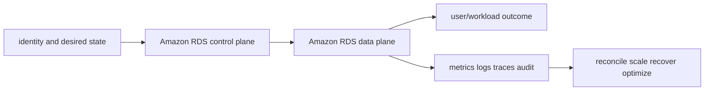

# Amazon RDS

<!-- chapter-guide:start -->
> **Step 139 of 373 — 07.07.01**
>
> **Builds on:** [Databases](../README.md)
>
> **Now:** Learn **Amazon RDS** from its mental model through production ownership.
>
> **Then:** Rehearse the linked questions and continue to [Amazon Aurora](../02-aurora/README.md).
<!-- chapter-guide:end -->

> Interview bank: [questions-and-answers.md](questions-and-answers.md) · Official documentation: <https://docs.aws.amazon.com/AmazonRDS/latest/UserGuide/Welcome.html>

## Easy mode: purpose and mental model

Operate managed relational databases with safe connectivity, failover, backups, parameters and connection capacity.



## Detailed learning notes

| # | Concept | What you must be able to explain |
|---:|---|---|
| 1 | **DB instance** | managed engine compute/storage inside subnet/parameter/security configuration. |
| 2 | **Multi-AZ** | synchronous standby/failover for availability rather than read scaling. |
| 3 | **Read replica** | asynchronous copy for read scale/DR with lag and promotion implications. |
| 4 | **Automated backups/PITR** | transaction-log retention enables restore to a new instance within window. |
| 5 | **Parameter group** | engine settings can be dynamic or require reboot and need tested rollout. |
| 6 | **RDS Proxy** | pools/multiplexes supported connections and credentials with transaction pinning constraints. |
| 7 | **Maintenance window** | provider maintenance/reboot still needs application failover/retry testing. |
| 8 | **Storage autoscaling** | grows storage under thresholds but cannot shrink or fix I/O design. |
| 9 | **Connection exhaustion** | pool size, Lambda scaling and long transactions can overload before CPU. |
| 10 | **Enhanced Monitoring/Performance Insights** | OS/database wait evidence complements CloudWatch. |

## Architecture and lifecycle

Trace this service from request/authentication and desired configuration through provisioning, steady-state data path, scaling, change, failure, recovery and retirement. Bind every production resource to an owner, environment, data classification, source-of-truth revision, SLO, runbook, cost center and deletion/retention policy.

For Amazon RDS, draw a real request/resource path and label where these mechanisms act: DB instance, Multi-AZ, Read replica, Automated backups/PITR, Parameter group, RDS Proxy, Maintenance window, Storage autoscaling, Connection exhaustion, Enhanced Monitoring/Performance Insights. State which parts are control plane versus data plane, regional versus zonal/global, synchronous versus asynchronous, and customer versus provider responsibility.

## Security model

Start with the caller/workload identity and evaluate every applicable identity, resource, organization, network-endpoint, encryption-key and admission policy. Minimize public paths, long-lived credentials, wildcard actions/resources and unreviewed cross-account/tenant trust. Encrypt in transit/at rest where applicable, but include key/certificate rotation and recovery. Protect audit evidence and prevent secrets/customer content from entering command history, logs, traces or metric labels.

## Availability and failure modes

List dependencies and failure domains before claiming high availability. Test quota/capacity, identity/control-plane, DNS/network/TLS, configuration drift, downstream saturation, zonal/Regional/node failure and recovery from protected state. Use bounded timeout, retry budget, jitter, idempotency, backpressure, load shedding and graceful drain according to protocol. A green resource status is not a user-facing recovery check.

## Performance, scaling and cost

Measure workload distribution and SLI before sizing. Track rate/work units, latency distribution, errors, saturation/queue and service-specific limits. Separate replica/task scaling from infrastructure/capacity scaling and include cold-start/provisioning delay. Cost includes idle/provisioned capacity, requests/work units, storage/retention, cross-AZ/Region/egress/NAT, observability, licenses/support and failure headroom. Optimize cost per successful SLO/quality-controlled task.

## Observability

Correlate a request/change across user, route/resource, dependency and underlying compute/storage/network. Use stable owner/environment/region/service dimensions; put high-cardinality request/object IDs in sampled logs/traces rather than metric labels. Alert on actionable SLO burn and leading exhaustion. Monitor the telemetry path and keep a read-only diagnostic role.

## Command lab

Run in a sandbox with the correct account/context/Region. Read and explain output before mutation.

```bash
aws rds describe-db-instances --db-instance-identifier DB
aws rds describe-events --source-identifier DB --source-type db-instance
aws rds describe-db-snapshots --db-instance-identifier DB
aws rds reboot-db-instance --db-instance-identifier DB --force-failover
```

For each command, record: identity/context, exact resource, expected healthy fields, one failing output, the next command/query, and which mutation would be reversible. Never paste secrets/tokens into committed notes or shared terminal history.

## Real-world exercise: easy → hard

1. **Easy:** inventory one healthy Amazon RDS resource and draw identity/control/data/dependency paths.
2. **Intermediate:** reproduce a safe configuration change with IaC, preview/diff, apply to a sandbox, verify and roll back.
3. **Hard:** inject one policy/network/quota/capacity/dependency failure, diagnose from user symptom to root mechanism, mitigate without widening access, then add an alert/test/runbook.
4. **Senior:** design the service for two tenants, multi-zone/Region failure, RPO/RTO, regulated data, 10× demand and a 30% cost reduction; quantify trade-offs.

## Common interview traps

- Naming a feature without explaining request/resource lifecycle or failure semantics.
- Treating an allow, encryption checkbox, replica count or managed-service label as a complete security/reliability design.
- Mutating production before capturing identity, status, events, metrics, logs, audit and recent changes.
- Scaling the wrong layer or retrying overload/permanent errors.
- Omitting quotas, cold start, deletion/restore, observability cost or customer/tenant boundaries.

## Revision summary

Explain Amazon RDS in five passes: purpose/selection, mechanism/lifecycle, security/failure, operation/commands, and architecture/economics. Then complete the separate [answered question bank](questions-and-answers.md) without looking at these notes.

<!-- reading-navigation:start -->
---

**Reading path:** [← Back: Databases](../README.md) · [Questions](questions-and-answers.md) · [Next: Amazon Aurora →](../02-aurora/README.md)

<!-- reading-navigation:end -->
