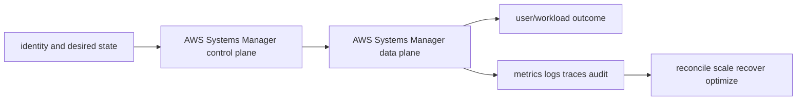

# AWS Systems Manager

<!-- chapter-guide:start -->
> **Step 158 of 373 — 07.09.07**
>
> **Builds on:** [AWS CloudTrail and Config](../06-cloudtrail-config/README.md)
>
> **Now:** Learn **AWS Systems Manager** from its mental model through production ownership.
>
> **Then:** Rehearse the linked questions and continue to [Infrastructure Delivery](../../10-infrastructure-delivery/README.md).
<!-- chapter-guide:end -->

> Interview bank: [questions-and-answers.md](questions-and-answers.md) · Official documentation: <https://docs.aws.amazon.com/systems-manager/latest/userguide/what-is-systems-manager.html>

## Easy mode: purpose and mental model

Operate fleets through audited sessions, inventory, patch and automation without unmanaged SSH or broad scripts.



## Detailed learning notes

| # | Concept | What you must be able to explain |
|---:|---|---|
| 1 | **Managed node** | agent/identity/network registration makes a host available to SSM. |
| 2 | **Session Manager** | audited interactive/tunnel access without inbound SSH under IAM/session preferences. |
| 3 | **Run Command** | executes commands across targets with concurrency/error thresholds and output controls. |
| 4 | **Automation document** | typed multi-step workflow with assume role, branching, approvals and rollback design. |
| 5 | **Patch Manager** | baselines, maintenance windows and compliance scan/install coordinate patching. |
| 6 | **Inventory** | collects software/instance metadata for fleet queries and exposure. |
| 7 | **State Manager** | periodically enforces associations and can conflict with image/IaC ownership. |
| 8 | **Parameter Store** | distributes configuration/secrets under hierarchy/KMS/IAM. |
| 9 | **Fleet Manager** | console operations still require least privilege and evidence. |
| 10 | **Target safety** | tags/resource groups, max concurrency/errors and canaries prevent fleet-wide mistakes. |

## Architecture and lifecycle

Trace this service from request/authentication and desired configuration through provisioning, steady-state data path, scaling, change, failure, recovery and retirement. Bind every production resource to an owner, environment, data classification, source-of-truth revision, SLO, runbook, cost center and deletion/retention policy.

For AWS Systems Manager, draw a real request/resource path and label where these mechanisms act: Managed node, Session Manager, Run Command, Automation document, Patch Manager, Inventory, State Manager, Parameter Store, Fleet Manager, Target safety. State which parts are control plane versus data plane, regional versus zonal/global, synchronous versus asynchronous, and customer versus provider responsibility.

## Security model

Start with the caller/workload identity and evaluate every applicable identity, resource, organization, network-endpoint, encryption-key and admission policy. Minimize public paths, long-lived credentials, wildcard actions/resources and unreviewed cross-account/tenant trust. Encrypt in transit/at rest where applicable, but include key/certificate rotation and recovery. Protect audit evidence and prevent secrets/customer content from entering command history, logs, traces or metric labels.

## Availability and failure modes

List dependencies and failure domains before claiming high availability. Test quota/capacity, identity/control-plane, DNS/network/TLS, configuration drift, downstream saturation, zonal/Regional/node failure and recovery from protected state. Use bounded timeout, retry budget, jitter, idempotency, backpressure, load shedding and graceful drain according to protocol. A green resource status is not a user-facing recovery check.

## Performance, scaling and cost

Measure workload distribution and SLI before sizing. Track rate/work units, latency distribution, errors, saturation/queue and service-specific limits. Separate replica/task scaling from infrastructure/capacity scaling and include cold-start/provisioning delay. Cost includes idle/provisioned capacity, requests/work units, storage/retention, cross-AZ/Region/egress/NAT, observability, licenses/support and failure headroom. Optimize cost per successful SLO/quality-controlled task.

## Observability

Correlate a request/change across user, route/resource, dependency and underlying compute/storage/network. Use stable owner/environment/region/service dimensions; put high-cardinality request/object IDs in sampled logs/traces rather than metric labels. Alert on actionable SLO burn and leading exhaustion. Monitor the telemetry path and keep a read-only diagnostic role.

## Command lab

Run in a sandbox with the correct account/context/Region. Read and explain output before mutation.

```bash
aws ssm describe-instance-information
aws ssm start-session --target INSTANCE_ID
aws ssm send-command --document-name DOC --targets Key=tag:Environment,Values=stage --max-concurrency 10% --max-errors 1
aws ssm describe-instance-patch-states --instance-ids INSTANCE_ID
```

For each command, record: identity/context, exact resource, expected healthy fields, one failing output, the next command/query, and which mutation would be reversible. Never paste secrets/tokens into committed notes or shared terminal history.

## Real-world exercise: easy → hard

1. **Easy:** inventory one healthy AWS Systems Manager resource and draw identity/control/data/dependency paths.
2. **Intermediate:** reproduce a safe configuration change with IaC, preview/diff, apply to a sandbox, verify and roll back.
3. **Hard:** inject one policy/network/quota/capacity/dependency failure, diagnose from user symptom to root mechanism, mitigate without widening access, then add an alert/test/runbook.
4. **Senior:** design the service for two tenants, multi-zone/Region failure, RPO/RTO, regulated data, 10× demand and a 30% cost reduction; quantify trade-offs.

## Common interview traps

- Naming a feature without explaining request/resource lifecycle or failure semantics.
- Treating an allow, encryption checkbox, replica count or managed-service label as a complete security/reliability design.
- Mutating production before capturing identity, status, events, metrics, logs, audit and recent changes.
- Scaling the wrong layer or retrying overload/permanent errors.
- Omitting quotas, cold start, deletion/restore, observability cost or customer/tenant boundaries.

## Revision summary

Explain AWS Systems Manager in five passes: purpose/selection, mechanism/lifecycle, security/failure, operation/commands, and architecture/economics. Then complete the separate [answered question bank](questions-and-answers.md) without looking at these notes.

<!-- reading-navigation:start -->
---

**Reading path:** [← Back: AWS CloudTrail and Config](../06-cloudtrail-config/README.md) · [Questions](questions-and-answers.md) · [Next: Infrastructure Delivery →](../../10-infrastructure-delivery/README.md)

<!-- reading-navigation:end -->
