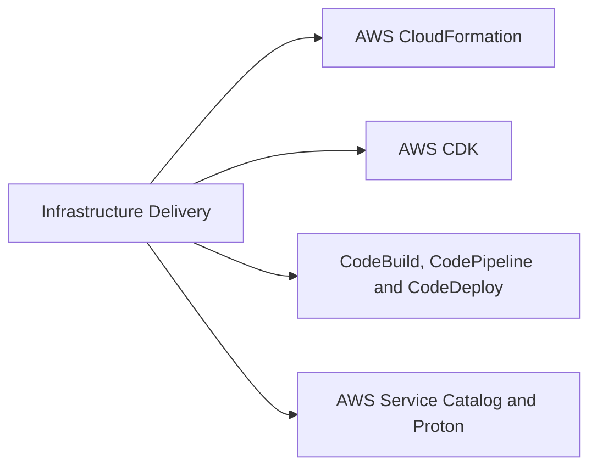
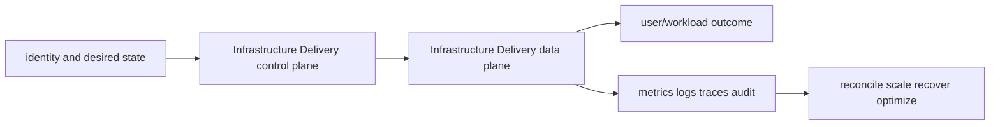

# Infrastructure Delivery

<!-- chapter-guide:start -->
> **Step 159 of 373 — 07.10**
>
> **Builds on:** [AWS Systems Manager](../09-security-operations/07-systems-manager/README.md)
>
> **Now:** Learn **Infrastructure Delivery** from its mental model through production ownership.
>
> **Then:** Rehearse the linked questions and continue to [AWS CloudFormation](01-cloudformation/README.md).
<!-- chapter-guide:end -->

This branch README is both the study note and the map. Each service leaf keeps its notes in its own README and its answered interview bank in a separate file.




## Branch learning contract

Learn the easy mental model first, run the read-only commands in a sandbox, render/apply the examples only in disposable environments, then break and repair one dependency at a time. Be able to connect these topics across the branch: Stack, Change set, Rollback, App/stack/construct tree, L1 construct, L2/L3 construct, CodeBuild project, Buildspec, Privileged mode, Portfolio/product, Launch constraint, Template constraint.

## Branch interview bank

See [questions-and-answers.md](questions-and-answers.md) for 60 additional branch-level questions and answers. Service-specific banks contain another 60 per service.

> Interview bank: [questions-and-answers.md](questions-and-answers.md) · Official documentation: <https://docs.aws.amazon.com/AWSCloudFormation/latest/UserGuide/Welcome.html>

## Easy mode: purpose and mental model

Integrate the infrastructure delivery branch as one production capability rather than isolated products.



## Detailed learning notes

| # | Concept | What you must be able to explain |
|---:|---|---|
| 1 | **Stack** | ownership/lifecycle boundary for a set of resources and outputs. |
| 2 | **Change set** | previews create/update/import actions but cannot predict every service-side effect. |
| 3 | **App/stack/construct tree** | code composes logical resources and ownership hierarchy. |
| 4 | **L1 construct** | direct generated CloudFormation resource mapping. |
| 5 | **CodeBuild project** | image/compute/VPC/service role/buildspec define a privileged ephemeral build. |
| 6 | **Buildspec** | phases/commands/artifacts/cache/reports are executable supply-chain code. |
| 7 | **Portfolio/product** | curated products and versions are shared to approved principals/accounts. |
| 8 | **Launch constraint** | service role separates user permission from provisioned-resource permission. |

## Architecture and lifecycle

Trace this service from request/authentication and desired configuration through provisioning, steady-state data path, scaling, change, failure, recovery and retirement. Bind every production resource to an owner, environment, data classification, source-of-truth revision, SLO, runbook, cost center and deletion/retention policy.

For Infrastructure Delivery, draw a real request/resource path and label where these mechanisms act: Stack, Change set, App/stack/construct tree, L1 construct, CodeBuild project, Buildspec, Portfolio/product, Launch constraint. State which parts are control plane versus data plane, regional versus zonal/global, synchronous versus asynchronous, and customer versus provider responsibility.

## Security model

Start with the caller/workload identity and evaluate every applicable identity, resource, organization, network-endpoint, encryption-key and admission policy. Minimize public paths, long-lived credentials, wildcard actions/resources and unreviewed cross-account/tenant trust. Encrypt in transit/at rest where applicable, but include key/certificate rotation and recovery. Protect audit evidence and prevent secrets/customer content from entering command history, logs, traces or metric labels.

## Availability and failure modes

List dependencies and failure domains before claiming high availability. Test quota/capacity, identity/control-plane, DNS/network/TLS, configuration drift, downstream saturation, zonal/Regional/node failure and recovery from protected state. Use bounded timeout, retry budget, jitter, idempotency, backpressure, load shedding and graceful drain according to protocol. A green resource status is not a user-facing recovery check.

## Performance, scaling and cost

Measure workload distribution and SLI before sizing. Track rate/work units, latency distribution, errors, saturation/queue and service-specific limits. Separate replica/task scaling from infrastructure/capacity scaling and include cold-start/provisioning delay. Cost includes idle/provisioned capacity, requests/work units, storage/retention, cross-AZ/Region/egress/NAT, observability, licenses/support and failure headroom. Optimize cost per successful SLO/quality-controlled task.

## Observability

Correlate a request/change across user, route/resource, dependency and underlying compute/storage/network. Use stable owner/environment/region/service dimensions; put high-cardinality request/object IDs in sampled logs/traces rather than metric labels. Alert on actionable SLO burn and leading exhaustion. Monitor the telemetry path and keep a read-only diagnostic role.

## Command lab

Run in a sandbox with the correct account/context/Region. Read and explain output before mutation.

```bash
aws cloudformation create-change-set --stack-name STACK --change-set-name CHANGE --template-body file://template.yaml --change-set-type UPDATE
cdk synth
aws codebuild batch-get-builds --ids BUILD_ID
aws servicecatalog search-products-as-admin
```

For each command, record: identity/context, exact resource, expected healthy fields, one failing output, the next command/query, and which mutation would be reversible. Never paste secrets/tokens into committed notes or shared terminal history.

## Real-world exercise: easy → hard

1. **Easy:** inventory one healthy Infrastructure Delivery resource and draw identity/control/data/dependency paths.
2. **Intermediate:** reproduce a safe configuration change with IaC, preview/diff, apply to a sandbox, verify and roll back.
3. **Hard:** inject one policy/network/quota/capacity/dependency failure, diagnose from user symptom to root mechanism, mitigate without widening access, then add an alert/test/runbook.
4. **Senior:** design the service for two tenants, multi-zone/Region failure, RPO/RTO, regulated data, 10× demand and a 30% cost reduction; quantify trade-offs.

## Common interview traps

- Naming a feature without explaining request/resource lifecycle or failure semantics.
- Treating an allow, encryption checkbox, replica count or managed-service label as a complete security/reliability design.
- Mutating production before capturing identity, status, events, metrics, logs, audit and recent changes.
- Scaling the wrong layer or retrying overload/permanent errors.
- Omitting quotas, cold start, deletion/restore, observability cost or customer/tenant boundaries.

## Revision summary

Explain Infrastructure Delivery in five passes: purpose/selection, mechanism/lifecycle, security/failure, operation/commands, and architecture/economics. Then complete the separate [answered question bank](questions-and-answers.md) without looking at these notes.

<!-- merged-07-AWS-INFRASTRUCTURE-DELIVERY-MD:start -->
## Practical deep dive

## Purpose and mental model

Infrastructure delivery turns reviewed desired state into reproducible cloud resources. A safe workflow separates preview from apply, uses short-lived deployment identity, records artifacts/approvals, serializes conflicting updates, detects drift and provides explicit rollback/recovery. “Managed by IaC” is an operating contract, not a file format.

## CloudFormation and CDK

CloudFormation stacks own resources and dependencies from templates. Change sets preview proposed actions; stack policies protect critical resources; rollback attempts to restore prior stack state but cannot reverse every external side effect or data migration. StackSets deploy across accounts/Regions with service/self-managed permission models and controlled concurrency/failure tolerance. Drift detection covers supported properties and does not automatically choose desired truth.

Imports, resource moves/refactors and replacement-sensitive properties require rehearsed migration. Termination protection and deletion/retention policies protect stateful resources but can leave intentional orphans that need ownership. Nested stacks/modules improve composition; avoid giant blast-radius stacks and uncontrolled cross-stack output coupling.

CDK expresses constructs in programming languages and synthesizes CloudFormation. L1 constructs map service resources; L2/L3 add opinions. Pin framework/construct versions, review synthesized templates and asset publishing, secure bootstrap roles/buckets, test constructs/assertions and use escape hatches deliberately. CDK does not remove CloudFormation lifecycle semantics.

## Delivery services and self-service

CodeBuild runs builds with privileged-container risk, network/dependency access and ephemeral credentials to control. CodePipeline orchestrates sources/actions/approvals; CodeDeploy supports instance/Lambda/ECS strategies including blue-green. Promote immutable artifacts rather than rebuilding per environment; attach SBOM, signature/provenance, scan and test evidence.

Service Catalog distributes approved products with constrained launch roles. Proton-style platform templates can standardize service/infrastructure workflows. A golden path must expose required variation, version/deprecate safely, report status and allow exceptions without bypassing controls.

## Security, reliability, operations and cost

- OIDC/federation and scoped deployment roles; restrict `iam:PassRole`, KMS, network and organization mutations; isolate production runners/accounts.
- Pin dependencies/actions/images, verify signatures, scan templates/policies, enforce policy as code and protect state/artifacts/logs.
- Use per-environment/account state and approvals, change windows for high risk, canaries/regions in waves, failure thresholds and tested break-glass.
- Monitor pipeline duration/failure, stack status/events, rollback failures, drift, runner saturation, artifact age/provenance and change failure rate.
- Cost includes build minutes/runners, artifact/log storage, duplicated preview resources and—most importantly—resources created. Add cost estimation/budgets and time-to-live controls.

```bash
aws cloudformation create-change-set --stack-name STACK --change-set-name CHANGE --template-body file://template.yaml --change-set-type UPDATE
aws cloudformation describe-stack-events --stack-name STACK
aws cloudformation detect-stack-drift --stack-name STACK
aws cloudformation continue-update-rollback --stack-name STACK
cdk synth
cdk diff
```

When an update fails, freeze competing changes, inspect the first failing stack event and nested resources, distinguish permission/quota/configuration/provider failure, decide continue rollback versus targeted repair, preserve stateful data, then return the repair to source and re-preview. Never repeatedly retry a destructive replacement without understanding it.

## Revision summary

- Preview and rollback are evidence/controls, not guarantees.
- CDK synthesizes CloudFormation and inherits its resource lifecycle.
- Stack boundaries are ownership/blast-radius decisions.
- Promote identical signed artifacts through environments.
- Drift requires an explicit reconciliation decision and source-of-truth repair.


<!-- merged-07-AWS-INFRASTRUCTURE-DELIVERY-MD:end -->

<!-- reading-navigation:start -->
---

**Reading path:** [← Back: AWS Systems Manager](../09-security-operations/07-systems-manager/README.md) · [Questions](questions-and-answers.md) · [Next: AWS CloudFormation →](01-cloudformation/README.md)

<!-- reading-navigation:end -->
