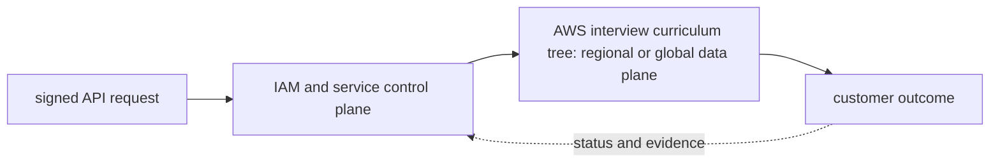

# AWS interview curriculum tree

<!-- chapter-guide:start -->
> **Step 103 of 373 — 07**
>
> **Builds on:** [LLM gateway and RAG on Kubernetes](../06-kubernetes/09-gpu-llmops/06-gateway-rag/README.md)
>
> **Now:** Learn **AWS interview curriculum tree** from its mental model through production ownership.
>
> **Then:** Rehearse the linked questions and continue to [Foundations](01-foundations/README.md).
<!-- chapter-guide:end -->

<!-- explanation-practice-normalizer:v1 -->


## Explanation

### What this chapter is and why it exists

**AWS interview curriculum tree** is easiest to understand as one part of a larger path. The subject has an API control plane and a workload data plane. An authenticated request is authorized, validated and persisted; managed controllers then create or reconfigure regional or global resources that serve traffic or process data.

The chapter focuses on AWS interview curriculum tree. These are connected mechanisms, not vocabulary to memorize. The AWS branch connects identity, regional and global control planes, workload data paths, managed-state guarantees and cost into one cloud operating model The explanations below first build the simple model, then add the exact system behavior and production consequences.

### History and evolution

AWS helped turn infrastructure into an on-demand API with services such as S3 and EC2 in 2006. The platform expanded from individual virtual resources into regional managed control planes, global identity and governance, event-driven services and specialized data and AI systems; automation therefore became as important as resource creation.

In this chapter, **AWS interview curriculum tree** is the next layer of that evolution. Its modern purpose is to the AWS branch connects identity, regional and global control planes, workload data paths, managed-state guarantees and cost into one cloud operating model. The exact product surface may change by version, but the underlying state, request path and failure boundaries remain the durable ideas to learn.

### How the complete branch works



A branch overview connects child mechanisms into one lifecycle. The input crosses identity and policy, a control or decision plane, the runtime data path and its dependencies before producing a user-visible result. Status and telemetry travel back through the loop so operators and controllers can correct drift or failure. Reading the child chapters adds precision, but this overview explains why those chapters depend on one another.

A useful test of understanding is to trace one concrete request or change from origin to outcome and name the authoritative state at each boundary. That trace reveals where work is synchronous or asynchronous, which failure domains are independent, what a timeout can prove, and which evidence distinguishes accepted intent from healthy behavior.

AWS interview answers should connect a request to identities, network paths, compute, data, telemetry, failure domains, and cost. Do not answer with isolated service definitions. Begin with the shared-responsibility model and account boundary; choose a managed service only after stating requirements and operational trade-offs.

### Complete tree for this role

```text
AWS
├── Foundation and governance
│   ├── Regions, AZs, edge/Local Zones/Wavelength, quotas
│   ├── Organizations, accounts, OUs, SCPs, Control Tower/landing zones
│   ├── IAM policy evaluation, roles, boundaries, resource policies
│   ├── STS, Identity Center, SAML/OIDC, web identity, cross-account access
│   └── tags, inventory, Config, governance and cost allocation
├── Networking
│   ├── VPC, CIDR/IPAM, public/private/isolated subnets, route tables, IGW
│   ├── security groups, NACLs, DNS/DHCP, Flow Logs, Reachability Analyzer
│   ├── NAT, IPv6 egress, endpoints/PrivateLink and centralized egress
│   ├── peering, Transit Gateway, Cloud WAN, VPC sharing
│   ├── Site-to-Site VPN, Client VPN, Direct Connect, BGP and hybrid DNS
│   └── Route 53 hosted zones, Resolver, health checks and routing policies
├── Compute
│   ├── EC2 families/architectures, Nitro, lifecycle/status checks
│   ├── AMIs, Image Builder/Packer, golden image qualification
│   ├── ENIs/EIPs, enhanced networking/EFA, placement groups
│   ├── instance profiles, IMDSv2, SSM, host/volume security
│   ├── On-Demand, Spot, Savings Plans, RIs, Hosts, reservations/blocks
│   └── Auto Scaling templates, policies, refresh, lifecycle and rebalancing
├── Load balancing and global traffic
│   ├── ALB: HTTP/gRPC/WebSocket routing, authentication, WAF, weighted groups
│   ├── NLB: TCP/UDP/TLS, static IP, source IP, long connections, PrivateLink
│   ├── GWLB: transparent GENEVE appliance fleets and symmetric routing
│   ├── CLB migration, Route 53, CloudFront and Global Accelerator
│   └── health checks, draining, cross-zone behavior, logs and 4xx/5xx diagnosis
├── Storage and data protection
│   ├── S3 object/version/encryption/policy/lifecycle/replication/events
│   ├── EBS types/snapshots/encryption/IOPS/throughput/queue depth
│   ├── EFS NFS/mount targets/access points/performance/throughput
│   ├── FSx Lustre/ONTAP/Windows/OpenZFS
│   └── AWS Backup plans/vaults/lock/cross-account/region and restore tests
├── Containers
│   ├── ECR scanning/signing/immutability/replication/cache/retention
│   ├── ECS tasks/services/Fargate/capacity providers/deployments/discovery
│   ├── EKS control plane/nodes/Fargate/add-ons/access/IRSA/Pod Identity
│   ├── VPC CNI, CSI, load balancer controller, upgrades and observability
│   └── managed groups, Karpenter/Auto Mode, Spot/GPU pools and scale-from-zero
├── Databases, cache, search, messaging and serverless
│   ├── RDS/Aurora availability, replicas, backups, proxies and connection limits
│   ├── DynamoDB key design/capacity/indexes/streams/transactions/global tables
│   ├── ElastiCache Valkey/Redis/Memcached and OpenSearch/vector search
│   ├── SQS/SNS/EventBridge/Step Functions/Kinesis/MSK delivery semantics
│   └── Lambda cold starts/concurrency/events/VPC/idempotency and API Gateway
├── Security and operations
│   ├── KMS/envelope encryption/policies/grants; Secrets Manager/Parameter Store
│   ├── ACM/WAF/Shield; GuardDuty/Security Hub/Inspector/Macie/Detective
│   ├── CloudTrail/Config/Access Analyzer and multi-account response
│   ├── CloudWatch/X-Ray/Application Signals/Container Insights
│   └── Systems Manager inventory/session/patch/automation/OpsCenter
├── Infrastructure delivery
│   ├── CloudFormation stacks/StackSets/change sets/drift/rollback
│   ├── CDK constructs/synthesis/bootstrapping and escape hatches
│   ├── CodeBuild/CodePipeline/CodeDeploy and blue-green delivery
│   └── Service Catalog/Proton and governed self-service
└── AI platform
    ├── Bedrock models/inference profiles/guardrails/knowledge bases/agents/evals
    ├── SageMaker jobs/pipelines/registry/endpoints/autoscaling/monitoring
    ├── EKS GPU inference/training, KServe/vLLM/Triton, EFA and model caches
    ├── GPU instances, Inferentia/Trainium/Neuron and compatibility
    └── quotas/capacity, tenancy, telemetry, data controls and unit economics
```

### Cross-cutting decision sequence

1. **Account and identity:** which account owns it, which principal acts, and which SCP/boundary/resource policy can deny it?
2. **Network path:** source/destination, IP family, subnet/route, SG/NACL, NAT/endpoint/DNS, load balancer and target.
3. **State and failure domain:** what state exists, in which AZ/Region/account, how replicated, and what are RPO/RTO?
4. **Delivery:** desired state, artifact provenance, approvals, drift, rollout and rollback.
5. **Operations:** SLI/SLO, metrics/logs/traces/audit, alert owner, runbook and restore test.
6. **Economics:** allocation tags, unit cost, fixed/variable cost, commitment, egress/NAT/telemetry cost, quota and budget guardrails.

### Common traps

- “Private subnet” means no direct route to an internet gateway; it does not mean no egress or no public IP by itself.
- An IAM allow is not sufficient if a resource policy, permissions boundary, session policy, SCP, VPC endpoint policy, or explicit deny blocks the request.
- Multi-AZ and read scaling solve different problems; backups and tested restores are still required.
- Security groups are stateful; NACLs are stateless. Neither repairs a wrong route or DNS response.
- Auto Scaling group health, load-balancer target health, and EC2 status checks are different signals.
- S3 is an object store, not a POSIX filesystem. EBS is AZ-scoped block storage; EFS is regional NFS.
- Retries require timeouts, backoff/jitter, idempotency, a total retry budget, and overload awareness.
- Spot discounts do not make interruption-sensitive stateful or tightly coupled inference automatically safe.
- Cross-Region inference/replication can affect residency and policy even when marketed as a reliability feature.
- Quotas and physical GPU capacity are different constraints; a raised quota does not guarantee available inventory.

### Read further

- [AWS documentation](https://docs.aws.amazon.com/) — authoritative service guides and API references. Confirm Region availability, quotas, pricing and feature behavior because those details are version- and location-sensitive.

## Practice

### Practice objective

Build a small, safe proof of **AWS interview curriculum tree** and explain the result in your own words. The goal is not command completion; it is to connect input, internal mechanism, observable state and user outcome.

### Prerequisites and setup

Use a disposable local environment, sandbox account/project or isolated namespace. Confirm the effective identity and target, record the start time, and set a cost limit before creating anything.

Record tool and platform versions because flags, APIs and defaults can change. Define every uppercase placeholder before use and keep secrets out of shell history and committed files.

### Activity 1: establish a healthy baseline

Run the read-oriented example first:

```bash
aws sts get-caller-identity
aws configure list
aws resourcegroupstaggingapi get-resources --resources-per-page 5
```

For each line, write down the layer it inspects, the expected healthy field or response, and one thing it cannot prove. The expected result is an attributable request against the intended target plus enough state to draw the path from input to outcome.

### Activity 2: create or review the smallest working example

Put the smallest relevant command, configuration, manifest or code sample in source control. Validate or lint it, produce a preview/diff where the tool supports one, and apply only inside the disposable boundary. Record the exact revision and resulting resource or process ID. If the topic is observational rather than configurable, save a sanitized baseline and an automated assertion instead of mutating the system.

### Activity 3: controlled failure and troubleshooting

Introduce one bounded failure: use a definitely nonexistent resource name, an invalid sandbox-only value, a denied test identity, a closed test port or a stopped disposable dependency. Capture the exact error and classify it as identity/policy, input/configuration, control-plane reconciliation, network/protocol, dependency or capacity. Test one discriminating hypothesis at a time; do not widen access or restart unrelated components.

Expected failure evidence is a specific non-zero exit, status/reason, event or protocol response that disappears when the controlled fault is removed. If healthy and failing runs look identical, the chosen signal does not explain the phenomenon and the exercise is not complete.

### Verification

Repeat the original client or user-facing check, not only an administrative status command. Confirm the desired revision, data correctness where applicable, error and latency recovery, and absence of a continuing retry/backlog/saturation condition. Explain why this evidence proves recovery and what uncertainty remains.

### Cleanup and rollback

Revert the configuration in its source of truth and review the rollback diff before applying it. Delete only the named sandbox resources, stop disposable processes, remove temporary credentials and verify that no billable resource, volume, artifact, queue item or background job remains. Read-only activities require no infrastructure rollback, but sanitized captures must still follow retention policy.

### Harder extension

Automate the healthy and failing paths in CI, use short-lived identity, add one SLI/alert or policy assertion, and write a five-step runbook another engineer can execute without hidden context. Then explain how the design changes for two tenants, a zonal or dependency failure, 10× load and a strict cost or recovery target.

<!-- reading-navigation:start -->
---

**Reading path:** [← Back: LLM gateway and RAG on Kubernetes](../06-kubernetes/09-gpu-llmops/06-gateway-rag/README.md) · [Questions](questions-and-answers.md) · [Next: Foundations →](01-foundations/README.md)

<!-- reading-navigation:end -->
