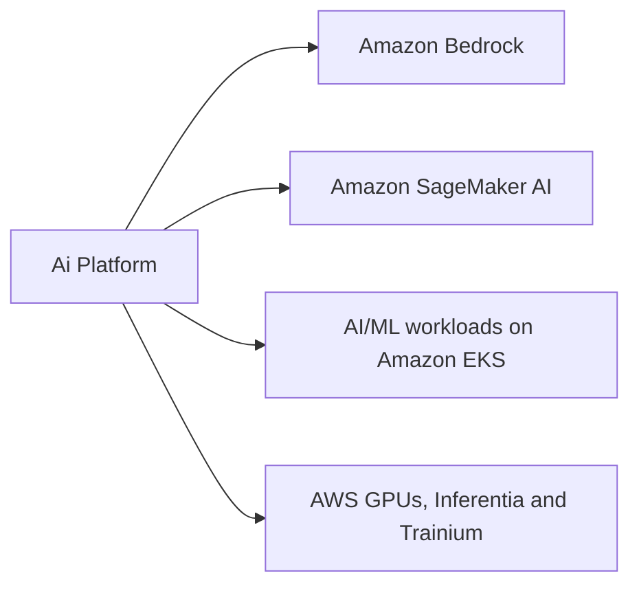
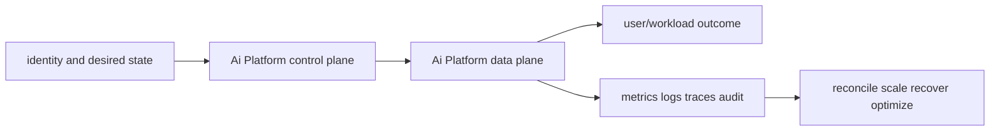

# Ai Platform

<!-- child-topic-toc:start -->
## Table of contents and deeper notes

This parent note explains how the child topics work together. Follow each child link for the deeper mechanism, real commands/configuration, hands-on practice, authoritative documentation, and its local interview bank.

- [Ai Platform service leaves](services/README.md) — [questions and answers](services/questions-and-answers.md)
<!-- child-topic-toc:end -->
This branch README is both the study note and the map. Each service leaf keeps its notes in its own README and its answered interview bank in a separate file.



## Service leaves

- [Amazon Bedrock](services/bedrock/README.md) — [Q&A](services/bedrock/questions-and-answers.md)
- [Amazon SageMaker AI](services/sagemaker-ai/README.md) — [Q&A](services/sagemaker-ai/questions-and-answers.md)
- [AI/ML workloads on Amazon EKS](services/eks-ai-inference/README.md) — [Q&A](services/eks-ai-inference/questions-and-answers.md)
- [AWS GPUs, Inferentia and Trainium](services/aws-accelerators/README.md) — [Q&A](services/aws-accelerators/questions-and-answers.md)

## Branch learning contract

Learn the easy mental model first, run the read-only commands in a sandbox, render/apply the examples only in disposable environments, then break and repair one dependency at a time. Be able to connect these topics across the branch: Foundation model access, Converse/Invoke API, Inference profile, Training job, Processing job, Pipeline, GPU node pool, Karpenter GPU provisioning, GPU Operator/device plugin, G-family GPU, P-family GPU, Inferentia.

## Branch interview bank

See [questions-and-answers.md](questions-and-answers.md) for 60 additional branch-level questions and answers. Service-specific banks contain another 60 per service.

> Interview bank: [questions-and-answers.md](questions-and-answers.md) · Official documentation: <https://docs.aws.amazon.com/bedrock/latest/userguide/what-is-bedrock.html>

## Easy mode: purpose and mental model

Integrate the ai platform branch as one production capability rather than isolated products.



## Detailed learning notes

| # | Concept | What you must be able to explain |
|---:|---|---|
| 1 | **Foundation model access** | model/provider/Region/API capability and terms must be approved. |
| 2 | **Converse/Invoke API** | normalized/model APIs differ in streaming, tools and request schema. |
| 3 | **Training job** | immutable container/data/hyperparameter/instance run writes model artifacts/metrics. |
| 4 | **Processing job** | managed batch preprocessing/evaluation under reproducible container and data inputs. |
| 5 | **GPU node pool** | hardware/AMI/driver/toolkit/plugin compatibility and taints isolate accelerators. |
| 6 | **Karpenter GPU provisioning** | pending resource/label/topology constraints select compatible EC2 capacity. |
| 7 | **G-family GPU** | graphics/inference-oriented NVIDIA instances with generation-specific GPU/memory/network. |
| 8 | **P-family GPU** | high-end training/HPC and large inference with NVLink/EFA/UltraCluster features by generation. |

## Architecture and lifecycle

Trace this service from request/authentication and desired configuration through provisioning, steady-state data path, scaling, change, failure, recovery and retirement. Bind every production resource to an owner, environment, data classification, source-of-truth revision, SLO, runbook, cost center and deletion/retention policy.

For Ai Platform, draw a real request/resource path and label where these mechanisms act: Foundation model access, Converse/Invoke API, Training job, Processing job, GPU node pool, Karpenter GPU provisioning, G-family GPU, P-family GPU. State which parts are control plane versus data plane, regional versus zonal/global, synchronous versus asynchronous, and customer versus provider responsibility.

## Security model

Start with the caller/workload identity and evaluate every applicable identity, resource, organization, network-endpoint, encryption-key and admission policy. Minimize public paths, long-lived credentials, wildcard actions/resources and unreviewed cross-account/tenant trust. Encrypt in transit/at rest where applicable, but include key/certificate rotation and recovery. Protect audit evidence and prevent secrets/customer content from entering command history, logs, traces or metric labels.

## Availability and failure modes

List dependencies and failure domains before claiming high availability. Test quota/capacity, identity/control-plane, DNS/network/TLS, configuration drift, downstream saturation, zonal/Regional/node failure and recovery from protected state. Use bounded timeout, retry budget, jitter, idempotency, backpressure, load shedding and graceful drain according to protocol. A green resource status is not a user-facing recovery check.

## Performance, scaling and cost

Measure workload distribution and SLI before sizing. Track rate/work units, latency distribution, errors, saturation/queue and service-specific limits. Separate replica/task scaling from infrastructure/capacity scaling and include cold-start/provisioning delay. Cost includes idle/provisioned capacity, requests/work units, storage/retention, cross-AZ/Region/egress/NAT, observability, licenses/support and failure headroom. Optimize cost per successful SLO/quality-controlled task.

## Observability

Correlate a request/change across user, route/resource, dependency and underlying compute/storage/network. Use stable owner/environment/region/service dimensions; put high-cardinality request/object IDs in sampled logs/traces rather than metric labels. Alert on actionable SLO burn and leading exhaustion. Monitor the telemetry path and keep a read-only diagnostic role.

## Command lab

Run in a sandbox with the correct account/context/Region. Read and explain output before mutation.

```bash
aws bedrock list-foundation-models
aws sagemaker list-training-jobs
kubectl get nodes -L karpenter.k8s.aws/instance-gpu-name
aws ec2 describe-instance-types --filters Name=instance-type,Values='g*','p*','inf*','trn*'
```

For each command, record: identity/context, exact resource, expected healthy fields, one failing output, the next command/query, and which mutation would be reversible. Never paste secrets/tokens into committed notes or shared terminal history.

## Real-world exercise: easy → hard

1. **Easy:** inventory one healthy Ai Platform resource and draw identity/control/data/dependency paths.
2. **Intermediate:** reproduce a safe configuration change with IaC, preview/diff, apply to a sandbox, verify and roll back.
3. **Hard:** inject one policy/network/quota/capacity/dependency failure, diagnose from user symptom to root mechanism, mitigate without widening access, then add an alert/test/runbook.
4. **Senior:** design the service for two tenants, multi-zone/Region failure, RPO/RTO, regulated data, 10× demand and a 30% cost reduction; quantify trade-offs.

## Common interview traps

- Naming a feature without explaining request/resource lifecycle or failure semantics.
- Treating an allow, encryption checkbox, replica count or managed-service label as a complete security/reliability design.
- Mutating production before capturing identity, status, events, metrics, logs, audit and recent changes.
- Scaling the wrong layer or retrying overload/permanent errors.
- Omitting quotas, cold start, deletion/restore, observability cost or customer/tenant boundaries.

## Revision summary

Explain Ai Platform in five passes: purpose/selection, mechanism/lifecycle, security/failure, operation/commands, and architecture/economics. Then complete the separate [answered question bank](questions-and-answers.md) without looking at these notes.

<!-- merged-07-AWS-AI-PLATFORM-MD:start -->
## Practical deep dive

## Purpose and selection

AWS offers three overlapping operating models: Bedrock for managed foundation-model APIs/capabilities, SageMaker AI for managed ML lifecycle and endpoint options, and EKS/EC2 for maximum runtime/hardware/control portability. Select per model availability/license, latency/throughput/quality, customization, data policy/residency, networking, observability, capacity, team skill, lock-in and unit cost. A platform may expose all three behind a governed gateway.

## Amazon Bedrock

Bedrock provides access to foundation models through model-specific/unified APIs plus inference profiles/provisioned capacity options. Platform concerns include model/Region availability, account quotas, IAM, VPC endpoints where supported, request/response retention terms, data residency, token limits, streaming, retries, guardrails, evaluation and cost attribution.

Guardrails can evaluate inputs and outputs using configured content/denied-topic/sensitive-information/word/image and related policies. Enforce required guardrail identifiers through IAM conditions where supported, version/test policies, log decisions without leaking content and define fail-open/fail-closed by risk. Guardrails are one defense layer, not proof against prompt injection or incorrect output.

Knowledge Bases orchestrate retrieval; Agents orchestrate model/tool flows. Still own source authorization, tenant filters, document provenance, injection defense, tool least privilege, idempotency, human approval and evaluation. Cross-Region inference can improve available capacity but prompts/results may traverse Regions within its geography; assess residency and policy explicitly.

## SageMaker AI

Training/processing jobs run containerized workloads with managed infrastructure, artifacts and logs. Pipelines connect data/process/train/evaluate/register/deploy stages. Model Registry stores versions, metadata and approvals; make approval evidence reproducible and bind exact model/container/code/data/evaluator versions.

Inference choices include real-time endpoints for low latency, serverless for intermittent compatible workloads, asynchronous for queued long requests, batch transform for offline jobs, and multi-model endpoints for sharing with isolation/cold-load trade-offs. Endpoint variants support traffic/shadow patterns; autoscaling must use invocation/concurrency/latency/backlog signals and account for model load. Model Monitor/Clarify cover selected data/quality/bias/explainability workflows but need domain-specific quality evaluation.

## AI on EKS and accelerator choices

EKS supports KServe/vLLM/Triton/TGI/Ray and custom runtimes, GPU Operator/device plugin, Karpenter/Auto Mode, queues, model caches and gateway integration. This exposes scheduling, driver/CUDA/runtime compatibility, node images, topology, model distribution, cold starts, scaling, tenancy and upgrades to the platform team. Use EFA/NCCL/placement-compatible nodes for distributed workloads after measuring whether network topology is the bottleneck.

NVIDIA G/P families cover graphics/inference/training profiles. Inferentia targets inference and Trainium training using the Neuron SDK; compatibility, compilation, supported operations and portability determine viability. Graviton can efficiently run gateways, retrieval and control-plane workloads. Capacity Blocks/reservations/Spot/On-Demand and diverse types/Regions address different duration/interruption/capacity risks.

## Serving lifecycle and SLOs

`artifact approval → download/cache → checksum/signature → weights/tokenizer/config load → GPU allocation → warm-up → readiness → controlled traffic → telemetry/eval → drain/cancel → unload`.

Track availability, error rate, TTFT, inter-token latency/time per output token, end-to-end latency, tokens/second, goodput within SLO, queue time/depth, input/output tokens, cache hit, GPU/Neuron utilization/memory/power/errors, model-load time/failure, quality/safety evals and cost per successful task/tenant/model. Never scale only from average GPU utilization; queue and KV-cache pressure are leading signals.

## Security, governance and cost

Use private paths/egress control, workload identity, tenant/model/provider/Region policy, encrypted signed model artifacts, safe serialization, no unreviewed remote code, prompt/response minimization, trace redaction, source/tool authorization and release gates. Inventory base model/license/version, tokenizer, adapters, prompts, datasets/indexes, evaluator and runtime.

Compute unit economics from provisioned GPU/accelerator hours and utilization plus model API tokens, storage/model transfer, NAT/egress, telemetry, licenses and support. Optimize with right model/hardware, quantization validated for quality, batching, KV/prefix caching, shorter context/output, warm capacity, scale-down, Spot for fault-tolerant work and commitments for stable load. Cost gates must not silently degrade quality or residency.

## Failure runbook

For latency/availability: segment gateway/provider/queue/model-load/prefill/decode/retrieval/tool time; compare model/version/traffic distribution/recent change; inspect throttles/quotas/capacity, endpoint/Pod/node/GPU health, cache and network/storage. Stop retry amplification, shed low-priority load or route to approved fallback, protect in-flight streams, roll back exact artifacts/config, verify SLO and quality, then capacity-test and add regression gates.

## Revision summary

- Bedrock, SageMaker and EKS trade control for operational responsibility differently.
- Guardrails and managed agents do not remove application authorization/evaluation.
- Bind model releases to complete, immutable lineage and evidence.
- Scale from demand/queue/token work and model cold-start/capacity realities.
- Optimize cost per successful quality-controlled task, not raw token/GPU price alone.


<!-- merged-07-AWS-AI-PLATFORM-MD:end -->
