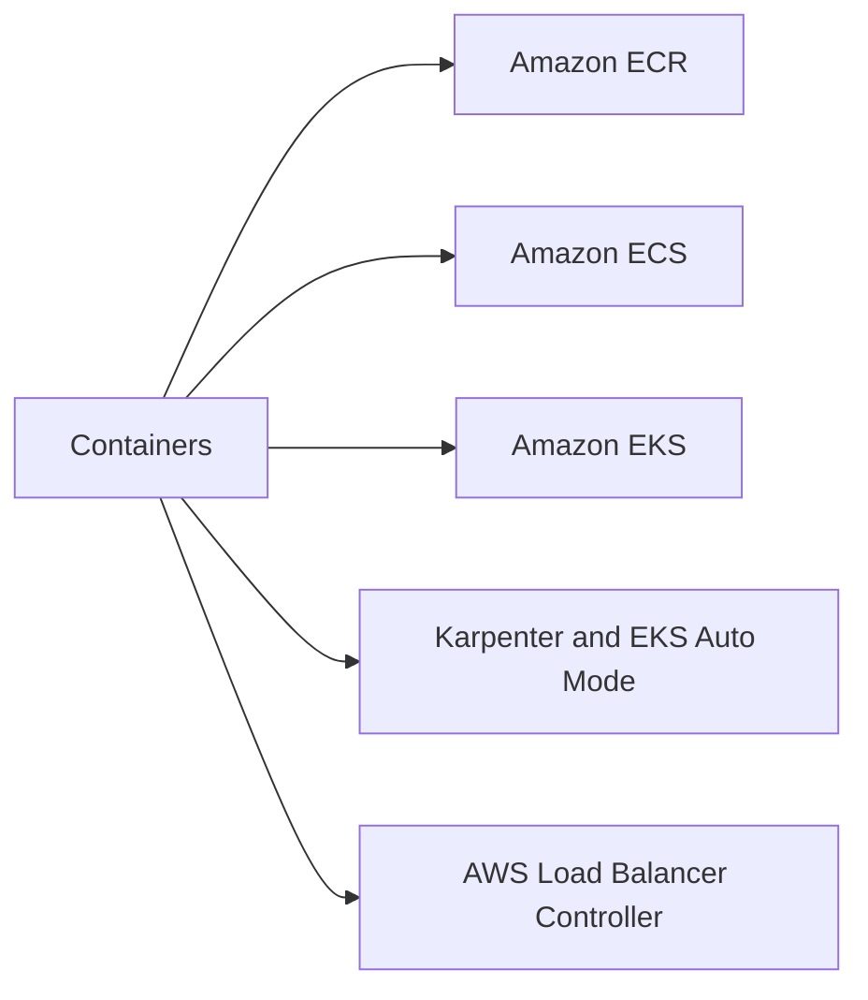
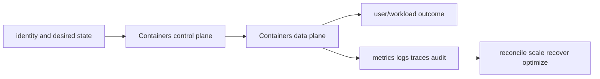

# Containers

<!-- child-topic-toc:start -->
## Table of contents and deeper notes

This parent note explains how the child topics work together. Follow each child link for the deeper mechanism, real commands/configuration, hands-on practice, authoritative documentation, and its local interview bank.

- [Containers service leaves](services/README.md) — [questions and answers](services/questions-and-answers.md)
<!-- child-topic-toc:end -->
This branch README is both the study note and the map. Each service leaf keeps its notes in its own README and its answered interview bank in a separate file.



## Service leaves

- [Amazon ECR](services/ecr/README.md) — [Q&A](services/ecr/questions-and-answers.md)
- [Amazon ECS](services/ecs/README.md) — [Q&A](services/ecs/questions-and-answers.md)
- [Amazon EKS](services/eks/README.md) — [Q&A](services/eks/questions-and-answers.md)
- [Karpenter and EKS Auto Mode](services/karpenter-auto-mode/README.md) — [Q&A](services/karpenter-auto-mode/questions-and-answers.md)
- [AWS Load Balancer Controller](services/aws-load-balancer-controller/README.md) — [Q&A](services/aws-load-balancer-controller/questions-and-answers.md)

## Branch learning contract

Learn the easy mental model first, run the read-only commands in a sandbox, render/apply the examples only in disposable environments, then break and repair one dependency at a time. Be able to connect these topics across the branch: Repository, Tag immutability, Image scanning, Task definition, Task, Service, Managed control plane, Access entries, Managed node group, Pending-Pod demand, NodePool, NodeClass, Ingress reconciliation, Service LoadBalancer, Target type ip.

## Branch interview bank

See [questions-and-answers.md](questions-and-answers.md) for 60 additional branch-level questions and answers. Service-specific banks contain another 60 per service.

> Interview bank: [questions-and-answers.md](questions-and-answers.md) · Official documentation: <https://docs.aws.amazon.com/AmazonECR/latest/userguide/what-is-ecr.html>

## Easy mode: purpose and mental model

Integrate the containers branch as one production capability rather than isolated products.



## Detailed learning notes

| # | Concept | What you must be able to explain |
|---:|---|---|
| 1 | **Repository** | regional namespace with IAM/resource policy and encryption. |
| 2 | **Tag immutability** | prevents overwriting release tags while deployment by digest is stronger identity. |
| 3 | **Task definition** | versioned container, resource, network, log, secret, volume and role specification. |
| 4 | **Task** | running/scheduled instantiation of a task definition. |
| 5 | **Managed control plane** | AWS runs API/etcd availability while customers own access, workloads and most data-plane choices. |
| 6 | **Access entries** | EKS API manages cluster access mappings; Kubernetes RBAC still authorizes resources. |
| 7 | **Pending-Pod demand** | autoscaler reads unschedulable constraints/requests rather than average node CPU alone. |
| 8 | **NodePool** | constrains labels, taints, requirements, disruption and aggregate resource limits. |
| 9 | **Ingress reconciliation** | annotations/spec/class generate ALB listeners/rules/target groups. |
| 10 | **Service LoadBalancer** | controller provisions NLB behavior from Service annotations/spec. |

## Architecture and lifecycle

Trace this service from request/authentication and desired configuration through provisioning, steady-state data path, scaling, change, failure, recovery and retirement. Bind every production resource to an owner, environment, data classification, source-of-truth revision, SLO, runbook, cost center and deletion/retention policy.

For Containers, draw a real request/resource path and label where these mechanisms act: Repository, Tag immutability, Task definition, Task, Managed control plane, Access entries, Pending-Pod demand, NodePool, Ingress reconciliation, Service LoadBalancer. State which parts are control plane versus data plane, regional versus zonal/global, synchronous versus asynchronous, and customer versus provider responsibility.

## Security model

Start with the caller/workload identity and evaluate every applicable identity, resource, organization, network-endpoint, encryption-key and admission policy. Minimize public paths, long-lived credentials, wildcard actions/resources and unreviewed cross-account/tenant trust. Encrypt in transit/at rest where applicable, but include key/certificate rotation and recovery. Protect audit evidence and prevent secrets/customer content from entering command history, logs, traces or metric labels.

## Availability and failure modes

List dependencies and failure domains before claiming high availability. Test quota/capacity, identity/control-plane, DNS/network/TLS, configuration drift, downstream saturation, zonal/Regional/node failure and recovery from protected state. Use bounded timeout, retry budget, jitter, idempotency, backpressure, load shedding and graceful drain according to protocol. A green resource status is not a user-facing recovery check.

## Performance, scaling and cost

Measure workload distribution and SLI before sizing. Track rate/work units, latency distribution, errors, saturation/queue and service-specific limits. Separate replica/task scaling from infrastructure/capacity scaling and include cold-start/provisioning delay. Cost includes idle/provisioned capacity, requests/work units, storage/retention, cross-AZ/Region/egress/NAT, observability, licenses/support and failure headroom. Optimize cost per successful SLO/quality-controlled task.

## Observability

Correlate a request/change across user, route/resource, dependency and underlying compute/storage/network. Use stable owner/environment/region/service dimensions; put high-cardinality request/object IDs in sampled logs/traces rather than metric labels. Alert on actionable SLO burn and leading exhaustion. Monitor the telemetry path and keep a read-only diagnostic role.

## Command lab

Run in a sandbox with the correct account/context/Region. Read and explain output before mutation.

```bash
aws ecr describe-repositories
aws ecs describe-clusters --clusters CLUSTER
aws eks describe-cluster --name CLUSTER
kubectl get nodepool,ec2nodeclass,nodeclaim
kubectl get ingress,service -A
```

For each command, record: identity/context, exact resource, expected healthy fields, one failing output, the next command/query, and which mutation would be reversible. Never paste secrets/tokens into committed notes or shared terminal history.

## Real-world exercise: easy → hard

1. **Easy:** inventory one healthy Containers resource and draw identity/control/data/dependency paths.
2. **Intermediate:** reproduce a safe configuration change with IaC, preview/diff, apply to a sandbox, verify and roll back.
3. **Hard:** inject one policy/network/quota/capacity/dependency failure, diagnose from user symptom to root mechanism, mitigate without widening access, then add an alert/test/runbook.
4. **Senior:** design the service for two tenants, multi-zone/Region failure, RPO/RTO, regulated data, 10× demand and a 30% cost reduction; quantify trade-offs.

## Common interview traps

- Naming a feature without explaining request/resource lifecycle or failure semantics.
- Treating an allow, encryption checkbox, replica count or managed-service label as a complete security/reliability design.
- Mutating production before capturing identity, status, events, metrics, logs, audit and recent changes.
- Scaling the wrong layer or retrying overload/permanent errors.
- Omitting quotas, cold start, deletion/restore, observability cost or customer/tenant boundaries.

## Revision summary

Explain Containers in five passes: purpose/selection, mechanism/lifecycle, security/failure, operation/commands, and architecture/economics. Then complete the separate [answered question bank](questions-and-answers.md) without looking at these notes.

<!-- merged-07-AWS-CONTAINERS-MD:start -->
## Practical deep dive

## Purpose and mental model

ECR stores OCI artifacts. ECS provides AWS-native task/service orchestration; EKS provides a managed Kubernetes control plane with AWS-integrated data-plane components. Fargate removes node management but constrains features and economics. Choose from API portability/ecosystem, workload needs, isolation, team expertise, operational burden and cost—not popularity.

## ECR

Use immutable tags plus deployment by digest, vulnerability scanning, lifecycle policies, cross-account resource policies, cross-Region replication, pull-through cache, encryption and signing/provenance verification. Scan results are a prioritization input; rebuild from patched trusted bases and promote the same digest. Protect `PutImage`, deletion and replication configuration; alert on unusual pull/push and expiring auth paths.

## ECS

A task definition versions container/resource/network/role/log/secret settings; tasks instantiate it; services maintain count, integrate load balancing/discovery and deploy revisions. EC2 launch type exposes instance/capacity control; Fargate prices per task resources and removes host access. Capacity providers combine ASGs/Fargate/Spot. Distinguish task execution role (pull/log/secret startup) from task role (application AWS calls). Use `awsvpc`, health checks, circuit breaker/rollback, draining and deployment minimum/maximum percentages.

## EKS architecture and identity

AWS manages the EKS control plane; you operate Kubernetes resources and, unless Fargate/Auto Mode covers them, nodes/add-ons. Node choices include managed/self-managed groups, Fargate and dynamic provisioning. EKS access entries map cluster access; Kubernetes RBAC still authorizes. IRSA exchanges projected service-account OIDC tokens through STS; EKS Pod Identity uses its agent/service association model. Do not give application pods the broad node role.

VPC CNI assigns VPC IPs to pods and is constrained by subnet IP/ENI density unless prefix delegation/alternate designs are used. Security groups for Pods offer ENI-level controls under constraints. CoreDNS and kube-proxy/eBPF data paths, EBS/EFS CSI, metrics/logging and load balancer controller are production dependencies. Pin compatible add-on versions and upgrade control plane, add-ons and nodes under the Kubernetes skew/deprecation policy.

The AWS Load Balancer Controller reconciles Ingress/Service resources into ALB/NLB resources. Target type `ip` routes directly to pod IP; `instance` routes through node ports. Ingress groups can share an ALB but expand the trust boundary—control who may add rules.

## Scaling, GPU and resilience

HPA/KEDA scale pods from demand signals; Cluster Autoscaler scales predefined node groups; Karpenter/Auto Mode provision nodes from pending-pod constraints. Pod scaling must lead node demand; cold GPU/model startup means queue depth and predictive buffers often matter more than GPU utilization alone. Use diverse compatible instance/AZ options, taints, labels, topology spread, PDBs, priority, disruption budgets, Spot handling and quota/capacity monitoring.

Separate system, CPU, stateful and GPU pools. For GPU pools manage driver/device plugin/Operator compatibility, large image/model caches, scale-from-zero labels, consolidation protection and XID/ECC remediation. A quota does not guarantee capacity.

## Security, observability, cost and troubleshooting

Use private endpoints where appropriate, least-privilege cluster/admin roles, workload identities, Pod Security/NetworkPolicy, admission policy, encrypted secrets, signed images, audit logs, node hardening and restricted metadata/egress. Watch control-plane/API latency, node/pod conditions, CNI IPs, DNS, add-on health, pending reasons, autoscaler decisions, LB target health, image pulls, CSI operations, GPU metrics and cost allocation.

```bash
aws ecr describe-images --repository-name REPO
aws ecs describe-services --cluster CLUSTER --services SERVICE
aws eks describe-cluster --name CLUSTER
aws eks list-addons --cluster-name CLUSTER
kubectl get pods,nodes -A -o wide
kubectl get events -A --sort-by=.lastTimestamp
kubectl auth can-i VERB RESOURCE --as=IDENTITY
```

Troubleshoot from desired object → events/status → scheduler → node/kubelet/runtime → image/identity → CNI/DNS/service/LB → CSI/state → application. Separate mitigation from the IaC/GitOps fix and verify reconciliation does not undo it.

## Revision summary

- Deploy immutable digests and preserve artifact provenance.
- ECS task and execution roles have different purposes.
- EKS managed control plane does not remove data-plane/add-on responsibility.
- Workload identity should not inherit node privilege.
- Pod and node autoscaling form a two-stage system with real cold-start/capacity delays.


<!-- merged-07-AWS-CONTAINERS-MD:end -->
