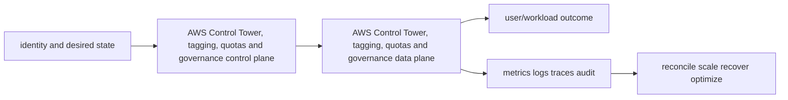

# AWS Control Tower, tagging, quotas and governance

> Interview bank: [questions-and-answers.md](questions-and-answers.md) · Official documentation: <https://docs.aws.amazon.com/controltower/latest/userguide/what-is-control-tower.html>

## Easy mode: purpose and mental model

Create a governed landing zone and continuously detect ownership, policy, drift, quota and cost risks.



## Detailed learning notes

| # | Concept | What you must be able to explain |
|---:|---|---|
| 1 | **Landing zone** | standardized multi-account identity, logging, security and network foundation. |
| 2 | **Control Tower controls** | preventive, detective and proactive controls differ in enforcement timing and mechanism. |
| 3 | **Tag taxonomy** | owner, environment, data class, cost center and lifecycle fields support operations and allocation. |
| 4 | **Tag policies** | standardize allowed tag values but may not enforce every resource creation path alone. |
| 5 | **AWS Config** | records supported configuration history and evaluates compliance rules. |
| 6 | **CloudTrail** | records account/API activity and must be centralized/protected. |
| 7 | **Service quotas** | API/resource ceilings need inventory, forecast, alert and early increase requests. |
| 8 | **AWS Resource Explorer/Config aggregators** | provide cross-account resource inventory with service-specific coverage. |
| 9 | **Budget controls** | combine alerts/anomaly detection with service/platform quotas because budgets are not universal hard stops. |
| 10 | **Drift remediation** | decide source of truth and use reviewed automation rather than destructive automatic correction everywhere. |

## Architecture and lifecycle

Trace this service from request/authentication and desired configuration through provisioning, steady-state data path, scaling, change, failure, recovery and retirement. Bind every production resource to an owner, environment, data classification, source-of-truth revision, SLO, runbook, cost center and deletion/retention policy.

For AWS Control Tower, tagging, quotas and governance, draw a real request/resource path and label where these mechanisms act: Landing zone, Control Tower controls, Tag taxonomy, Tag policies, AWS Config, CloudTrail, Service quotas, AWS Resource Explorer/Config aggregators, Budget controls, Drift remediation. State which parts are control plane versus data plane, regional versus zonal/global, synchronous versus asynchronous, and customer versus provider responsibility.

## Security model

Start with the caller/workload identity and evaluate every applicable identity, resource, organization, network-endpoint, encryption-key and admission policy. Minimize public paths, long-lived credentials, wildcard actions/resources and unreviewed cross-account/tenant trust. Encrypt in transit/at rest where applicable, but include key/certificate rotation and recovery. Protect audit evidence and prevent secrets/customer content from entering command history, logs, traces or metric labels.

## Availability and failure modes

List dependencies and failure domains before claiming high availability. Test quota/capacity, identity/control-plane, DNS/network/TLS, configuration drift, downstream saturation, zonal/Regional/node failure and recovery from protected state. Use bounded timeout, retry budget, jitter, idempotency, backpressure, load shedding and graceful drain according to protocol. A green resource status is not a user-facing recovery check.

## Performance, scaling and cost

Measure workload distribution and SLI before sizing. Track rate/work units, latency distribution, errors, saturation/queue and service-specific limits. Separate replica/task scaling from infrastructure/capacity scaling and include cold-start/provisioning delay. Cost includes idle/provisioned capacity, requests/work units, storage/retention, cross-AZ/Region/egress/NAT, observability, licenses/support and failure headroom. Optimize cost per successful SLO/quality-controlled task.

## Observability

Correlate a request/change across user, route/resource, dependency and underlying compute/storage/network. Use stable owner/environment/region/service dimensions; put high-cardinality request/object IDs in sampled logs/traces rather than metric labels. Alert on actionable SLO burn and leading exhaustion. Monitor the telemetry path and keep a read-only diagnostic role.

## Command lab

Run in a sandbox with the correct account/context/Region. Read and explain output before mutation.

```bash
aws controltower list-enabled-controls --target-identifier OU_ARN
aws configservice describe-compliance-by-config-rule
aws service-quotas list-service-quotas --service-code SERVICE
aws resource-explorer-2 search --query-string 'tag.key:Owner'
```

For each command, record: identity/context, exact resource, expected healthy fields, one failing output, the next command/query, and which mutation would be reversible. Never paste secrets/tokens into committed notes or shared terminal history.

## Real-world exercise: easy → hard

1. **Easy:** inventory one healthy AWS Control Tower, tagging, quotas and governance resource and draw identity/control/data/dependency paths.
2. **Intermediate:** reproduce a safe configuration change with IaC, preview/diff, apply to a sandbox, verify and roll back.
3. **Hard:** inject one policy/network/quota/capacity/dependency failure, diagnose from user symptom to root mechanism, mitigate without widening access, then add an alert/test/runbook.
4. **Senior:** design the service for two tenants, multi-zone/Region failure, RPO/RTO, regulated data, 10× demand and a 30% cost reduction; quantify trade-offs.

## Common interview traps

- Naming a feature without explaining request/resource lifecycle or failure semantics.
- Treating an allow, encryption checkbox, replica count or managed-service label as a complete security/reliability design.
- Mutating production before capturing identity, status, events, metrics, logs, audit and recent changes.
- Scaling the wrong layer or retrying overload/permanent errors.
- Omitting quotas, cold start, deletion/restore, observability cost or customer/tenant boundaries.

## Revision summary

Explain AWS Control Tower, tagging, quotas and governance in five passes: purpose/selection, mechanism/lifecycle, security/failure, operation/commands, and architecture/economics. Then complete the separate [answered question bank](questions-and-answers.md) without looking at these notes.
