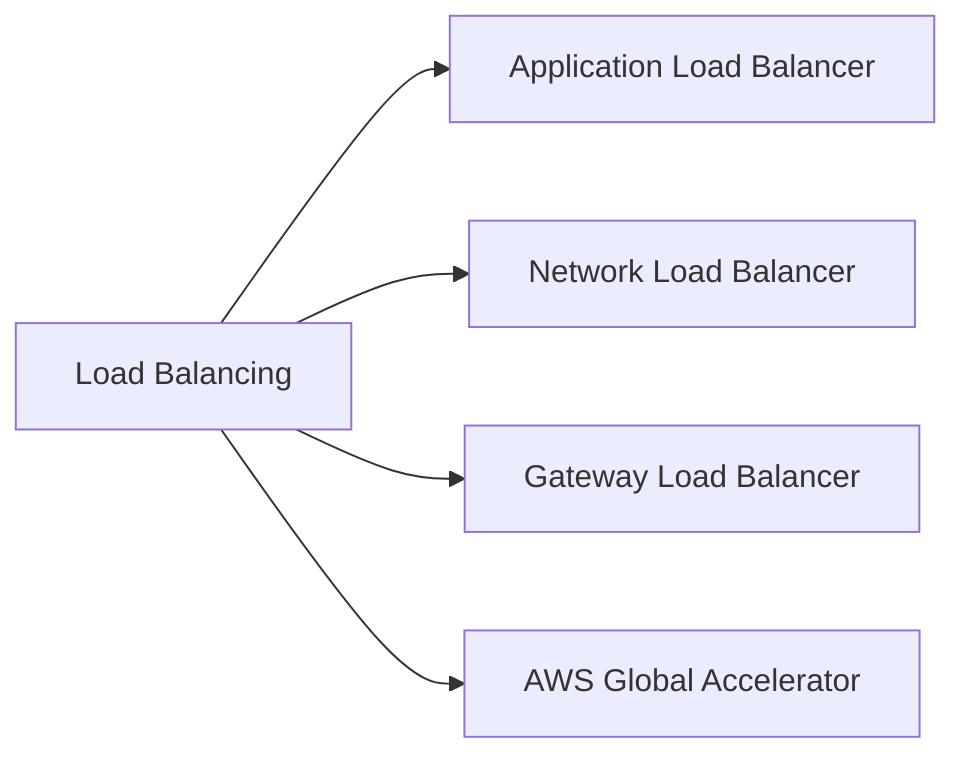
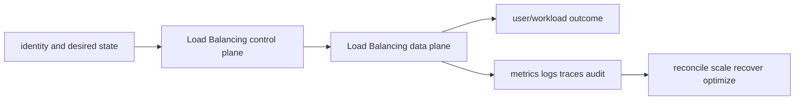

# Load Balancing

<!-- child-topic-toc:start -->
## Table of contents and deeper notes

This parent note explains how the child topics work together. Follow each child link for the deeper mechanism, real commands/configuration, hands-on practice, authoritative documentation, and its local interview bank.

- [Load Balancing service leaves](services/README.md) — [questions and answers](services/questions-and-answers.md)
<!-- child-topic-toc:end -->
This branch README is both the study note and the map. Each service leaf keeps its notes in its own README and its answered interview bank in a separate file.



## Service leaves

- [Application Load Balancer](services/alb/README.md) — [Q&A](services/alb/questions-and-answers.md)
- [Network Load Balancer](services/nlb/README.md) — [Q&A](services/nlb/questions-and-answers.md)
- [Gateway Load Balancer](services/gwlb/README.md) — [Q&A](services/gwlb/questions-and-answers.md)
- [AWS Global Accelerator](services/global-accelerator/README.md) — [Q&A](services/global-accelerator/questions-and-answers.md)

## Branch learning contract

Learn the easy mental model first, run the read-only commands in a sandbox, render/apply the examples only in disposable environments, then break and repair one dependency at a time. Be able to connect these topics across the branch: Listener, Listener rule, Target group, Layer 4 flow, Static zonal addresses, Source IP preservation, GENEVE, GWLB endpoint, Appliance target group, Anycast IP, Accelerator listener, Endpoint group.

## Branch interview bank

See [questions-and-answers.md](questions-and-answers.md) for 60 additional branch-level questions and answers. Service-specific banks contain another 60 per service.

> Interview bank: [questions-and-answers.md](questions-and-answers.md) · Official documentation: <https://docs.aws.amazon.com/elasticloadbalancing/latest/application/introduction.html>

## Easy mode: purpose and mental model

Integrate the load balancing branch as one production capability rather than isolated products.



## Detailed learning notes

| # | Concept | What you must be able to explain |
|---:|---|---|
| 1 | **Listener** | accepts a protocol/port and default action under TLS policy/certificates. |
| 2 | **Listener rule** | ordered conditions on host/path/header/query/method/source select actions. |
| 3 | **Layer 4 flow** | routing is based on connection/protocol rather than HTTP path/header semantics. |
| 4 | **Static zonal addresses** | one address per enabled zone can satisfy allowlists and anycast/global patterns via other services. |
| 5 | **GENEVE** | encapsulates original packets and metadata between GWLB and appliances. |
| 6 | **GWLB endpoint** | PrivateLink-style route target that sends traffic to an appliance service. |
| 7 | **Anycast IP** | the same static addresses advertise globally and enter a nearby AWS edge. |
| 8 | **Accelerator listener** | accepts TCP/UDP port ranges and distributes to endpoint groups. |

## Architecture and lifecycle

Trace this service from request/authentication and desired configuration through provisioning, steady-state data path, scaling, change, failure, recovery and retirement. Bind every production resource to an owner, environment, data classification, source-of-truth revision, SLO, runbook, cost center and deletion/retention policy.

For Load Balancing, draw a real request/resource path and label where these mechanisms act: Listener, Listener rule, Layer 4 flow, Static zonal addresses, GENEVE, GWLB endpoint, Anycast IP, Accelerator listener. State which parts are control plane versus data plane, regional versus zonal/global, synchronous versus asynchronous, and customer versus provider responsibility.

## Security model

Start with the caller/workload identity and evaluate every applicable identity, resource, organization, network-endpoint, encryption-key and admission policy. Minimize public paths, long-lived credentials, wildcard actions/resources and unreviewed cross-account/tenant trust. Encrypt in transit/at rest where applicable, but include key/certificate rotation and recovery. Protect audit evidence and prevent secrets/customer content from entering command history, logs, traces or metric labels.

## Availability and failure modes

List dependencies and failure domains before claiming high availability. Test quota/capacity, identity/control-plane, DNS/network/TLS, configuration drift, downstream saturation, zonal/Regional/node failure and recovery from protected state. Use bounded timeout, retry budget, jitter, idempotency, backpressure, load shedding and graceful drain according to protocol. A green resource status is not a user-facing recovery check.

## Performance, scaling and cost

Measure workload distribution and SLI before sizing. Track rate/work units, latency distribution, errors, saturation/queue and service-specific limits. Separate replica/task scaling from infrastructure/capacity scaling and include cold-start/provisioning delay. Cost includes idle/provisioned capacity, requests/work units, storage/retention, cross-AZ/Region/egress/NAT, observability, licenses/support and failure headroom. Optimize cost per successful SLO/quality-controlled task.

## Observability

Correlate a request/change across user, route/resource, dependency and underlying compute/storage/network. Use stable owner/environment/region/service dimensions; put high-cardinality request/object IDs in sampled logs/traces rather than metric labels. Alert on actionable SLO burn and leading exhaustion. Monitor the telemetry path and keep a read-only diagnostic role.

## Command lab

Run in a sandbox with the correct account/context/Region. Read and explain output before mutation.

```bash
aws elbv2 describe-load-balancers --names NAME
aws elbv2 describe-load-balancers --names NAME
aws elbv2 describe-load-balancers
aws globalaccelerator list-accelerators --region us-west-2
```

For each command, record: identity/context, exact resource, expected healthy fields, one failing output, the next command/query, and which mutation would be reversible. Never paste secrets/tokens into committed notes or shared terminal history.

## Real-world exercise: easy → hard

1. **Easy:** inventory one healthy Load Balancing resource and draw identity/control/data/dependency paths.
2. **Intermediate:** reproduce a safe configuration change with IaC, preview/diff, apply to a sandbox, verify and roll back.
3. **Hard:** inject one policy/network/quota/capacity/dependency failure, diagnose from user symptom to root mechanism, mitigate without widening access, then add an alert/test/runbook.
4. **Senior:** design the service for two tenants, multi-zone/Region failure, RPO/RTO, regulated data, 10× demand and a 30% cost reduction; quantify trade-offs.

## Common interview traps

- Naming a feature without explaining request/resource lifecycle or failure semantics.
- Treating an allow, encryption checkbox, replica count or managed-service label as a complete security/reliability design.
- Mutating production before capturing identity, status, events, metrics, logs, audit and recent changes.
- Scaling the wrong layer or retrying overload/permanent errors.
- Omitting quotas, cold start, deletion/restore, observability cost or customer/tenant boundaries.

## Revision summary

Explain Load Balancing in five passes: purpose/selection, mechanism/lifecycle, security/failure, operation/commands, and architecture/economics. Then complete the separate [answered question bank](questions-and-answers.md) without looking at these notes.

<!-- merged-07-AWS-ELASTIC-LOAD-BALANCING-MD:start -->
## Practical deep dive

## Purpose and mental model

A load balancer accepts connections on listeners, applies listener rules, selects healthy targets from a target group, and observes a separate connection to each target. Choose at the protocol boundary: ALB understands HTTP semantics, NLB handles high-performance Layer 4 flows, and GWLB inserts transparent appliances. DNS/anycast/global routing decides which regional endpoint receives traffic.

## Common lifecycle

Create an internet-facing or internal load balancer in suitable subnets/AZs; add listeners and certificates; define target groups by instance, IP, Lambda or ALB support; register targets; configure health checks; route rules; enable logs/metrics; test; then shift traffic. Deregistration delay drains existing work when targets leave. Health checks must test readiness without causing load or hiding critical dependency failure. Cross-zone behavior affects distribution, zonal isolation and transfer cost and differs by load-balancer type/configuration—verify current defaults.

TLS termination exposes HTTP to the load balancer and centralizes certificates/policies. Re-encryption protects the backend hop. TLS passthrough preserves end-to-end TLS but removes Layer 7 inspection/routing. SNI permits multiple certificates; mTLS can authenticate clients where supported or at an upstream proxy. Automate ACM issuance/renewal and alert on imported/private certificate expiry.

## Application Load Balancer

ALB supports HTTP/HTTPS, HTTP/2, WebSockets and gRPC, with host/path/header/query/method/source-IP rules, redirects/fixed responses, weighted target groups, stickiness, slow start, authentication, WAF and Lambda/IP/instance targets. It is ideal for web APIs, Kubernetes Ingress/Gateway and progressive traffic splitting. It does not give stable individual IPs; use DNS or an NLB-fronted pattern when a supported static/private endpoint is required.

Distinguish ALB-generated errors from target errors using access-log fields and metrics. `HTTPCode_ELB_5XX` points toward the load-balancer side; `HTTPCode_Target_5XX` points to targets. 502 commonly means invalid/reset backend response, 503 no usable target/capacity, and 504 target connection/response timeout—but verify evidence.

## Network Load Balancer

NLB handles TCP/UDP/TLS, preserves source IP in supported target modes, offers zonal static addresses/EIPs, long-lived connections, TLS termination or passthrough, IP/instance/ALB targets and PrivateLink endpoint services. Security behavior depends on target type and whether the NLB has a security group. Layer 4 health cannot prove an HTTP dependency is semantically ready unless HTTP/HTTPS checks are configured.

## Gateway Load Balancer, CLB and global choices

GWLB uses GENEVE to steer flows through scalable firewall/IDS/appliance fleets via GWLB endpoints. Appliance mode/symmetric routing and flow stickiness are fundamental; asymmetric paths break stateful inspection. Classic Load Balancer is legacy; migrate after inventorying listeners, stickiness, proxy protocol, health, certificates and client behavior.

Route 53 routing is DNS-based and influenced by caching. Global Accelerator uses anycast addresses and the AWS network to route to healthy regional endpoints. CloudFront is a CDN/reverse proxy for cacheable and dynamic HTTP. Use these together only with a clear origin/failover/caching/residency model.

## Security, reliability, performance, observability and cost

- Restrict inbound SGs, targets to load-balancer SG/source as supported, TLS policies/ciphers, WAF and authenticated origins; protect logs and redact application data.
- Deploy across AZs, ensure each zone has healthy capacity, drain safely, align idle/keepalive/timeouts end-to-end, and test zonal failure.
- Watch active/new connections, processed bytes, healthy/unhealthy hosts, rejected connections, target response time, resets, TLS errors and ELB/target status codes.
- Access logs are delayed evidence, not a real-time SLO. Correlate request IDs/traces from edge to target.
- Costs include hourly/load-balancer capacity units, bytes/connections/rules, cross-AZ transfer, WAF, Global Accelerator, CloudFront and logging.

## Troubleshooting path

```bash
aws elbv2 describe-load-balancers --names NAME
aws elbv2 describe-listeners --load-balancer-arn ARN
aws elbv2 describe-rules --listener-arn ARN
aws elbv2 describe-target-health --target-group-arn TG_ARN
aws elbv2 describe-load-balancer-attributes --load-balancer-arn ARN
```

Resolve the LB DNS from the failing client; verify scheme/IP family/listener/certificate; inspect rule priority/action; inspect target type, port, AZ and reason codes; test the health path directly from the same network; evaluate SG/NACL/routes; compare ELB/target metrics and access logs; check app saturation/timeouts; make a reversible correction; validate drain/failover from the client.

## Common traps

- A healthy TCP port does not prove a healthy application.
- Stickiness can mask bad capacity distribution and complicate deployments.
- Weighted rules are not an evaluation system; define success and rollback gates.
- A load balancer cannot send traffic to a target blocked by return routing or host firewall.
- Static IP, client IP preservation and L7 routing are separate requirements; sometimes NLB→ALB is appropriate.
- Retry behavior at client, gateway, LB and service layers can multiply traffic during failure.

## Revision summary

- Select ALB/NLB/GWLB by protocol and operational requirements.
- Listener, rule, target health, network path and application capacity are distinct layers.
- Drain and timeout alignment prevent deployment-induced resets.
- Diagnose load-balancer-generated versus target-generated errors with metrics/logs.
- Global routing must include caching, failure detection, residency and state recovery.


<!-- merged-07-AWS-ELASTIC-LOAD-BALANCING-MD:end -->
