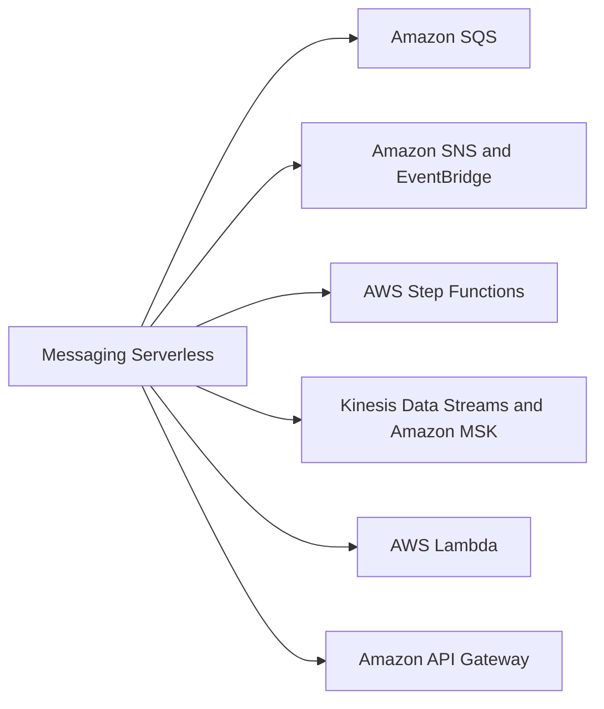
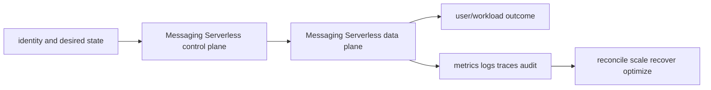

# Messaging Serverless

<!-- child-topic-toc:start -->
## Table of contents and deeper notes

This parent note explains how the child topics work together. Follow each child link for the deeper mechanism, real commands/configuration, hands-on practice, authoritative documentation, and its local interview bank.

- [Messaging Serverless service leaves](services/README.md) — [questions and answers](services/questions-and-answers.md)
<!-- child-topic-toc:end -->
This branch README is both the study note and the map. Each service leaf keeps its notes in its own README and its answered interview bank in a separate file.



## Service leaves

- [Amazon SQS](services/sqs/README.md) — [Q&A](services/sqs/questions-and-answers.md)
- [Amazon SNS and EventBridge](services/sns-eventbridge/README.md) — [Q&A](services/sns-eventbridge/questions-and-answers.md)
- [AWS Step Functions](services/step-functions/README.md) — [Q&A](services/step-functions/questions-and-answers.md)
- [Kinesis Data Streams and Amazon MSK](services/kinesis-msk/README.md) — [Q&A](services/kinesis-msk/questions-and-answers.md)
- [AWS Lambda](services/lambda/README.md) — [Q&A](services/lambda/questions-and-answers.md)
- [Amazon API Gateway](services/api-gateway/README.md) — [Q&A](services/api-gateway/questions-and-answers.md)

## Branch learning contract

Learn the easy mental model first, run the read-only commands in a sandbox, render/apply the examples only in disposable environments, then break and repair one dependency at a time. Be able to connect these topics across the branch: Standard queue, FIFO queue, Visibility timeout, SNS topic, Subscription filter, Delivery retry/DLQ, State machine, Standard workflow, Express workflow, Shard/partition, Partition key, Sequence/offset, Execution environment, Cold start, Reserved concurrency, REST vs HTTP API, WebSocket API, Route/resource-method.

## Branch interview bank

See [questions-and-answers.md](questions-and-answers.md) for 60 additional branch-level questions and answers. Service-specific banks contain another 60 per service.

> Interview bank: [questions-and-answers.md](questions-and-answers.md) · Official documentation: <https://docs.aws.amazon.com/AWSSimpleQueueService/latest/SQSDeveloperGuide/welcome.html>

## Easy mode: purpose and mental model

Integrate the messaging serverless branch as one production capability rather than isolated products.



## Detailed learning notes

| # | Concept | What you must be able to explain |
|---:|---|---|
| 1 | **Standard queue** | at-least-once delivery and best-effort order at very high scale. |
| 2 | **FIFO queue** | ordered message groups and deduplication with throughput/parallelism constraints. |
| 3 | **SNS topic** | publisher fan-out to protocol subscriptions under topic policy. |
| 4 | **Subscription filter** | routes messages by attributes/body and can drop unexpected schemas. |
| 5 | **State machine** | Amazon States Language graph defines tasks, choices, parallel/map, waits and terminal states. |
| 6 | **Standard workflow** | durable exactly-once workflow execution semantics for long-running auditable flows. |
| 7 | **Shard/partition** | ordered log unit and primary throughput/parallelism boundary. |
| 8 | **Partition key** | determines shard/partition and can create hot spots. |
| 9 | **Execution environment** | initialization may be reused across invocations but must not hold unsafe tenant state. |
| 10 | **Cold start** | package/runtime/init/VPC and extensions contribute before handler execution. |

## Architecture and lifecycle

Trace this service from request/authentication and desired configuration through provisioning, steady-state data path, scaling, change, failure, recovery and retirement. Bind every production resource to an owner, environment, data classification, source-of-truth revision, SLO, runbook, cost center and deletion/retention policy.

For Messaging Serverless, draw a real request/resource path and label where these mechanisms act: Standard queue, FIFO queue, SNS topic, Subscription filter, State machine, Standard workflow, Shard/partition, Partition key, Execution environment, Cold start. State which parts are control plane versus data plane, regional versus zonal/global, synchronous versus asynchronous, and customer versus provider responsibility.

## Security model

Start with the caller/workload identity and evaluate every applicable identity, resource, organization, network-endpoint, encryption-key and admission policy. Minimize public paths, long-lived credentials, wildcard actions/resources and unreviewed cross-account/tenant trust. Encrypt in transit/at rest where applicable, but include key/certificate rotation and recovery. Protect audit evidence and prevent secrets/customer content from entering command history, logs, traces or metric labels.

## Availability and failure modes

List dependencies and failure domains before claiming high availability. Test quota/capacity, identity/control-plane, DNS/network/TLS, configuration drift, downstream saturation, zonal/Regional/node failure and recovery from protected state. Use bounded timeout, retry budget, jitter, idempotency, backpressure, load shedding and graceful drain according to protocol. A green resource status is not a user-facing recovery check.

## Performance, scaling and cost

Measure workload distribution and SLI before sizing. Track rate/work units, latency distribution, errors, saturation/queue and service-specific limits. Separate replica/task scaling from infrastructure/capacity scaling and include cold-start/provisioning delay. Cost includes idle/provisioned capacity, requests/work units, storage/retention, cross-AZ/Region/egress/NAT, observability, licenses/support and failure headroom. Optimize cost per successful SLO/quality-controlled task.

## Observability

Correlate a request/change across user, route/resource, dependency and underlying compute/storage/network. Use stable owner/environment/region/service dimensions; put high-cardinality request/object IDs in sampled logs/traces rather than metric labels. Alert on actionable SLO burn and leading exhaustion. Monitor the telemetry path and keep a read-only diagnostic role.

## Command lab

Run in a sandbox with the correct account/context/Region. Read and explain output before mutation.

```bash
aws sqs get-queue-attributes --queue-url URL --attribute-names All
aws sns list-topics
aws stepfunctions list-state-machines
aws kinesis describe-stream-summary --stream-name STREAM
aws lambda get-function-configuration --function-name FUNCTION
aws apigateway get-rest-apis
```

For each command, record: identity/context, exact resource, expected healthy fields, one failing output, the next command/query, and which mutation would be reversible. Never paste secrets/tokens into committed notes or shared terminal history.

## Real-world exercise: easy → hard

1. **Easy:** inventory one healthy Messaging Serverless resource and draw identity/control/data/dependency paths.
2. **Intermediate:** reproduce a safe configuration change with IaC, preview/diff, apply to a sandbox, verify and roll back.
3. **Hard:** inject one policy/network/quota/capacity/dependency failure, diagnose from user symptom to root mechanism, mitigate without widening access, then add an alert/test/runbook.
4. **Senior:** design the service for two tenants, multi-zone/Region failure, RPO/RTO, regulated data, 10× demand and a 30% cost reduction; quantify trade-offs.

## Common interview traps

- Naming a feature without explaining request/resource lifecycle or failure semantics.
- Treating an allow, encryption checkbox, replica count or managed-service label as a complete security/reliability design.
- Mutating production before capturing identity, status, events, metrics, logs, audit and recent changes.
- Scaling the wrong layer or retrying overload/permanent errors.
- Omitting quotas, cold start, deletion/restore, observability cost or customer/tenant boundaries.

## Revision summary

Explain Messaging Serverless in five passes: purpose/selection, mechanism/lifecycle, security/failure, operation/commands, and architecture/economics. Then complete the separate [answered question bank](questions-and-answers.md) without looking at these notes.

<!-- merged-07-AWS-DATA-MESSAGING-SERVERLESS-MD:start -->
## Practical deep dive

## Purpose and service selection

Choose a data service from access pattern, consistency/transaction needs, item/query shape, latency/throughput, growth, availability/DR, operational control and cost. Choose messaging from delivery/order/replay/fan-out/latency and consumer model. Serverless moves fleet operations to the provider but leaves concurrency, idempotency, observability, security and cost design with you.

## Relational databases

RDS manages engines such as PostgreSQL/MySQL. Multi-AZ provides synchronous standby/failover for availability; read replicas provide asynchronous read scaling/DR options and can lag. Neither replaces backups/PITR. Parameter/option/subnet/security groups and maintenance windows are part of lifecycle. Connection storms exhaust memory/processes; pool clients and use RDS Proxy where its semantics fit.

Aurora separates distributed storage from compute with a writer and reader instances. Reader endpoints distribute eligible reads; failover promotes a reader. Serverless changes capacity model but does not eliminate connection/transaction/design limits. Global Database replicates cross-Region asynchronously; design recovery/failback and reconcile possible RPO.

## DynamoDB, cache and search

DynamoDB distributes items by partition key; sort key enables ordered collections. Key design must spread load and match queries. GSIs have independent keys/capacity and asynchronous propagation; LSIs share the partition key and are defined at table creation. On-demand/provisioned modes, adaptive capacity and autoscaling do not rescue a single hot key. Use conditional writes/idempotency, transactions selectively, TTL as asynchronous cleanup, Streams for change processing, and Global Tables with conflict semantics understood.

ElastiCache Valkey/Redis supports replication, cluster sharding, persistence options and eviction; Memcached is simpler distributed cache. A cache is disposable acceleration unless explicitly designed otherwise. Prevent stampedes with coalescing/jitter/soft TTL and protect databases from cold-cache recovery. OpenSearch indexes/shards/replicas data for search/vector workloads; mappings, shard count, heap, segment/merge load, snapshots and domain access determine health.

## Messaging and streaming

SQS Standard is highly scalable with at-least-once delivery and best-effort ordering; FIFO adds ordered message groups and deduplication constraints. Visibility timeout must exceed processing or be extended; deletion is the consumer commit. Redrive to a DLQ after thoughtful retries and build replay tooling that does not re-poison production.

SNS pushes fan-out notifications; filter policies route subscriptions. EventBridge routes schema-rich events across buses/rules/targets and supports archive/replay capabilities; it is not a general replacement for a high-throughput ordered log. Step Functions orchestrates state and retries; ensure activities are idempotent. Kinesis Data Streams and MSK/Kafka use ordered partitions/shards and consumer checkpoints; key distribution, retention, lag, rebalancing and replay are core. Firehose is managed delivery/buffering, not interactive stream processing.

## Lambda and API Gateway

Lambda execution environments initialize then handle invocations; cold start depends on runtime/package/network/init and provisioned concurrency can pre-initialize capacity. Reserved concurrency caps/reserves; account concurrency and downstream capacity must align. Event source mappings have service-specific batch, retry, bisect and failure-destination semantics. Use idempotency keyed by stable event identity, bounded retries, DLQs/destinations, partial batch failure where supported, and timeouts shorter than callers.

VPC Lambda uses managed networking but still needs subnet IPs, routes/endpoints/NAT and SGs. Keep secrets out of environment/logs, use execution roles, sign/scan artifacts and control layers/extensions. API Gateway REST/HTTP/WebSocket APIs differ in features/cost. Configure authorizers, validation, quotas/throttling, WAF, access logs, stages/custom domains and safe deployments.

## Reliability, observability, security and cost

Track database connections/CPU/memory/storage/replica lag/locks, DynamoDB throttles/consumed capacity/hot keys, cache hit/eviction/memory, OpenSearch cluster/shards/JVM, queue age/depth/DLQ, stream lag, Lambda concurrency/duration/errors/throttles/iterator age and workflow failures. Encrypt, isolate networks, use resource policies/workload roles, redact data and test backup/restore/replay.

Cost traps: idle database capacity, I/O and backup retention, GSI duplication, scans, cache overprovisioning, OpenSearch shard sprawl, cross-AZ/Region transfer, long queue retention, Lambda duration/concurrency/log volume and API requests. Optimize from unit economics and SLO, not a single line item.

## Revision summary

- Multi-AZ availability and read replicas solve different problems.
- DynamoDB partition-key distribution is a first-order design constraint.
- Consumers must be idempotent because common delivery is at least once.
- Retry/DLQ/replay need an operational lifecycle and poison-message controls.
- Serverless removes servers, not capacity, dependency or security engineering.


<!-- merged-07-AWS-DATA-MESSAGING-SERVERLESS-MD:end -->
