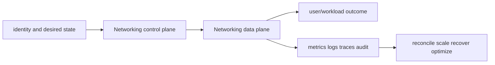

# Networking service leaves

<!-- child-topic-toc:start -->
## Table of contents and deeper notes

This parent note explains how the child topics work together. Follow each child link for the deeper mechanism, real commands/configuration, hands-on practice, authoritative documentation, and its local interview bank.

- [VPC endpoints and AWS PrivateLink](endpoints-privatelink/README.md) — [questions and answers](endpoints-privatelink/questions-and-answers.md)
- [AWS hybrid networking](hybrid-networking/README.md) — [questions and answers](hybrid-networking/questions-and-answers.md)
- [NAT and egress architecture](nat-egress/README.md) — [questions and answers](nat-egress/questions-and-answers.md)
- [VPC peering, Transit Gateway and Cloud WAN](peering-tgw-cloudwan/README.md) — [questions and answers](peering-tgw-cloudwan/questions-and-answers.md)
- [Amazon Route 53](route53/README.md) — [questions and answers](route53/questions-and-answers.md)
- [Security groups and network ACLs](security-groups-nacls/README.md) — [questions and answers](security-groups-nacls/questions-and-answers.md)
- [Amazon VPC](vpc/README.md) — [questions and answers](vpc/questions-and-answers.md)
<!-- child-topic-toc:end -->
- [Amazon VPC](vpc/README.md) — [Q&A](vpc/questions-and-answers.md)
- [Security groups and network ACLs](security-groups-nacls/README.md) — [Q&A](security-groups-nacls/questions-and-answers.md)
- [NAT and egress architecture](nat-egress/README.md) — [Q&A](nat-egress/questions-and-answers.md)
- [VPC endpoints and AWS PrivateLink](endpoints-privatelink/README.md) — [Q&A](endpoints-privatelink/questions-and-answers.md)
- [VPC peering, Transit Gateway and Cloud WAN](peering-tgw-cloudwan/README.md) — [Q&A](peering-tgw-cloudwan/questions-and-answers.md)
- [AWS hybrid networking](hybrid-networking/README.md) — [Q&A](hybrid-networking/questions-and-answers.md)
- [Amazon Route 53](route53/README.md) — [Q&A](route53/questions-and-answers.md)

> Interview bank: [questions-and-answers.md](questions-and-answers.md) · Official documentation: <https://docs.aws.amazon.com/vpc/latest/userguide/what-is-amazon-vpc.html>

## Easy mode: purpose and mental model

Integrate the networking branch as one production capability rather than isolated products.



## Detailed learning notes

| # | Concept | What you must be able to explain |
|---:|---|---|
| 1 | **VPC CIDR** | regional IPv4/IPv6 address space must avoid overlap and leave room for workloads, pods and growth. |
| 2 | **Subnet** | AZ-scoped address range whose route table and address behavior determine public/private/isolated use. |
| 3 | **Security group state** | allowed connections automatically permit tracked return traffic. |
| 4 | **Security group reference** | supported paths can allow traffic from ENIs associated with another group. |
| 5 | **NAT gateway** | managed AZ-scoped IPv4 translation with hourly and data-processing cost. |
| 6 | **NAT instance** | customer-managed translation with patching, throughput and failover responsibility. |
| 7 | **Gateway endpoint** | route-table target for supported services such as S3/DynamoDB without endpoint ENIs. |
| 8 | **Interface endpoint** | PrivateLink ENIs in subnets with security groups and per-hour/data cost. |
| 9 | **VPC peering** | direct non-transitive connectivity that requires non-overlap and routes on both sides. |
| 10 | **Transit Gateway attachments** | connect VPC, VPN, Direct Connect gateway or peering into a routed hub. |

## Architecture and lifecycle

Trace this service from request/authentication and desired configuration through provisioning, steady-state data path, scaling, change, failure, recovery and retirement. Bind every production resource to an owner, environment, data classification, source-of-truth revision, SLO, runbook, cost center and deletion/retention policy.

For Networking, draw a real request/resource path and label where these mechanisms act: VPC CIDR, Subnet, Security group state, Security group reference, NAT gateway, NAT instance, Gateway endpoint, Interface endpoint, VPC peering, Transit Gateway attachments. State which parts are control plane versus data plane, regional versus zonal/global, synchronous versus asynchronous, and customer versus provider responsibility.

## Security model

Start with the caller/workload identity and evaluate every applicable identity, resource, organization, network-endpoint, encryption-key and admission policy. Minimize public paths, long-lived credentials, wildcard actions/resources and unreviewed cross-account/tenant trust. Encrypt in transit/at rest where applicable, but include key/certificate rotation and recovery. Protect audit evidence and prevent secrets/customer content from entering command history, logs, traces or metric labels.

## Availability and failure modes

List dependencies and failure domains before claiming high availability. Test quota/capacity, identity/control-plane, DNS/network/TLS, configuration drift, downstream saturation, zonal/Regional/node failure and recovery from protected state. Use bounded timeout, retry budget, jitter, idempotency, backpressure, load shedding and graceful drain according to protocol. A green resource status is not a user-facing recovery check.

## Performance, scaling and cost

Measure workload distribution and SLI before sizing. Track rate/work units, latency distribution, errors, saturation/queue and service-specific limits. Separate replica/task scaling from infrastructure/capacity scaling and include cold-start/provisioning delay. Cost includes idle/provisioned capacity, requests/work units, storage/retention, cross-AZ/Region/egress/NAT, observability, licenses/support and failure headroom. Optimize cost per successful SLO/quality-controlled task.

## Observability

Correlate a request/change across user, route/resource, dependency and underlying compute/storage/network. Use stable owner/environment/region/service dimensions; put high-cardinality request/object IDs in sampled logs/traces rather than metric labels. Alert on actionable SLO burn and leading exhaustion. Monitor the telemetry path and keep a read-only diagnostic role.

## Command lab

Run in a sandbox with the correct account/context/Region. Read and explain output before mutation.

```bash
aws ec2 describe-vpcs --vpc-ids VPC_ID
aws ec2 describe-security-groups --group-ids SG_ID
aws ec2 describe-nat-gateways
aws ec2 describe-vpc-endpoints --filters Name=vpc-id,Values=VPC_ID
aws ec2 describe-vpc-peering-connections
aws ec2 describe-vpn-connections
aws route53 list-hosted-zones
```

For each command, record: identity/context, exact resource, expected healthy fields, one failing output, the next command/query, and which mutation would be reversible. Never paste secrets/tokens into committed notes or shared terminal history.

## Real-world exercise: easy → hard

1. **Easy:** inventory one healthy Networking resource and draw identity/control/data/dependency paths.
2. **Intermediate:** reproduce a safe configuration change with IaC, preview/diff, apply to a sandbox, verify and roll back.
3. **Hard:** inject one policy/network/quota/capacity/dependency failure, diagnose from user symptom to root mechanism, mitigate without widening access, then add an alert/test/runbook.
4. **Senior:** design the service for two tenants, multi-zone/Region failure, RPO/RTO, regulated data, 10× demand and a 30% cost reduction; quantify trade-offs.

## Common interview traps

- Naming a feature without explaining request/resource lifecycle or failure semantics.
- Treating an allow, encryption checkbox, replica count or managed-service label as a complete security/reliability design.
- Mutating production before capturing identity, status, events, metrics, logs, audit and recent changes.
- Scaling the wrong layer or retrying overload/permanent errors.
- Omitting quotas, cold start, deletion/restore, observability cost or customer/tenant boundaries.

## Revision summary

Explain Networking in five passes: purpose/selection, mechanism/lifecycle, security/failure, operation/commands, and architecture/economics. Then complete the separate [answered question bank](questions-and-answers.md) without looking at these notes.
