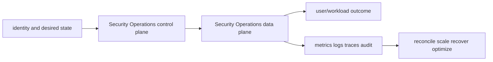

# Security Operations service leaves

<!-- child-topic-toc:start -->
## Table of contents and deeper notes

This parent note explains how the child topics work together. Follow each child link for the deeper mechanism, real commands/configuration, hands-on practice, authoritative documentation, and its local interview bank.

- [ACM, AWS WAF and Shield](acm-waf-shield/README.md) — [questions and answers](acm-waf-shield/questions-and-answers.md)
- [AWS CloudTrail and Config](cloudtrail-config/README.md) — [questions and answers](cloudtrail-config/questions-and-answers.md)
- [Amazon CloudWatch and X-Ray](cloudwatch-xray/README.md) — [questions and answers](cloudwatch-xray/questions-and-answers.md)
- [AWS KMS](kms/README.md) — [questions and answers](kms/questions-and-answers.md)
- [AWS Secrets Manager and Parameter Store](secrets-manager/README.md) — [questions and answers](secrets-manager/questions-and-answers.md)
- [GuardDuty, Security Hub, Inspector, Macie and Detective](security-detection/README.md) — [questions and answers](security-detection/questions-and-answers.md)
- [AWS Systems Manager](systems-manager/README.md) — [questions and answers](systems-manager/questions-and-answers.md)
<!-- child-topic-toc:end -->
- [AWS KMS](kms/README.md) — [Q&A](kms/questions-and-answers.md)
- [AWS Secrets Manager and Parameter Store](secrets-manager/README.md) — [Q&A](secrets-manager/questions-and-answers.md)
- [ACM, AWS WAF and Shield](acm-waf-shield/README.md) — [Q&A](acm-waf-shield/questions-and-answers.md)
- [GuardDuty, Security Hub, Inspector, Macie and Detective](security-detection/README.md) — [Q&A](security-detection/questions-and-answers.md)
- [Amazon CloudWatch and X-Ray](cloudwatch-xray/README.md) — [Q&A](cloudwatch-xray/questions-and-answers.md)
- [AWS CloudTrail and Config](cloudtrail-config/README.md) — [Q&A](cloudtrail-config/questions-and-answers.md)
- [AWS Systems Manager](systems-manager/README.md) — [Q&A](systems-manager/questions-and-answers.md)

> Interview bank: [questions-and-answers.md](questions-and-answers.md) · Official documentation: <https://docs.aws.amazon.com/kms/latest/developerguide/overview.html>

## Easy mode: purpose and mental model

Integrate the security operations branch as one production capability rather than isolated products.



## Detailed learning notes

| # | Concept | What you must be able to explain |
|---:|---|---|
| 1 | **KMS key** | logical key with policy, metadata and protected key material used by integrated services. |
| 2 | **Envelope encryption** | KMS protects data keys while applications/services encrypt bulk data locally. |
| 3 | **Secret version/stage** | labels such as AWSCURRENT/AWSPENDING coordinate rotation and rollback. |
| 4 | **Rotation Lambda** | creates/sets/tests/finishes a new credential under idempotent staged workflow. |
| 5 | **ACM certificate** | managed public/private/imported certificate with supported service integration. |
| 6 | **DNS validation** | persistent validation record enables managed renewal when service conditions hold. |
| 7 | **GuardDuty** | analyzes supported logs/signals to emit contextual threat findings. |
| 8 | **Security Hub** | aggregates/normalizes findings and control standards across accounts/Regions. |
| 9 | **Metric/dimension** | numeric time series and bounded dimensions enable aggregation but high cardinality multiplies cost. |
| 10 | **Alarm** | evaluates metric/statistic/period/datapoints/missing-data into OK/ALARM/insufficient state. |

## Architecture and lifecycle

Trace this service from request/authentication and desired configuration through provisioning, steady-state data path, scaling, change, failure, recovery and retirement. Bind every production resource to an owner, environment, data classification, source-of-truth revision, SLO, runbook, cost center and deletion/retention policy.

For Security Operations, draw a real request/resource path and label where these mechanisms act: KMS key, Envelope encryption, Secret version/stage, Rotation Lambda, ACM certificate, DNS validation, GuardDuty, Security Hub, Metric/dimension, Alarm. State which parts are control plane versus data plane, regional versus zonal/global, synchronous versus asynchronous, and customer versus provider responsibility.

## Security model

Start with the caller/workload identity and evaluate every applicable identity, resource, organization, network-endpoint, encryption-key and admission policy. Minimize public paths, long-lived credentials, wildcard actions/resources and unreviewed cross-account/tenant trust. Encrypt in transit/at rest where applicable, but include key/certificate rotation and recovery. Protect audit evidence and prevent secrets/customer content from entering command history, logs, traces or metric labels.

## Availability and failure modes

List dependencies and failure domains before claiming high availability. Test quota/capacity, identity/control-plane, DNS/network/TLS, configuration drift, downstream saturation, zonal/Regional/node failure and recovery from protected state. Use bounded timeout, retry budget, jitter, idempotency, backpressure, load shedding and graceful drain according to protocol. A green resource status is not a user-facing recovery check.

## Performance, scaling and cost

Measure workload distribution and SLI before sizing. Track rate/work units, latency distribution, errors, saturation/queue and service-specific limits. Separate replica/task scaling from infrastructure/capacity scaling and include cold-start/provisioning delay. Cost includes idle/provisioned capacity, requests/work units, storage/retention, cross-AZ/Region/egress/NAT, observability, licenses/support and failure headroom. Optimize cost per successful SLO/quality-controlled task.

## Observability

Correlate a request/change across user, route/resource, dependency and underlying compute/storage/network. Use stable owner/environment/region/service dimensions; put high-cardinality request/object IDs in sampled logs/traces rather than metric labels. Alert on actionable SLO burn and leading exhaustion. Monitor the telemetry path and keep a read-only diagnostic role.

## Command lab

Run in a sandbox with the correct account/context/Region. Read and explain output before mutation.

```bash
aws kms describe-key --key-id KEY
aws secretsmanager describe-secret --secret-id SECRET
aws acm list-certificates
aws guardduty list-detectors
aws cloudwatch describe-alarms --state-value ALARM
aws cloudtrail describe-trails
aws ssm describe-instance-information
```

For each command, record: identity/context, exact resource, expected healthy fields, one failing output, the next command/query, and which mutation would be reversible. Never paste secrets/tokens into committed notes or shared terminal history.

## Real-world exercise: easy → hard

1. **Easy:** inventory one healthy Security Operations resource and draw identity/control/data/dependency paths.
2. **Intermediate:** reproduce a safe configuration change with IaC, preview/diff, apply to a sandbox, verify and roll back.
3. **Hard:** inject one policy/network/quota/capacity/dependency failure, diagnose from user symptom to root mechanism, mitigate without widening access, then add an alert/test/runbook.
4. **Senior:** design the service for two tenants, multi-zone/Region failure, RPO/RTO, regulated data, 10× demand and a 30% cost reduction; quantify trade-offs.

## Common interview traps

- Naming a feature without explaining request/resource lifecycle or failure semantics.
- Treating an allow, encryption checkbox, replica count or managed-service label as a complete security/reliability design.
- Mutating production before capturing identity, status, events, metrics, logs, audit and recent changes.
- Scaling the wrong layer or retrying overload/permanent errors.
- Omitting quotas, cold start, deletion/restore, observability cost or customer/tenant boundaries.

## Revision summary

Explain Security Operations in five passes: purpose/selection, mechanism/lifecycle, security/failure, operation/commands, and architecture/economics. Then complete the separate [answered question bank](questions-and-answers.md) without looking at these notes.
