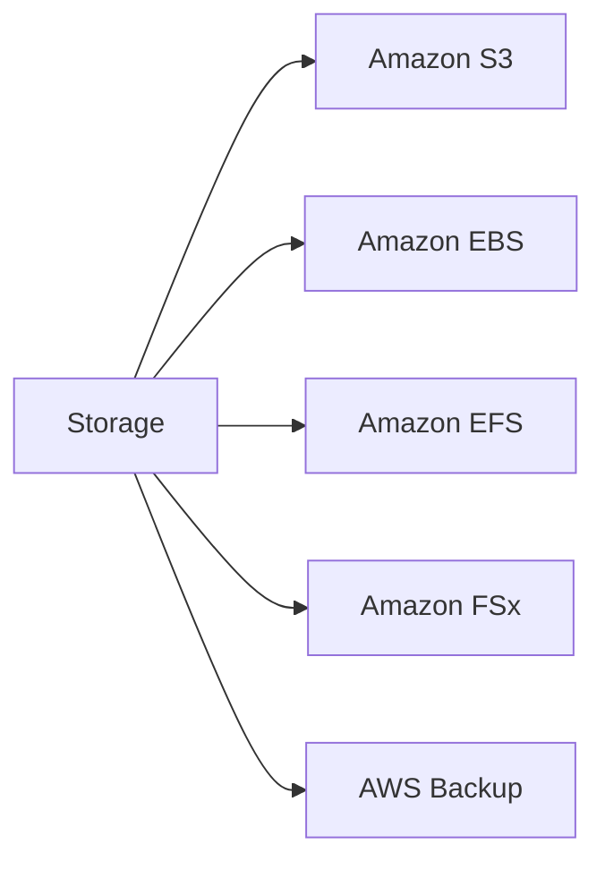
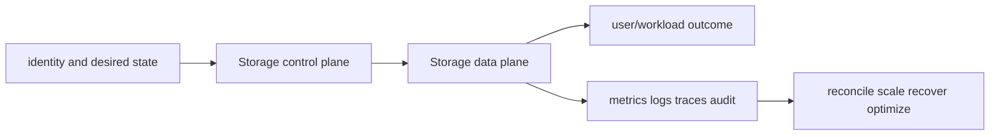

# Storage

<!-- child-topic-toc:start -->
## Table of contents and deeper notes

This parent note explains how the child topics work together. Follow each child link for the deeper mechanism, real commands/configuration, hands-on practice, authoritative documentation, and its local interview bank.

- [Storage service leaves](services/README.md) — [questions and answers](services/questions-and-answers.md)
<!-- child-topic-toc:end -->
This branch README is both the study note and the map. Each service leaf keeps its notes in its own README and its answered interview bank in a separate file.



## Service leaves

- [Amazon S3](services/s3/README.md) — [Q&A](services/s3/questions-and-answers.md)
- [Amazon EBS](services/ebs/README.md) — [Q&A](services/ebs/questions-and-answers.md)
- [Amazon EFS](services/efs/README.md) — [Q&A](services/efs/questions-and-answers.md)
- [Amazon FSx](services/fsx/README.md) — [Q&A](services/fsx/questions-and-answers.md)
- [AWS Backup](services/aws-backup/README.md) — [Q&A](services/aws-backup/questions-and-answers.md)

## Branch learning contract

Learn the easy mental model first, run the read-only commands in a sandbox, render/apply the examples only in disposable environments, then break and repair one dependency at a time. Be able to connect these topics across the branch: Object/key, Strong consistency, Versioning, gp3, io2, st1/sc1, Mount target, NFS semantics, Access point, FSx for Lustre, Data repository association, FSx for ONTAP, Backup plan, Resource selection, Backup vault.

## Branch interview bank

See [questions-and-answers.md](questions-and-answers.md) for 60 additional branch-level questions and answers. Service-specific banks contain another 60 per service.

> Interview bank: [questions-and-answers.md](questions-and-answers.md) · Official documentation: <https://docs.aws.amazon.com/AmazonS3/latest/userguide/Welcome.html>

## Easy mode: purpose and mental model

Integrate the storage branch as one production capability rather than isolated products.



## Detailed learning notes

| # | Concept | What you must be able to explain |
|---:|---|---|
| 1 | **Object/key** | immutable-style object bytes plus metadata are addressed by a key; prefixes are not POSIX directories. |
| 2 | **Strong consistency** | successful writes/deletes are reflected by subsequent reads/lists, while concurrent writers still need coordination. |
| 3 | **gp3** | general SSD with independently configurable size, IOPS and throughput within limits. |
| 4 | **io2** | high-performance/durability SSD for sustained I/O and supported Multi-Attach cases. |
| 5 | **Mount target** | ENI per selected AZ provides NFS endpoint and security-group boundary. |
| 6 | **NFS semantics** | shared file access, locking, metadata and close-to-open behavior differ from object/block storage. |
| 7 | **FSx for Lustre** | parallel high-throughput filesystem suited to HPC/ML and optional S3 data repository integration. |
| 8 | **Data repository association** | imports/exports metadata/data between Lustre and S3 under explicit lifecycle. |
| 9 | **Backup plan** | schedule, window, lifecycle and copy rules define intended RPO/retention. |
| 10 | **Resource selection** | tags/ARNs/roles determine coverage and need inventory validation. |

## Architecture and lifecycle

Trace this service from request/authentication and desired configuration through provisioning, steady-state data path, scaling, change, failure, recovery and retirement. Bind every production resource to an owner, environment, data classification, source-of-truth revision, SLO, runbook, cost center and deletion/retention policy.

For Storage, draw a real request/resource path and label where these mechanisms act: Object/key, Strong consistency, gp3, io2, Mount target, NFS semantics, FSx for Lustre, Data repository association, Backup plan, Resource selection. State which parts are control plane versus data plane, regional versus zonal/global, synchronous versus asynchronous, and customer versus provider responsibility.

## Security model

Start with the caller/workload identity and evaluate every applicable identity, resource, organization, network-endpoint, encryption-key and admission policy. Minimize public paths, long-lived credentials, wildcard actions/resources and unreviewed cross-account/tenant trust. Encrypt in transit/at rest where applicable, but include key/certificate rotation and recovery. Protect audit evidence and prevent secrets/customer content from entering command history, logs, traces or metric labels.

## Availability and failure modes

List dependencies and failure domains before claiming high availability. Test quota/capacity, identity/control-plane, DNS/network/TLS, configuration drift, downstream saturation, zonal/Regional/node failure and recovery from protected state. Use bounded timeout, retry budget, jitter, idempotency, backpressure, load shedding and graceful drain according to protocol. A green resource status is not a user-facing recovery check.

## Performance, scaling and cost

Measure workload distribution and SLI before sizing. Track rate/work units, latency distribution, errors, saturation/queue and service-specific limits. Separate replica/task scaling from infrastructure/capacity scaling and include cold-start/provisioning delay. Cost includes idle/provisioned capacity, requests/work units, storage/retention, cross-AZ/Region/egress/NAT, observability, licenses/support and failure headroom. Optimize cost per successful SLO/quality-controlled task.

## Observability

Correlate a request/change across user, route/resource, dependency and underlying compute/storage/network. Use stable owner/environment/region/service dimensions; put high-cardinality request/object IDs in sampled logs/traces rather than metric labels. Alert on actionable SLO burn and leading exhaustion. Monitor the telemetry path and keep a read-only diagnostic role.

## Command lab

Run in a sandbox with the correct account/context/Region. Read and explain output before mutation.

```bash
aws s3api head-object --bucket BUCKET --key KEY
aws ec2 describe-volumes --volume-ids VOLUME_ID
aws efs describe-file-systems
aws fsx describe-file-systems
aws backup list-backup-plans
```

For each command, record: identity/context, exact resource, expected healthy fields, one failing output, the next command/query, and which mutation would be reversible. Never paste secrets/tokens into committed notes or shared terminal history.

## Real-world exercise: easy → hard

1. **Easy:** inventory one healthy Storage resource and draw identity/control/data/dependency paths.
2. **Intermediate:** reproduce a safe configuration change with IaC, preview/diff, apply to a sandbox, verify and roll back.
3. **Hard:** inject one policy/network/quota/capacity/dependency failure, diagnose from user symptom to root mechanism, mitigate without widening access, then add an alert/test/runbook.
4. **Senior:** design the service for two tenants, multi-zone/Region failure, RPO/RTO, regulated data, 10× demand and a 30% cost reduction; quantify trade-offs.

## Common interview traps

- Naming a feature without explaining request/resource lifecycle or failure semantics.
- Treating an allow, encryption checkbox, replica count or managed-service label as a complete security/reliability design.
- Mutating production before capturing identity, status, events, metrics, logs, audit and recent changes.
- Scaling the wrong layer or retrying overload/permanent errors.
- Omitting quotas, cold start, deletion/restore, observability cost or customer/tenant boundaries.

## Revision summary

Explain Storage in five passes: purpose/selection, mechanism/lifecycle, security/failure, operation/commands, and architecture/economics. Then complete the separate [answered question bank](questions-and-answers.md) without looking at these notes.

<!-- merged-07-AWS-BLOCK-FILE-BACKUP-MD:start -->
## Practical deep dive

## Purpose and selection

EBS is AZ-scoped block storage attached to EC2; EFS is regional managed NFS; FSx supplies managed filesystems optimized for Lustre, ONTAP, Windows or OpenZFS; AWS Backup orchestrates policies and protected recovery copies. Select from protocol, latency/IOPS/throughput, access mode, durability/failure domain, consistency, backup semantics and price.

## EBS

`gp3` decouples baseline size from provisioned IOPS/throughput; `io2` targets sustained high IOPS/durability and supports Multi-Attach on supported configurations; `st1/sc1` are throughput HDD choices and not boot volumes. Performance is limited by both volume and instance attachment bandwidth. Queue depth, I/O size, read/write mix, filesystem and application sync behavior affect results.

Snapshots are incremental point-in-time copies stored by the service; crash consistency is not application consistency. Quiesce/freeze databases or use native backup coordination. Encryption uses KMS and persists into snapshots/copies; sharing encrypted snapshots requires key policy access. Fast Snapshot Restore or initialization avoids first-read latency when required. Expand the volume, partition, PV/LV and filesystem in the correct sequence; snapshot first and verify.

## EFS and FSx

EFS exposes NFS through per-AZ mount targets. Security groups protect mount traffic; IAM/TLS mount authorization and access points provide controlled roots/POSIX identity. Performance/throughput modes and small-file metadata patterns matter. Mount from the local AZ, monitor burst/throughput and validate application locking/permissions.

FSx for Lustre suits high-throughput parallel workloads and can link to S3; ONTAP provides enterprise NFS/SMB/iSCSI/data-management features; Windows supports SMB/AD workloads; OpenZFS provides ZFS semantics. They are not interchangeable. For model distribution/training, benchmark metadata, aggregate throughput, cache warming and failure recovery, not only headline bandwidth.

## Backup security and recovery

AWS Backup plans select resources, schedules, lifecycle and vaults. Use separate backup accounts, cross-account/Region copies, KMS controls, logically isolated/locked vaults where requirements justify them, least-privilege restore roles and deletion alarms. Backup success is not recovery proof: automate restore tests, application validation, dependency ordering and measured RPO/RTO.

## Operations, cost and diagnosis

Watch EBS latency/queue/burst balance/IOPS/throughput/status, EFS client connections/throughput/percent limit, FSx health/capacity and backup job/copy/restore results. Common issues include wrong AZ, instance bandwidth cap, filesystem full/inodes, mount DNS/SG/NACL, KMS denial, stale NFS handles, burst depletion and inconsistent snapshots.

```bash
aws ec2 describe-volumes --volume-ids VOLUME_ID
aws ec2 describe-volume-status --volume-ids VOLUME_ID
aws ec2 describe-snapshots --owner-ids self
aws efs describe-file-systems
aws backup list-backup-jobs
aws backup list-restore-jobs
```

Cost includes provisioned GB/IOPS/throughput, snapshots and changed blocks, FSR, EFS storage/throughput classes, FSx capacity/backups and cross-Region transfer. Remove unattached volumes/incomplete restores only after ownership and retention checks.

## Revision summary

- EBS block/AZ, EFS NFS/regional, FSx specialized file, Backup policy orchestration.
- Volume and instance limits jointly determine EBS performance.
- Point-in-time is not automatically application-consistent.
- Secure backup copies outside the workload blast radius and test restore.
- Expand every storage layer deliberately and verify filesystem/application health.


<!-- merged-07-AWS-BLOCK-FILE-BACKUP-MD:end -->
