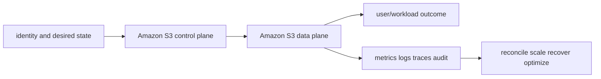

# Amazon S3

> Interview bank: [questions-and-answers.md](questions-and-answers.md) · Official documentation: <https://docs.aws.amazon.com/AmazonS3/latest/userguide/Welcome.html>

## Easy mode: purpose and mental model

Store, secure, lifecycle, replicate and recover versioned objects under explicit authorization and cost controls.



## Detailed learning notes

| # | Concept | What you must be able to explain |
|---:|---|---|
| 1 | **Object/key** | immutable-style object bytes plus metadata are addressed by a key; prefixes are not POSIX directories. |
| 2 | **Strong consistency** | successful writes/deletes are reflected by subsequent reads/lists, while concurrent writers still need coordination. |
| 3 | **Versioning** | preserves version IDs/delete markers for recovery and is not sufficient if one principal can purge all versions. |
| 4 | **Storage classes** | trade access/retrieval/minimum-duration/AZ resilience and monitoring cost. |
| 5 | **Lifecycle** | asynchronously transitions/expires current/noncurrent versions and incomplete multipart uploads. |
| 6 | **Multipart/checksum** | parallel parts and integrity checks improve large transfer reliability but abandoned uploads cost money. |
| 7 | **Authorization intersection** | identity, bucket/access point, SCP/boundary/session, endpoint and KMS policies can all constrain. |
| 8 | **Encryption** | SSE-S3/KMS/DSSE/client methods differ in control, audit, quota and recovery. |
| 9 | **Replication** | asynchronous SRR/CRR needs versioning, IAM/KMS, existing-object/delete behavior and monitoring. |
| 10 | **Events** | notifications can duplicate/reorder, so consumers need idempotency and reconciliation. |

## Architecture and lifecycle

Trace this service from request/authentication and desired configuration through provisioning, steady-state data path, scaling, change, failure, recovery and retirement. Bind every production resource to an owner, environment, data classification, source-of-truth revision, SLO, runbook, cost center and deletion/retention policy.

For Amazon S3, draw a real request/resource path and label where these mechanisms act: Object/key, Strong consistency, Versioning, Storage classes, Lifecycle, Multipart/checksum, Authorization intersection, Encryption, Replication, Events. State which parts are control plane versus data plane, regional versus zonal/global, synchronous versus asynchronous, and customer versus provider responsibility.

## Security model

Start with the caller/workload identity and evaluate every applicable identity, resource, organization, network-endpoint, encryption-key and admission policy. Minimize public paths, long-lived credentials, wildcard actions/resources and unreviewed cross-account/tenant trust. Encrypt in transit/at rest where applicable, but include key/certificate rotation and recovery. Protect audit evidence and prevent secrets/customer content from entering command history, logs, traces or metric labels.

## Availability and failure modes

List dependencies and failure domains before claiming high availability. Test quota/capacity, identity/control-plane, DNS/network/TLS, configuration drift, downstream saturation, zonal/Regional/node failure and recovery from protected state. Use bounded timeout, retry budget, jitter, idempotency, backpressure, load shedding and graceful drain according to protocol. A green resource status is not a user-facing recovery check.

## Performance, scaling and cost

Measure workload distribution and SLI before sizing. Track rate/work units, latency distribution, errors, saturation/queue and service-specific limits. Separate replica/task scaling from infrastructure/capacity scaling and include cold-start/provisioning delay. Cost includes idle/provisioned capacity, requests/work units, storage/retention, cross-AZ/Region/egress/NAT, observability, licenses/support and failure headroom. Optimize cost per successful SLO/quality-controlled task.

## Observability

Correlate a request/change across user, route/resource, dependency and underlying compute/storage/network. Use stable owner/environment/region/service dimensions; put high-cardinality request/object IDs in sampled logs/traces rather than metric labels. Alert on actionable SLO burn and leading exhaustion. Monitor the telemetry path and keep a read-only diagnostic role.

## Command lab

Run in a sandbox with the correct account/context/Region. Read and explain output before mutation.

```bash
aws s3api head-object --bucket BUCKET --key KEY
aws s3api list-object-versions --bucket BUCKET --prefix KEY
aws s3api get-public-access-block --bucket BUCKET
aws s3api get-bucket-replication --bucket BUCKET
```

For each command, record: identity/context, exact resource, expected healthy fields, one failing output, the next command/query, and which mutation would be reversible. Never paste secrets/tokens into committed notes or shared terminal history.

## Real-world exercise: easy → hard

1. **Easy:** inventory one healthy Amazon S3 resource and draw identity/control/data/dependency paths.
2. **Intermediate:** reproduce a safe configuration change with IaC, preview/diff, apply to a sandbox, verify and roll back.
3. **Hard:** inject one policy/network/quota/capacity/dependency failure, diagnose from user symptom to root mechanism, mitigate without widening access, then add an alert/test/runbook.
4. **Senior:** design the service for two tenants, multi-zone/Region failure, RPO/RTO, regulated data, 10× demand and a 30% cost reduction; quantify trade-offs.

## Common interview traps

- Naming a feature without explaining request/resource lifecycle or failure semantics.
- Treating an allow, encryption checkbox, replica count or managed-service label as a complete security/reliability design.
- Mutating production before capturing identity, status, events, metrics, logs, audit and recent changes.
- Scaling the wrong layer or retrying overload/permanent errors.
- Omitting quotas, cold start, deletion/restore, observability cost or customer/tenant boundaries.

## Revision summary

Explain Amazon S3 in five passes: purpose/selection, mechanism/lifecycle, security/failure, operation/commands, and architecture/economics. Then complete the separate [answered question bank](questions-and-answers.md) without looking at these notes.

<!-- merged-07-AWS-S3-MD:start -->
## Practical deep dive

## Purpose and mental model

S3 is a regional object store. A bucket contains objects addressed by keys; prefixes are naming/partitioning conventions, not POSIX directories. The data plane stores and retrieves whole/ranged objects over APIs, while the control plane manages bucket configuration, policy and lifecycle. Design around object immutability/version identity, not file locking or append semantics.

## Data, consistency and lifecycle

S3 provides strong read-after-write and list consistency for object operations. Concurrent writers still require application-level version/conditional request semantics. Versioning gives each mutation a version ID; deletion normally creates a delete marker. It helps recover accidental changes but increases retention/cost and does not replace cross-account protected backups. MFA Delete, Object Lock governance/compliance modes and legal holds address stronger deletion controls under precise operational/legal procedures.

Choose storage classes from access latency/frequency, minimum duration/size charges, retrieval time/cost and AZ resilience: Standard, Intelligent-Tiering, Standard-IA, One Zone-IA, Glacier Instant/Flexible/Deep Archive and specialized classes as available. Lifecycle transitions/expiration apply asynchronously; handle noncurrent versions, delete markers and incomplete multipart uploads. Model total cost including requests, monitoring, retrieval, transitions, replication and egress.

Multipart upload improves large-object throughput and retry granularity; complete it only after verifying parts/checksums. Use range GETs and parallelism when clients support them. Modern S3 scales without manual random-prefix schemes, but KMS request limits, client connections, network paths and tiny-object request cost can still bottleneck.

## Authorization and encryption

Block Public Access is a guardrail, not the entire policy model. Effective access can involve identity policy, bucket/access-point policy, ACLs in legacy ownership modes, SCP/boundary/session policy, VPC endpoint policy, KMS key policy/grants and explicit denies. Prefer Bucket owner enforced/Object Ownership, disabled ACLs, narrow bucket/access-point policies, organization/account conditions and least-privilege roles.

TLS protects transit. SSE-S3 uses S3-managed keys; SSE-KMS adds KMS policy/audit/control and request cost/quota; DSSE-KMS adds dual-layer server-side encryption for relevant requirements; SSE-C makes the caller manage keys and is operationally risky. Client-side encryption changes search/processing/recovery responsibilities. Bucket keys can reduce KMS request cost. Replicas need destination KMS permissions and configuration.

Presigned URLs delegate time-limited access with the signer’s permissions; constrain operation, expiry, network and content conditions, and remember they act as bearer credentials. Use access points or multi-region access patterns to separate application policies; never log sensitive URLs.

## Replication, events and analytics

Same-/cross-Region replication is asynchronous and needs versioning, IAM and destination ownership/encryption design. It normally applies to new eligible objects; use batch replication for existing data. Replicate delete markers only by explicit intent. Replication Time Control provides an SLA for eligible replication, not zero RPO. Multi-Region Access Points route requests but do not replace correct replication/conflict/recovery design.

Event notifications can publish to SQS/SNS/Lambda/EventBridge depending on configuration. Delivery can be duplicate and out of order; consumers must be idempotent and reconcile with the bucket. Inventory gives scheduled object listings; Storage Lens aggregates usage/activity; server access logs/CloudTrail data events have different coverage and cost.

## Availability, observability and recovery

Use versioning, protected replication/backup account, Object Lock where required, lifecycle, checksum validation and regularly tested restore. Monitor 4xx/5xx, request latency, bytes, replication backlog/latency/failures, event DLQs, KMS errors/throttles, object counts/bytes, incomplete multipart uploads and public/policy changes. Request metrics and CloudTrail data events must be deliberately enabled and can be expensive.

Common failures: wrong Region/endpoint, expired credentials, clock skew, policy/KMS/endpoint explicit deny, object owner mismatch, missing version, lifecycle deletion, replication IAM/KMS failure, CORS mismatch, checksum/multipart error and client saturation.

```bash
aws s3api get-bucket-versioning --bucket BUCKET
aws s3api get-public-access-block --bucket BUCKET
aws s3api get-bucket-policy-status --bucket BUCKET
aws s3api head-object --bucket BUCKET --key KEY
aws s3api list-object-versions --bucket BUCKET --prefix KEY
aws s3api get-bucket-replication --bucket BUCKET
aws s3api list-multipart-uploads --bucket BUCKET
```

For an unexpected deny, record caller/session, exact bucket/key/version/action, endpoint/VPC, encryption key and request ID. Test with `head-object`, inspect policy intersections and KMS, avoid weakening Block Public Access, and verify through the original application identity.

## Common traps

- Versioning is not a backup if the same compromised principal can permanently delete all versions.
- Replication is not necessarily retroactive, synchronous, bidirectional or deletion-safe.
- Encryption does not grant access; KMS authorization can deny an otherwise allowed S3 request.
- “Folders” are key prefixes; rename/copy semantics involve objects.
- Event notifications are not an exactly-once transaction log.
- A lower storage price can cost more after retrieval, request and minimum-duration charges.

## Revision summary

- Think objects/keys/version IDs, not files/directories.
- Model the full authorization intersection including KMS and endpoints.
- Use lifecycle and storage classes from measured access/recovery requirements.
- Make event consumers idempotent and reconcile.
- Prove recovery with protected versions/replicas/backups and restore tests.


<!-- merged-07-AWS-S3-MD:end -->
