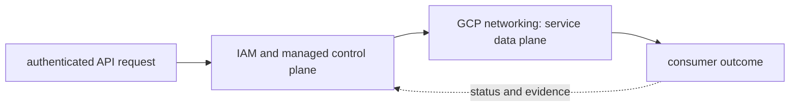

# GCP networking

<!-- chapter-guide:start -->
> **Step 171 of 373 — 08.02**
>
> **Builds on:** [GCP foundations and governance](../01-gcp-foundations-and-governance/README.md)
>
> **Now:** Learn **GCP networking** from its mental model through production ownership.
>
> **Then:** Rehearse the linked questions and continue to [GCP load balancing](../03-gcp-load-balancing/README.md).
<!-- chapter-guide:end -->

> [Interview questions and answers](questions-and-answers.md) · [Master curriculum](../../curriculum/master-curriculum.txt) · Official starting point: <https://cloud.google.com/vpc/docs/overview>

## Explanation

### What it is and why it exists

**GCP networking** is easiest to understand as one part of a larger path. The subject is an API-managed resource under organization, folder and project boundaries. Identity and policy authorize a control-plane change, while regional or global managed infrastructure produces the data-path behavior.

The chapter focuses on Global VPCs, Subnets, Routes, Firewall rules. These are connected mechanisms, not vocabulary to memorize. Integrate every part of GCP networking into one secure, reliable, observable, supportable and cost-aware production capability The explanations below first build the simple model, then add the exact system behavior and production consequences.

### History and evolution

Google Cloud grew from Google's internal distributed-systems experience and early managed products such as App Engine. It developed into a project- and organization-scoped platform spanning global networks, data systems, Kubernetes, serverless and AI, with APIs and IAM acting as the common control surface.

In this chapter, **GCP networking** is the next layer of that evolution. Its modern purpose is to integrate every part of GCP networking into one secure, reliable, observable, supportable and cost-aware production capability. The exact product surface may change by version, but the underlying state, request path and failure boundaries remain the durable ideas to learn.

### How it works: the end-to-end path



The path begins with a concrete input: a user request, configuration revision, packet, job, model request or operational symptom. The relevant subsystem validates that input, reads current state, performs or schedules work and exposes a result. Some transitions complete before the caller receives a response; others acknowledge the request and converge later. That difference determines whether a timeout means "nothing happened," "the operation failed," or "the final result is still unknown."

For **GCP networking**, the important stages are Global VPCs, Subnets, Routes, Firewall rules, Hierarchical firewall policies, Cloud NAT, Private Google Access, Private Service Connect, VPC peering, Network Connectivity Center, Cloud VPN, Cloud Interconnect, Cloud DNS, Cloud CDN, Cloud Armor. Their boundaries explain where identity is checked, where state becomes durable, where capacity is consumed, how failures propagate and which signal can distinguish one layer from another. A production explanation should follow the actual path rather than treating each term as an isolated definition.


### Core concepts explained in detail

#### Global VPCs

**What it is.** The term Global VPCs refers to a Google Cloud control- or data-plane mechanism bounded by resource hierarchy, location, identity, quota and service contract within GCP networking.

**Junior mental model.** A useful analogy is a parcel journey: the name identifies the destination, routing selects each next hop, policy decides whether the parcel may pass, transport tracks delivery, and the application decides what the contents mean.

**How it works.** A real request crosses several independent states: name resolution returns an address, the source selects a route and source address, link or overlay forwarding reaches the next hop, stateful or stateless policy evaluates the flow, transport establishes communication, and TLS/application protocols negotiate their own contract. The return path must also work.

**What it looks like in production.** Healthy evidence progresses layer by layer: correct name/address, expected route, permitted flow, listening endpoint, successful handshake and valid application response. Timeouts, refusals, resets and protocol errors mean different layers; packet loss, MTU, asymmetric paths, connection-state exhaustion and proxy timeout mismatch are common production failures.

#### Subnets

**What it is.** The term Subnets refers to a Google Cloud control- or data-plane mechanism bounded by resource hierarchy, location, identity, quota and service contract within GCP networking.

**Junior mental model.** A useful analogy is a parcel journey: the name identifies the destination, routing selects each next hop, policy decides whether the parcel may pass, transport tracks delivery, and the application decides what the contents mean.

**How it works.** A real request crosses several independent states: name resolution returns an address, the source selects a route and source address, link or overlay forwarding reaches the next hop, stateful or stateless policy evaluates the flow, transport establishes communication, and TLS/application protocols negotiate their own contract. The return path must also work.

**What it looks like in production.** Healthy evidence progresses layer by layer: correct name/address, expected route, permitted flow, listening endpoint, successful handshake and valid application response. Timeouts, refusals, resets and protocol errors mean different layers; packet loss, MTU, asymmetric paths, connection-state exhaustion and proxy timeout mismatch are common production failures.

#### Routes

**What it is.** The term Routes refers to a Google Cloud control- or data-plane mechanism bounded by resource hierarchy, location, identity, quota and service contract within GCP networking.

**Junior mental model.** A useful analogy is a parcel journey: the name identifies the destination, routing selects each next hop, policy decides whether the parcel may pass, transport tracks delivery, and the application decides what the contents mean.

**How it works.** A real request crosses several independent states: name resolution returns an address, the source selects a route and source address, link or overlay forwarding reaches the next hop, stateful or stateless policy evaluates the flow, transport establishes communication, and TLS/application protocols negotiate their own contract. The return path must also work.

**What it looks like in production.** Healthy evidence progresses layer by layer: correct name/address, expected route, permitted flow, listening endpoint, successful handshake and valid application response. Timeouts, refusals, resets and protocol errors mean different layers; packet loss, MTU, asymmetric paths, connection-state exhaustion and proxy timeout mismatch are common production failures.

#### Firewall rules

**What it is.** The term Firewall rules refers to a Google Cloud control- or data-plane mechanism bounded by resource hierarchy, location, identity, quota and service contract within GCP networking.

**Junior mental model.** A useful analogy is a parcel journey: the name identifies the destination, routing selects each next hop, policy decides whether the parcel may pass, transport tracks delivery, and the application decides what the contents mean.

**How it works.** A real request crosses several independent states: name resolution returns an address, the source selects a route and source address, link or overlay forwarding reaches the next hop, stateful or stateless policy evaluates the flow, transport establishes communication, and TLS/application protocols negotiate their own contract. The return path must also work.

**What it looks like in production.** Healthy evidence progresses layer by layer: correct name/address, expected route, permitted flow, listening endpoint, successful handshake and valid application response. Timeouts, refusals, resets and protocol errors mean different layers; packet loss, MTU, asymmetric paths, connection-state exhaustion and proxy timeout mismatch are common production failures.

#### Hierarchical firewall policies

**What it is.** The term Hierarchical firewall policies refers to a Google Cloud control- or data-plane mechanism bounded by resource hierarchy, location, identity, quota and service contract within GCP networking.

**Junior mental model.** A useful analogy is a parcel journey: the name identifies the destination, routing selects each next hop, policy decides whether the parcel may pass, transport tracks delivery, and the application decides what the contents mean.

**How it works.** A real request crosses several independent states: name resolution returns an address, the source selects a route and source address, link or overlay forwarding reaches the next hop, stateful or stateless policy evaluates the flow, transport establishes communication, and TLS/application protocols negotiate their own contract. The return path must also work.

**What it looks like in production.** Healthy evidence progresses layer by layer: correct name/address, expected route, permitted flow, listening endpoint, successful handshake and valid application response. Timeouts, refusals, resets and protocol errors mean different layers; packet loss, MTU, asymmetric paths, connection-state exhaustion and proxy timeout mismatch are common production failures.

#### Cloud NAT

**What it is.** The term Cloud NAT refers to a Google Cloud control- or data-plane mechanism bounded by resource hierarchy, location, identity, quota and service contract within GCP networking.

**Junior mental model.** A useful analogy is a parcel journey: the name identifies the destination, routing selects each next hop, policy decides whether the parcel may pass, transport tracks delivery, and the application decides what the contents mean.

**How it works.** A real request crosses several independent states: name resolution returns an address, the source selects a route and source address, link or overlay forwarding reaches the next hop, stateful or stateless policy evaluates the flow, transport establishes communication, and TLS/application protocols negotiate their own contract. The return path must also work.

**What it looks like in production.** Healthy evidence progresses layer by layer: correct name/address, expected route, permitted flow, listening endpoint, successful handshake and valid application response. Timeouts, refusals, resets and protocol errors mean different layers; packet loss, MTU, asymmetric paths, connection-state exhaustion and proxy timeout mismatch are common production failures.

#### Private Google Access

**What it is.** The term Private Google Access refers to a Google Cloud control- or data-plane mechanism bounded by resource hierarchy, location, identity, quota and service contract within GCP networking.

**Junior mental model.** The simplest mental model is a state machine: an input is checked, current state is read, a rule computes the next state, and an observable result tells callers whether the transition succeeded.

**How it works.** The mechanism receives configuration or runtime input, validates preconditions, changes or derives state, and exposes status to the next component. Synchronous parts return a direct outcome; asynchronous parts need durable status, reconciliation and idempotency because the original caller may disappear.

**What it looks like in production.** Healthy evidence shows the expected state transition and its owner, timestamp and reason. Invalid input, stale state, conflicting writers, hidden limits and dependencies that partially complete are the most useful failure categories to distinguish.

#### Private Service Connect

**What it is.** The term Private Service Connect refers to a Google Cloud control- or data-plane mechanism bounded by resource hierarchy, location, identity, quota and service contract within GCP networking.

**Junior mental model.** The simplest mental model is a state machine: an input is checked, current state is read, a rule computes the next state, and an observable result tells callers whether the transition succeeded.

**How it works.** The mechanism receives configuration or runtime input, validates preconditions, changes or derives state, and exposes status to the next component. Synchronous parts return a direct outcome; asynchronous parts need durable status, reconciliation and idempotency because the original caller may disappear.

**What it looks like in production.** Healthy evidence shows the expected state transition and its owner, timestamp and reason. Invalid input, stale state, conflicting writers, hidden limits and dependencies that partially complete are the most useful failure categories to distinguish.

#### VPC peering

**What it is.** The term VPC peering refers to a Google Cloud control- or data-plane mechanism bounded by resource hierarchy, location, identity, quota and service contract within GCP networking.

**Junior mental model.** A useful analogy is a parcel journey: the name identifies the destination, routing selects each next hop, policy decides whether the parcel may pass, transport tracks delivery, and the application decides what the contents mean.

**How it works.** A real request crosses several independent states: name resolution returns an address, the source selects a route and source address, link or overlay forwarding reaches the next hop, stateful or stateless policy evaluates the flow, transport establishes communication, and TLS/application protocols negotiate their own contract. The return path must also work.

**What it looks like in production.** Healthy evidence progresses layer by layer: correct name/address, expected route, permitted flow, listening endpoint, successful handshake and valid application response. Timeouts, refusals, resets and protocol errors mean different layers; packet loss, MTU, asymmetric paths, connection-state exhaustion and proxy timeout mismatch are common production failures.

#### Network Connectivity Center

**What it is.** The term Network Connectivity Center refers to a Google Cloud control- or data-plane mechanism bounded by resource hierarchy, location, identity, quota and service contract within GCP networking.

**Junior mental model.** A useful analogy is a parcel journey: the name identifies the destination, routing selects each next hop, policy decides whether the parcel may pass, transport tracks delivery, and the application decides what the contents mean.

**How it works.** A real request crosses several independent states: name resolution returns an address, the source selects a route and source address, link or overlay forwarding reaches the next hop, stateful or stateless policy evaluates the flow, transport establishes communication, and TLS/application protocols negotiate their own contract. The return path must also work.

**What it looks like in production.** Healthy evidence progresses layer by layer: correct name/address, expected route, permitted flow, listening endpoint, successful handshake and valid application response. Timeouts, refusals, resets and protocol errors mean different layers; packet loss, MTU, asymmetric paths, connection-state exhaustion and proxy timeout mismatch are common production failures.

#### Cloud VPN

**What it is.** The term Cloud VPN refers to a Google Cloud control- or data-plane mechanism bounded by resource hierarchy, location, identity, quota and service contract within GCP networking.

**Junior mental model.** The simplest mental model is a state machine: an input is checked, current state is read, a rule computes the next state, and an observable result tells callers whether the transition succeeded.

**How it works.** The mechanism receives configuration or runtime input, validates preconditions, changes or derives state, and exposes status to the next component. Synchronous parts return a direct outcome; asynchronous parts need durable status, reconciliation and idempotency because the original caller may disappear.

**What it looks like in production.** Healthy evidence shows the expected state transition and its owner, timestamp and reason. Invalid input, stale state, conflicting writers, hidden limits and dependencies that partially complete are the most useful failure categories to distinguish.

#### Cloud Interconnect

**What it is.** The term Cloud Interconnect refers to a Google Cloud control- or data-plane mechanism bounded by resource hierarchy, location, identity, quota and service contract within GCP networking.

**Junior mental model.** The simplest mental model is a state machine: an input is checked, current state is read, a rule computes the next state, and an observable result tells callers whether the transition succeeded.

**How it works.** The mechanism receives configuration or runtime input, validates preconditions, changes or derives state, and exposes status to the next component. Synchronous parts return a direct outcome; asynchronous parts need durable status, reconciliation and idempotency because the original caller may disappear.

**What it looks like in production.** Healthy evidence shows the expected state transition and its owner, timestamp and reason. Invalid input, stale state, conflicting writers, hidden limits and dependencies that partially complete are the most useful failure categories to distinguish.

#### Cloud DNS

**What it is.** The term Cloud DNS refers to a Google Cloud control- or data-plane mechanism bounded by resource hierarchy, location, identity, quota and service contract within GCP networking.

**Junior mental model.** A useful analogy is a parcel journey: the name identifies the destination, routing selects each next hop, policy decides whether the parcel may pass, transport tracks delivery, and the application decides what the contents mean.

**How it works.** A real request crosses several independent states: name resolution returns an address, the source selects a route and source address, link or overlay forwarding reaches the next hop, stateful or stateless policy evaluates the flow, transport establishes communication, and TLS/application protocols negotiate their own contract. The return path must also work.

**What it looks like in production.** Healthy evidence progresses layer by layer: correct name/address, expected route, permitted flow, listening endpoint, successful handshake and valid application response. Timeouts, refusals, resets and protocol errors mean different layers; packet loss, MTU, asymmetric paths, connection-state exhaustion and proxy timeout mismatch are common production failures.

#### Cloud CDN

**What it is.** The term Cloud CDN refers to a Google Cloud control- or data-plane mechanism bounded by resource hierarchy, location, identity, quota and service contract within GCP networking.

**Junior mental model.** The simplest mental model is a state machine: an input is checked, current state is read, a rule computes the next state, and an observable result tells callers whether the transition succeeded.

**How it works.** The mechanism receives configuration or runtime input, validates preconditions, changes or derives state, and exposes status to the next component. Synchronous parts return a direct outcome; asynchronous parts need durable status, reconciliation and idempotency because the original caller may disappear.

**What it looks like in production.** Healthy evidence shows the expected state transition and its owner, timestamp and reason. Invalid input, stale state, conflicting writers, hidden limits and dependencies that partially complete are the most useful failure categories to distinguish.

#### Cloud Armor

**What it is.** The term Cloud Armor refers to a Google Cloud control- or data-plane mechanism bounded by resource hierarchy, location, identity, quota and service contract within GCP networking.

**Junior mental model.** The simplest mental model is a state machine: an input is checked, current state is read, a rule computes the next state, and an observable result tells callers whether the transition succeeded.

**How it works.** The mechanism receives configuration or runtime input, validates preconditions, changes or derives state, and exposes status to the next component. Synchronous parts return a direct outcome; asynchronous parts need durable status, reconciliation and idempotency because the original caller may disappear.

**What it looks like in production.** Healthy evidence shows the expected state transition and its owner, timestamp and reason. Invalid input, stale state, conflicting writers, hidden limits and dependencies that partially complete are the most useful failure categories to distinguish.

### Worked command and configuration example

The following is a diagnostic example, not an unexplained command dump. Define every uppercase placeholder first—for example `NAME`, `RESOURCE`, `PROJECT`, `REGION`, `NAMESPACE`, `URL`, `IMAGE` or `CONTAINER`—and use a sandbox or read-only production role.

```bash
gcloud auth list
gcloud config list
gcloud projects describe PROJECT
gcloud logging read 'severity>=ERROR' --limit=20
```

What the example demonstrates:

- `gcloud auth list` establishes which identity and target context subsequent commands will inspect; a correct resource in the wrong account, project or cluster is still the wrong result.
- `gcloud config list` establishes which identity and target context subsequent commands will inspect; a correct resource in the wrong account, project or cluster is still the wrong result.
- `gcloud projects describe PROJECT` queries Google Cloud's control plane using the active account, project and location; compare the returned resource with source-controlled intent.
- `gcloud logging read 'severity>=ERROR' --limit=20` queries Google Cloud's control plane using the active account, project and location; compare the returned resource with source-controlled intent.

A healthy run returns the intended identity/context, exits successfully and shows the expected object or response without a new warning, retry loop or saturation signal. A failure is useful evidence: preserve the exact exit code, status/reason, timestamp and target, then inspect the immediately adjacent layer before changing anything. This makes the example part of the explanation of **GCP networking**, not merely a list to copy.

### Security, reliability and production ownership

Security controls who can initiate a transition and what data or resource that transition may affect. Authentication, authorization, network reachability, encryption and audit solve different problems and must align at each boundary. Short-lived attributable identities, least privilege, explicit tenant separation and tested key/certificate rotation reduce blast radius. Logs and traces need their own data controls because copying a secret or customer payload into telemetry defeats the primary protection.

Reliability depends on every synchronous dependency and on the eventual convergence of asynchronous work. Timeouts bound waiting; idempotency makes an ambiguous retry safe; backpressure and load shedding keep demand within useful capacity; replication and failover help only across independent failure domains. Recovery must be tested from protected state and verified through the original user outcome, not inferred from a green administrative status.

Ownership makes these mechanisms operable. Every production resource or service needs an accountable team, source-of-truth revision, environment and data classification, SLO, runbook, cost center and retirement policy. Reversible mitigation can stabilize an incident, but the durable repair belongs in Git, IaC, policy or the owning application so reconciliation does not reintroduce the fault.

### Observability, performance and cost

Metrics, logs, traces, profiles and audit events are complementary. A useful diagnostic path starts with time, identity, exact target and user symptom, then compares desired and observed state before moving through reconciliation, network/protocol, runtime, dependency and saturation layers. High-cardinality request or object IDs belong in sampled logs or traces rather than metric labels; alerts should represent actionable user-impact risk or leading exhaustion.

Performance is governed by work distribution, queueing and bottlenecks. Rate, latency percentiles, errors, saturation, queue depth or age and service-specific limits reveal more than average utilization. Application replicas and underlying machines, storage or provider quota scale through separate loops with different cold delays. Cost includes idle headroom, requests or work units, storage/retention, network transfer, telemetry, support and recovery capacity; optimize cost per successful outcome rather than the cheapest isolated resource.

### What you should be able to explain

The table remains as a revision checklist. Read the explanations above first; afterward, use each row to check whether you can explain the concept without relying on memorized wording.

| # | Topic | What you must understand and demonstrate |
|---:|---|---|
| 1 | **Global VPCs** | is part of GCP networking; learn its precise definition, mechanism and lifecycle, nearest alternatives, configuration interface, failure/limit, security boundary, observable evidence and production trade-off |
| 2 | **Subnets** | is part of GCP networking; learn its precise definition, mechanism and lifecycle, nearest alternatives, configuration interface, failure/limit, security boundary, observable evidence and production trade-off |
| 3 | **Routes** | is part of GCP networking; learn its precise definition, mechanism and lifecycle, nearest alternatives, configuration interface, failure/limit, security boundary, observable evidence and production trade-off |
| 4 | **Firewall rules** | is part of GCP networking; learn its precise definition, mechanism and lifecycle, nearest alternatives, configuration interface, failure/limit, security boundary, observable evidence and production trade-off |
| 5 | **Hierarchical firewall policies** | is part of GCP networking; learn its precise definition, mechanism and lifecycle, nearest alternatives, configuration interface, failure/limit, security boundary, observable evidence and production trade-off |
| 6 | **Cloud NAT** | is part of GCP networking; learn its precise definition, mechanism and lifecycle, nearest alternatives, configuration interface, failure/limit, security boundary, observable evidence and production trade-off |
| 7 | **Private Google Access** | is part of GCP networking; learn its precise definition, mechanism and lifecycle, nearest alternatives, configuration interface, failure/limit, security boundary, observable evidence and production trade-off |
| 8 | **Private Service Connect** | is part of GCP networking; learn its precise definition, mechanism and lifecycle, nearest alternatives, configuration interface, failure/limit, security boundary, observable evidence and production trade-off |
| 9 | **VPC peering** | is part of GCP networking; learn its precise definition, mechanism and lifecycle, nearest alternatives, configuration interface, failure/limit, security boundary, observable evidence and production trade-off |
| 10 | **Network Connectivity Center** | is part of GCP networking; learn its precise definition, mechanism and lifecycle, nearest alternatives, configuration interface, failure/limit, security boundary, observable evidence and production trade-off |
| 11 | **Cloud VPN** | is part of GCP networking; learn its precise definition, mechanism and lifecycle, nearest alternatives, configuration interface, failure/limit, security boundary, observable evidence and production trade-off |
| 12 | **Cloud Interconnect** | is part of GCP networking; learn its precise definition, mechanism and lifecycle, nearest alternatives, configuration interface, failure/limit, security boundary, observable evidence and production trade-off |
| 13 | **Cloud DNS** | is part of GCP networking; learn its precise definition, mechanism and lifecycle, nearest alternatives, configuration interface, failure/limit, security boundary, observable evidence and production trade-off |
| 14 | **Cloud CDN** | is part of GCP networking; learn its precise definition, mechanism and lifecycle, nearest alternatives, configuration interface, failure/limit, security boundary, observable evidence and production trade-off |
| 15 | **Cloud Armor** | is part of GCP networking; learn its precise definition, mechanism and lifecycle, nearest alternatives, configuration interface, failure/limit, security boundary, observable evidence and production trade-off |

## Practice

### Practice objective

Build a small, safe proof of **GCP networking** and explain the result in your own words. The goal is not command completion; it is to connect input, internal mechanism, observable state and user outcome.

### Prerequisites and setup

Use a disposable local or cloud sandbox. Confirm identity/context and cost boundary, capture a healthy baseline with the commands above, introduce one bounded configuration or invalid-input failure, compare evidence, revert from source control, verify the original outcome, and delete only the named lab resources.

Record tool and platform versions because flags, APIs and defaults can change. Define every uppercase placeholder before use and keep secrets out of shell history and committed files.

### Activity 1: establish a healthy baseline

Run the read-oriented example first:

```bash
gcloud auth list
gcloud config list
gcloud projects describe PROJECT
gcloud logging read 'severity>=ERROR' --limit=20
```

For each line, write down the layer it inspects, the expected healthy field or response, and one thing it cannot prove. The expected result is an attributable request against the intended target plus enough state to draw the path from input to outcome.

### Activity 2: create or review the smallest working example

Put the smallest relevant command, configuration, manifest or code sample in source control. Validate or lint it, produce a preview/diff where the tool supports one, and apply only inside the disposable boundary. Record the exact revision and resulting resource or process ID. If the topic is observational rather than configurable, save a sanitized baseline and an automated assertion instead of mutating the system.

### Activity 3: controlled failure and troubleshooting

Introduce one bounded failure: use a definitely nonexistent resource name, an invalid sandbox-only value, a denied test identity, a closed test port or a stopped disposable dependency. Capture the exact error and classify it as identity/policy, input/configuration, control-plane reconciliation, network/protocol, dependency or capacity. Test one discriminating hypothesis at a time; do not widen access or restart unrelated components.

Expected failure evidence is a specific non-zero exit, status/reason, event or protocol response that disappears when the controlled fault is removed. If healthy and failing runs look identical, the chosen signal does not explain the phenomenon and the exercise is not complete.

### Verification

Repeat the original client or user-facing check, not only an administrative status command. Confirm the desired revision, data correctness where applicable, error and latency recovery, and absence of a continuing retry/backlog/saturation condition. Explain why this evidence proves recovery and what uncertainty remains.

### Cleanup and rollback

Revert the configuration in its source of truth and review the rollback diff before applying it. Delete only the named sandbox resources, stop disposable processes, remove temporary credentials and verify that no billable resource, volume, artifact, queue item or background job remains. Read-only activities require no infrastructure rollback, but sanitized captures must still follow retention policy.

### Harder extension

Automate the healthy and failing paths in CI, use short-lived identity, add one SLI/alert or policy assertion, and write a five-step runbook another engineer can execute without hidden context. Then explain how the design changes for two tenants, a zonal or dependency failure, 10× load and a strict cost or recovery target.

<!-- reading-navigation:start -->
---

**Reading path:** [← Back: GCP foundations and governance](../01-gcp-foundations-and-governance/README.md) · [Questions](questions-and-answers.md) · [Next: GCP load balancing →](../03-gcp-load-balancing/README.md)

<!-- reading-navigation:end -->
