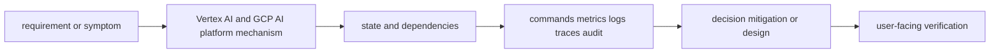
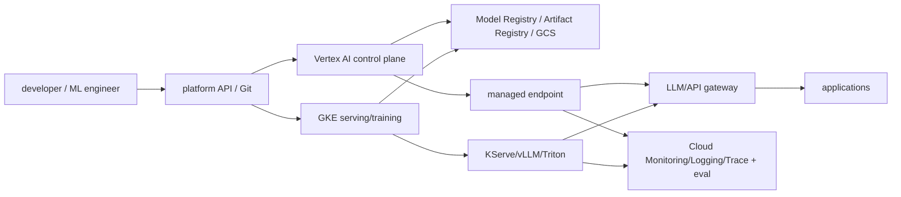

# Vertex AI and GCP AI platform

<!-- chapter-guide:start -->
> **Step 176 of 373 — 08.07**
>
> **Builds on:** [GCP messaging and data processing](../06-gcp-messaging-and-data-processing/README.md)
>
> **Now:** Learn **Vertex AI and GCP AI platform** from its mental model through production ownership.
>
> **Then:** Rehearse the linked questions and continue to [GCP operations, security and cost](../08-gcp-operations-security-and-cost/README.md).
<!-- chapter-guide:end -->

> [Interview questions and answers](questions-and-answers.md) · [Master curriculum](../../curriculum/master-curriculum.txt) · Official starting point: <https://cloud.google.com/vertex-ai/docs/start/introduction-unified-platform>

## Easy mode: mental model

Integrate every part of Vertex AI and GCP AI platform into one secure, reliable, observable, supportable and cost-aware production capability.

Learn this topic in layers: name the object or mechanism, trace its lifecycle/data path, configure it safely, observe a healthy and failed state, recover it, and then design it across failure domains and team boundaries.



## Complete curriculum checklist

| # | Topic | What you must understand and demonstrate |
|---:|---|---|
| 1 | **Vertex AI Model Garden** | is part of Vertex AI and GCP AI platform; learn its precise definition, mechanism and lifecycle, nearest alternatives, configuration interface, failure/limit, security boundary, observable evidence and production trade-off. |
| 2 | **Managed foundation models** | is part of Vertex AI and GCP AI platform; learn its precise definition, mechanism and lifecycle, nearest alternatives, configuration interface, failure/limit, security boundary, observable evidence and production trade-off. |
| 3 | **Gemini models** | is part of Vertex AI and GCP AI platform; learn its precise definition, mechanism and lifecycle, nearest alternatives, configuration interface, failure/limit, security boundary, observable evidence and production trade-off. |
| 4 | **Custom training** | is part of Vertex AI and GCP AI platform; learn its precise definition, mechanism and lifecycle, nearest alternatives, configuration interface, failure/limit, security boundary, observable evidence and production trade-off. |
| 5 | **Training pipelines** | is part of Vertex AI and GCP AI platform; learn its precise definition, mechanism and lifecycle, nearest alternatives, configuration interface, failure/limit, security boundary, observable evidence and production trade-off. |
| 6 | **Model Registry** | is part of Vertex AI and GCP AI platform; learn its precise definition, mechanism and lifecycle, nearest alternatives, configuration interface, failure/limit, security boundary, observable evidence and production trade-off. |
| 7 | **Online prediction** | is part of Vertex AI and GCP AI platform; learn its precise definition, mechanism and lifecycle, nearest alternatives, configuration interface, failure/limit, security boundary, observable evidence and production trade-off. |
| 8 | **Batch prediction** | is part of Vertex AI and GCP AI platform; learn its precise definition, mechanism and lifecycle, nearest alternatives, configuration interface, failure/limit, security boundary, observable evidence and production trade-off. |
| 9 | **Private endpoints** | is part of Vertex AI and GCP AI platform; learn its precise definition, mechanism and lifecycle, nearest alternatives, configuration interface, failure/limit, security boundary, observable evidence and production trade-off. |
| 10 | **Endpoint autoscaling** | must connect demand and work units to latency, errors, saturation, queueing, provisioning delay, headroom, failure domains and unit cost using measured distributions. |
| 11 | **Feature Store** | is part of Vertex AI and GCP AI platform; learn its precise definition, mechanism and lifecycle, nearest alternatives, configuration interface, failure/limit, security boundary, observable evidence and production trade-off. |
| 12 | **Vector Search** | is part of Vertex AI and GCP AI platform; learn its precise definition, mechanism and lifecycle, nearest alternatives, configuration interface, failure/limit, security boundary, observable evidence and production trade-off. |
| 13 | **RAG Engine** | is part of Vertex AI and GCP AI platform; learn its precise definition, mechanism and lifecycle, nearest alternatives, configuration interface, failure/limit, security boundary, observable evidence and production trade-off. |
| 14 | **Pipelines** | is part of Vertex AI and GCP AI platform; learn its precise definition, mechanism and lifecycle, nearest alternatives, configuration interface, failure/limit, security boundary, observable evidence and production trade-off. |
| 15 | **Experiments** | is part of Vertex AI and GCP AI platform; learn its precise definition, mechanism and lifecycle, nearest alternatives, configuration interface, failure/limit, security boundary, observable evidence and production trade-off. |
| 16 | **Model monitoring** | turns runtime state into evidence; define signal semantics, labels/context, retention/privacy/cost, healthy baseline, actionable threshold and a query that distinguishes competing hypotheses. |
| 17 | **Evaluation** | is part of Vertex AI and GCP AI platform; learn its precise definition, mechanism and lifecycle, nearest alternatives, configuration interface, failure/limit, security boundary, observable evidence and production trade-off. |
| 18 | **Responsible AI** | is part of Vertex AI and GCP AI platform; learn its precise definition, mechanism and lifecycle, nearest alternatives, configuration interface, failure/limit, security boundary, observable evidence and production trade-off. |
| 19 | **Vertex AI Agent Builder** | is part of Vertex AI and GCP AI platform; learn its precise definition, mechanism and lifecycle, nearest alternatives, configuration interface, failure/limit, security boundary, observable evidence and production trade-off. |
| 20 | **GPU and TPU consumption** | is part of Vertex AI and GCP AI platform; learn its precise definition, mechanism and lifecycle, nearest alternatives, configuration interface, failure/limit, security boundary, observable evidence and production trade-off. |
| 21 | **GKE-based model serving** | is part of Vertex AI and GCP AI platform; learn its precise definition, mechanism and lifecycle, nearest alternatives, configuration interface, failure/limit, security boundary, observable evidence and production trade-off. |

## Beginner → mid-level → senior learning path

1. **Beginner:** define every term; identify the relevant file, object, protocol, API, or command; explain one normal use.
2. **Mid-level:** configure it from source control, inspect effective runtime state, diagnose two failure modes, automate a safe change, and explain one trade-off.
3. **Senior:** clarify ambiguous requirements, map trust and failure domains, quantify capacity/SLO/RPO/RTO/cost, compare alternatives, plan migration/rollback, and assign ownership.

## Command and configuration lab

Run read-only checks first in a sandbox. For each command, predict healthy output, one failing result, the next discriminating check, and the safe rollback for any later mutation.

```bash
gcloud auth list
gcloud config list
gcloud projects describe PROJECT
gcloud logging read 'severity>=ERROR' --limit=20
```

## Hands-on practice: setup → failure → verification → cleanup

Use a disposable local or cloud sandbox. Confirm identity/context and cost boundary, capture a healthy baseline with the commands above, introduce one bounded configuration or invalid-input failure, compare evidence, revert from source control, verify the original outcome, and delete only the named lab resources.

Expected result: you can show the healthy evidence, reproduce a safe failure, explain why each command distinguishes one layer from another, restore the baseline, and prove cleanup. Hard extension: automate the lab from source control, add a test or alert for the injected failure, and write a five-step runbook another engineer can execute.

For code/configuration, be ready to review an intentionally unsafe diff and improve idempotency, secret handling, timeouts, validation, logging, tests, and rollback.

## Senior design checklist

State assumptions for tenants, traffic/work units, latency and availability targets, data classification/residency, recovery, team skills and budget. Draw control/data planes and synchronous/asynchronous dependencies. Cover identity, policy, encryption/key lifecycle, delivery provenance, observability, capacity, unit cost, operational ownership, migration and exit criteria. Name the evidence that would cause you to revise the design.

## Revision and practice

Complete the separate [checkbox interview bank](questions-and-answers.md). Do not memorize wording: speak in the order **definition → mechanism → evidence/configuration → failure/trade-off → production example**. For procedures use **stabilize → scope → inspect → hypothesize → test → mitigate → verify → prevent**.

<!-- merged-08-GCP-VERTEX-AI-PLATFORM-MD:start -->
## Practical deep dive

## Service selection

Vertex AI supplies managed model/catalog, training, pipelines, registry, endpoints, evaluation/RAG/agent capabilities and governance integrations; GKE supplies Kubernetes-level runtime and accelerator control. Choose managed model APIs/endpoints for speed and reduced operations; GKE/self-hosting for runtime/model portability, custom schedulers/networking, specialized serving and cost/control—after pricing the operations team.



## Vertex lifecycle

Model Garden/managed foundation models expose models under Region, quota, data and licensing constraints. Custom training runs containers/packages on managed workers; pipelines assemble reproducible steps; Experiments/metadata track runs; Model Registry versions deployable artifacts. Bind training code/container, data snapshot/lineage, parameters, model artifact, evaluation and approval.

Endpoints serve online predictions with machine/accelerator and replica autoscaling choices; private endpoints/PSC alter access path. Batch prediction suits offline large sets. Traffic splits allow versions, but define quality/latency/error/cost gates. Feature Store/vector/RAG capabilities change rapidly—verify current product/API and avoid making a managed index the authorization source.

```bash
gcloud ai models list --region=REGION
gcloud ai endpoints list --region=REGION
gcloud ai endpoints describe ENDPOINT_ID --region=REGION
gcloud ai custom-jobs list --region=REGION
gcloud ai operations list --region=REGION
gcloud ai index-endpoints list --region=REGION
```

Python SDK sketch (verify current SDK types):

```python
from google.cloud import aiplatform

aiplatform.init(project="PROJECT", location="europe-west4", staging_bucket="gs://ml-staging")
model = aiplatform.Model.upload(
    display_name="reranker-v7",
    artifact_uri="gs://models/reranker/v7",
    serving_container_image_uri="europe-west4-docker.pkg.dev/PROJECT/serving/reranker@sha256:DIGEST",
)
endpoint = aiplatform.Endpoint.create(display_name="reranker-prod")
model.deploy(
    endpoint=endpoint,
    deployed_model_display_name="reranker-v7-canary",
    machine_type="g2-standard-8",
    accelerator_type="NVIDIA_L4",
    accelerator_count=1,
    min_replica_count=1,
    max_replica_count=10,
    traffic_percentage=5,
)
```

Use service account/workload federation, CMEK/VPC controls when required, exact artifact versions and explicit network/egress. Do not hardcode service-account keys.

## GKE accelerators and serving

GPU/TPU availability depends on location/machine/version/capacity/quota. GKE can manage drivers under supported modes; otherwise qualify driver/runtime. Node pools or node auto-provisioning/ComputeClasses create accelerator nodes. Taints/labels and resource limits select GPUs; Dynamic Workload Scheduler/reservation concepts may apply to queued training/capacity.

```bash
gcloud container get-server-config --region=REGION
gcloud compute accelerator-types list --filter='zone:(ZONE)'
gcloud compute regions describe REGION --format='value(quotas)'
gcloud container node-pools describe GPU_POOL --cluster=CLUSTER --region=REGION
kubectl get nodes -L cloud.google.com/gke-accelerator -L topology.kubernetes.io/zone
kubectl get nodes -o custom-columns='NAME:.metadata.name,GPU:.status.allocatable.nvidia\.com/gpu'
```

Pod concept:

```yaml
apiVersion: apps/v1
kind: Deployment
metadata: {name: vllm, namespace: inference}
spec:
  replicas: 1
  selector: {matchLabels: {app: vllm}}
  template:
    metadata: {labels: {app: vllm}}
    spec:
      nodeSelector:
        cloud.google.com/gke-accelerator: nvidia-l4
      tolerations:
        - {key: nvidia.com/gpu, operator: Exists, effect: NoSchedule}
      containers:
        - name: server
          image: REGION-docker.pkg.dev/PROJECT/serving/vllm@sha256:DIGEST
          args: ["--model=/models/model", "--max-model-len=8192"]
          resources:
            requests: {cpu: "4", memory: 24Gi}
            limits: {memory: 24Gi, nvidia.com/gpu: 1}
```

GKE autoscaling for AI is two-stage as in Kubernetes: custom queue/token metric scales replicas; unschedulable Pod requests trigger node provisioning. ComputeClasses can express fallback/preference across accelerator configurations in supported GKE versions. Benchmark fallbacks for correctness/performance.

## RAG, evaluation and responsible operation

Vector Search/RAG Engine/managed embeddings can reduce operations but still require source authorization, tenant filters, deletion/freshness, embedding version, poisoning controls and evaluation. Evaluation compares model/prompt/RAG versions on versioned datasets with human/calibrated automated judges and release thresholds. Store raw evidence with privacy/retention controls; production monitoring includes quality drift and cost, not only endpoint availability.

## Failure and cost runbook

Segment IAM/perimeter/private DNS/network, quota/capacity, model upload/deploy operation, container health, accelerator/driver, artifact access, autoscaling and application SLO. Use operation error details and Cloud Audit Logs before retrying. For capacity, diversify tested locations/hardware, reservations and managed/self-hosted fallback with residency/quality policy.

Costs: model API input/output/cached tokens, endpoint replica accelerator/CPU hours, training, vector/index capacity, GCS/artifact, cross-region/egress, pipelines/data processing and telemetry. Meter tenant/model/endpoint and optimize cost per quality-controlled task.

## Labs

1. Register and canary a small model endpoint; add latency/error/eval rollback gate.
2. Deploy the same model on GKE; compare cold start, TTFT, throughput, observability and cost.
3. Configure private endpoint access and diagnose a DNS/IAM/VPC-SC failure.
4. Exhaust a sandbox accelerator quota/capacity path and test approved fallback.
5. Build a RAG index update/deletion/re-embedding workflow with evaluation evidence.

## Revision summary

- Vertex and GKE are complementary operating models with different control/ops burden.
- Bind exact lineage and evaluation to promotion.
- Managed RAG/agents do not remove application authorization and security.
- Accelerator quota, zonal capacity and model compatibility all constrain scheduling.
- Compare platforms by SLO/quality/security and unit economics, not feature count.


<!-- merged-08-GCP-VERTEX-AI-PLATFORM-MD:end -->

<!-- reading-navigation:start -->
---

**Reading path:** [← Back: GCP messaging and data processing](../06-gcp-messaging-and-data-processing/README.md) · [Questions](questions-and-answers.md) · [Next: GCP operations, security and cost →](../08-gcp-operations-security-and-cost/README.md)

<!-- reading-navigation:end -->
