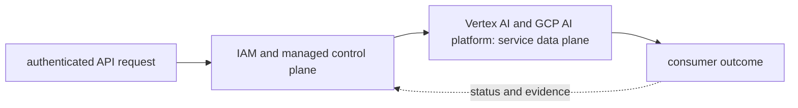

# Vertex AI and GCP AI platform

<!-- chapter-guide:start -->
> **Step 176 of 373 — 08.07**
>
> **Builds on:** [GCP messaging and data processing](../06-gcp-messaging-and-data-processing/README.md)
>
> **Now:** Learn **Vertex AI and GCP AI platform** from its mental model through production ownership.
>
> **Then:** Rehearse the linked questions and continue to [GCP operations, security and cost](../08-gcp-operations-security-and-cost/README.md).
<!-- chapter-guide:end -->

> [Interview questions and answers](questions-and-answers.md) · [Master curriculum](../../curriculum/master-curriculum.txt) · Official starting point: <https://cloud.google.com/vertex-ai/docs/start/introduction-unified-platform>

## Explanation

### What it is and why it exists

**Vertex AI and GCP AI platform** is easiest to understand as one part of a larger path. The subject is an API-managed resource under organization, folder and project boundaries. Identity and policy authorize a control-plane change, while regional or global managed infrastructure produces the data-path behavior.

The chapter focuses on Vertex AI Model Garden, Managed foundation models, Gemini models, Custom training. These are connected mechanisms, not vocabulary to memorize. Integrate every part of Vertex AI and GCP AI platform into one secure, reliable, observable, supportable and cost-aware production capability The explanations below first build the simple model, then add the exact system behavior and production consequences.

### History and evolution

Google Cloud grew from Google's internal distributed-systems experience and early managed products such as App Engine. It developed into a project- and organization-scoped platform spanning global networks, data systems, Kubernetes, serverless and AI, with APIs and IAM acting as the common control surface.

In this chapter, **Vertex AI and GCP AI platform** is the next layer of that evolution. Its modern purpose is to integrate every part of Vertex AI and GCP AI platform into one secure, reliable, observable, supportable and cost-aware production capability. The exact product surface may change by version, but the underlying state, request path and failure boundaries remain the durable ideas to learn.

### How it works: the end-to-end path



The path begins with a concrete input: a user request, configuration revision, packet, job, model request or operational symptom. The relevant subsystem validates that input, reads current state, performs or schedules work and exposes a result. Some transitions complete before the caller receives a response; others acknowledge the request and converge later. That difference determines whether a timeout means "nothing happened," "the operation failed," or "the final result is still unknown."

For **Vertex AI and GCP AI platform**, the important stages are Vertex AI Model Garden, Managed foundation models, Gemini models, Custom training, Training pipelines, Model Registry, Online prediction, Batch prediction, Private endpoints, Endpoint autoscaling, Feature Store, Vector Search, RAG Engine, Pipelines, Experiments, Model monitoring, Evaluation, Responsible AI, Vertex AI Agent Builder, GPU and TPU consumption, GKE-based model serving. Their boundaries explain where identity is checked, where state becomes durable, where capacity is consumed, how failures propagate and which signal can distinguish one layer from another. A production explanation should follow the actual path rather than treating each term as an isolated definition.


### Core concepts explained in detail

#### Vertex AI Model Garden

**What it is.** The term Vertex AI Model Garden is an AI data or behavior artifact whose exact revision, inputs, transformations, compatibility and evaluation evidence affect the result produced at runtime within Vertex AI and GCP AI platform.

**Junior mental model.** An AI result is produced by a release made of several moving parts—not only model weights. Data, tokenizer, prompt/template, adapter, retrieval index, runtime, hardware and evaluator can each change behavior.

**How it works.** Inputs are validated and transformed, a versioned model or pipeline performs work, and post-processing and policy produce the exposed result. Offline evaluation compares a candidate with a baseline; shadow or canary traffic supplies production evidence; lineage connects the decision back to exact artifacts and data.

**What it looks like in production.** Healthy evidence combines task quality and safety with latency, token or accelerator work, failure rate and unit cost. Training-serving skew, stale or unauthorized retrieval, incompatible runtime/hardware, biased evaluators, prompt injection and silent provider/model changes are core production risks.

#### Managed foundation models

**What it is.** The term Managed foundation models is an AI data or behavior artifact whose exact revision, inputs, transformations, compatibility and evaluation evidence affect the result produced at runtime within Vertex AI and GCP AI platform.

**Junior mental model.** An AI result is produced by a release made of several moving parts—not only model weights. Data, tokenizer, prompt/template, adapter, retrieval index, runtime, hardware and evaluator can each change behavior.

**How it works.** Inputs are validated and transformed, a versioned model or pipeline performs work, and post-processing and policy produce the exposed result. Offline evaluation compares a candidate with a baseline; shadow or canary traffic supplies production evidence; lineage connects the decision back to exact artifacts and data.

**What it looks like in production.** Healthy evidence combines task quality and safety with latency, token or accelerator work, failure rate and unit cost. Training-serving skew, stale or unauthorized retrieval, incompatible runtime/hardware, biased evaluators, prompt injection and silent provider/model changes are core production risks.

#### Gemini models

**What it is.** The term Gemini models is an AI data or behavior artifact whose exact revision, inputs, transformations, compatibility and evaluation evidence affect the result produced at runtime within Vertex AI and GCP AI platform.

**Junior mental model.** An AI result is produced by a release made of several moving parts—not only model weights. Data, tokenizer, prompt/template, adapter, retrieval index, runtime, hardware and evaluator can each change behavior.

**How it works.** Inputs are validated and transformed, a versioned model or pipeline performs work, and post-processing and policy produce the exposed result. Offline evaluation compares a candidate with a baseline; shadow or canary traffic supplies production evidence; lineage connects the decision back to exact artifacts and data.

**What it looks like in production.** Healthy evidence combines task quality and safety with latency, token or accelerator work, failure rate and unit cost. Training-serving skew, stale or unauthorized retrieval, incompatible runtime/hardware, biased evaluators, prompt injection and silent provider/model changes are core production risks.

#### Custom training

**What it is.** The term Custom training refers to a Google Cloud control- or data-plane mechanism bounded by resource hierarchy, location, identity, quota and service contract within Vertex AI and GCP AI platform.

**Junior mental model.** Think of a scheduler as allocating seats and time slots: a request states what it needs, available workers advertise capacity, and policy chooses a placement. Requested capacity, usable capacity and completed useful work are different quantities.

**How it works.** Work enters a runnable or pending state, eligibility filters remove incompatible placements, scoring or queue policy selects a worker, and a runtime creates the process and accounts for CPU, memory, devices and time. Autoscaling observes demand, requests more replicas or machines, and waits through provisioning and warm-up before capacity becomes useful.

**What it looks like in production.** Healthy evidence connects queue delay, placement, utilization, throttling, memory/device pressure, runtime readiness and successful work. Fragmentation, inaccurate requests, quota, topology, cold starts and a saturated downstream service can leave capacity apparently free while latency and pending work grow.

#### Training pipelines

**What it is.** The term Training pipelines is an ordered or dependency-aware chain of stages that transforms versioned inputs into outputs and records status so failed work can be retried, resumed or rolled back safely within Vertex AI and GCP AI platform.

**Junior mental model.** Think of a scheduler as allocating seats and time slots: a request states what it needs, available workers advertise capacity, and policy chooses a placement. Requested capacity, usable capacity and completed useful work are different quantities.

**How it works.** Work enters a runnable or pending state, eligibility filters remove incompatible placements, scoring or queue policy selects a worker, and a runtime creates the process and accounts for CPU, memory, devices and time. Autoscaling observes demand, requests more replicas or machines, and waits through provisioning and warm-up before capacity becomes useful.

**What it looks like in production.** Healthy evidence connects queue delay, placement, utilization, throttling, memory/device pressure, runtime readiness and successful work. Fragmentation, inaccurate requests, quota, topology, cold starts and a saturated downstream service can leave capacity apparently free while latency and pending work grow.

#### Model Registry

**What it is.** The term Model Registry is an authoritative or indexed catalog of assets and metadata used to discover identity, owner, revision, lifecycle state and relationships without scanning every runtime separately within Vertex AI and GCP AI platform.

**Junior mental model.** An AI result is produced by a release made of several moving parts—not only model weights. Data, tokenizer, prompt/template, adapter, retrieval index, runtime, hardware and evaluator can each change behavior.

**How it works.** Inputs are validated and transformed, a versioned model or pipeline performs work, and post-processing and policy produce the exposed result. Offline evaluation compares a candidate with a baseline; shadow or canary traffic supplies production evidence; lineage connects the decision back to exact artifacts and data.

**What it looks like in production.** Healthy evidence combines task quality and safety with latency, token or accelerator work, failure rate and unit cost. Training-serving skew, stale or unauthorized retrieval, incompatible runtime/hardware, biased evaluators, prompt injection and silent provider/model changes are core production risks.

#### Online prediction

**What it is.** The term Online prediction refers to a Google Cloud control- or data-plane mechanism bounded by resource hierarchy, location, identity, quota and service contract within Vertex AI and GCP AI platform.

**Junior mental model.** The simplest mental model is a state machine: an input is checked, current state is read, a rule computes the next state, and an observable result tells callers whether the transition succeeded.

**How it works.** The mechanism receives configuration or runtime input, validates preconditions, changes or derives state, and exposes status to the next component. Synchronous parts return a direct outcome; asynchronous parts need durable status, reconciliation and idempotency because the original caller may disappear.

**What it looks like in production.** Healthy evidence shows the expected state transition and its owner, timestamp and reason. Invalid input, stale state, conflicting writers, hidden limits and dependencies that partially complete are the most useful failure categories to distinguish.

#### Batch prediction

**What it is.** The term Batch prediction refers to a Google Cloud control- or data-plane mechanism bounded by resource hierarchy, location, identity, quota and service contract within Vertex AI and GCP AI platform.

**Junior mental model.** A queue is like a numbered waiting line: producers can hand off work without waiting for completion, but someone must define ordering, capacity, acknowledgement and what happens when a worker disappears.

**How it works.** A producer serializes and publishes a message, the service stores or routes it, a consumer receives it under a delivery contract, and acknowledgement advances or removes the item. At-least-once systems can redeliver after an unknown outcome, so stable operation identifiers and idempotent state changes are part of correctness.

**What it looks like in production.** Healthy evidence includes publish and consume rates, queue depth and age, processing latency, retry/dead-letter counts and end-to-end business completion. Poison messages, hot partitions, backlog growth, duplicate effects and retry storms are common; adding consumers helps only when the downstream dependency and partition model can absorb them.

#### Private endpoints

**What it is.** The term Private endpoints is a network-facing contract that defines request and response shape, authentication, errors, timeouts, compatibility and the point where callers meet the service data path within Vertex AI and GCP AI platform.

**Junior mental model.** A useful analogy is a parcel journey: the name identifies the destination, routing selects each next hop, policy decides whether the parcel may pass, transport tracks delivery, and the application decides what the contents mean.

**How it works.** A real request crosses several independent states: name resolution returns an address, the source selects a route and source address, link or overlay forwarding reaches the next hop, stateful or stateless policy evaluates the flow, transport establishes communication, and TLS/application protocols negotiate their own contract. The return path must also work.

**What it looks like in production.** Healthy evidence progresses layer by layer: correct name/address, expected route, permitted flow, listening endpoint, successful handshake and valid application response. Timeouts, refusals, resets and protocol errors mean different layers; packet loss, MTU, asymmetric paths, connection-state exhaustion and proxy timeout mismatch are common production failures.

#### Endpoint autoscaling

**What it is.** Must connect demand and work units to latency, errors, saturation, queueing, provisioning delay, headroom, failure domains and unit cost using measured distributions.

**Junior mental model.** A useful analogy is a parcel journey: the name identifies the destination, routing selects each next hop, policy decides whether the parcel may pass, transport tracks delivery, and the application decides what the contents mean.

**How it works.** A real request crosses several independent states: name resolution returns an address, the source selects a route and source address, link or overlay forwarding reaches the next hop, stateful or stateless policy evaluates the flow, transport establishes communication, and TLS/application protocols negotiate their own contract. The return path must also work.

**What it looks like in production.** Healthy evidence progresses layer by layer: correct name/address, expected route, permitted flow, listening endpoint, successful handshake and valid application response. Timeouts, refusals, resets and protocol errors mean different layers; packet loss, MTU, asymmetric paths, connection-state exhaustion and proxy timeout mismatch are common production failures.

#### Feature Store

**What it is.** The term Feature Store is an AI data or behavior artifact whose exact revision, inputs, transformations, compatibility and evaluation evidence affect the result produced at runtime within Vertex AI and GCP AI platform.

**Junior mental model.** An AI result is produced by a release made of several moving parts—not only model weights. Data, tokenizer, prompt/template, adapter, retrieval index, runtime, hardware and evaluator can each change behavior.

**How it works.** Inputs are validated and transformed, a versioned model or pipeline performs work, and post-processing and policy produce the exposed result. Offline evaluation compares a candidate with a baseline; shadow or canary traffic supplies production evidence; lineage connects the decision back to exact artifacts and data.

**What it looks like in production.** Healthy evidence combines task quality and safety with latency, token or accelerator work, failure rate and unit cost. Training-serving skew, stale or unauthorized retrieval, incompatible runtime/hardware, biased evaluators, prompt injection and silent provider/model changes are core production risks.

#### Vector Search

**What it is.** The term Vector Search refers to a Google Cloud control- or data-plane mechanism bounded by resource hierarchy, location, identity, quota and service contract within Vertex AI and GCP AI platform.

**Junior mental model.** An AI result is produced by a release made of several moving parts—not only model weights. Data, tokenizer, prompt/template, adapter, retrieval index, runtime, hardware and evaluator can each change behavior.

**How it works.** Inputs are validated and transformed, a versioned model or pipeline performs work, and post-processing and policy produce the exposed result. Offline evaluation compares a candidate with a baseline; shadow or canary traffic supplies production evidence; lineage connects the decision back to exact artifacts and data.

**What it looks like in production.** Healthy evidence combines task quality and safety with latency, token or accelerator work, failure rate and unit cost. Training-serving skew, stale or unauthorized retrieval, incompatible runtime/hardware, biased evaluators, prompt injection and silent provider/model changes are core production risks.

#### RAG Engine

**What it is.** The term RAG Engine is an AI data or behavior artifact whose exact revision, inputs, transformations, compatibility and evaluation evidence affect the result produced at runtime within Vertex AI and GCP AI platform.

**Junior mental model.** An AI result is produced by a release made of several moving parts—not only model weights. Data, tokenizer, prompt/template, adapter, retrieval index, runtime, hardware and evaluator can each change behavior.

**How it works.** Inputs are validated and transformed, a versioned model or pipeline performs work, and post-processing and policy produce the exposed result. Offline evaluation compares a candidate with a baseline; shadow or canary traffic supplies production evidence; lineage connects the decision back to exact artifacts and data.

**What it looks like in production.** Healthy evidence combines task quality and safety with latency, token or accelerator work, failure rate and unit cost. Training-serving skew, stale or unauthorized retrieval, incompatible runtime/hardware, biased evaluators, prompt injection and silent provider/model changes are core production risks.

#### Pipelines

**What it is.** The term Pipelines is an ordered or dependency-aware chain of stages that transforms versioned inputs into outputs and records status so failed work can be retried, resumed or rolled back safely within Vertex AI and GCP AI platform.

**Junior mental model.** Treat delivery like a controlled assembly line: reviewed source becomes an immutable artifact, the artifact is promoted without being rebuilt, and each environment records exactly which revision is effective.

**How it works.** The lifecycle begins with versioned intent, validates syntax and policy, resolves dependencies, builds or selects immutable inputs, produces a diff or release plan, changes the target in bounded waves, and records status. Reconciliation keeps desired and observed state aligned; rollback is another tested state transition, not merely a command name.

**What it looks like in production.** Healthy evidence links source revision, review, test, artifact digest, signer/provenance, deployment target and user-facing verification. Mutable tags, environment-specific rebuilds, unpinned dependencies, non-idempotent migrations and controllers fighting emergency changes are recurring failure modes.

#### Experiments

**What it is.** The term Experiments refers to a Google Cloud control- or data-plane mechanism bounded by resource hierarchy, location, identity, quota and service contract within Vertex AI and GCP AI platform.

**Junior mental model.** The simplest mental model is a state machine: an input is checked, current state is read, a rule computes the next state, and an observable result tells callers whether the transition succeeded.

**How it works.** The mechanism receives configuration or runtime input, validates preconditions, changes or derives state, and exposes status to the next component. Synchronous parts return a direct outcome; asynchronous parts need durable status, reconciliation and idempotency because the original caller may disappear.

**What it looks like in production.** Healthy evidence shows the expected state transition and its owner, timestamp and reason. Invalid input, stale state, conflicting writers, hidden limits and dependencies that partially complete are the most useful failure categories to distinguish.

#### Model monitoring

**What it is.** Turns runtime state into evidence; define signal semantics, labels/context, retention/privacy/cost, healthy baseline, actionable threshold and a query that distinguishes competing hypotheses.

**Junior mental model.** Telemetry is the instrument panel, not the system itself. Metrics summarize trends, logs preserve discrete context, traces connect work across boundaries, profiles attribute resource use, and audit events record security-relevant actions.

**How it works.** Instrumentation observes a defined event or state, attaches bounded context, transports the signal, stores it under retention rules and makes it queryable. A useful signal has documented semantics and can distinguish at least two competing explanations; correlation identifiers belong in logs or traces rather than unbounded metric labels.

**What it looks like in production.** Healthy evidence includes coverage of the user journey, known collection delay and actionable SLO or saturation views. Missing telemetry, sampling bias, cardinality explosions, sensitive payload capture and alert thresholds disconnected from user impact are failures of the observability system itself.

#### Evaluation

**What it is.** The term Evaluation is a repeatable comparison between defined input, expected or baseline behavior and an acceptance threshold, with recorded environment and artifact revisions so the result can support a release decision within Vertex AI and GCP AI platform.

**Junior mental model.** An AI result is produced by a release made of several moving parts—not only model weights. Data, tokenizer, prompt/template, adapter, retrieval index, runtime, hardware and evaluator can each change behavior.

**How it works.** Inputs are validated and transformed, a versioned model or pipeline performs work, and post-processing and policy produce the exposed result. Offline evaluation compares a candidate with a baseline; shadow or canary traffic supplies production evidence; lineage connects the decision back to exact artifacts and data.

**What it looks like in production.** Healthy evidence combines task quality and safety with latency, token or accelerator work, failure rate and unit cost. Training-serving skew, stale or unauthorized retrieval, incompatible runtime/hardware, biased evaluators, prompt injection and silent provider/model changes are core production risks.

#### Responsible AI

**What it is.** The term Responsible AI refers to a Google Cloud control- or data-plane mechanism bounded by resource hierarchy, location, identity, quota and service contract within Vertex AI and GCP AI platform.

**Junior mental model.** The simplest mental model is a state machine: an input is checked, current state is read, a rule computes the next state, and an observable result tells callers whether the transition succeeded.

**How it works.** The mechanism receives configuration or runtime input, validates preconditions, changes or derives state, and exposes status to the next component. Synchronous parts return a direct outcome; asynchronous parts need durable status, reconciliation and idempotency because the original caller may disappear.

**What it looks like in production.** Healthy evidence shows the expected state transition and its owner, timestamp and reason. Invalid input, stale state, conflicting writers, hidden limits and dependencies that partially complete are the most useful failure categories to distinguish.

#### Vertex AI Agent Builder

**What it is.** The term Vertex AI Agent Builder is a delivery mechanism that binds reviewed source to an immutable revision and moves that revision through validation and bounded rollout toward verified runtime state within Vertex AI and GCP AI platform.

**Junior mental model.** An AI result is produced by a release made of several moving parts—not only model weights. Data, tokenizer, prompt/template, adapter, retrieval index, runtime, hardware and evaluator can each change behavior.

**How it works.** Inputs are validated and transformed, a versioned model or pipeline performs work, and post-processing and policy produce the exposed result. Offline evaluation compares a candidate with a baseline; shadow or canary traffic supplies production evidence; lineage connects the decision back to exact artifacts and data.

**What it looks like in production.** Healthy evidence combines task quality and safety with latency, token or accelerator work, failure rate and unit cost. Training-serving skew, stale or unauthorized retrieval, incompatible runtime/hardware, biased evaluators, prompt injection and silent provider/model changes are core production risks.

#### GPU and TPU consumption

**What it is.** The term GPU and TPU consumption refers to a Google Cloud control- or data-plane mechanism bounded by resource hierarchy, location, identity, quota and service contract within Vertex AI and GCP AI platform.

**Junior mental model.** Think of a scheduler as allocating seats and time slots: a request states what it needs, available workers advertise capacity, and policy chooses a placement. Requested capacity, usable capacity and completed useful work are different quantities.

**How it works.** Work enters a runnable or pending state, eligibility filters remove incompatible placements, scoring or queue policy selects a worker, and a runtime creates the process and accounts for CPU, memory, devices and time. Autoscaling observes demand, requests more replicas or machines, and waits through provisioning and warm-up before capacity becomes useful.

**What it looks like in production.** Healthy evidence connects queue delay, placement, utilization, throttling, memory/device pressure, runtime readiness and successful work. Fragmentation, inaccurate requests, quota, topology, cold starts and a saturated downstream service can leave capacity apparently free while latency and pending work grow.

#### GKE-based model serving

**What it is.** The term GKE-based model serving is an AI data or behavior artifact whose exact revision, inputs, transformations, compatibility and evaluation evidence affect the result produced at runtime within Vertex AI and GCP AI platform.

**Junior mental model.** An AI result is produced by a release made of several moving parts—not only model weights. Data, tokenizer, prompt/template, adapter, retrieval index, runtime, hardware and evaluator can each change behavior.

**How it works.** Inputs are validated and transformed, a versioned model or pipeline performs work, and post-processing and policy produce the exposed result. Offline evaluation compares a candidate with a baseline; shadow or canary traffic supplies production evidence; lineage connects the decision back to exact artifacts and data.

**What it looks like in production.** Healthy evidence combines task quality and safety with latency, token or accelerator work, failure rate and unit cost. Training-serving skew, stale or unauthorized retrieval, incompatible runtime/hardware, biased evaluators, prompt injection and silent provider/model changes are core production risks.

### Worked command and configuration example

The following is a diagnostic example, not an unexplained command dump. Define every uppercase placeholder first—for example `NAME`, `RESOURCE`, `PROJECT`, `REGION`, `NAMESPACE`, `URL`, `IMAGE` or `CONTAINER`—and use a sandbox or read-only production role.

```bash
gcloud auth list
gcloud config list
gcloud projects describe PROJECT
gcloud logging read 'severity>=ERROR' --limit=20
```

What the example demonstrates:

- `gcloud auth list` establishes which identity and target context subsequent commands will inspect; a correct resource in the wrong account, project or cluster is still the wrong result.
- `gcloud config list` establishes which identity and target context subsequent commands will inspect; a correct resource in the wrong account, project or cluster is still the wrong result.
- `gcloud projects describe PROJECT` queries Google Cloud's control plane using the active account, project and location; compare the returned resource with source-controlled intent.
- `gcloud logging read 'severity>=ERROR' --limit=20` queries Google Cloud's control plane using the active account, project and location; compare the returned resource with source-controlled intent.

A healthy run returns the intended identity/context, exits successfully and shows the expected object or response without a new warning, retry loop or saturation signal. A failure is useful evidence: preserve the exact exit code, status/reason, timestamp and target, then inspect the immediately adjacent layer before changing anything. This makes the example part of the explanation of **Vertex AI and GCP AI platform**, not merely a list to copy.

### Security, reliability and production ownership

Security controls who can initiate a transition and what data or resource that transition may affect. Authentication, authorization, network reachability, encryption and audit solve different problems and must align at each boundary. Short-lived attributable identities, least privilege, explicit tenant separation and tested key/certificate rotation reduce blast radius. Logs and traces need their own data controls because copying a secret or customer payload into telemetry defeats the primary protection.

Reliability depends on every synchronous dependency and on the eventual convergence of asynchronous work. Timeouts bound waiting; idempotency makes an ambiguous retry safe; backpressure and load shedding keep demand within useful capacity; replication and failover help only across independent failure domains. Recovery must be tested from protected state and verified through the original user outcome, not inferred from a green administrative status.

Ownership makes these mechanisms operable. Every production resource or service needs an accountable team, source-of-truth revision, environment and data classification, SLO, runbook, cost center and retirement policy. Reversible mitigation can stabilize an incident, but the durable repair belongs in Git, IaC, policy or the owning application so reconciliation does not reintroduce the fault.

### Observability, performance and cost

Metrics, logs, traces, profiles and audit events are complementary. A useful diagnostic path starts with time, identity, exact target and user symptom, then compares desired and observed state before moving through reconciliation, network/protocol, runtime, dependency and saturation layers. High-cardinality request or object IDs belong in sampled logs or traces rather than metric labels; alerts should represent actionable user-impact risk or leading exhaustion.

Performance is governed by work distribution, queueing and bottlenecks. Rate, latency percentiles, errors, saturation, queue depth or age and service-specific limits reveal more than average utilization. Application replicas and underlying machines, storage or provider quota scale through separate loops with different cold delays. Cost includes idle headroom, requests or work units, storage/retention, network transfer, telemetry, support and recovery capacity; optimize cost per successful outcome rather than the cheapest isolated resource.

### What you should be able to explain

The table remains as a revision checklist. Read the explanations above first; afterward, use each row to check whether you can explain the concept without relying on memorized wording.

| # | Topic | What you must understand and demonstrate |
|---:|---|---|
| 1 | **Vertex AI Model Garden** | is part of Vertex AI and GCP AI platform; learn its precise definition, mechanism and lifecycle, nearest alternatives, configuration interface, failure/limit, security boundary, observable evidence and production trade-off |
| 2 | **Managed foundation models** | is part of Vertex AI and GCP AI platform; learn its precise definition, mechanism and lifecycle, nearest alternatives, configuration interface, failure/limit, security boundary, observable evidence and production trade-off |
| 3 | **Gemini models** | is part of Vertex AI and GCP AI platform; learn its precise definition, mechanism and lifecycle, nearest alternatives, configuration interface, failure/limit, security boundary, observable evidence and production trade-off |
| 4 | **Custom training** | is part of Vertex AI and GCP AI platform; learn its precise definition, mechanism and lifecycle, nearest alternatives, configuration interface, failure/limit, security boundary, observable evidence and production trade-off |
| 5 | **Training pipelines** | is part of Vertex AI and GCP AI platform; learn its precise definition, mechanism and lifecycle, nearest alternatives, configuration interface, failure/limit, security boundary, observable evidence and production trade-off |
| 6 | **Model Registry** | is part of Vertex AI and GCP AI platform; learn its precise definition, mechanism and lifecycle, nearest alternatives, configuration interface, failure/limit, security boundary, observable evidence and production trade-off |
| 7 | **Online prediction** | is part of Vertex AI and GCP AI platform; learn its precise definition, mechanism and lifecycle, nearest alternatives, configuration interface, failure/limit, security boundary, observable evidence and production trade-off |
| 8 | **Batch prediction** | is part of Vertex AI and GCP AI platform; learn its precise definition, mechanism and lifecycle, nearest alternatives, configuration interface, failure/limit, security boundary, observable evidence and production trade-off |
| 9 | **Private endpoints** | is part of Vertex AI and GCP AI platform; learn its precise definition, mechanism and lifecycle, nearest alternatives, configuration interface, failure/limit, security boundary, observable evidence and production trade-off |
| 10 | **Endpoint autoscaling** | must connect demand and work units to latency, errors, saturation, queueing, provisioning delay, headroom, failure domains and unit cost using measured distributions |
| 11 | **Feature Store** | is part of Vertex AI and GCP AI platform; learn its precise definition, mechanism and lifecycle, nearest alternatives, configuration interface, failure/limit, security boundary, observable evidence and production trade-off |
| 12 | **Vector Search** | is part of Vertex AI and GCP AI platform; learn its precise definition, mechanism and lifecycle, nearest alternatives, configuration interface, failure/limit, security boundary, observable evidence and production trade-off |
| 13 | **RAG Engine** | is part of Vertex AI and GCP AI platform; learn its precise definition, mechanism and lifecycle, nearest alternatives, configuration interface, failure/limit, security boundary, observable evidence and production trade-off |
| 14 | **Pipelines** | is part of Vertex AI and GCP AI platform; learn its precise definition, mechanism and lifecycle, nearest alternatives, configuration interface, failure/limit, security boundary, observable evidence and production trade-off |
| 15 | **Experiments** | is part of Vertex AI and GCP AI platform; learn its precise definition, mechanism and lifecycle, nearest alternatives, configuration interface, failure/limit, security boundary, observable evidence and production trade-off |
| 16 | **Model monitoring** | turns runtime state into evidence; define signal semantics, labels/context, retention/privacy/cost, healthy baseline, actionable threshold and a query that distinguishes competing hypotheses |
| 17 | **Evaluation** | is part of Vertex AI and GCP AI platform; learn its precise definition, mechanism and lifecycle, nearest alternatives, configuration interface, failure/limit, security boundary, observable evidence and production trade-off |
| 18 | **Responsible AI** | is part of Vertex AI and GCP AI platform; learn its precise definition, mechanism and lifecycle, nearest alternatives, configuration interface, failure/limit, security boundary, observable evidence and production trade-off |
| 19 | **Vertex AI Agent Builder** | is part of Vertex AI and GCP AI platform; learn its precise definition, mechanism and lifecycle, nearest alternatives, configuration interface, failure/limit, security boundary, observable evidence and production trade-off |
| 20 | **GPU and TPU consumption** | is part of Vertex AI and GCP AI platform; learn its precise definition, mechanism and lifecycle, nearest alternatives, configuration interface, failure/limit, security boundary, observable evidence and production trade-off |
| 21 | **GKE-based model serving** | is part of Vertex AI and GCP AI platform; learn its precise definition, mechanism and lifecycle, nearest alternatives, configuration interface, failure/limit, security boundary, observable evidence and production trade-off |

## Practice

### Practice objective

Build a small, safe proof of **Vertex AI and GCP AI platform** and explain the result in your own words. The goal is not command completion; it is to connect input, internal mechanism, observable state and user outcome.

### Prerequisites and setup

Use a disposable local or cloud sandbox. Confirm identity/context and cost boundary, capture a healthy baseline with the commands above, introduce one bounded configuration or invalid-input failure, compare evidence, revert from source control, verify the original outcome, and delete only the named lab resources.

Record tool and platform versions because flags, APIs and defaults can change. Define every uppercase placeholder before use and keep secrets out of shell history and committed files.

### Activity 1: establish a healthy baseline

Run the read-oriented example first:

```bash
gcloud auth list
gcloud config list
gcloud projects describe PROJECT
gcloud logging read 'severity>=ERROR' --limit=20
```

For each line, write down the layer it inspects, the expected healthy field or response, and one thing it cannot prove. The expected result is an attributable request against the intended target plus enough state to draw the path from input to outcome.

### Activity 2: create or review the smallest working example

Put the smallest relevant command, configuration, manifest or code sample in source control. Validate or lint it, produce a preview/diff where the tool supports one, and apply only inside the disposable boundary. Record the exact revision and resulting resource or process ID. If the topic is observational rather than configurable, save a sanitized baseline and an automated assertion instead of mutating the system.

### Activity 3: controlled failure and troubleshooting

Introduce one bounded failure: use a definitely nonexistent resource name, an invalid sandbox-only value, a denied test identity, a closed test port or a stopped disposable dependency. Capture the exact error and classify it as identity/policy, input/configuration, control-plane reconciliation, network/protocol, dependency or capacity. Test one discriminating hypothesis at a time; do not widen access or restart unrelated components.

Expected failure evidence is a specific non-zero exit, status/reason, event or protocol response that disappears when the controlled fault is removed. If healthy and failing runs look identical, the chosen signal does not explain the phenomenon and the exercise is not complete.

### Verification

Repeat the original client or user-facing check, not only an administrative status command. Confirm the desired revision, data correctness where applicable, error and latency recovery, and absence of a continuing retry/backlog/saturation condition. Explain why this evidence proves recovery and what uncertainty remains.

### Cleanup and rollback

Revert the configuration in its source of truth and review the rollback diff before applying it. Delete only the named sandbox resources, stop disposable processes, remove temporary credentials and verify that no billable resource, volume, artifact, queue item or background job remains. Read-only activities require no infrastructure rollback, but sanitized captures must still follow retention policy.

### Harder extension

Automate the healthy and failing paths in CI, use short-lived identity, add one SLI/alert or policy assertion, and write a five-step runbook another engineer can execute without hidden context. Then explain how the design changes for two tenants, a zonal or dependency failure, 10× load and a strict cost or recovery target.

<!-- reading-navigation:start -->
---

**Reading path:** [← Back: GCP messaging and data processing](../06-gcp-messaging-and-data-processing/README.md) · [Questions](questions-and-answers.md) · [Next: GCP operations, security and cost →](../08-gcp-operations-security-and-cost/README.md)

<!-- reading-navigation:end -->
