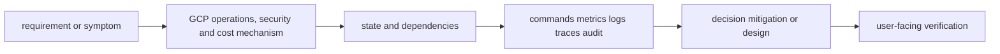

# GCP operations, security and cost

<!-- chapter-guide:start -->
> **Step 177 of 373 — 08.08**
>
> **Builds on:** [Vertex AI and GCP AI platform](../07-vertex-ai-and-gcp-ai-platform/README.md)
>
> **Now:** Learn **GCP operations, security and cost** from its mental model through production ownership.
>
> **Then:** Rehearse the linked questions and continue to [Infrastructure as Code and delivery](../../09-iac-delivery/README.md).
<!-- chapter-guide:end -->

> [Interview questions and answers](questions-and-answers.md) · [Master curriculum](../../curriculum/master-curriculum.txt) · Official starting point: <https://cloud.google.com/architecture/framework>

## Easy mode: mental model

Integrate every part of GCP operations, security and cost into one secure, reliable, observable, supportable and cost-aware production capability.

Learn this topic in layers: name the object or mechanism, trace its lifecycle/data path, configure it safely, observe a healthy and failed state, recover it, and then design it across failure domains and team boundaries.



## Complete curriculum checklist

| # | Topic | What you must understand and demonstrate |
|---:|---|---|
| 1 | **Cloud Monitoring** | turns runtime state into evidence; define signal semantics, labels/context, retention/privacy/cost, healthy baseline, actionable threshold and a query that distinguishes competing hypotheses. |
| 2 | **Cloud Logging** | is part of GCP operations, security and cost; learn its precise definition, mechanism and lifecycle, nearest alternatives, configuration interface, failure/limit, security boundary, observable evidence and production trade-off. |
| 3 | **Cloud Trace** | is part of GCP operations, security and cost; learn its precise definition, mechanism and lifecycle, nearest alternatives, configuration interface, failure/limit, security boundary, observable evidence and production trade-off. |
| 4 | **Cloud Profiler** | is part of GCP operations, security and cost; learn its precise definition, mechanism and lifecycle, nearest alternatives, configuration interface, failure/limit, security boundary, observable evidence and production trade-off. |
| 5 | **Audit Logs** | turns runtime state into evidence; define signal semantics, labels/context, retention/privacy/cost, healthy baseline, actionable threshold and a query that distinguishes competing hypotheses. |
| 6 | **Security Command Center** | defines a trust/control boundary: identify actor, protected asset, decision/enforcement point, least privilege, bypass path, audit evidence, rotation/revocation and recovery. |
| 7 | **Secret Manager** | is part of GCP operations, security and cost; learn its precise definition, mechanism and lifecycle, nearest alternatives, configuration interface, failure/limit, security boundary, observable evidence and production trade-off. |
| 8 | **Cloud KMS** | is part of GCP operations, security and cost; learn its precise definition, mechanism and lifecycle, nearest alternatives, configuration interface, failure/limit, security boundary, observable evidence and production trade-off. |
| 9 | **Certificate Authority Service** | is part of GCP operations, security and cost; learn its precise definition, mechanism and lifecycle, nearest alternatives, configuration interface, failure/limit, security boundary, observable evidence and production trade-off. |
| 10 | **Binary Authorization** | defines a trust/control boundary: identify actor, protected asset, decision/enforcement point, least privilege, bypass path, audit evidence, rotation/revocation and recovery. |
| 11 | **Policy Controller** | defines a trust/control boundary: identify actor, protected asset, decision/enforcement point, least privilege, bypass path, audit evidence, rotation/revocation and recovery. |
| 12 | **Budgets and alerts** | turns runtime state into evidence; define signal semantics, labels/context, retention/privacy/cost, healthy baseline, actionable threshold and a query that distinguishes competing hypotheses. |
| 13 | **Billing exports** | is part of GCP operations, security and cost; learn its precise definition, mechanism and lifecycle, nearest alternatives, configuration interface, failure/limit, security boundary, observable evidence and production trade-off. |
| 14 | **Recommender** | is part of GCP operations, security and cost; learn its precise definition, mechanism and lifecycle, nearest alternatives, configuration interface, failure/limit, security boundary, observable evidence and production trade-off. |
| 15 | **Quota management** | is part of GCP operations, security and cost; learn its precise definition, mechanism and lifecycle, nearest alternatives, configuration interface, failure/limit, security boundary, observable evidence and production trade-off. |

## Beginner → mid-level → senior learning path

1. **Beginner:** define every term; identify the relevant file, object, protocol, API, or command; explain one normal use.
2. **Mid-level:** configure it from source control, inspect effective runtime state, diagnose two failure modes, automate a safe change, and explain one trade-off.
3. **Senior:** clarify ambiguous requirements, map trust and failure domains, quantify capacity/SLO/RPO/RTO/cost, compare alternatives, plan migration/rollback, and assign ownership.

## Command and configuration lab

Run read-only checks first in a sandbox. For each command, predict healthy output, one failing result, the next discriminating check, and the safe rollback for any later mutation.

```bash
gcloud auth list
gcloud config list
gcloud projects describe PROJECT
gcloud logging read 'severity>=ERROR' --limit=20
```

## Hands-on practice: setup → failure → verification → cleanup

Use a disposable local or cloud sandbox. Confirm identity/context and cost boundary, capture a healthy baseline with the commands above, introduce one bounded configuration or invalid-input failure, compare evidence, revert from source control, verify the original outcome, and delete only the named lab resources.

Expected result: you can show the healthy evidence, reproduce a safe failure, explain why each command distinguishes one layer from another, restore the baseline, and prove cleanup. Hard extension: automate the lab from source control, add a test or alert for the injected failure, and write a five-step runbook another engineer can execute.

For code/configuration, be ready to review an intentionally unsafe diff and improve idempotency, secret handling, timeouts, validation, logging, tests, and rollback.

## Senior design checklist

State assumptions for tenants, traffic/work units, latency and availability targets, data classification/residency, recovery, team skills and budget. Draw control/data planes and synchronous/asynchronous dependencies. Cover identity, policy, encryption/key lifecycle, delivery provenance, observability, capacity, unit cost, operational ownership, migration and exit criteria. Name the evidence that would cause you to revise the design.

## Revision and practice

Complete the separate [checkbox interview bank](questions-and-answers.md). Do not memorize wording: speak in the order **definition → mechanism → evidence/configuration → failure/trade-off → production example**. For procedures use **stabilize → scope → inspect → hypothesize → test → mitigate → verify → prevent**.

<!-- reading-navigation:start -->
---

**Reading path:** [← Back: Vertex AI and GCP AI platform](../07-vertex-ai-and-gcp-ai-platform/README.md) · [Questions](questions-and-answers.md) · [Next: Infrastructure as Code and delivery →](../../09-iac-delivery/README.md)

<!-- reading-navigation:end -->
