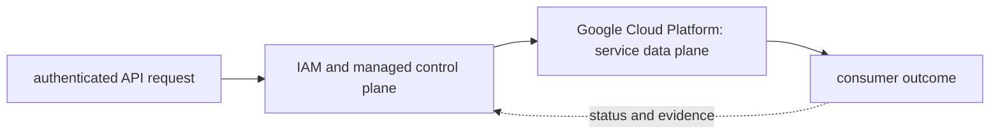
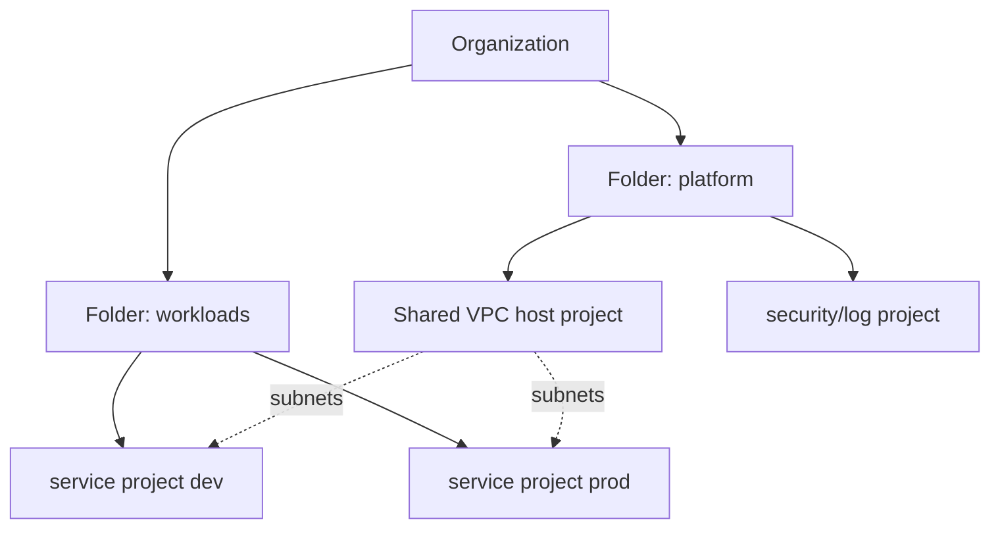

# Google Cloud Platform

<!-- chapter-guide:start -->
> **Step 169 of 373 — 08**
>
> **Builds on:** [AWS GPUs, Inferentia and Trainium](../07-aws/11-ai-platform/04-aws-accelerators/README.md)
>
> **Now:** Learn **Google Cloud Platform** from its mental model through production ownership.
>
> **Then:** Rehearse the linked questions and continue to [GCP foundations and governance](01-gcp-foundations-and-governance/README.md).
<!-- chapter-guide:end -->

<!-- explanation-practice-normalizer:v1 -->


## Explanation

### What this chapter is and why it exists

**Google Cloud Platform** is easiest to understand as one part of a larger path. The subject is an API-managed resource under organization, folder and project boundaries. Identity and policy authorize a control-plane change, while regional or global managed infrastructure produces the data-path behavior.

The chapter focuses on Google Cloud Platform. These are connected mechanisms, not vocabulary to memorize. The GCP branch connects resource hierarchy and IAM to global networking, managed compute, data, messaging, operations and AI service behavior The explanations below first build the simple model, then add the exact system behavior and production consequences.

### History and evolution

Google Cloud grew from Google's internal distributed-systems experience and early managed products such as App Engine. It developed into a project- and organization-scoped platform spanning global networks, data systems, Kubernetes, serverless and AI, with APIs and IAM acting as the common control surface.

In this chapter, **Google Cloud Platform** is the next layer of that evolution. Its modern purpose is to the GCP branch connects resource hierarchy and IAM to global networking, managed compute, data, messaging, operations and AI service behavior. The exact product surface may change by version, but the underlying state, request path and failure boundaries remain the durable ideas to learn.

### How the complete branch works



A branch overview connects child mechanisms into one lifecycle. The input crosses identity and policy, a control or decision plane, the runtime data path and its dependencies before producing a user-visible result. Status and telemetry travel back through the loop so operators and controllers can correct drift or failure. Reading the child chapters adds precision, but this overview explains why those chapters depend on one another.

A useful test of understanding is to trace one concrete request or change from origin to outcome and name the authoritative state at each boundary. That trace reveals where work is synchronous or asynchronous, which failure domains are independent, what a timeout can prove, and which evidence distinguishes accepted intent from healthy behavior.

### Resource and identity mental model

Organization → folders → projects → resources. Policies inherit downward; projects are practical API/quota/billing/isolation boundaries. IAM binds principals to roles on resources; service accounts are workload identities, not human groups. Prefer user federation and Workload Identity Federation/managed workload identity over service-account keys. Organization policies constrain capabilities; VPC Service Controls add data-exfiltration perimeters for supported services but do not replace IAM.



```bash
gcloud auth list
gcloud config configurations list
gcloud config set project PROJECT_ID
gcloud projects describe PROJECT_ID
gcloud resource-manager org-policies list --project=PROJECT_ID
gcloud projects get-iam-policy PROJECT_ID --format=json | jq
gcloud asset search-all-resources --scope=projects/PROJECT_NUMBER
gcloud services list --enabled
```

### Networking and load balancing

VPCs are global; subnets are regional. Routes and hierarchical/VPC firewall rules govern paths. Shared VPC centralizes networks while service projects own workloads. Cloud NAT supplies managed outbound translation; Private Google Access reaches Google APIs from private addresses; Private Service Connect exposes managed/published services privately. VPC peering exchanges routes non-transitively; Network Connectivity Center, Cloud VPN and Interconnect handle hub/hybrid patterns. Cloud DNS and forwarding policies implement naming.

```bash
gcloud compute networks describe NETWORK
gcloud compute networks subnets list --network=NETWORK
gcloud compute routes list --filter='network:NETWORK'
gcloud compute firewall-rules list --filter='network:NETWORK'
gcloud compute routers nats describe NAT --router=ROUTER --region=REGION
gcloud compute network-endpoint-groups list
gcloud compute backend-services get-health BACKEND --global
gcloud compute forwarding-rules list
```

Google Cloud load balancing is built from forwarding rule/IP → target proxy/URL map (proxy L7/L4 products) → backend service → instance/endpoint groups → health check. Product names distinguish global/regional, external/internal, application/proxy/passthrough. Select by protocol, client/source IP, global anycast, TLS, backend type and locality; verify current product feature matrix.

Cloud Armor protects supported L7 services, Cloud CDN caches through external Application Load Balancing, and managed certificates automate supported TLS. Diagnose DNS → forwarding rule → proxy/certificate/URL map → backend service/health → NEG/instance → firewall/route → app.

### Compute, containers and serverless

Compute Engine machine series differ by CPU/memory/accelerator/local SSD/network. Instance templates plus Managed Instance Groups deliver autoscaling, autohealing and rolling/canary update. Spot VMs can be preempted; reservations address capacity. Shielded/confidential features and OS Login/managed instance access reduce host risk.

```bash
gcloud compute instances describe VM --zone=ZONE
gcloud compute instance-groups managed describe MIG --zone=ZONE
gcloud compute instance-groups managed list-errors MIG --zone=ZONE
gcloud compute reservations list
gcloud compute accelerator-types list --filter='zone:ZONE'
```

GKE Standard exposes nodes/control choices; Autopilot manages more node operations under constraints. Use Workload Identity Federation for GKE, release channels, private clusters, authorized networks where relevant, Binary Authorization/policy, node auto-provisioning/ComputeClasses, gateway/ingress, CSI and managed observability. Artifact Registry stores OCI/packages with IAM, scanning, cleanup and regional strategy. Cloud Run handles request/event containers with concurrency, min/max instances, revision traffic and identity.

```bash
gcloud container clusters describe CLUSTER --region=REGION
gcloud container operations list --location=REGION
gcloud container node-pools list --cluster=CLUSTER --region=REGION
gcloud artifacts docker images list REGION-docker.pkg.dev/PROJECT/REPO --include-tags
gcloud run services describe SERVICE --region=REGION
gcloud run services update-traffic SERVICE --to-revisions REVISION=10 --region=REGION
```

### Storage and databases

Cloud Storage is object storage with classes, lifecycle, versioning, retention/holds, IAM and replication/location choices. Persistent Disk/Hyperdisk are block devices with different performance/provisioning; Local SSD is ephemeral. Filestore provides NFS tiers. Cloud SQL manages relational engines; AlloyDB targets PostgreSQL-compatible performance/availability; Spanner is distributed relational with horizontal scale/strong consistency; Firestore is document; Bigtable wide-column; BigQuery analytical warehouse; Memorystore cache.

Select from transaction/query/key model and operational needs, not “managed” alone. Design connections/pooling, backups/PITR/export, multi-zone/region failover, replication lag, schema/index migration, quotas and cost. Prove restore.

```bash
gcloud storage buckets describe gs://BUCKET
gcloud storage ls -a gs://BUCKET/PREFIX
gcloud sql instances describe INSTANCE
gcloud spanner instances describe INSTANCE
gcloud bigtable instances describe INSTANCE
bq show --format=prettyjson PROJECT:DATASET
```

### Messaging, operations, security and cost

Pub/Sub provides at-least-once messaging by default with subscriptions, ack deadlines, retention, ordering keys and dead-letter policy; consumers remain idempotent. Dataflow processes batch/stream, Dataproc manages Spark/Hadoop, Composer manages Airflow, Eventarc routes events and Workflows orchestrates APIs.

Cloud Monitoring/Logging/Trace/Profiler and Audit Logs provide signals; Security Command Center aggregates findings; Secret Manager/KMS control secrets/keys; Binary Authorization gates artifacts; Policy Controller enforces Kubernetes policy. Billing exports to BigQuery support allocation; budgets alert but are not always hard stops; Recommender suggestions need SLO/context review.

```bash
gcloud pubsub subscriptions describe SUB
gcloud pubsub subscriptions seek SUB --time=TIMESTAMP
gcloud logging read 'resource.type="k8s_container" severity>=ERROR' --limit=50 --format=json
gcloud monitoring policies list
gcloud secrets versions access latest --secret=NAME
gcloud kms keys list --keyring=RING --location=LOCATION
gcloud billing budgets list --billing-account=ACCOUNT
```

### Common traps and revision

- A role binding grants permissions; a service-account key is a credential and usually avoidable.
- Shared VPC centralizes network ownership; it does not make service projects one security domain.
- Global VPC does not mean every subnet/resource is global.
- Health check source ranges/firewalls and backend readiness are frequent LB failures.
- Budget alerts do not guarantee spend prevention; combine quotas/policies/platform controls.
- GKE Autopilot/managed services reduce, not eliminate, workload/security/reliability responsibility.

### Read further

- [Google Cloud documentation](https://cloud.google.com/docs) — authoritative product, architecture and API documentation. Confirm project, location, quota, pricing and release-stage assumptions before following a version-sensitive example.

## Practice

### Practice objective

Build a small, safe proof of **Google Cloud Platform** and explain the result in your own words. The goal is not command completion; it is to connect input, internal mechanism, observable state and user outcome.

### Prerequisites and setup

Use a disposable local environment, sandbox account/project or isolated namespace. Confirm the effective identity and target, record the start time, and set a cost limit before creating anything.

Record tool and platform versions because flags, APIs and defaults can change. Define every uppercase placeholder before use and keep secrets out of shell history and committed files.

### Activity 1: establish a healthy baseline

Run the read-oriented example first:

```bash
gcloud auth list
gcloud config list
gcloud projects describe PROJECT
```

For each line, write down the layer it inspects, the expected healthy field or response, and one thing it cannot prove. The expected result is an attributable request against the intended target plus enough state to draw the path from input to outcome.

### Activity 2: create or review the smallest working example

Put the smallest relevant command, configuration, manifest or code sample in source control. Validate or lint it, produce a preview/diff where the tool supports one, and apply only inside the disposable boundary. Record the exact revision and resulting resource or process ID. If the topic is observational rather than configurable, save a sanitized baseline and an automated assertion instead of mutating the system.

### Activity 3: controlled failure and troubleshooting

Introduce one bounded failure: use a definitely nonexistent resource name, an invalid sandbox-only value, a denied test identity, a closed test port or a stopped disposable dependency. Capture the exact error and classify it as identity/policy, input/configuration, control-plane reconciliation, network/protocol, dependency or capacity. Test one discriminating hypothesis at a time; do not widen access or restart unrelated components.

Expected failure evidence is a specific non-zero exit, status/reason, event or protocol response that disappears when the controlled fault is removed. If healthy and failing runs look identical, the chosen signal does not explain the phenomenon and the exercise is not complete.

### Verification

Repeat the original client or user-facing check, not only an administrative status command. Confirm the desired revision, data correctness where applicable, error and latency recovery, and absence of a continuing retry/backlog/saturation condition. Explain why this evidence proves recovery and what uncertainty remains.

### Cleanup and rollback

Revert the configuration in its source of truth and review the rollback diff before applying it. Delete only the named sandbox resources, stop disposable processes, remove temporary credentials and verify that no billable resource, volume, artifact, queue item or background job remains. Read-only activities require no infrastructure rollback, but sanitized captures must still follow retention policy.

### Harder extension

Automate the healthy and failing paths in CI, use short-lived identity, add one SLI/alert or policy assertion, and write a five-step runbook another engineer can execute without hidden context. Then explain how the design changes for two tenants, a zonal or dependency failure, 10× load and a strict cost or recovery target.

<!-- reading-navigation:start -->
---

**Reading path:** [← Back: AWS GPUs, Inferentia and Trainium](../07-aws/11-ai-platform/04-aws-accelerators/README.md) · [Questions](questions-and-answers.md) · [Next: GCP foundations and governance →](01-gcp-foundations-and-governance/README.md)

<!-- reading-navigation:end -->
